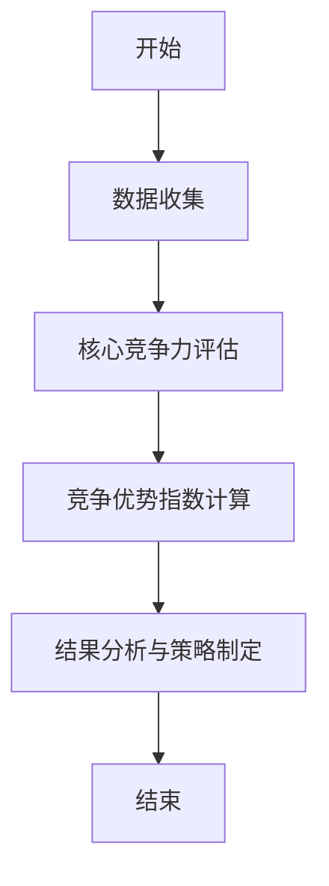

                 

# 费雪的竞争优势分析框架

> 关键词：竞争优势分析，费雪框架，企业战略，行业分析，竞争力评估

> 摘要：本文系统地介绍并详细分析了费雪的竞争优势分析框架，从其核心概念、分析模型、数学公式、系统化分析方法到实际应用案例，逐一展开探讨。通过本文，读者将能够掌握如何利用费雪框架识别和评估企业的竞争优势，并在实际的企业战略规划和投资决策中应用这一框架。

---

# 第一部分: 费雪的竞争优势分析框架概述

## 第1章: 竞争优势分析的背景与基础

### 1.1 企业竞争优势的重要性

#### 1.1.1 企业竞争优势的定义
竞争优势是指企业在市场中相较于竞争对手的独特优势，这种优势可以是资源、技术、成本、品牌、市场占有率等。竞争优势是企业长期生存和发展的关键。

#### 1.1.2 竞争优势对企业价值的影响
竞争优势直接影响企业的市场份额、盈利能力、抗风险能力以及长期发展能力。竞争优势越强，企业的市场地位和价值越高。

#### 1.1.3 费雪竞争优势分析框架的提出背景
传统的竞争优势分析多关注行业结构、成本和规模，而费雪的竞争优势分析框架则更注重企业内部的核心竞争力和外部市场环境的动态关系。

### 1.2 费雪竞争优势分析框架的核心概念

#### 1.2.1 核心竞争力的定义与特征
核心竞争力是企业在长期发展过程中形成的独特能力，包括技术创新、管理能力、资源整合能力等。核心竞争力具有独特性、可持续性和可扩展性。

#### 1.2.2 可持续竞争优势的来源
可持续竞争优势来源于企业的核心竞争力、品牌价值、客户忠诚度、成本控制能力以及供应链优势等。

#### 1.2.3 费雪框架与传统竞争优势分析的对比
传统分析框架多关注行业结构和外部环境，而费雪框架更强调企业内部核心竞争力与外部市场环境的结合。

### 1.3 费雪竞争优势分析框架的适用范围

#### 1.3.1 行业分析与竞争优势的关系
行业分析是竞争优势分析的基础，不同行业的竞争优势来源不同。

#### 1.3.2 不同行业竞争优势的差异性
例如，科技行业注重技术创新，制造业注重成本控制，服务业注重客户体验。

#### 1.3.3 企业规模与竞争优势的关联性
大企业通常具有更强的资源和规模优势，而小企业则可能通过灵活性和专业化获得竞争优势。

### 1.4 本章小结
竞争优势是企业生存和发展的关键，费雪竞争优势分析框架从企业内部核心竞争力和外部市场环境两个方面入手，为企业战略规划提供了新的视角。

---

## 第2章: 费雪竞争优势分析框架的核心要素

### 2.1 费雪竞争优势分析模型的结构

#### 2.1.1 核心要素的识别
核心要素包括市场定位、产品独特性、成本优势、技术创新能力、供应链能力、品牌影响力和客户忠诚度。

#### 2.1.2 要素之间的关系与互动
市场定位影响产品独特性，产品独特性影响品牌影响力，品牌影响力又影响客户忠诚度，形成一个闭环。

#### 2.1.3 模型的逻辑框架
费雪竞争优势分析模型是一个多层次的分析框架，从微观到宏观逐步展开。

### 2.2 费雪竞争优势分析的核心要素

#### 2.2.1 市场定位与目标客户
市场定位决定了企业的目标客户群体和市场范围。

#### 2.2.2 产品或服务的独特性
产品或服务的独特性是企业竞争优势的核心来源之一。

#### 2.2.3 成本优势与效率
成本优势是企业在价格竞争中的关键因素。

#### 2.2.4 技术创新与研发能力
技术创新是企业在科技行业中的核心竞争力。

#### 2.2.5 供应链与合作伙伴关系
供应链的稳定性和合作伙伴关系直接影响企业的运营效率和成本。

#### 2.2.6 品牌影响力与客户忠诚度
强大的品牌影响力和高客户忠诚度是企业长期竞争优势的重要来源。

### 2.3 费雪竞争优势分析框架的数学模型

#### 2.3.1 竞争优势指数的定义
竞争优势指数是衡量企业竞争优势强弱的量化指标，公式如下：
$$ \text{竞争优势指数} = \frac{\text{核心竞争力}}{\text{行业平均竞争力}} $$

#### 2.3.2 核心竞争力的评估公式
核心竞争力是多个要素的加权和，公式如下：
$$ \text{核心竞争力} = \sum_{i=1}^{n} w_i \cdot c_i $$
其中，$w_i$ 是第 $i$ 个要素的权重，$c_i$ 是第 $i$ 个要素的竞争力评分。

#### 2.3.3 优势领域识别的算法流程
1. 确定核心竞争力要素。
2. 评估各要素的竞争力评分。
3. 计算竞争优势指数。
4. 识别优势领域。

### 2.4 本章小结
费雪竞争优势分析框架通过量化的方法，帮助企业识别核心竞争力，并通过竞争优势指数衡量企业的竞争优势强弱。

---

## 第3章: 费雪竞争优势分析框架的应用与案例

### 3.1 行业分析与竞争优势识别

#### 3.1.1 科技行业：技术创新与研发投入
以科技行业为例，技术创新和研发投入是核心竞争力，苹果公司就是通过技术创新和品牌影响力获得持续竞争优势的典型。

#### 3.1.2 消费行业：品牌影响力与客户忠诚度
在消费行业，品牌影响力和客户忠诚度是关键竞争优势，例如可口可乐和星巴克。

#### 3.1.3 制造行业：成本控制与供应链优势
在制造行业，成本控制和供应链优势是核心竞争力，例如丰田和三星。

#### 3.1.4 金融行业：风险管理与客户信任
在金融行业，风险管理能力和客户信任是核心竞争优势，例如巴菲特的伯克希尔哈撒韦。

### 3.2 竞争优势评估的实际案例

#### 3.2.1 科技行业：苹果公司的竞争优势分析
- 市场定位：高端科技产品市场。
- 产品独特性：创新的用户体验和设计。
- 品牌影响力：全球知名品牌。
- 技术创新：持续的专利和技术研发。

#### 3.2.2 消费行业：可口可乐的竞争优势分析
- 市场定位：全球饮料市场。
- 产品独特性：独特的配方和品牌形象。
- 供应链优势：全球化的供应链管理。
- 客户忠诚度：强大的品牌忠诚度。

### 3.3 本章小结
通过实际案例分析，可以清晰地看到费雪竞争优势分析框架在不同行业中的应用和效果。

---

## 第4章: 费雪竞争优势分析框架的系统化分析方法

### 4.1 竞争优势分析的系统化方法

#### 4.1.1 竞争优势分析的步骤
1. 确定核心竞争力要素。
2. 评估各要素的竞争力评分。
3. 计算竞争优势指数。
4. 识别优势领域和改进领域。

#### 4.1.2 竞争优势分析的工具
- 核心竞争力评估表
- 竞争优势指数计算工具
- 优势领域识别矩阵

### 4.2 竞争优势评估的系统化方法

#### 4.2.1 竞争优势分析的系统架构
1. 数据收集与整理。
2. 核心竞争力评估。
3. 竞争优势指数计算。
4. 结果分析与策略制定。

#### 4.2.2 竞争优势分析的流程图

### 4.3 本章小结
通过系统化的分析方法，可以更高效地识别和评估企业的竞争优势，并制定相应的战略。

---

## 第5章: 项目实战——费雪竞争优势分析框架的应用

### 5.1 项目背景与目标

#### 5.1.1 项目背景
以某科技公司为例，分析其竞争优势，制定发展战略。

#### 5.1.2 项目目标
识别公司的核心竞争力，评估竞争优势，制定优化策略。

### 5.2 项目实施步骤

#### 5.2.1 数据收集与整理
收集公司和竞争对手的市场数据、财务数据、技术专利等。

#### 5.2.2 核心竞争力评估
评估公司的技术创新能力、品牌影响力、成本控制能力等。

#### 5.2.3 竞争优势指数计算
计算公司的竞争优势指数，并与行业平均水平进行对比。

#### 5.2.4 结果分析与策略制定
根据分析结果，制定优化策略，提升竞争优势。

### 5.3 项目总结

#### 5.3.1 项目成果
识别了公司的核心竞争力，评估了竞争优势，制定了优化策略。

#### 5.3.2 经验总结
竞争优势分析需要结合实际数据和行业背景，才能得出准确的结论。

---

## 第6章: 总结与展望

### 6.1 本章总结
费雪竞争优势分析框架为企业识别和评估竞争优势提供了系统的解决方案，帮助企业制定有效的战略。

### 6.2 注意事项
竞争优势分析需要结合实际数据和行业背景，且竞争优势是动态变化的，需要持续关注和调整。

### 6.3 最佳实践 tips
1. 定期更新竞争优势分析数据。
2. 结合企业实际情况灵活应用分析框架。
3. 注重核心竞争力的持续提升。

### 6.4 拓展阅读
推荐阅读迈克尔·波特的《竞争优势》和费雪的其他相关著作。

---

# 作者：AI天才研究院/AI Genius Institute & 禅与计算机程序设计艺术 /Zen And The Art of Computer Programming

