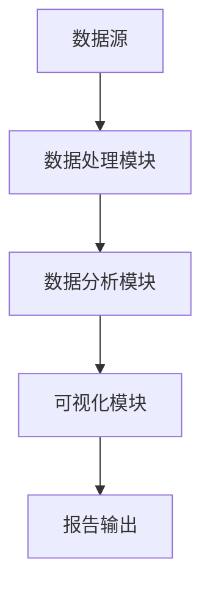

                 


# 费雪的竞争对手分析方法

## 关键词：竞争对手分析、费雪分析方法、投资分析、系统架构设计、项目实战

## 摘要：  
费雪的竞争对手分析方法是一种经典的投资分析工具，通过深入分析竞争对手的财务状况、业务模式和市场策略，帮助投资者识别潜在的投资机会和风险。本文从背景介绍、核心原理、系统架构设计、项目实战等多个维度，全面解析费雪分析方法的理论基础和实际应用，为读者提供一套系统化的竞争对手分析框架。

---

## 第一部分: 费雪的竞争对手分析方法概述

### 第1章: 费雪的竞争对手分析方法概述

#### 1.1 竞争对手分析的重要性  
竞争对手分析是投资决策中的核心环节，通过分析竞争对手的财务状况、市场策略和竞争优势，投资者可以更好地把握行业趋势和市场机会。  

#### 1.2 费雪分析方法的背景与起源  
费雪分析方法由投资大师费雪（Philip Fisher）提出，其核心思想是通过深入分析企业的财务数据和市场表现，识别出具有强大竞争优势的企业，从而实现长期投资收益最大化。  

#### 1.3 费雪分析方法的核心概念  
- **财务数据**：包括收入、利润、成本等关键指标。  
- **竞争优势**：企业相对于竞争对手的核心优势，如技术壁垒、品牌影响力等。  
- **市场策略**：企业如何通过定价、促销等方式获取市场份额。  

---

## 第二部分: 费雪分析方法的核心原理与应用

### 第2章: 费雪分析方法的核心原理

#### 2.1 费雪分析方法的基本原理  
费雪分析方法的核心在于通过计算企业的财务比率，识别出具有持续盈利能力的企业。其公式如下：  
$$ \text{费雪指数} = \frac{\text{销售额}}{\text{成本}} $$  

#### 2.2 费雪分析方法的数学模型  
费雪指数的计算公式可以进一步分解为以下步骤：  
1. 收集企业的财务数据，包括收入和成本。  
2. 计算费雪指数：  
$$ \text{费雪指数} = \frac{\text{销售额}}{\text{成本}} $$  
3. 分析费雪指数的变化趋势，判断企业的盈利能力。  

#### 2.3 费雪分析方法的优缺点  
- **优点**：简单易懂，计算速度快。  
- **缺点**：仅适用于单一维度的分析，无法全面反映企业的竞争优势。  

---

### 第3章: 费雪分析方法的系统架构设计

#### 3.1 竞争对手分析系统的功能模块  
竞争对手分析系统通常包括以下功能模块：  
1. 数据收集模块：收集竞争对手的财务数据和市场信息。  
2. 数据处理模块：对收集的数据进行清洗和预处理。  
3. 数据分析模块：计算费雪指数并生成分析报告。  
4. 可视化模块：将分析结果以图表形式展示。  

#### 3.2 竞争对手分析系统的架构图  


---

## 第三部分: 项目实战

### 第4章: 项目实战

#### 4.1 环境安装与数据准备  
- **环境安装**：安装Python和相关数据处理库（如Pandas、Matplotlib）。  
- **数据准备**：收集竞争对手的财务数据，包括收入和成本。  

#### 4.2 数据分析与可视化  
- **代码实现**：  
```python
import pandas as pd
import matplotlib.pyplot as plt

# 数据加载
data = pd.DataFrame({
    '企业': ['A', 'B', 'C'],
    '收入': [100, 150, 200],
    '成本': [50, 75, 100]
})

# 费雪指数计算
data['费雪指数'] = data['收入'] / data['成本']

# 可视化
plt.figure(figsize=(10, 6))
plt.plot(data['企业'], data['费雪指数'], 'o-')
plt.title('费雪指数分析')
plt.xlabel('企业')
plt.ylabel('费雪指数')
plt.show()
```

#### 4.3 实际案例分析  
以企业A为例，其费雪指数为2，表明企业的盈利能力较强。  

---

## 第四部分: 总结与展望

### 5.1 总结  
费雪的竞争对手分析方法通过计算企业的费雪指数，帮助投资者快速识别出具有持续盈利能力的企业。  

### 5.2 展望  
未来，随着人工智能技术的发展，竞争对手分析将更加智能化和自动化。  

---

## 作者：AI天才研究院/AI Genius Institute & 禅与计算机程序设计艺术 /Zen And The Art of Computer Programming

