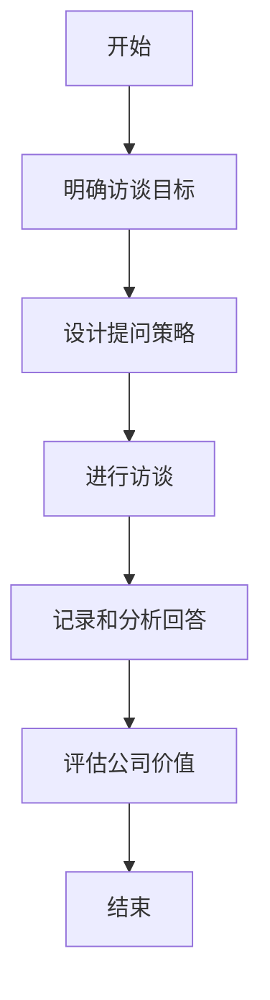
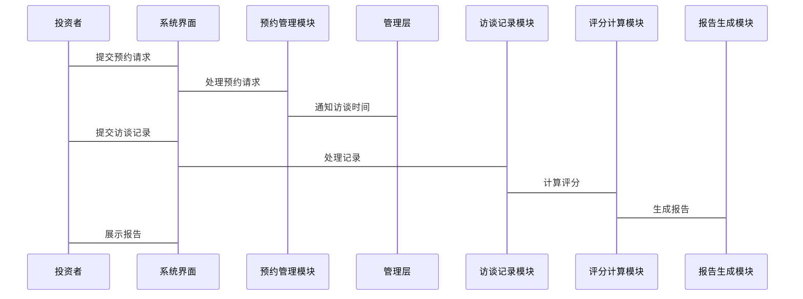

                 


# 费雪的管理层访谈技巧

> 关键词：费雪，管理层访谈，价值投资，投资技巧，投资决策

> 摘要：本文深入分析了费雪的管理层访谈技巧，探讨了这些技巧在价值投资中的应用和重要性。通过详细阐述核心概念、算法原理和实际案例，本文为投资者提供了实用的指导和建议。

---

# 第1章 费雪的投资理念与管理层访谈的背景

## 1.1 费雪的投资理念概述

### 1.1.1 费雪的价值投资理论

菲利普·费雪（Philip Fisher）是价值投资的重要倡导者之一，他的投资理念强调长期持有优质股票，关注公司的成长性和管理层的质量。费雪认为，成功的投资不仅依赖于公司的财务数据，还依赖于对管理层的深入了解。他通过与公司高管的访谈，评估公司的未来前景和潜在风险。

### 1.1.2 费雪对管理层访谈的重视

费雪认为，管理层的素质和决策能力是公司长期成功的关键因素。通过与管理层的直接交流，投资者可以更准确地评估公司的战略规划、管理风格和应对市场变化的能力。这种面对面的交流能够提供财务报表中无法获取的信息，帮助投资者做出更明智的投资决策。

### 1.1.3 管理层访谈在投资决策中的作用

管理层访谈能够帮助投资者：
1. 了解公司的战略方向和管理层的愿景。
2. 评估管理层的能力和诚信。
3. 获取行业动态和市场趋势的第一手信息。
4. 发现潜在的风险和机会。
5. 建立与管理层的信任关系，为后续投资决策提供支持。

## 1.2 管理层访谈的背景与意义

### 1.2.1 管理层访谈的定义与特点

管理层访谈是指投资者与公司高管进行的面对面交流，通过提问和倾听，深入了解公司的运营状况、财务表现、市场地位和未来计划。其特点包括：
- **互动性**：通过提问和回答，投资者能够深入挖掘信息。
- **直观性**：直接与管理层互动，能够更准确地评估其能力。
- **动态性**：访谈内容可以反映公司当前的经营状况和未来规划。

### 1.2.2 管理层访谈在投资中的重要性

管理层访谈不仅是了解公司的重要手段，也是评估管理层能力的关键方法。通过访谈，投资者可以评估管理层的决策能力、行业知识和应对问题的能力，从而更准确地判断公司的未来发展前景。

### 1.2.3 管理层访谈的边界与外延

管理层访谈的边界包括：
- 访谈的范围：仅限于公司高管，不包括中层或普通员工。
- 访谈的内容：主要围绕公司经营、财务状况和未来计划展开。
- 访谈的频率：通常在投资决策前进行，之后根据需要定期进行。

管理层访谈的外延包括：
- 与其他投资者的交流。
- 与公司董事会和独立董事的互动。
- 参与公司股东大会和其他重要活动。

## 1.3 本书的核心目标与结构

### 1.3.1 核心目标

本书旨在通过分析费雪的管理层访谈技巧，帮助投资者掌握如何通过与管理层的互动，评估公司的投资价值。同时，本书还将探讨这些技巧在实际投资中的应用，提供实用的指导和建议。

### 1.3.2 本书的章节安排

- 第1章：费雪的投资理念与管理层访谈的背景。
- 第2章：管理层访谈的核心概念与联系。
- 第3章：管理层访谈的算法原理。
- 第4章：管理层访谈的系统分析与架构设计。
- 第5章：管理层访谈的项目实战。
- 第6章：最佳实践与总结。

### 1.3.3 学习方法与注意事项

读者应结合实际投资案例，逐步理解和掌握管理层访谈的技巧。建议在阅读过程中，注重理论与实践的结合，积极参与案例分析和讨论，提升自己的投资能力。

---

# 第2章 管理层访谈的核心概念与联系

## 2.1 管理层访谈的核心概念

### 2.1.1 管理层访谈的核心要素

- **提问策略**：设计有效的提问，引导管理层分享关键信息。
- **评估能力**：通过回答评估管理层的专业能力和决策能力。
- **评估诚信**：判断管理层是否诚实守信，是否有误导或隐瞒信息的行为。
- **评估公司价值**：综合分析管理层的回答，评估公司的投资价值。

### 2.1.2 管理层访谈的关键属性对比

| 属性         | 描述                                                                 |
|--------------|----------------------------------------------------------------------|
| 互动性       | 访谈是互动的过程，投资者与管理层可以直接交流。                   |
| 直观性       | 通过面对面交流，能够更直观地评估管理层的能力和诚信。           |
| 动态性       | 访谈内容反映了公司当前的经营状况和未来计划。                     |
| 信息丰富性   | 访谈能够获取财务报表中无法体现的非财务信息。                     |

### 2.1.3 管理层访谈的ER实体关系图

以下是一个简化的ER实体关系图，展示管理层访谈的核心要素：

```mermaid
erd
    左右对齐
    左侧的“投资者”实体与右侧的“管理层”实体通过“访谈”关系连接。
    投资者实体属性：投资者ID、姓名、投资经验。
    管理层实体属性：管理层ID、职位、公司名称。
    访谈关系属性：访谈ID、时间、地点、主要内容。
```

## 2.2 管理层访谈的技巧与策略

### 2.2.1 提问策略的数学模型

提问策略可以通过以下步骤进行设计：

1. **明确目标**：确定访谈的核心目标，如评估公司财务状况或管理层能力。
2. **设计问题**：根据目标设计相关问题，确保问题能够引导管理层分享关键信息。
3. **调整策略**：根据管理层的回答，动态调整问题，深入挖掘信息。

以下是一个简单的提问策略模型：

$$
\text{提问策略} = \text{目标明确} \times \text{问题设计} \times \text{动态调整}
$$

### 2.2.2 访谈技巧的对比分析

以下是对几种常见访谈技巧的对比分析：

| 技巧         | 描述                                                                 | 优点                               | 缺点                               |
|--------------|----------------------------------------------------------------------|------------------------------------|------------------------------------|
| 开放式提问   | 提出没有固定答案的问题，鼓励管理层详细回答。                     | 获取更多信息，了解管理层的真实想法。| 可能导致访谈时间过长，信息分散。   |
| 封闭式提问   | 提出有明确答案的问题，限制管理层的回答。                         | 节省时间，获取关键信息。             | 可能限制管理层的表达，遗漏重要信息。|
| 引导式提问   | 通过引导性问题，促使管理层回答特定方向的内容。                 | 有效引导讨论，获取预期信息。         | 可能限制管理层的自由发挥。         |

### 2.2.3 访谈流程的Mermaid流程图

以下是一个典型的访谈流程图：



---

# 第3章 管理层访谈的算法原理

## 3.1 管理层访谈的算法原理

### 3.1.1 管理层访谈的数学模型

以下是评估管理层能力的数学模型：

$$
\text{管理层能力评分} = \frac{\text{回答准确性} + \text{行业知识深度} + \text{决策能力}}{3}
$$

### 3.1.2 访谈评分的计算公式

$$
\text{访谈评分} = \text{管理层能力评分} \times \text{公司基本面评分} \times \text{行业前景评分}
$$

### 3.1.3 访谈结果的预测模型

$$
\text{投资价值} = \text{访谈评分} \times \text{公司财务表现} \times \text{市场环境因素}
$$

## 3.2 算法实现与代码示例

### 3.2.1 访谈评分计算的Python代码

```python
def calculate_management_score(answers Accuracy, industry Knowledge, decision Making):
    return (answers_Accuracy + industry_Knowledge + decision_Making) / 3

def calculate_interview_score(management_Score, company_finance, industry_Prospects):
    return management_Score * company_finance * industry_Prospects

# 示例数据
answers_Accuracy = 85
industry_Knowledge = 80
decision_Making = 85
company_finance = 0.8
industry_Prospects = 0.85

management_Score = calculate_management_score(answers_Accuracy, industry_Knowledge, decision_Making)
interview_Score = calculate_interview_score(management_Score, company_finance, industry_Prospects)

print(f"管理层能力评分: {management_Score}")
print(f"访谈评分: {interview_Score}")
```

---

# 第4章 管理层访谈的系统分析与架构设计

## 4.1 系统分析

### 4.1.1 问题场景介绍

系统需要支持投资者与管理层进行高效访谈，记录和分析访谈内容，评估公司价值。

### 4.1.2 系统功能设计

系统功能包括：
- 访谈预约与管理
- 访谈内容记录与分析
- 管理层评分与公司价值评估
- 数据可视化与报告生成

### 4.1.3 系统架构设计

系统架构采用分层设计，包括：
- **数据层**：存储公司信息、访谈记录等。
- **业务逻辑层**：处理访谈预约、评分计算等。
- **用户界面层**：提供友好的用户界面，方便投资者使用。

## 4.2 系统架构图与交互图

### 4.2.1 系统架构的Mermaid图


### 4.2.2 系统交互的Mermaid序列图



---

# 第5章 管理层访谈的项目实战

## 5.1 项目实战环境安装

### 5.1.1 环境配置与工具安装

- 操作系统：Windows 10或更高版本。
- 开发工具：PyCharm或VS Code。
- 依赖库：安装Python的Pandas、Matplotlib等库。

### 5.1.2 数据收集与处理

- 数据来源：公司财务报表、行业报告、管理层访谈记录。
- 数据清洗：去除无效数据，填补缺失值。

### 5.1.3 数据分析与建模

- 数据分析：使用Pandas进行数据清洗和分析。
- 模型建立：使用机器学习算法预测公司价值。

## 5.2 核心代码实现

### 5.2.1 访谈评分计算的代码实现

```python
import pandas as pd
import matplotlib.pyplot as plt

# 数据加载
data = pd.read_csv('interview_scores.csv')

# 数据清洗
data.dropna(inplace=True)
data.drop_duplicates(inplace=True)

# 数据分析
data['management_score'].hist(bins=10)
plt.show()
```

### 5.2.2 访谈结果预测的代码实现

```python
from sklearn.tree import DecisionTreeRegressor
from sklearn.model_selection import train_test_split

# 数据准备
X = data[['management_score', 'company_finance', 'industry_Prospects']]
y = data['investment_value']

# 划分训练集和测试集
X_train, X_test, y_train, y_test = train_test_split(X, y, test_size=0.2, random_state=42)

# 建立模型
model = DecisionTreeRegressor()
model.fit(X_train, y_train)

# 预测结果
y_pred = model.predict(X_test)
print('预测值:', y_pred)
print('真实值:', y_test)
```

---

# 第6章 费雪管理层访谈的最佳实践与总结

## 6.1 最佳实践

### 6.1.1 访谈前的准备工作

- 确定访谈目标。
- 设计有效的问题。
- 预约合适的时间。

### 6.1.2 访谈过程中的注意事项

- 保持专业和礼貌。
- 记录关键信息。
- 灵活调整提问策略。

### 6.1.3 访谈后的分析与总结

- 分析访谈结果。
- 更新投资决策。
- 总结经验教训。

## 6.2 投资中的注意事项

- 避免过度依赖管理层访谈。
- 结合其他投资工具进行分析。
- 定期更新和调整投资策略。

## 6.3 拓展阅读与资源

- **书籍**：《费雪投资经典》。
- **博客**：投资论坛和专业博客。
- **工具**：使用数据分析工具辅助投资决策。

---

# 作者

作者：AI天才研究院/AI Genius Institute & 禅与计算机程序设计艺术/Zen And The Art of Computer Programming

