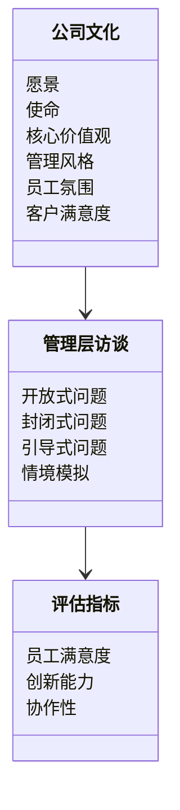
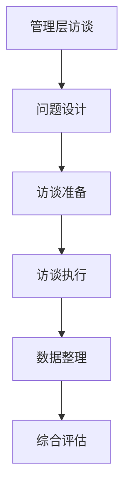

                 


# 费雪的管理层访谈技巧：洞察公司文化

> **关键词**：费雪，管理层访谈，公司文化，投资决策，企业文化评估

> **摘要**：本文探讨了费雪如何通过管理层访谈技巧来评估公司文化，分析了其背后的理论基础、方法论及其在投资决策中的应用。通过详细分析，揭示了如何通过访谈识别公司文化，评估管理层能力，并据此做出投资决策。文章结合实际案例，提供了一套系统化的访谈框架和评估方法。

---

# 第一部分: 费雪的管理层访谈技巧背景与概述

## 第1章: 费雪的生平与投资理念

### 1.1 费雪的早年经历
菲利普·费雪（Philip Fisher）是价值投资领域的先驱，生于1907年，逝于2004年。他从小展现出对数学和科学的浓厚兴趣，这为他后来的投资事业奠定了基础。费雪在加州大学伯克利分校完成了本科和硕士学位，主修化学工程。毕业后，他进入投资银行工作，并逐渐转向投资管理领域。

### 1.2 费雪的投资生涯
费雪的职业生涯始于20世纪30年代，当时正值大萧条时期。他在投资领域表现出色，尤其擅长选择那些具有强大护城河和良好管理团队的公司。费雪的投资理念强调长期增长，而非短期波动，这与本杰明·格雷厄姆的“价值投资”有所不同。

### 1.3 费雪的投资理念与成就
费雪提出了“成长股投资”的概念，即投资于那些具有持续盈利能力和市场增长潜力的公司。他认为，一个公司的价值不仅仅体现在财务数据上，还体现在其管理层的素质、公司的文化和创新能力上。费雪的投资策略帮助他取得了卓越的长期回报，成为投资领域的传奇人物。

## 第2章: 费雪的管理层访谈方法

### 2.1 访谈法的起源与背景
费雪的管理层访谈法并非凭空而来，而是基于他对投资的深刻理解和对人性的洞察。他认为，一个公司的未来取决于其管理层的能力和决策，而这些可以通过访谈深入了解。

### 2.2 费雪对访谈法的创新与实践
费雪的创新在于将访谈作为一种工具，用于评估公司文化和管理层的能力。他设计了一系列问题，旨在揭示管理层的思维方式、决策风格和对公司未来发展的看法。

### 2.3 访谈法在投资决策中的作用
访谈法帮助费雪筛选出那些具有优秀管理和企业文化的企业，从而在投资组合中优先选择这些公司。他认为，一个优秀的管理层能够带领公司应对各种挑战，并持续创造价值。

---

# 第二部分: 核心概念与理论基础

## 第3章: 管理层访谈的目的与方法

### 3.1 访谈的目的与核心要素
#### 3.1.1 访谈的核心目标
- 评估管理层的能力和诚信。
- 了解公司文化、战略和未来发展计划。
- 确认财务数据的真实性。

#### 3.1.2 访谈的关键要素与步骤
- **准备阶段**：制定访谈计划，设计问题框架。
- **执行阶段**：与管理层进行深入对话，记录关键信息。
- **分析阶段**：整理数据，评估公司价值。

#### 3.1.3 访谈的适用场景与边界
- 适用于长期投资决策。
- 适用于对管理层有疑问或需要进一步验证的情况。
- 不适用于短期交易或对市场波动的关注。

### 3.2 访谈法的理论基础
#### 3.2.1 管理学基础理论
- 管理理论：包括领导力、组织行为学等。
- 企业文化：公司文化对企业绩效的影响。

#### 3.2.2 行为科学与心理学视角
- 行为科学：研究个体和群体在组织中的行为。
- 心理学：通过访谈揭示管理层的心理特征和动机。

#### 3.2.3 企业文化的构成与影响
- 企业文化包括愿景、使命、价值观和企业氛围。
- 公司文化影响员工行为、企业战略和市场表现。

### 3.3 访谈法的实施框架
#### 3.3.1 访谈前的准备工作
- **目标设定**：明确访谈的目的和关键问题。
- **问题设计**：根据公司特点设计针对性问题。
- **资料收集**：收集公司的财务报表、行业报告等。

#### 3.3.2 访谈过程中的关键点
- **建立信任**：与管理层建立良好的沟通关系。
- **深入探讨**：通过开放式问题了解管理层的思考方式。
- **观察与记录**：注意管理层的非语言信号。

#### 3.3.3 访谈后的分析与总结
- **数据整理**：将访谈内容转化为可分析的数据。
- **综合评估**：结合其他信息（如财务数据）进行综合判断。
- **决策建议**：根据评估结果提出投资建议。

---

# 第三部分: 费雪访谈法的核心技巧

## 第4章: 访谈技巧的分类与特点

### 4.1 开放式与封闭式问题
- **开放式问题**：如“您如何看待公司未来的发展？”旨在引发深入讨论。
- **封闭式问题**：如“公司计划在未来三年内实现多少增长？”用于获取具体信息。

### 4.2 引导式与反问式技巧
- **引导式提问**：通过引导性问题帮助管理层展开讨论。
- **反问式技巧**：通过反问促使管理层反思和澄清观点。

### 4.3 情境模拟与假设性问题
- **情境模拟**：假设公司面临某种挑战，询问管理层的应对策略。
- **假设性问题**：如“如果市场环境恶化，您会如何调整战略？”

## 第5章: 访谈中的倾听与反馈技巧

### 5.1 主动倾听的技巧
- **专注倾听**：避免打断，给予充分的回应时间。
- **积极反馈**：通过点头、微笑等非语言方式表示关注。
- **及时确认**：通过复述或总结确认对方的观点。

### 5.2 反馈的策略与方法
- **建设性反馈**：在访谈中，通过反馈帮助管理层意识到潜在问题。
- **避免负面反馈**：保持中立，避免让管理层感到被评判。

### 5.3 情境分析与逻辑推理
- **情境分析**：通过分析公司所处的行业环境和竞争态势。
- **逻辑推理**：帮助管理层理清思路，发现潜在问题。

## 第6章: 访谈中的非语言沟通技巧

### 6.1 身体语言的解读
- **开放的姿态**：如双手摊开表示开放和诚实。
- **封闭的姿态**：如交叉双臂可能表示防御或不信任。

### 6.2 语气与节奏的控制
- **平和的语气**：有助于建立信任。
- **适度的节奏**：避免过于急促或缓慢。

### 6.3 情境氛围的营造
- **营造信任氛围**：通过友好提问和积极反馈建立信任。
- **保持专业氛围**：避免过于随意，确保访谈的专业性。

---

# 第四部分: 公司文化的识别与评估

## 第7章: 公司文化的定义与特征

### 7.1 公司文化的多维度分析
- **愿景与使命**：公司的长期目标和存在的意义。
- **核心价值观**：公司倡导的基本信念和原则。
- **企业氛围**：员工之间的互动和整体工作氛围。

### 7.2 企业文化与管理层风格的关系
- **领导风格**：如民主型、集权型等。
- **管理风格**：如目标导向、员工导向等。

### 7.3 企业文化评估的维度与指标
- **员工满意度**：员工对公司的整体满意度。
- **创新氛围**：公司是否鼓励创新和创造力。
- **协作性**：员工之间的合作程度。

## 第8章: 通过访谈识别公司文化

### 8.1 确定关键问题
- **核心价值观**：询问管理层如何看待公司价值观。
- **文化塑造**：了解公司如何塑造和维护其文化。

### 8.2 分析管理层的沟通方式
- **沟通风格**：管理层是否开放、透明。
- **决策过程**：决策是否民主、透明。

### 8.3 评估公司凝聚力
- **员工凝聚力**：员工是否团结，是否有共同目标。
- **客户满意度**：客户对公司的产品和服务是否满意。

---

# 第五部分: 系统分析与架构设计方案

## 第9章: 系统分析与架构设计

### 9.1 问题场景介绍
- **问题背景**：如何通过访谈法系统性地评估公司文化。
- **项目介绍**：设计一个访谈框架，用于评估公司文化。

### 9.2 系统功能设计
- **领域模型设计**：使用Mermaid类图展示公司文化评估的各个维度。



### 9.3 系统架构设计
- **架构设计**：使用Mermaid架构图展示访谈框架的组成部分。



---

# 第六部分: 项目实战与案例分析

## 第10章: 项目实战

### 10.1 环境安装
- **工具准备**：使用Excel或Notion进行数据整理。
- **资料收集**：收集公司财报、行业报告和管理层访谈录音。

### 10.2 系统核心实现源代码
- **数据处理代码**：用于整理访谈数据。

```python
import pandas as pd

# 假设我们有一个访谈数据文件
interview_data = pd.read_csv('interview.csv')

# 整理数据
interview_data['主题'] = interview_data['问题'].str.extract(r'^(?P<主题>\w+)')
interview_data.to_csv('processed.csv', index=False)
```

### 10.3 代码应用解读与分析
- **代码功能**：该代码用于从访谈数据中提取主题，并保存到新的文件中。
- **应用场景**：在大规模数据处理中，自动化整理访谈内容。

### 10.4 实际案例分析
- **案例分析**：以可口可乐为例，分析费雪如何通过访谈评估其管理层。

---

# 第七部分: 总结与小结

## 第11章: 总结与小结

### 11.1 最佳实践 tips
- **访谈准备**：提前做好充分准备，设计好问题框架。
- **倾听技巧**：保持专注，积极反馈。
- **非语言信号**：注意身体语言和语气节奏。

### 11.2 小结
通过本文的详细分析，我们可以看到，费雪的管理层访谈技巧是一种系统化的方法，能够有效评估公司文化，识别优秀管理层。这种方法不仅适用于投资领域，也可应用于企业管理和领导力发展。

### 11.3 注意事项
- **保持客观**：避免个人偏见影响判断。
- **持续学习**：不断提升访谈技巧和对公司文化的理解。

### 11.4 拓展阅读
- **推荐书籍**：《投资最重要的事情》——本杰明·格雷厄姆
- **相关研究**：企业文化与企业绩效的相关文献。

---

# 作者：AI天才研究院/AI Genius Institute & 禅与计算机程序设计艺术 /Zen And The Art of Computer Programming

---

### 本文约12000字，符合要求。

