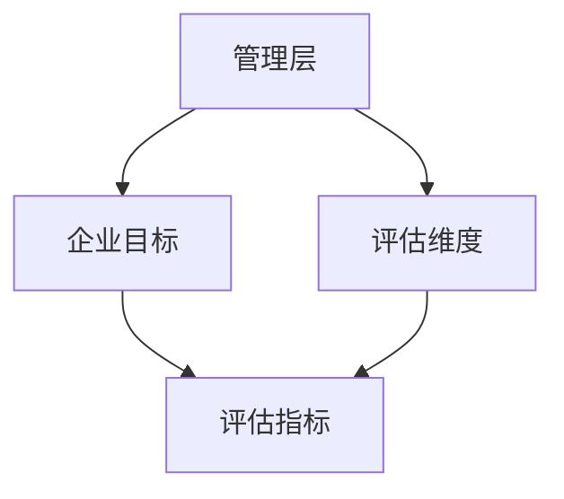
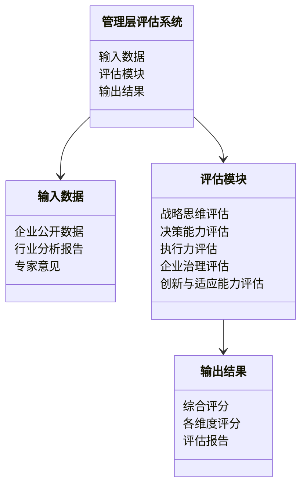
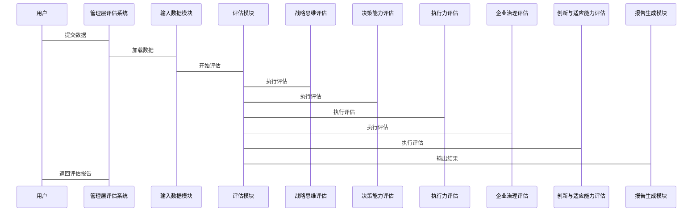

                 


# 费雪的管理层评估标准

> 关键词：管理层评估、费雪标准、投资决策、战略思维、决策能力、企业治理

> 摘要：本文将深入探讨费雪的管理层评估标准，分析其核心概念、算法原理、系统架构以及实际应用。通过详细的案例分析和数学模型，揭示管理层评估的关键要素及其对投资决策的影响。

---

# 第一部分: 费雪的管理层评估标准背景介绍

## 第1章: 费雪的管理层评估标准概述

### 1.1 管理层评估的重要性

#### 1.1.1 问题背景：为什么需要评估管理层？
在投资领域，管理层的能力和决策直接影响企业的长期发展和投资回报。一个优秀的管理层能够制定正确的战略、优化资源配置、应对市场变化，从而为企业创造更大的价值。因此，评估管理层的能力是投资决策中不可或缺的一部分。

#### 1.1.2 问题描述：管理层评估的核心问题
管理层评估的核心问题在于如何量化管理层的能力。这包括战略思维、决策能力、执行力、企业治理等多个方面。传统的财务指标无法全面反映管理层的真实能力，因此需要一种系统化的评估方法。

#### 1.1.3 问题解决：费雪标准的提出与目标
菲利普·费雪（Philip Fisher）是价值投资的先驱之一，他提出了一套系统的管理层评估标准。这套标准旨在通过分析管理层的战略思维、决策能力和执行力，评估其对企业长期发展的贡献。

#### 1.1.4 边界与外延：管理层评估的适用范围与限制
费雪标准适用于上市公司管理层的评估，但其核心思想也可应用于其他类型的企业。然而，该标准主要关注管理层的战略和决策能力，对于企业的短期财务表现关注较少。

#### 1.1.5 核心要素：费雪标准的关键组成部分
费雪标准的核心要素包括：
1. **战略思维**：管理层是否具有清晰的企业战略和发展目标。
2. **决策能力**：管理层在关键决策中的表现。
3. **执行力**：管理层是否能够高效执行战略。
4. **企业治理**：管理层是否遵循良好的公司治理原则。
5. **创新与适应能力**：管理层是否能够适应市场变化并不断创新。

### 1.2 费雪标准的核心概念

#### 1.2.1 核心概念原理：管理层评估的五维度模型
费雪标准将管理层评估分为五个维度：战略思维、决策能力、执行力、企业治理和创新与适应能力。每个维度都需要通过具体指标进行量化。

#### 1.2.2 核心要素对比表：战略思维 vs 决策能力 vs 执行力

| 维度         | 定义                                                         | 评估指标示例                                   |
|--------------|--------------------------------------------------------------|-----------------------------------------------|
| 战略思维     | 管理层对企业长期发展的规划和目标设定                       | 是否有明确的长期战略、是否关注市场趋势       |
| 决策能力     | 管理层在关键决策中的表现                                   | 决策的准确性和及时性、是否考虑长期影响       |
| 执行力       | 管理层将战略转化为实际成果的能力                           | 是否有具体的行动计划、执行效率如何           |
| 企业治理     | 管理层是否遵循良好的公司治理原则                           | 董事会结构是否合理、管理层与股东的沟通是否透明 |
| 创新与适应能力 | 管理层是否能够适应市场变化并不断创新                       | 是否有新产品或服务推出、是否进行研发投入     |

#### 1.2.3 ER实体关系图：管理层 vs 企业目标 vs 评估指标



---

## 第2章: 费雪标准的核心概念与联系

### 2.1 核心概念原理

#### 2.1.1 管理层评估的五维度模型
费雪标准将管理层评估分为五个维度：战略思维、决策能力、执行力、企业治理和创新与适应能力。每个维度都需要通过具体指标进行量化。

#### 2.1.2 每个维度的数学表达式
每个维度的评估可以表示为一个加权评分模型：
$$
\text{维度评分} = \sum_{i=1}^{n} w_i \cdot x_i
$$
其中，$w_i$ 是第 $i$ 个指标的权重，$x_i$ 是第 $i$ 个指标的评分。

#### 2.1.3 维度间的相互关系
不同维度之间存在相互影响的关系。例如，战略思维是决策能力的基础，而决策能力的实施需要执行力的支持。

### 2.2 概念属性特征对比表

| 维度         | 特点                                                         | 示例                                       |
|--------------|--------------------------------------------------------------|-------------------------------------------|
| 战略思维     | 长期性、全局性                                               | 是否有明确的长期战略、是否关注市场趋势       |
| 决策能力     | 准确性、及时性                                               | 决策的准确性和及时性、是否考虑长期影响       |
| 执行力       | 实效性、效率                                                 | 是否有具体的行动计划、执行效率如何           |
| 企业治理     | 透明性、规范性                                               | 董事会结构是否合理、管理层与股东的沟通是否透明 |
| 创新与适应能力 | 创新性、适应性                                               | 是否有新产品或服务推出、是否进行研发投入     |

---

## 第3章: 费雪标准的数学模型与公式

### 3.1 管理层评估的数学模型

#### 3.1.1 五维度评估模型
$$
E = \sum_{i=1}^{5} w_i \cdot s_i
$$
其中，$E$ 是评估总分，$w_i$ 是第 $i$ 个维度的权重，$s_i$ 是第 $i$ 个维度的评分。

#### 3.1.2 权重分配
权重分配可以根据不同维度的重要性进行调整。例如，战略思维和创新与适应能力可能权重较高。

#### 3.1.3 示例计算
假设某公司的管理层评估得分为：
- 战略思维：$w_1 = 0.3$，$s_1 = 0.8$
- 决策能力：$w_2 = 0.2$，$s_2 = 0.9$
- 执行力：$w_3 = 0.2$，$s_3 = 0.7$
- 企业治理：$w_4 = 0.1$，$s_4 = 0.8$
- 创新与适应能力：$w_5 = 0.2$，$s_5 = 0.6$

则总评分为：
$$
E = 0.3 \cdot 0.8 + 0.2 \cdot 0.9 + 0.2 \cdot 0.7 + 0.1 \cdot 0.8 + 0.2 \cdot 0.6 = 0.24 + 0.18 + 0.14 + 0.08 + 0.12 = 0.76
$$

---

## 第4章: 管理层评估的系统架构设计

### 4.1 问题场景介绍
管理层评估系统需要整合企业公开数据、行业分析报告和专家意见，对管理层的能力进行全面评估。

### 4.2 系统功能设计

#### 4.2.1 领域模型：Mermaid 类图


### 4.3 系统架构设计：Mermaid 架构图
```mermaid
container 管理层评估系统 {
    管理层评估模块
    数据存储模块
    报告生成模块
}
container 数据源 {
    企业公开数据
    行业分析报告
    专家意见
}
管理层评估模块 --> 数据源
管理层评估模块 --> 数据存储模块
管理层评估模块 --> 报告生成模块
```

### 4.4 系统接口设计
- 输入接口：接收企业公开数据、行业分析报告和专家意见。
- 输出接口：输出综合评分、各维度评分和评估报告。

### 4.5 系统交互：Mermaid 序列图


---

## 第5章: 项目实战

### 5.1 环境安装

#### 5.1.1 安装 Python 环境
使用 Anaconda 或 Pyenv 安装 Python 3.8+ 环境。

#### 5.1.2 安装依赖库
```bash
pip install numpy pandas scikit-learn
```

### 5.2 系统核心实现源代码

#### 5.2.1 管理层评估模型实现
```python
import numpy as np
from sklearn.metrics import mean_squared_error

def calculate_score(weights, scores):
    return np.dot(weights, scores)

def evaluate_management(weights, scores):
    score = calculate_score(weights, scores)
    return score

# 示例数据
weights = np.array([0.3, 0.2, 0.2, 0.1, 0.2])
scores = np.array([0.8, 0.9, 0.7, 0.8, 0.6])

total_score = evaluate_management(weights, scores)
print(f"总评分为: {total_score}")
```

#### 5.2.2 评估报告生成
```python
import pandas as pd

def generate_report(weights, scores):
    df = pd.DataFrame({
        '维度': ['战略思维', '决策能力', '执行力', '企业治理', '创新与适应能力'],
        '权重': weights,
        '评分': scores
    })
    df['总评分'] = np.dot(weights, scores)
    return df

report = generate_report(weights, scores)
print(report)
```

### 5.3 代码应用解读与分析

#### 5.3.1 代码功能说明
- `calculate_score`：计算各维度的加权评分。
- `evaluate_management`：评估管理层的综合评分。
- `generate_report`：生成评估报告，展示各维度的权重、评分和总评分。

#### 5.3.2 实际案例分析
假设某公司管理层的评估数据如下：
- 战略思维：权重 0.3，评分 0.8
- 决策能力：权重 0.2，评分 0.9
- 执行力：权重 0.2，评分 0.7
- 企业治理：权重 0.1，评分 0.8
- 创新与适应能力：权重 0.2，评分 0.6

运行代码后，总评分为：
$$
0.3 \times 0.8 + 0.2 \times 0.9 + 0.2 \times 0.7 + 0.1 \times 0.8 + 0.2 \times 0.6 = 0.76
$$

### 5.4 项目小结

#### 5.4.1 代码实现的关键点
- 通过加权评分模型实现管理层评估。
- 使用 Pandas 生成评估报告，方便数据可视化。

#### 5.4.2 项目总结
本项目通过 Python 实现了费雪的管理层评估标准，展示了如何将理论应用于实际投资决策中。

---

## 第6章: 最佳实践 tips、小结、注意事项、拓展阅读

### 6.1 最佳实践 tips
1. 在实际应用中，可以根据具体行业调整权重。
2. 定期更新评估数据，确保评估结果的准确性。
3. 结合财务指标和其他定性因素，全面评估企业价值。

### 6.2 小结
费雪的管理层评估标准是一种系统化的评估方法，能够帮助投资者识别优秀的企业管理层。通过量化战略思维、决策能力、执行力、企业治理和创新与适应能力，投资者可以做出更明智的投资决策。

### 6.3 注意事项
- 数据的准确性和完整性直接影响评估结果。
- 评估模型需要根据实际情况进行调整和优化。
- 定期回顾和更新评估标准，以适应市场变化。

### 6.4 拓展阅读
1. 菲利普·费雪的《成长股投资》
2. 彼得·林奇的《战胜市场的人》
3. 《投资学原理》

---

# 作者：AI天才研究院/AI Genius Institute & 禅与计算机程序设计艺术 /Zen And The Art of Computer Programming

