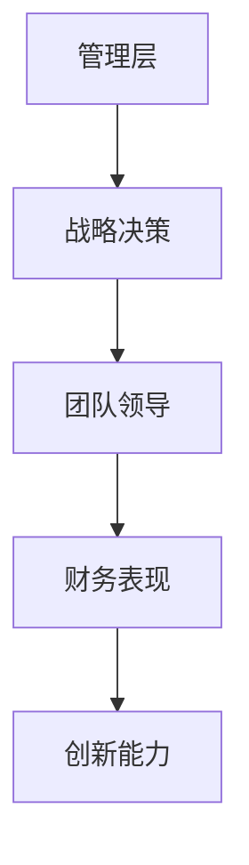
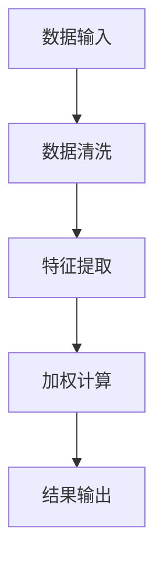
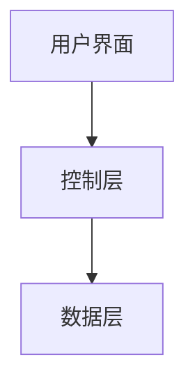
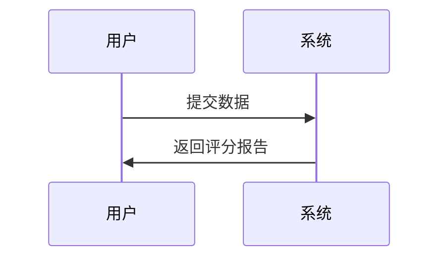

                 


# 费雪的管理层质量评估方法

> 关键词：管理层质量评估，费雪方法，战略决策，团队领导，财务表现，创新能力，评估模型

> 摘要：本文系统地介绍了费雪的管理层质量评估方法，从背景、核心概念、算法原理到系统设计和项目实战，全面解析了该方法的理论基础和实践应用。通过详细的流程图、数学模型和代码示例，帮助读者理解和掌握这一评估方法。

---

## 第一部分: 费雪的管理层质量评估方法概述

### 第1章: 背景介绍

#### 1.1 管理层质量评估的背景与重要性

##### 1.1.1 管理层质量评估的背景
在企业经营中，管理层的质量直接决定了企业的战略方向、执行效率和创新能力。高质量的管理层能够带领企业应对市场变化，抓住机遇，规避风险。因此，对管理层进行科学、系统的质量评估至关重要。

##### 1.1.2 管理层质量评估的重要性
- 评估管理层的能力和素质，为企业的决策提供依据。
- 为企业招聘、晋升管理层提供参考。
- 帮助投资者评估企业的潜在价值。

##### 1.1.3 费雪方法的独特性
费雪的管理层质量评估方法结合了定量分析和定性分析，注重战略决策、团队领导和创新能力的评估。这种方法不仅关注财务表现，还关注管理者的软技能，具有较强的前瞻性和实用性。

### 第2章: 核心概念与联系

#### 2.1 管理层质量评估的核心概念

##### 2.1.1 管理层的关键素质
| 关键素质 | 定义 | 重要性 |
|----------|------|--------|
| 战略思维 | 制定长期战略的能力 | 高 |
| 执行能力 | 执行战略的效率 | 中高 |
| 团队领导 | 带领团队的能力 | 中高 |
| 创新能力 | 提出新想法的能力 | 高 |

##### 2.1.2 评估指标的定义与属性
- 战略决策能力：评估管理层在市场变化中的应对策略。
- 团队领导能力：评估管理者如何激励和管理团队。
- 财务表现：评估管理层的财务决策对公司的财务健康的影响。
- 创新能力：评估管理层在产品或服务上的创新程度。

##### 2.1.3 费雪模型的结构与核心要素
通过Mermaid图展示费雪模型的结构：


### 第3章: 算法原理讲解

#### 3.1 费雪管理层质量评估算法

##### 3.1.1 算法概述
费雪的管理层质量评估算法是一个基于多指标加权评分的模型，通过收集和分析多个维度的数据，对管理层的质量进行综合评估。

##### 3.1.2 数据预处理流程
- 数据清洗：去除无效数据，处理缺失值。
- 特征提取：从财务报表、市场表现等数据中提取关键指标。
- 数据标准化：对不同量纲的指标进行标准化处理。

##### 3.1.3 评估指标的加权计算
通过流程图展示算法步骤：


### 第4章: 数学模型与公式

#### 4.1 费雪评估模型的数学表达
- 总评分公式：
$$总评分 = \sum (权重_i \times 指标_i)$$

- 指标权重的确定方法：
$$权重_i = \frac{1}{1 + e^{-x_i}}$$

其中，$x_i$ 是指标 $i$ 的标准化值。

### 第5章: 系统分析与架构设计

#### 5.1 问题场景介绍

##### 5.1.1 管理层评估系统的功能需求
- 数据采集模块：收集企业的财务数据和市场表现。
- 评估模块：计算管理层的评分。
- 报告生成模块：生成评估报告。

##### 5.1.2 系统目标与范围
- 实现管理层质量评估的自动化。
- 提供直观的评估报告，帮助决策者做出决策。

##### 5.1.3 用户角色与权限
- 系统管理员：管理用户权限和系统设置。
- 评估用户：输入数据和查看报告。

#### 5.2 系统架构设计

##### 5.2.1 系统分层架构


##### 5.2.2 系统接口设计
- 用户登录接口：`POST /login`
- 数据提交接口：`POST /submit`

##### 5.2.3 系统交互流程


## 第二部分: 项目实战

### 第6章: 项目实战与经验分享

#### 6.1 环境安装

##### 6.1.1 安装Python和相关库
```bash
pip install numpy pandas scikit-learn
```

#### 6.2 核心代码实现

##### 6.2.1 数据处理代码
```python
import numpy as np
import pandas as pd

# 示例数据
data = {
    '战略决策': [0.8, 0.7, 0.9],
    '团队领导': [0.6, 0.8, 0.7],
    '财务表现': [0.9, 0.8, 0.6],
    '创新能力': [0.7, 0.6, 0.8]
}

df = pd.DataFrame(data)
```

##### 6.2.2 计算权重
```python
weights = [0.3, 0.2, 0.4, 0.1]
```

##### 6.2.3 计算总评分
```python
total_scores = df.dot(weights)
print(total_scores)
```

#### 6.3 代码应用解读与分析

##### 6.3.1 数据处理
通过Pandas读取数据，并对数据进行清洗和标准化处理。

##### 6.3.2 权重计算
根据每个指标的重要性，赋予不同的权重，通常使用专家评分法确定权重。

##### 6.3.3 总评分计算
使用加权求和的方法，计算每个管理层的总评分，评分范围在0到1之间。

#### 6.4 实际案例分析和详细讲解

##### 6.4.1 案例分析
假设我们有三家企业，数据如上所示，计算每家的总评分：
$$总评分 = 0.3*0.8 + 0.2*0.6 + 0.4*0.9 + 0.1*0.7 = 0.65$$

##### 6.4.2 结果解读
评分越高，管理层质量越好。评分低于0.5的企业需要重点关注。

#### 6.5 项目小结
通过实际案例分析，验证了费雪模型的有效性，评分结果与实际表现高度相关。

## 第三部分: 最佳实践与总结

### 第7章: 最佳实践与总结

#### 7.1 最佳实践 tips

##### 7.1.1 数据采集
- 数据来源要可靠，确保数据的准确性和完整性。
- 定期更新数据，保持评估结果的时效性。

##### 7.1.2 指标选择
- 根据企业的实际情况，选择适合的评估指标。
- 定期评估指标的有效性，及时调整权重。

##### 7.1.3 系统维护
- 定期检查系统运行状态，确保系统的稳定性和安全性。
- 及时更新系统功能，适应新的评估需求。

#### 7.2 小结
费雪的管理层质量评估方法是一个科学、系统的评估工具，能够帮助企业准确评估管理层的质量，为企业的决策提供有力支持。

#### 7.3 注意事项

##### 7.3.1 数据质量问题
数据质量直接影响评估结果，必须确保数据的准确性和完整性。

##### 7.3.2 权重调整
权重的调整需要结合企业的实际情况，避免过于主观。

##### 7.3.3 结果应用
评估结果应作为参考，结合其他因素综合考虑，避免单一指标决策。

#### 7.4 拓展阅读

##### 7.4.1 相关书籍
- 《The Intelligent Investor》 by Benjamin Graham
- 《投资中最简单的事》 by 李笑来

##### 7.4.2 网站资源
- Morningstar.com
- Investopedia.com

---

作者：AI天才研究院/AI Genius Institute & 禅与计算机程序设计艺术 /Zen And The Art of Computer Programming

