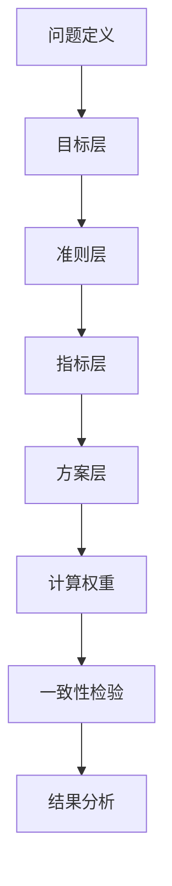
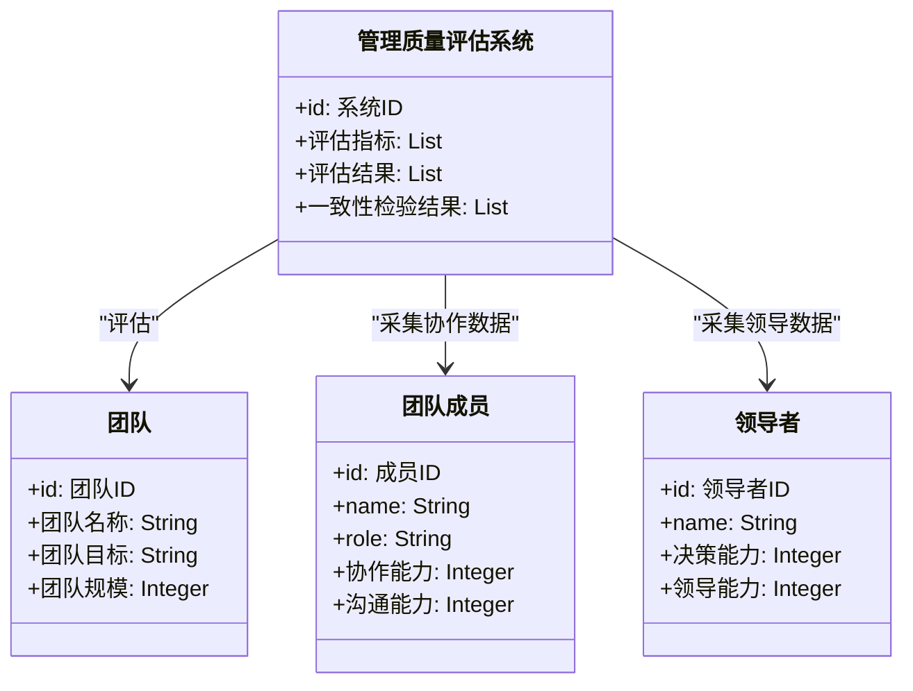

                 


# 费雪的管理质量评估：优秀团队的重要性

---

## 关键词：管理质量评估、团队管理、优秀团队、费雪模型、AHP、层次分析法

---

## 摘要：  
本文围绕费雪的管理质量评估理论，深入探讨了优秀团队在管理质量评估中的重要性。文章首先介绍了管理质量评估的背景与核心概念，详细分析了费雪模型的核心要素及其内在联系。接着，结合层次分析法（AHP），从算法原理与数学模型的角度，阐述了管理质量评估的具体方法。随后，通过对系统的分析与架构设计，展示了如何将管理质量评估应用于实际场景中。最后，通过项目实战与最佳实践，总结了优秀团队在管理质量评估中的实际应用与价值。

---

# 1. 管理质量评估的背景与核心概念

## 1.1 管理学的演进与管理质量评估的提出

管理学作为一门研究人类组织活动的科学，其核心目标是通过合理分配资源、协调个体行为，实现组织目标的高效达成。随着社会的进步与企业规模的扩大，传统的管理方法逐渐暴露出诸多局限性。现代管理学开始注重“以人为本”的理念，强调团队协作、领导力和沟通效率的重要性。

管理质量评估的提出，正是基于对现代企业管理中“人”的因素的关注。通过科学的方法评估团队的质量，可以帮助管理者识别团队的优势与不足，从而采取针对性的改进措施。这种评估不仅能够提升团队的整体效率，还能增强团队的凝聚力与稳定性。

## 1.2 费雪的管理质量评估理论

费雪的管理质量评估理论是基于团队管理的实践总结而提出的。该理论的核心在于通过量化的方式评估团队的整体质量，包括团队协作、领导力、沟通效率等关键要素。费雪模型的特点在于其系统的分析方法，能够将复杂的团队管理问题分解为若干可量化的指标。

### 费雪模型的核心要素

1. **团队协作质量**：团队成员之间的合作程度，包括任务分配、角色分工的合理性。
2. **领导力与决策能力**：领导者在团队中的影响力与决策效率。
3. **沟通效率与信息传递**：团队内部的信息流通畅性与准确性。
4. **团队凝聚力与稳定性**：团队成员的归属感与团队的稳定性。

## 1.3 优秀团队在管理质量评估中的重要性

优秀团队是管理质量评估的核心关注点。一个优秀的团队不仅能够高效完成任务，还能在复杂环境下保持稳定。优秀团队的重要性体现在以下几个方面：

1. **提升团队效率**：优秀团队能够通过高效的协作与沟通，显著提升工作效率。
2. **增强团队稳定性**：优秀团队具有较强的凝聚力，能够在挑战中保持稳定。
3. **促进组织目标的实现**：优秀团队能够更好地理解组织目标，并通过协作实现目标。

---

# 2. 费雪的管理质量评估模型与核心概念

## 2.1 费雪模型的组成部分

费雪模型将管理质量评估分解为多个核心要素，并通过量化的方法对这些要素进行评估。以下是费雪模型的主要组成部分：

1. **团队协作质量**：包括任务分配的合理性、角色分工的清晰性等。
2. **领导力与决策能力**：包括领导者的决策效率、影响力等。
3. **沟通效率与信息传递**：包括团队内部的信息流通畅性、准确性等。
4. **团队凝聚力与稳定性**：包括团队成员的归属感、稳定性等。

### 费雪模型的核心要素对比

以下是一个对比表格，展示了费雪模型中各核心要素的属性特征：

| 核心要素               | 属性特征                               |
|------------------------|--------------------------------------|
| 团队协作质量           | 合作性、任务分配合理性、角色分工清晰性 |
| 领导力与决策能力       | 决策效率、影响力、决策准确性          |
| 沟通效率与信息传递     | 信息流通畅性、准确性、及时性          |
| 团队凝聚力与稳定性     | 团队归属感、稳定性、抗压能力          |

## 2.2 费雪模型的ER实体关系图

以下是一个使用 Mermaid 绘制的 ER 实体关系图，展示了费雪模型的核心要素之间的关系：

```mermaid
erDiagram
    actor 团队成员 {
        attribute id, name, role, 沟通能力, 合作能力
    }
    actor 领导者 {
        attribute id, name, role, 决策能力, 领导能力
    }
    actor 管理系统 {
        attribute id, 评估指标, 评估结果, 改进建议
    }
    team "团队" {
        attribute id, 团队名称, 团队目标, 团队规模
    }
    relation "参与" {
        role 团队成员 -> 团队
    }
    relation "领导" {
        role 领导者 -> 团队
    }
    relation "评估" {
        role 管理系统 -> 团队
    }
```

---

# 3. 管理质量评估的算法原理与数学模型

## 3.1 层次分析法（AHP）在管理质量评估中的应用

层次分析法（AHP）是一种常用的决策分析方法，适用于多指标、多层次的决策问题。在管理质量评估中，AHP 可以帮助我们量化各核心要素的权重，从而得出团队质量的综合评估结果。

### 层次分析法的流程

以下是一个使用 Mermaid 绘制的层次分析法流程图：



### 层次分析法的数学模型

层次分析法的核心在于计算各指标的权重，公式如下：

$$ A = \sum_{i=1}^{n} w_i x_i $$

其中：
- \( A \) 是综合评估结果
- \( w_i \) 是第 \( i \) 个指标的权重
- \( x_i \) 是第 \( i \) 个指标的得分

一致性检验的公式为：

$$ CR = \frac{\lambda_{max} - n}{n \times (n - 1)} $$

其中：
- \( CR \) 是一致性比率
- \( \lambda_{max} \) 是最大特征值
- \( n \) 是指标的数量

### Python 实现示例

以下是一个使用层次分析法进行管理质量评估的 Python 代码示例：

```python
import numpy as np

def ahpassessment(criteria_weights, alternatives):
    # 计算每个方案的综合得分
    total_weights = np.array(criteria_weights).T
    scores = np.dot(alternatives, total_weights)
    return scores

# 示例数据
criteria_weights = [0.4, 0.3, 0.2, 0.1]
alternatives = [
    [0.8, 0.7, 0.6, 0.5],
    [0.7, 0.8, 0.7, 0.6],
    [0.6, 0.6, 0.8, 0.7]
]

# 计算评估结果
scores = ahpassessment(criteria_weights, alternatives)
print("评估结果：", scores)
```

---

# 4. 管理质量评估系统的分析与架构设计

## 4.1 系统功能设计

管理质量评估系统需要具备以下核心功能：

1. **数据采集**：收集团队成员的协作数据、沟通数据等。
2. **指标计算**：根据层次分析法计算各指标的权重。
3. **结果分析**：生成综合评估结果，并提供改进建议。
4. **可视化展示**：以图表形式展示评估结果。

### 系统功能的领域模型

以下是一个使用 Mermaid 绘制的领域模型：



---

# 5. 项目实战：优秀团队的管理质量评估

## 5.1 项目背景与目标

### 项目背景

本文将以一个软件开发团队的管理质量评估为例，展示如何通过费雪模型与层次分析法，评估团队的质量。

### 项目目标

通过实施管理质量评估系统，识别团队中存在的问题，并提出改进建议。

---

## 5.2 项目实施步骤

### 5.2.1 环境安装

需要安装以下工具与库：

1. **Python**：用于数据分析与计算。
2. **NumPy**：用于矩阵运算。
3. **Matplotlib**：用于数据可视化。
4. **Mermaid**：用于绘制图表。

### 5.2.2 核心代码实现

以下是一个实现层次分析法的 Python 代码示例：

```python
import numpy as np

def calculate_consistency_ratio(matrix, n):
    # 计算最大特征值
    eigvals = np.linalg.eigvals(matrix)
    lambda_max = max(eigvals)
    # 计算一致性比率
    ci = (lambda_max - n) / (n - 1)
    cr = ci / 0.05
    return cr

# 示例数据矩阵
matrix = np.array([
    [1, 3, 2, 4],
    [2, 1, 3, 2],
    [3, 2, 1, 3],
    [4, 2, 3, 1]
])

n = 4  # 指标数量
cr = calculate_consistency_ratio(matrix, n)
print("一致性比率：", cr)
```

---

## 5.3 项目总结与改进措施

通过实施管理质量评估系统，我们发现团队在以下几个方面存在问题：

1. **沟通效率**：部分团队成员之间的沟通效率较低，影响了信息传递的准确性。
2. **领导力**：部分领导者在决策过程中缺乏足够的影响力，导致团队目标的实现效率较低。

针对以上问题，我们提出了以下改进措施：

1. **提升沟通效率**：引入协作工具，优化团队内部的沟通流程。
2. **增强领导力**：通过培训提升领导者的决策能力与影响力。

---

# 6. 最佳实践与总结

## 6.1 小结

通过本文的分析与实践，我们得出以下结论：

1. **优秀团队是管理质量评估的核心**：只有通过评估优秀团队的质量，才能真正提升组织的管理水平。
2. **层次分析法是有效的工具**：层次分析法能够帮助我们量化团队质量的各个要素，从而得出科学的评估结果。

## 6.2 注意事项

在实际应用中，需要注意以下几点：

1. **数据的准确性**：评估结果的准确性依赖于数据的准确性。
2. **模型的适用性**：选择合适的模型与方法，避免生搬硬套。

## 6.3 拓展阅读

- 《层次分析法在管理中的应用》
- 《团队管理的科学与艺术》
- 《管理质量评估的实践与案例》

---

## 作者：AI天才研究院/AI Genius Institute & 禅与计算机程序设计艺术 /Zen And The Art of Computer Programming

