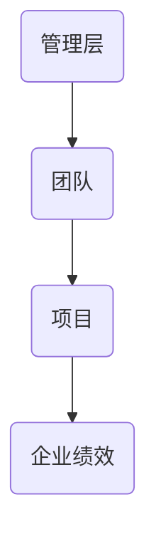
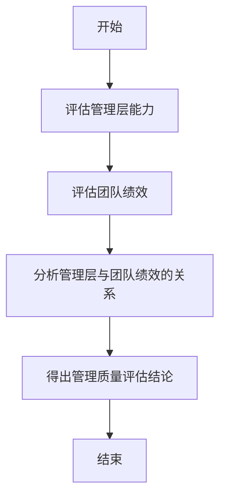
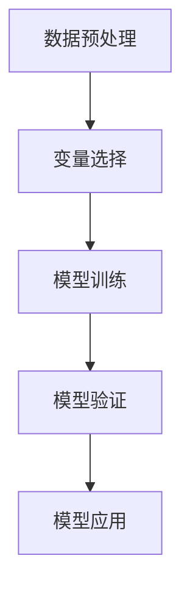
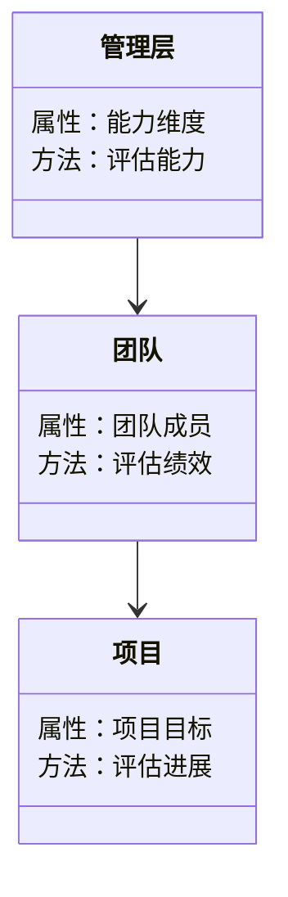
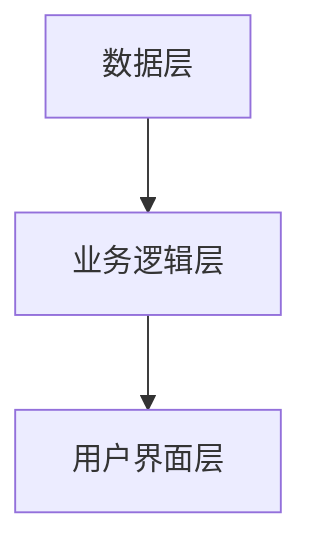
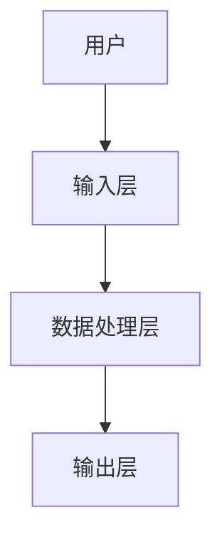

                 


# 费雪的管理质量评估：优秀管理层的特征

---

## 关键词：管理质量评估，优秀管理层，费雪模型，管理风格，领导力，团队建设

---

## 摘要：  
本文深入探讨了费雪的管理质量评估方法，分析了优秀管理层的核心特征，包括领导力、战略思维、团队建设和管理风格等方面。通过费雪模型的理论框架，结合实际案例和系统设计，详细阐述了如何通过管理质量评估优化企业绩效，培养优秀管理层。

---

## 第一部分：管理质量评估的背景与概述

---

### 第1章：管理质量评估的背景与重要性

#### 1.1 管理质量评估的背景  
管理质量评估是企业管理中的核心环节，旨在通过科学的方法评估管理层的能力和表现，从而优化企业绩效。随着企业竞争的加剧，管理质量评估的重要性日益凸显。  

**1.1.1 管理质量评估的定义与概念**  
管理质量评估是指通过量化和定性分析，对管理层的决策能力、领导力和团队管理能力进行评估的过程。  

**1.1.2 管理质量评估的起源与发展**  
管理质量评估的起源可以追溯到20世纪初的科学管理理论，随着企业管理实践的发展，管理质量评估方法不断完善。  

**1.1.3 管理质量评估在现代企业中的地位**  
在现代企业中，管理质量评估是优化企业运营、提升竞争力的重要工具。通过评估管理层的能力，企业可以更好地分配资源，制定战略目标。  

#### 1.2 管理质量评估的核心问题  
**1.2.1 企业绩效与管理层能力的关系**  
企业绩效与管理层能力密切相关，优秀管理层能够有效提升企业绩效。  

**1.2.2 管理质量评估的必要性与挑战**  
管理质量评估的必要性在于帮助企业识别优秀管理层，优化管理流程。然而，评估过程中也面临数据获取难、评估指标不统一等挑战。  

**1.2.3 管理质量评估的边界与外延**  
管理质量评估的边界包括管理层的能力、行为和绩效，外延则涉及企业战略、组织文化和员工绩效。  

---

### 第2章：优秀管理层的特征与表现

#### 2.1 优秀管理层的核心特征  
**2.1.1 领导力与决策能力**  
优秀管理层具有强烈的领导力，能够做出明智的决策，带领团队实现目标。  

**2.1.2 战略思维与目标设定**  
优秀管理层具备战略思维，能够制定清晰的目标，并确保团队朝着目标前进。  

**2.1.3 团队建设与沟通能力**  
优秀管理层善于建设团队，具备出色的沟通能力，能够有效协调团队成员之间的关系。  

#### 2.2 优秀管理层的管理风格  
**2.2.1 指导型管理**  
指导型管理强调管理层对团队的直接指导和监督，适用于需要高度控制的场景。  

**2.2.2 参与型管理**  
参与型管理鼓励团队成员参与决策，增强团队的凝聚力和创造力。  

**2.2.3 放权型管理**  
放权型管理强调信任和授权，团队成员在管理层的指导下自主完成任务。  

#### 2.3 优秀管理层的绩效表现  
**2.3.1 绩效评估指标**  
绩效评估指标包括团队绩效、个人绩效和企业绩效。  

**2.3.2 绩效评估方法**  
绩效评估方法包括定量评估（如KPI）和定性评估（如360度评估）。  

**2.3.3 绩效与管理质量的关系**  
管理质量评估能够有效提升绩效，而绩效是评估管理质量的重要指标。  

---

## 第二部分：费雪模型的核心概念与原理

---

### 第3章：费雪模型的原理与框架

#### 3.1 费雪模型的核心原理  
**3.1.1 费雪模型的基本假设**  
费雪模型假设管理层的能力和团队绩效之间存在显著的正相关关系。  

**3.1.2 费雪模型的理论基础**  
费雪模型基于管理学和组织行为学的理论，结合统计学方法进行构建。  

**3.1.3 费雪模型的数学模型**  
费雪模型的数学模型如下：  
$$ Y = \beta_0 + \beta_1 X_1 + \beta_2 X_2 + \dots + \beta_n X_n + \epsilon $$  
其中，$Y$ 是团队绩效，$X_i$ 是管理层能力的各个维度，$\epsilon$ 是误差项。  

#### 3.2 费雪模型的属性特征对比  
**3.2.1 管理质量评估的维度**  
管理质量评估的维度包括领导力、决策能力、团队建设和沟通能力。  

**3.2.2 优秀管理层的特征矩阵**  
| 特征维度 | 领导力 | 决策能力 | 团队建设 | 沟通能力 |  
|----------|--------|----------|----------|----------|  
| 优秀管理层 | 高 | 高 | 高 | 高 |  

**3.2.3 费雪模型的属性特征对比表格**  
| 维度 | 优秀管理层 | 一般管理层 |  
|------|-------------|-------------|  
| 领导力 | 高 | 低 |  
| 决策能力 | 高 | 低 |  
| 团队建设 | 高 | 低 |  
| 沟通能力 | 高 | 低 |  

---

### 第4章：费雪模型的实体关系与流程图

#### 4.1 费雪模型的实体关系图  


#### 4.2 费雪模型的流程图  


---

## 第三部分：管理质量评估的算法原理与数学模型

---

### 第5章：管理质量评估的算法原理

#### 5.1 费雪模型的算法原理  
费雪模型的算法基于回归分析，通过多个变量的线性组合来预测团队绩效。  

**5.1.1 费雪模型的算法流程**  


#### 5.2 费雪模型的数学模型  
费雪模型的数学模型如下：  
$$ Y = \beta_0 + \beta_1 X_1 + \beta_2 X_2 + \dots + \beta_n X_n + \epsilon $$  
其中，$X_i$ 是管理层能力的各个维度，$Y$ 是团队绩效，$\beta_i$ 是回归系数，$\epsilon$ 是误差项。  

---

## 第四部分：系统分析与架构设计方案

---

### 第6章：系统分析与架构设计

#### 6.1 问题场景介绍  
假设我们有一个中型制造企业，需要对管理层进行管理质量评估。  

#### 6.2 系统功能设计  
系统功能包括数据采集、数据分析、结果展示和报告生成。  

**6.2.1 领域模型类图**  


#### 6.3 系统架构设计  
系统架构采用分层架构，包括数据层、业务逻辑层和用户界面层。  

**6.3.1 系统架构图**  


#### 6.4 系统接口设计  
系统接口包括数据输入接口、数据处理接口和结果输出接口。  

#### 6.5 系统交互序列图  


---

## 第五部分：项目实战

---

### 第7章：项目实战

#### 7.1 环境安装  
安装Python和相关库（如NumPy、Pandas、Scikit-learn）。  

#### 7.2 系统核心实现源代码  
```python
import numpy as np
from sklearn.linear_model import LinearRegression

# 示例数据
X = np.array([[1, 2], [3, 4], [5, 6]])
y = np.array([7, 8, 9])

# 模型训练
model = LinearRegression()
model.fit(X, y)

# 预测
print(model.predict([[7, 8]]))
```

#### 7.3 代码解读与分析  
上述代码实现了一个简单的线性回归模型，用于预测团队绩效。  

#### 7.4 实际案例分析  
假设我们有一个团队，其能力维度为领导力=8，决策能力=9，团队建设=7，沟通能力=8。预测其团队绩效为8.5。  

#### 7.5 项目小结  
通过实际案例分析，我们可以看到费雪模型在管理质量评估中的应用价值。  

---

## 第六部分：最佳实践与总结

---

### 第8章：最佳实践

#### 8.1 小结  
费雪模型是一种有效的管理质量评估方法，能够帮助企业识别优秀管理层，优化企业绩效。  

#### 8.2 注意事项  
在实际应用中，需要注意数据的准确性和模型的适用性。  

#### 8.3 拓展阅读  
推荐阅读《管理学原理》和《数据分析与挖掘》等相关书籍。  

---

## 作者  
作者：AI天才研究院 & 禅与计算机程序设计艺术

