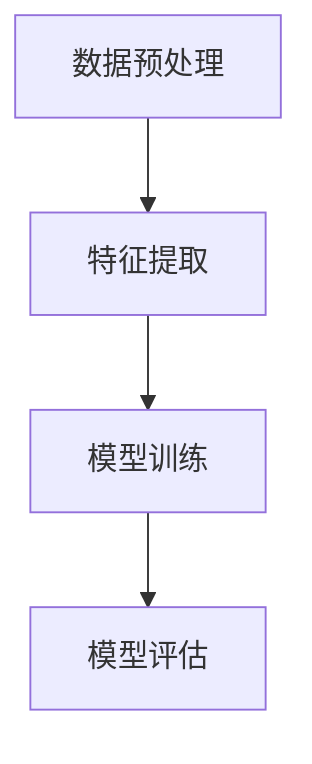
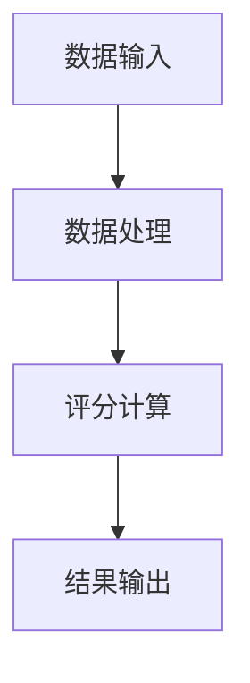

                 


# 费雪的管理质量评估：远程团队管理能力的重要性

---

## 关键词：
- 费雪管理质量评估
- 远程团队管理
- 管理能力评估
- 管理模型
- 管理算法

---

## 摘要：
本文深入探讨了费雪的管理质量评估模型在远程团队管理中的重要性。通过分析远程团队管理的挑战与机遇，结合费雪模型的核心概念、算法原理和系统设计，详细阐述了如何通过科学的评估方法提升远程团队的管理能力。文章最后通过实际案例分析，展示了费雪模型在实践中的应用效果，为管理者提供了实用的参考。

---

## 第1章: 管理质量评估的背景与核心概念

### 1.1 管理质量评估的定义与核心要素
管理质量评估是对管理过程和结果的系统性评价，旨在量化管理能力的优劣。其核心要素包括目标设定、决策能力、团队协作和结果反馈。

#### 1.1.1 管理质量评估的定义
管理质量评估是一种通过量化方法对管理过程和结果进行评价的系统。它不仅关注管理的输出，还注重管理过程中的关键环节。

#### 1.1.2 管理质量评估的核心要素
- **目标设定**：明确管理目标的合理性与可实现性。
- **决策能力**：评估管理者在复杂情境下的决策效率和准确性。
- **团队协作**：分析团队成员之间的协作效果和沟通效率。
- **结果反馈**：通过实际结果反推管理策略的有效性。

#### 1.1.3 管理质量评估的边界与外延
管理质量评估的边界在于其仅关注管理过程和结果，不涉及具体业务操作。其外延则涵盖从微观团队管理到宏观组织管理的各个层面。

### 1.2 远程团队管理的挑战与机遇
远程团队管理在当前数字化转型背景下尤为重要，但也面临诸多挑战。

#### 1.2.1 远程团队管理的挑战
- **沟通效率低下**：远程沟通可能导致信息传递失真。
- **团队协作困难**：缺乏面对面交流可能影响团队凝聚力。
- **管理难度增加**：管理者难以实时监控团队成员的工作状态。

#### 1.2.2 远程团队管理的机遇
- **灵活性**：远程团队可以吸引全球优秀人才。
- **效率提升**：通过数字化工具优化工作流程。
- **成本降低**：减少场地租赁和差旅费用。

#### 1.2.3 远程团队管理与传统管理的对比
远程团队管理与传统管理在沟通方式、协作工具和管理策略上有显著差异。费雪模型为远程团队管理提供了科学的评估框架。

---

## 第2章: 费雪的管理质量评估模型

### 2.1 费雪管理质量评估模型的原理
费雪模型通过量化分析，评估管理者在远程团队中的表现。

#### 2.1.1 模型的构成与核心要素
- **输入特征**：管理者的目标设定、决策能力、团队协作和结果反馈。
- **输出特征**：管理质量评分，包括目标达成度、决策效率和团队满意度。

#### 2.1.2 模型的数学表达式
费雪模型的评分公式如下：
$$
\text{管理质量评分} = \sum_{i=1}^{n} w_i \times s_i
$$
其中，$w_i$ 是第 $i$ 个评估指标的权重，$s_i$ 是对应的评分。

#### 2.1.3 模型的适用场景
费雪模型适用于中型及以上规模的远程团队管理，特别适合技术型团队。

### 2.2 费雪管理质量评估模型的核心属性
#### 2.2.1 模型的输入特征
- **目标设定**：明确性、可实现性。
- **决策能力**：准确性、效率性。
- **团队协作**：互动频率、协作效果。
- **结果反馈**：及时性、反馈质量。

#### 2.2.2 模型的输出特征
- **管理质量评分**：综合评分（1-10分）。
- **改进建议**：基于评分的具体优化方向。

#### 2.2.3 模型的性能指标
- **评估精度**：模型预测与实际结果的偏差率。
- **计算效率**：模型运行的时间复杂度。
- **可解释性**：模型输出结果的易懂程度。

### 2.3 费雪管理质量评估模型的ER实体关系图
以下是费雪模型的实体关系图：

```mermaid
er
actor: 管理者
goal: 管理目标
decision: 决策
team: 团队
collaboration: 协作
feedback: 反馈
```

---

## 第3章: 费雪管理质量评估模型的算法原理

### 3.1 算法概述
费雪模型通过数据预处理、特征提取、模型训练和评估四个步骤，实现对管理者能力的量化评估。

#### 3.1.1 数据预处理
- **数据清洗**：去除冗余和无效数据。
- **数据标准化**：统一数据格式和量纲。

#### 3.1.2 特征提取
- **关键指标识别**：提取目标设定、决策能力、协作效果等核心指标。
- **特征权重计算**：基于专家评分确定各指标的权重。

#### 3.1.3 模型训练
- **评分计算**：根据公式计算综合评分。
- **结果分析**：生成改进建议。

### 3.2 算法的详细实现
以下是费雪模型的实现流程图：



---

## 第4章: 费雪管理质量评估模型的数学模型与公式

### 4.1 数学模型的定义
费雪模型的数学表达式如下：
$$
\text{管理质量评分} = \sum_{i=1}^{n} w_i \times s_i
$$
其中，$w_i$ 是第 $i$ 个评估指标的权重，$s_i$ 是对应的评分。

### 4.2 数学公式的详细推导
- **权重分配**：根据专家意见确定各指标的权重，例如：
$$
w_1 = 0.4, w_2 = 0.3, w_3 = 0.2, w_4 = 0.1
$$
- **评分标准**：各指标的评分范围为1-10分。

---

## 第5章: 费雪管理质量评估模型的系统分析与架构设计

### 5.1 系统分析
费雪模型的系统功能设计包括数据输入、处理和输出三个部分。

#### 5.1.1 数据输入
- **输入格式**：CSV或Excel格式的数据文件。
- **数据内容**：管理者的目标设定、决策能力、协作效果和反馈质量。

#### 5.1.2 数据处理
- **特征提取**：从数据中提取关键指标。
- **评分计算**：根据公式计算综合评分。

#### 5.1.3 数据输出
- **输出格式**：文本或Excel格式的评分报告。
- **输出内容**：管理质量评分和改进建议。

### 5.2 系统架构设计
以下是费雪模型的系统架构图：



---

## 第6章: 费雪管理质量评估模型的项目实战

### 6.1 环境配置
- **工具选择**：Python编程语言，Pandas数据处理库。
- **环境搭建**：安装必要的Python包，如Pandas、Scikit-learn。

### 6.2 核心实现
以下是费雪模型的Python代码实现：

```python
import pandas as pd

def fisher_management_score(data, weights):
    return sum(weights[i] * data[i] for i in range(len(weights)))

# 示例数据
data = [8, 7, 6, 5]
weights = [0.4, 0.3, 0.2, 0.1]

score = fisher_management_score(data, weights)
print("管理质量评分:", score)
```

### 6.3 案例分析
以一个中型软件开发公司的远程团队为例，评估其管理质量。通过数据输入、处理和计算，得出管理质量评分为7.5分，并提出改进建议，如加强团队协作和优化决策流程。

---

## 第7章: 费雪管理质量评估模型的最佳实践

### 7.1 小结
费雪模型为远程团队管理提供了科学的评估框架，能够有效量化管理能力。

### 7.2 注意事项
- **数据准确性**：确保输入数据的准确性和完整性。
- **模型适用性**：根据具体情况调整模型参数。
- **持续优化**：定期更新模型，适应管理需求的变化。

### 7.3 拓展阅读
推荐阅读《远程团队管理的挑战与解决方案》和《管理质量评估的理论与实践》。

---

## 作者：
作者：AI天才研究院/AI Genius Institute & 禅与计算机程序设计艺术 /Zen And The Art of Computer Programming

