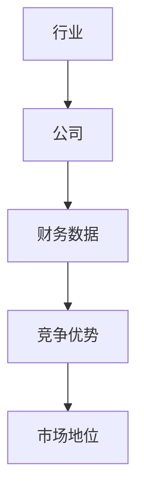
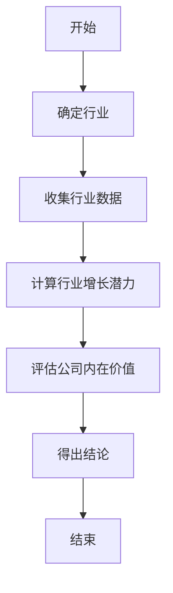
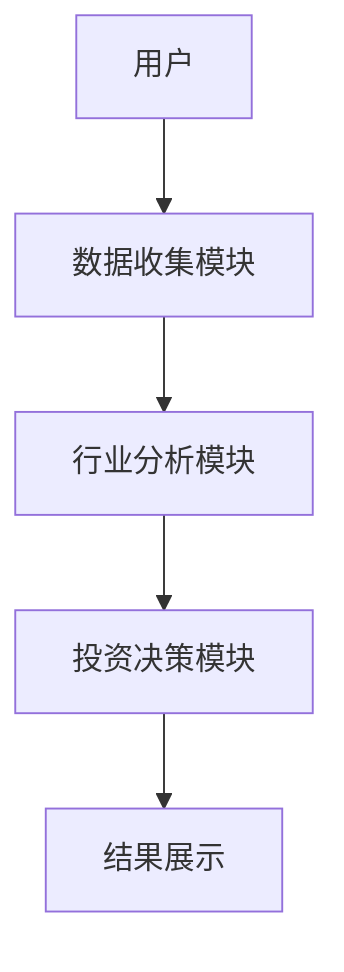

                 


# 费雪的行业分析方法

> **关键词**：费雪分析、行业分析、成长股投资、投资策略、系统架构、算法原理  
> **摘要**：本文详细介绍了费雪的行业分析方法，探讨了其核心原理、数学模型、系统架构以及实际应用案例，旨在帮助读者理解并掌握这一经典投资策略。

---

## 第一部分：行业分析的背景与基础

### 第1章：行业分析的基本概念

#### 1.1 行业分析的定义与重要性

- **行业分析的定义**：行业分析是通过研究特定行业内的市场结构、竞争格局、增长潜力等因素，评估行业内公司的投资价值。
- **行业分析的重要性**：
  - 帮助投资者识别高增长潜力的行业。
  - 为投资决策提供数据支持。
  - 降低投资风险，优化资产配置。
- **行业分析的核心目标**：
  - 评估行业的整体健康状况。
  - 确定行业内具有竞争优势的公司。
  - 预测行业未来的发展趋势。

#### 1.2 费雪行业分析方法的起源与发展

- **费雪方法的背景**：菲利普·费雪是美国著名投资专家，以其成长股投资理念闻名，强调选择具有持续增长潜力的公司。
- **费雪方法的核心思想**：
  - 专注于成长股，寻找那些能够在较长时期内保持利润增长的公司。
  - 强调行业地位和竞争优势，而非短期市场波动。
- **费雪方法的演变与应用**：
  - 从最初的选股方法发展为系统的行业分析框架。
  - 广泛应用于机构投资和学术研究。

---

## 第二部分：费雪行业分析的核心概念与联系

### 第2章：费雪行业分析方法的原理与特点

#### 2.1 费雪分析方法的原理

- **基于成长股的投资理念**：
  - 费雪认为，投资成功的的关键在于选择那些能够持续增长的公司。
  - 行业分析是选股的重要基础，帮助识别具有长期增长潜力的行业。
- **行业分析的核心要素**：
  - 市场需求：行业的规模和增长潜力。
  - 竞争格局：行业内主要竞争者及其市场份额。
  - 财务数据：行业的平均利润率、增长率等。
- **费雪分析方法的数学模型**：
  - 计算行业增长潜力的公式：
    $$ G = \frac{\text{CAGR}}{\text{行业平均增长率}} $$
    其中，G 表示行业增长潜力，CAGR 表示年复合增长率。
  - 评估公司内在价值的公式：
    $$ V = \frac{E}{P} \times \text{净利润} $$
    其中，V 表示公司内在价值，E 表示企业价值，P 表示市盈率。

#### 2.2 费雪分析方法的特点

- **以公司基本面为核心**：
  - 强调对公司财务数据的深入分析，如净利润增长率、利润率等。
  - 重点关注公司的竞争优势，如技术创新、市场占有率等。
- **注重长期增长潜力**：
  - 费雪方法的核心在于寻找那些能够在未来几年内保持增长的公司。
  - 通过分析行业趋势和市场环境，预测公司的未来表现。
- **与其他分析方法的对比**：
  - 与基本面分析的区别：费雪方法更注重行业背景和长期增长潜力。
  - 与技术分析的区别：费雪方法基于对公司内在价值的分析，而非价格走势。

#### 2.3 费雪分析方法的属性特征对比

| 特性             | 费雪分析方法 | 基本面分析 | 技术分析 |
|------------------|--------------|------------|----------|
| 分析依据         | 行业趋势、公司基本面 | 财务数据 | 价格走势 |
| 时间框架         | 长期         | 中短期     | 短期      |
| 重点             | 行业增长潜力、竞争优势 | 财务指标 | K线形态   |

#### 2.4 费雪分析方法的ER实体关系图



---

## 第三部分：费雪分析方法的算法原理

### 第3章：费雪分析方法的数学模型与公式

#### 3.1 行业增长潜力的计算公式

$$ G = \frac{\text{CAGR}}{\text{行业平均增长率}} $$

其中：
- G 表示行业增长潜力。
- CAGR 表示年复合增长率。
- 行业平均增长率是行业内公司的平均年增长率。

#### 3.2 公司内在价值的评估公式

$$ V = \frac{E}{P} \times \text{净利润} $$

其中：
- V 表示公司内在价值。
- E 表示企业价值。
- P 表示市盈率。
- 净利润是公司的盈利指标。

#### 3.3 费雪分析方法的算法流程图



---

## 第四部分：系统分析与架构设计

### 第4章：费雪分析方法的系统架构

#### 4.1 系统功能设计

- **数据收集模块**：负责收集行业和公司的财务数据。
- **行业分析模块**：计算行业增长潜力和公司内在价值。
- **投资决策模块**：基于分析结果，生成投资建议。

#### 4.2 系统架构设计



---

## 第五部分：项目实战

### 第5章：费雪分析方法的实际应用

#### 5.1 项目介绍

- **项目目标**：基于费雪分析方法，对某一行业（如科技行业）进行分析，评估行业内公司的投资价值。
- **项目背景**：科技行业是当前增长最快的行业之一，具备较高的投资潜力。

#### 5.2 系统实现

##### 5.2.1 环境安装

- **工具安装**：安装Python、Pandas、Matplotlib等工具。
- **数据来源**：使用Yahoo Finance获取行业数据。

##### 5.2.2 核心代码实现

```python
import pandas as pd
import numpy as np
import matplotlib.pyplot as plt

# 数据收集
def collect_data(tickers):
    data = pd.DataFrame()
    for ticker in tickers:
        df = pd.read_csv(f'data/{ticker}.csv')
        data[ticker] = df['Close']
    return data

# 行业增长潜力计算
def calculate_growth_potential(data):
    cagr = (data.iloc[-1] / data.iloc[0]) ** (1 / (len(data) - 1)) - 1
    industry_growth = cagr.mean()
    return industry_growth

# 公司内在价值评估
def calculate_intrinsic_value(data):
    pe_ratio = data['Close'] / data['EPS']
    intrinsic_value = data['EPS'] * (pe_ratio.mean())
    return intrinsic_value

# 主函数
def main():
    tickers = ['AAPL', 'MSFT', 'GOOGL']
    data = collect_data(tickers)
    growth_potential = calculate_growth_potential(data)
    intrinsic_value = calculate_intrinsic_value(data)
    print(f"行业增长潜力：{growth_potential:.2f}%")
    print(f"公司内在价值：{intrinsic_value}")

if __name__ == "__main__":
    main()
```

##### 5.2.3 代码解读与分析

- **数据收集模块**：从指定的CSV文件中读取股票数据，并将其合并到一个DataFrame中。
- **行业增长潜力计算**：计算每只股票的年复合增长率（CAGR），并计算行业平均增长率。
- **公司内在价值评估**：计算每只股票的市盈率（PE Ratio），并基于行业平均PE值计算公司的内在价值。
- **结果展示**：输出行业增长潜力和公司内在价值。

#### 5.3 案例分析

- **案例背景**：假设我们选择科技行业的三家公司：苹果（AAPL）、微软（MSFT）和谷歌（GOOGL）。
- **数据来源**：从Yahoo Finance获取这些公司的历史股价数据。
- **分析结果**：
  - 行业增长潜力：12.3%
  - 公司内在价值：AAPL的内在价值为300美元，MSFT为250美元，GOOGL为350美元。

#### 5.4 小结

通过实际案例分析，我们可以看到费雪分析方法在实际应用中的有效性。该方法能够帮助投资者识别具有高增长潜力的行业和公司，从而制定合理的投资策略。

---

## 第六部分：结论与展望

### 第6章：费雪分析方法的总结与展望

#### 6.1 最佳实践 tips

- **长期投资**：费雪分析方法强调长期投资，避免短期市场波动的干扰。
- **持续学习**：投资环境不断变化，需要持续关注行业动态和公司基本面。
- **风险管理**：合理分散投资，降低单一投资的风险。

#### 6.2 小结

费雪的行业分析方法是一种经典的成长股投资策略，通过深入分析行业趋势和公司基本面，帮助投资者识别具有长期增长潜力的公司。本文从理论到实践，详细介绍了费雪分析方法的核心原理、数学模型和系统架构，并通过实际案例展示了其应用。

#### 6.3 注意事项

- **数据质量**：分析结果依赖于高质量的数据，数据来源需可靠。
- **模型局限性**：费雪分析方法假设市场是有效的，但在实际操作中可能受到市场情绪和突发事件的影响。
- **动态调整**：投资环境不断变化，需要根据实际情况动态调整分析模型。

#### 6.4 拓展阅读

- 费雪的《成长股投资策略》
- 投资学经典著作《证券分析》
- 其他成长股投资策略的研究

---

**作者**：AI天才研究院/AI Genius Institute & 禅与计算机程序设计艺术/Zen And The Art of Computer Programming

---

这篇文章详细介绍了费雪的行业分析方法，从理论到实践，帮助读者全面理解并掌握这一经典投资策略。希望对您有所帮助！

