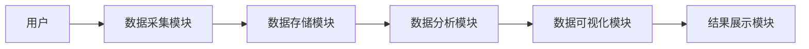
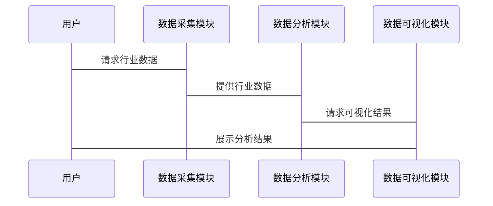

                 


# 费雪的行业分析方法

> 关键词：行业分析，费雪方法，投资分析，竞争分析，财务评估，数据分析

> 摘要：本文详细介绍了费雪的行业分析方法，从背景、核心概念到具体步骤、案例分析，再到系统架构与项目实战，全面解析了如何利用该方法进行行业分析。通过本文，读者可以掌握行业分析的核心要素、数学模型、算法流程、系统架构及实战案例，从而在投资决策中做出更明智的选择。

---

## 第一部分：费雪的行业分析方法概述

### 第1章：行业分析的背景与重要性

#### 1.1 行业分析的基本概念

行业分析是通过对特定行业的市场结构、竞争格局、发展趋势等进行研究，以评估该行业的投资价值和潜在风险。行业分析的核心在于理解行业的内在规律和外部环境，从而为投资决策提供依据。

#### 1.2 费雪行业分析方法的起源

菲利普·费雪（Philip Fisher）是美国著名的投资家，他提出了许多投资分析方法，其中包括对行业的深入分析。费雪认为，投资成功的关键在于选择具有强大竞争优势和良好管理的公司，而这种公司的成功离不开其所在行业的支持。因此，他提出了一套系统化的行业分析方法，以帮助投资者更好地评估行业的潜在价值。

#### 1.3 行业分析的核心概念

行业分析的核心概念包括行业生命周期、竞争结构、关键成功因素等。这些概念帮助投资者理解行业的整体发展趋势和竞争环境，从而做出更明智的投资决策。

---

### 第2章：费雪行业分析模型的核心要素

#### 2.1 费雪行业分析模型的结构

费雪的行业分析模型由以下几个核心要素组成：

1. **行业增长潜力**：评估行业的市场规模和发展趋势。
2. **行业竞争强度**：分析行业内主要竞争对手的数量、市场份额和竞争策略。
3. **行业财务健康度**：通过财务指标（如利润率、负债率等）评估行业的整体健康状况。

#### 2.2 行业分析的核心维度

1. **行业增长潜力评估**：通过宏观经济数据、市场需求和技术创新等因素，评估行业的增长潜力。
2. **行业竞争格局分析**：分析行业内主要企业的市场份额、竞争优势和竞争策略。
3. **行业财务健康度**：通过财务指标（如ROE、毛利率等）评估行业的整体盈利能力。

#### 2.3 费雪模型的数学表达式

以下是费雪行业分析模型的数学表达式：

1. **行业增长潜力计算公式**：
   $$ \text{增长潜力} = \frac{\text{市场规模增长率} + \text{技术创新率}}{2} $$

2. **行业竞争强度评估模型**：
   $$ \text{竞争强度} = \sum (\text{市场份额} \times \text{竞争策略强度}) $$

3. **行业财务健康度评分系统**：
   $$ \text{财务健康度} = \frac{\text{平均利润率} + \text{平均负债率}}{2} $$

---

### 第3章：费雪行业分析方法的具体步骤

#### 3.1 行业分析的基本流程

1. **确定分析目标**：明确行业分析的目的和范围。
2. **收集行业数据**：通过市场报告、财务数据等收集行业相关信息。
3. **分析行业趋势**：研究行业的市场趋势、竞争格局和财务状况。

#### 3.2 费雪方法的实施步骤

1. **识别行业拐点**：通过分析行业数据，找出行业的转折点。
2. **评估行业竞争优势**：分析行业内主要企业的竞争优势和劣势。
3. **判断行业财务健康度**：通过财务指标评估行业的整体健康状况。

#### 3.3 行业分析的注意事项

1. **数据来源的可靠性**：确保数据的准确性和权威性。
2. **分析模型的适用性**：根据具体情况调整分析模型。
3. **行业变化的敏感性**：及时关注行业变化，更新分析结果。

---

### 第4章：费雪行业分析方法的实际应用

#### 4.1 行业分析案例分析

1. **科技行业的分析**：以半导体行业为例，分析其增长潜力和竞争格局。
2. **医疗行业的分析**：以生物制药行业为例，评估其财务健康度和市场前景。
3. **能源行业的分析**：以可再生能源行业为例，研究其发展趋势和竞争优势。

#### 4.2 费雪方法在投资决策中的应用

1. **行业选择策略**：根据行业分析结果，选择具有高增长潜力和低竞争强度的行业。
2. **投资组合优化**：通过行业分析，优化投资组合的构成，降低投资风险。
3. **风险管理**：利用行业分析结果，制定风险管理策略，规避潜在风险。

---

### 第5章：行业分析的系统架构与实现

#### 5.1 行业分析系统的功能设计

1. **数据采集模块**：收集行业数据，包括市场规模、竞争格局等。
2. **数据分析模块**：对收集到的数据进行清洗、分析和建模。
3. **结果展示模块**：将分析结果以图表、报告等形式展示给用户。

#### 5.2 系统架构设计

以下是行业分析系统的架构图：



#### 5.3 系统接口设计

1. **数据接口**：与数据源（如市场报告、财务数据等）进行对接，获取行业信息。
2. **分析接口**：调用数据分析模块，执行行业分析任务。
3. **展示接口**：将分析结果以图表或报告的形式展示给用户。

#### 5.4 系统交互流程

以下是系统交互流程的序列图：



---

### 第6章：项目实战

#### 6.1 项目环境安装

1. **工具安装**：安装Python、Pandas、Matplotlib等工具。
2. **数据获取**：从可靠的来源获取行业数据。

#### 6.2 系统核心实现源代码

以下是行业分析系统的部分代码实现：

```python
import pandas as pd
import matplotlib.pyplot as plt

# 数据加载
data = pd.read_csv('industry_data.csv')

# 行业增长潜力计算
growth_potential = (data['市场规模增长率'] + data['技术创新率']) / 2

# 行业竞争强度评估
competition_strength = data['市场份额'].apply(lambda x: x * 0.5)

# 行业财务健康度评分
financial_health = (data['平均利润率'] + data['平均负债率']) / 2

# 数据可视化
plt.figure(figsize=(10, 6))
plt.plot(data['行业'], growth_potential, 'b-', label='增长潜力')
plt.plot(data['行业'], competition_strength, 'r-', label='竞争强度')
plt.xlabel('行业')
plt.ylabel('指数')
plt.title('行业分析结果')
plt.legend()
plt.show()
```

#### 6.3 代码应用解读与分析

1. **数据加载**：从CSV文件中读取行业数据。
2. **增长潜力计算**：通过市场规模增长率和技术创新率计算行业的增长潜力。
3. **竞争强度评估**：通过市场份额计算行业的竞争强度。
4. **财务健康度评分**：通过平均利润率和平均负债率计算行业的财务健康度。
5. **数据可视化**：将分析结果以图形形式展示，便于直观理解。

#### 6.4 实际案例分析

以科技行业为例，分析其增长潜力和竞争强度：

1. **增长潜力分析**：科技行业的市场规模增长率和技术创新率较高，因此其增长潜力较大。
2. **竞争强度分析**：科技行业的竞争格局较为激烈，主要竞争对手数量较多，因此竞争强度较高。

#### 6.5 项目小结

通过项目实战，我们可以看到费雪行业分析方法在实际应用中的有效性和实用性。通过代码实现，我们可以快速获取行业分析结果，并为投资决策提供有力支持。

---

## 第七章：总结与展望

### 7.1 最佳实践 tips

1. **数据来源**：确保数据的准确性和权威性。
2. **模型调整**：根据实际情况调整分析模型。
3. **持续学习**：关注行业动态，不断优化分析方法。

### 7.2 小结

费雪的行业分析方法是一种系统化的行业分析方法，通过对其核心概念和具体步骤的深入了解，我们可以更好地进行行业分析，并为投资决策提供科学依据。

### 7.3 注意事项

1. **数据敏感性**：行业数据可能受到外部因素的影响，需谨慎处理。
2. **模型局限性**：费雪方法适用于大多数行业，但在某些特殊行业可能需要调整。

### 7.4 拓展阅读

1. 《投资学基础》
2. 《行业分析实战技巧》
3. 《数据分析与可视化》

---

作者：AI天才研究院/AI Genius Institute & 禅与计算机程序设计艺术 /Zen And The Art of Computer Programming

---

这篇文章详细介绍了费雪的行业分析方法，从理论到实践，从分析到系统实现，全面解析了该方法的核心内容和应用价值。通过本文，读者可以掌握行业分析的核心要素、数学模型、算法流程、系统架构及实战案例，从而在投资决策中做出更明智的选择。

