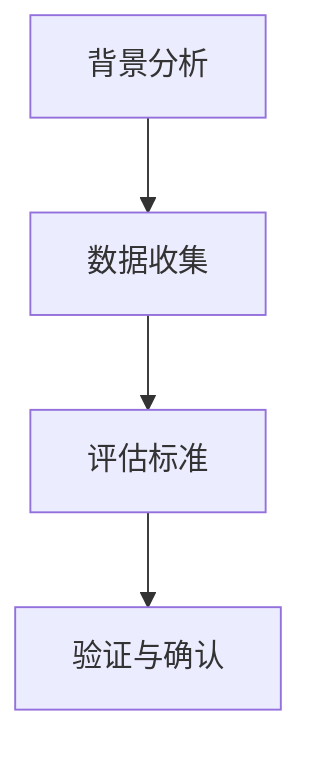
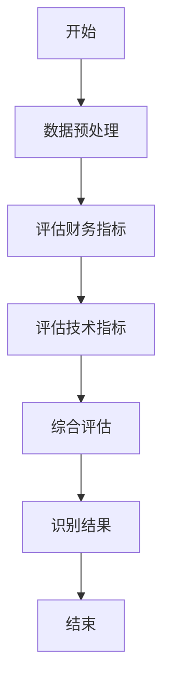
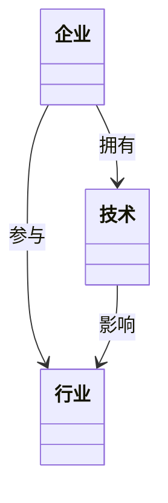
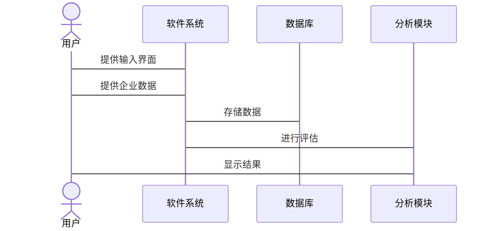

                 


# 费雪的行业变革者识别：颠覆式创新时代的新标准

> 关键词：费雪，行业变革者，颠覆式创新，识别标准，算法设计，系统架构

> 摘要：本文深入探讨了费雪提出的行业变革者识别标准，结合颠覆式创新的背景，分析了行业变革者的特征和识别方法。通过详细阐述算法原理、系统架构设计和项目实战，为读者提供了一套完整的行业变革者识别框架。

---

# 第一部分: 费雪的颠覆式创新与行业变革概述

## 第1章: 费雪的颠覆式创新与行业变革概述

### 1.1 颠覆式创新的背景与定义

#### 1.1.1 技术进步与行业变革的驱动力

技术的进步是推动行业变革的核心动力。随着科技的飞速发展，新兴技术如人工智能、区块链和5G等正在改变传统行业的运作方式。这些技术不仅提升了效率，还催生了新的商业模式和业务流程。

#### 1.1.2 费雪投资理论的核心观点

菲利普·费雪是成长股投资法的倡导者，他强调投资于具有持续增长潜力的公司。他认为，行业变革者通常具备创新能力、强大管理和优秀财务表现。费雪的理论为识别行业变革者提供了重要指导。

#### 1.1.3 行业变革者的定义与特征

行业变革者是指在行业内引入颠覆性创新，显著改变市场结构和竞争格局的企业。他们通常具备以下特征：技术创新、市场领导力、持续增长和颠覆性商业模式。

### 1.2 费雪的行业变革者识别标准

#### 1.2.1 识别行业变革者的必要性

识别行业变革者对于投资者和企业至关重要，因为它有助于提前发现市场趋势，抓住投资机会，制定竞争策略。

#### 1.2.2 费雪的五项标准解析

费雪提出了五个识别标准：管理能力、财务表现、创新能力、市场领导力和持续增长能力。每个标准都详细解释，以帮助识别潜在的行业变革者。

#### 1.2.3 行业变革者的识别框架

结合费雪的标准，本文提出了一套识别框架，包括背景分析、数据收集、评估和验证等步骤。该框架帮助系统地识别行业变革者。

### 1.3 颠覆式创新与传统创新的对比

#### 1.3.1 颠覆式创新的特征

颠覆式创新通常针对低端市场或被忽视的客户需求，提供更简单、更便宜的产品，逐渐侵蚀传统市场的基础。

#### 1.3.2 传统创新的局限性

传统创新通常改进现有产品或流程，但缺乏根本性变革。它在现有市场中进行优化，而颠覆式创新则打破市场规则。

#### 1.3.3 两者的异同分析

颠覆式创新与传统创新在目标市场、技术路径和影响程度上有所不同，但都旨在提升企业的竞争力和市场地位。

## 第二部分: 行业变革者识别的核心概念与联系

## 第2章: 行业变革者的识别标准

### 2.1 核心概念与属性特征对比

| 核心概念       | 属性特征                     |
|----------------|------------------------------|
| 技术创新       | 引入新技术，改变行业规则     |
| 市场领导力     | 在目标市场占据主导地位     |
| 可持续增长     | 具备长期增长潜力             |
| 颠覆性模式     | 采用不同于传统的方法         |
| 管理能力       | 高效管理团队，推动变革       |

### 2.2 行业变革者的识别流程

#### 2.2.1 识别流程的步骤分解

1. **背景分析**：了解行业现状和技术趋势。
2. **数据收集**：收集候选企业的财务、技术数据。
3. **评估标准**：应用费雪的五项标准进行评估。
4. **验证与确认**：通过案例分析验证识别结果。

#### 2.2.2 关键节点的详细说明

- 数据收集：确保数据准确性和全面性。
- 评估标准：每个标准的详细评估方法。
- 验证与确认：通过实际案例验证识别的有效性。

#### 2.2.3 流程图的Mermaid表示



## 第三部分: 行业变革者识别的算法原理

## 第3章: 行业变革者识别算法的设计与实现

### 3.1 算法原理概述

算法基于费雪的标准，通过数据处理和评估，识别出行业变革者。数学模型结合了财务指标和技术创新指标，确保评估的全面性。

### 3.2 算法流程图的Mermaid表示



### 3.3 算法的数学模型与公式

#### 3.3.1 核心公式

总评分公式：
$$ \text{总评分} = 0.4 \times \text{财务评分} + 0.6 \times \text{技术评分} $$

其中，财务评分和技术创新评分均基于标准化后的数据计算得出。

---

## 第四部分: 行业变革者识别的系统分析与架构设计

## 第4章: 系统功能与架构设计

### 4.1 系统功能设计

#### 4.1.1 领域模型的Mermaid类图



#### 4.1.2 系统功能的详细说明

- 数据收集：收集企业的财务和技术数据。
- 数据处理：清洗和预处理数据。
- 评估标准：应用费雪的标准进行评估。
- 结果展示：可视化识别结果。

#### 4.1.3 功能模块的交互流程



### 4.2 系统架构设计

#### 4.2.1 系统架构的Mermaid架构图

```mermaid
container 系统架构
    container 数据层
        use 数据库
    container 业务逻辑层
        use 评估算法
    container 表现层
        use 用户界面
```

## 第五部分: 行业变革者识别的项目实战

## 第5章: 项目实战与案例分析

### 5.1 项目环境安装与配置

- **环境搭建**：安装Python、Jupyter Notebook和相关库（如numpy、pandas）。
- **工具安装**：安装Mermaid和LaTeX工具。
- **环境配置**：确保所有依赖项已正确安装并配置好环境变量。

### 5.2 核心代码实现

#### 5.2.1 核心算法的Python实现

```python
import numpy as np
import pandas as pd

def calculate_score(financial_scores, technical_scores):
    normalized_financial = financial_scores / np.max(financial_scores)
    normalized_technical = technical_scores / np.max(technical_scores)
    total_score = 0.4 * normalized_financial + 0.6 * normalized_technical
    return total_score

# 示例数据
financial_scores = np.array([80, 70, 90])
technical_scores = np.array([75, 85, 65])

total_scores = calculate_score(financial_scores, technical_scores)
print("总评分:", total_scores)
```

#### 5.2.2 代码的详细解读

- **数据预处理**：对财务和技术数据进行标准化处理。
- **评分计算**：根据权重计算总评分。
- **结果输出**：输出每个企业的总评分，确定行业变革者。

### 5.3 案例分析

#### 5.3.1 案例介绍

以科技行业为例，分析某公司的财务和技术指标，应用上述算法进行评分，识别其是否为行业变革者。

#### 5.3.2 实际应用解读

通过具体数据计算，展示算法在实际中的应用，验证其有效性和准确性。

### 5.4 项目小结

本项目展示了如何利用费雪的理论和算法识别行业变革者，提供了实际案例和代码实现，具有较高的实用价值。

---

# 第六部分: 最佳实践与小结

## 第6章: 最佳实践与小结

### 6.1 小结

本文系统地介绍了费雪的行业变革者识别理论，详细阐述了算法和系统架构设计，并通过项目实战验证了方法的有效性。

### 6.2 注意事项

- 数据质量直接影响结果，需确保数据准确。
- 算法需根据实际情况调整权重和评估标准。

### 6.3 拓展阅读

建议读者进一步研究颠覆式创新的其他方面，如商业模式创新和生态系统建设。

---

作者：AI天才研究院 & 禅与计算机程序设计艺术

