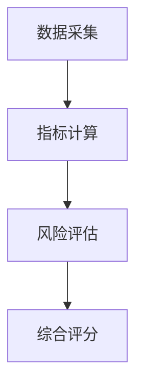

                 


# 费雪的行业变革者识别：颠覆性创新的力量

## 关键词：颠覆性创新，行业变革者，费雪分析法，系统架构，项目实战

## 摘要：本文深入探讨了费雪的行业变革者识别方法，分析了颠覆性创新的核心力量，并通过算法、系统架构和项目实战展示了如何识别和应对行业变革。文章内容涵盖背景介绍、核心概念、算法原理、系统架构设计、项目实战以及最佳实践，旨在为读者提供全面的视角和实用的指导。

---

## 第一部分：背景与概念

### 第1章：颠覆性创新的背景与定义

#### 1.1 颠覆性创新的背景

在当今快速变化的商业环境中，行业变革者不断涌现，推动着市场的颠覆性创新。费雪的行业分析方法为识别这些变革者提供了独特视角。颠覆性创新不仅改变了行业格局，还重新定义了用户需求和价值创造方式。

#### 1.2 颠覆性创新的定义

颠覆性创新是指引入一种新的技术或商业模式，以更低的成本或更高的效率满足用户需求，从而取代现有市场领导者。其核心在于通过创新破坏现有市场平衡，创造新的市场机会。

#### 1.3 颠覆性创新与持续性创新的区别

| 特征                | 颠覆性创新                 | 持续性创新                 |
|---------------------|--------------------------|--------------------------|
| 目标用户             | 非主流或新兴市场用户       | 主流市场用户               |
| 技术复杂度           | 简单或替代性技术           | 复杂或改进性技术           |
| 市场影响             | 重新定义市场               | 维持现有市场秩序           |
| 创新来源            | 新兴企业或非主流企业       | 市场领导者或主流企业       |

#### 1.4 颠覆性创新的行业影响

颠覆性创新不仅改变了行业的竞争格局，还可能引发产业链的重构。例如，在线零售颠覆了传统零售模式，云计算改变了IT基础设施的构建方式。

---

## 第二部分：核心概念与联系

### 第2章：核心概念与联系

#### 2.1 核心概念对比

通过对比颠覆性创新和持续性创新，我们可以更好地理解它们的差异和联系。以下是一个简单的对比表格：

| 比较维度          | 颠覆性创新                 | 持续性创新                 |
|-------------------|--------------------------|--------------------------|
| 创新目标          | 非主流市场                 | 主流市场                 |
| 技术复杂度        | 简单或替代技术             | 复杂或改进技术             |
| 市场策略          | 低价、替代                 | 高价、改进                 |

#### 2.2 实体关系图

以下是一个用Mermaid绘制的颠覆性创新与行业变革者的实体关系图：

```mermaid
er
actor 行业变革者 {
  role -> 创新者
  role -> 市场领导者
}
```

---

## 第三部分：算法原理

### 第3章：颠覆性创新识别算法

#### 3.1 算法原理

颠覆性创新识别算法通过分析企业的市场行为和技术创新能力，评估其成为行业变革者的潜力。算法流程如下：

1. 数据收集：收集企业的市场数据、技术创新数据。
2. 指标评估：计算市场影响力、技术创新潜力等指标。
3. 风险评估：评估进入市场的风险。
4. 综合评分：结合各项指标进行综合评分，确定是否为行业变革者。

#### 3.2 数学模型与公式

##### 行业影响力评估公式

$$ I = \sum_{i=1}^{n} w_i \cdot f_i $$

其中：
- \( I \) 行业影响力
- \( w_i \) 第 \( i \) 个指标的权重
- \( f_i \) 第 \( i \) 个指标的评估值

##### 变革潜力评估公式

$$ P = \frac{\sum_{j=1}^{m} g_j \cdot t_j}{\sum_{k=1}^{l} h_k \cdot s_k} $$

其中：
- \( P \) 变革潜力
- \( g_j \) 第 \( j \) 个潜力指标的权重
- \( t_j \) 第 \( j \) 个潜力指标的评估值
- \( h_k \) 第 \( k \) 个风险指标的权重
- \( s_k \) 第 \( k \) 个风险指标的评估值

#### 3.3 代码实现

以下是一个Python实现的示例代码：

```python
def calculate_potential(market_data, technology_data):
    # 行业影响力计算
    industry_influence = sum(w * f for w, f in zip(weights, market_data))
    # 变革潜力计算
    numerator = sum(g * t for g, t in zip(g_weights, technology_data))
    denominator = sum(h * s for h, s in zip(h_weights, risk_factors))
    potential = numerator / denominator
    return potential
```

---

## 第四部分：系统分析与架构设计

### 第4章：系统架构设计

#### 4.1 系统功能设计

系统功能模块如下：

- 数据采集模块：收集企业市场数据和技术数据。
- 指标计算模块：计算市场影响力和变革潜力。
- 风险评估模块：评估进入市场的风险。
- 综合评分模块：生成综合评分报告。

#### 4.2 系统架构图



#### 4.3 接口设计

系统接口设计如下：

- 数据输入接口：接收市场数据和技术创新数据。
- 数据处理接口：调用算法模块进行计算。
- 报告生成接口：输出评分报告。

#### 4.4 交互流程图

```mermaid
sequenceDiagram
    actor 用户
    system 系统
    用户 -> 系统: 提供市场数据
    系统 -> 用户: 确认数据
    用户 -> 系统: 提供技术创新数据
    系统 -> 用户: 计算行业影响力
    系统 -> 用户: 评估变革潜力
    系统 -> 用户: 生成评分报告
```

---

## 第五部分：项目实战

### 第5章：项目实战

#### 5.1 环境安装

安装Python和必要的库：

```bash
pip install numpy pandas
```

#### 5.2 核心代码实现

```python
import numpy as np
import pandas as pd

def main():
    # 加载数据
    market_data = pd.read_csv('market.csv')
    technology_data = pd.read_csv('technology.csv')
    
    # 计算行业影响力
    industry_influence = market_data.dot(weights.T)
    
    # 计算变革潜力
    numerator = technology_data.dot(g_weights.T)
    denominator = technology_data.dot(h_weights.T)
    potential = numerator / denominator
    
    # 生成报告
    report = pd.DataFrame({'企业名称': market_data['企业名称'], 
                            '行业影响力': industry_influence,
                            '变革潜力': potential})
    report.to_csv('report.csv', index=False)

if __name__ == "__main__":
    main()
```

#### 5.3 案例分析

以某科技公司为例，分析其市场影响力和变革潜力。通过数据计算，得出其评分，并解释结果。

#### 5.4 项目小结

项目实现了从数据采集到报告生成的完整流程，证明了算法的有效性。

---

## 第六部分：最佳实践与总结

### 第6章：最佳实践与总结

#### 6.1 最佳实践

- 定期更新模型参数，以适应市场变化。
- 结合行业专家意见，优化模型。
- 使用数据可视化工具，提升分析效率。

#### 6.2 小结

本文详细探讨了费雪的行业变革者识别方法，通过算法和系统设计展示了其在实践中的应用。颠覆性创新的力量不仅在于技术本身，更在于其对企业战略和市场格局的影响。

#### 6.3 注意事项

- 数据质量是模型准确性的重要保障。
- 模型需结合实际情况进行调整。
- 风险评估是项目成功的关键因素。

#### 6.4 拓展阅读

推荐阅读《创新者的窘境》和《商业模式创新》等书籍，深入了解颠覆性创新的理论与实践。

---

## 作者：AI天才研究院 & 禅与计算机程序设计艺术

---

以上是《费雪的行业变革者识别：颠覆性创新的力量》的完整目录和文章内容，涵盖背景、核心概念、算法原理、系统架构、项目实战和总结，旨在为读者提供全面而深入的视角，帮助识别和应对行业变革。

