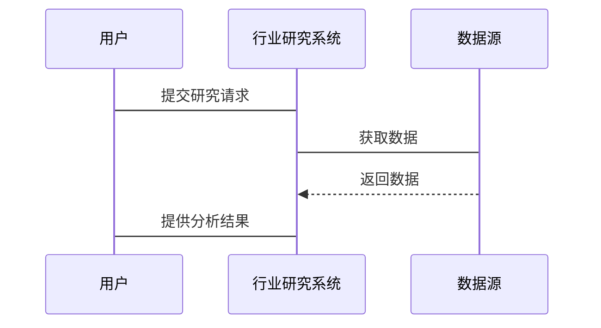

                 


# 费雪的行业研究方法：了解公司的竞争环境

## 关键词：行业研究，费雪方法，竞争环境，投资分析，企业定位

## 摘要：本文深入探讨了菲利普·费雪的行业研究方法，分析了如何通过研究公司的竞争环境来评估其投资价值。文章从背景介绍、核心概念、算法原理、系统架构到实际案例，全面解析了费雪方法的精髓，帮助读者掌握如何在现代投资中应用这一经典方法。

---

## 第1章 费雪投资方法的背景与核心理念

### 1.1 费雪投资方法的起源与演变

#### 1.1.1 费雪投资方法的起源
菲利普·费雪（Philip Fisher）是20世纪著名的投资大师，被誉为“成长型投资之父”。他在20世纪30年代提出的投资方法，强调通过深入研究企业的基本面，尤其是公司的竞争环境和成长潜力，来选择具有长期增长潜力的股票。

#### 1.1.2 费雪方法的演变与发展
随着时间的推移，费雪的方法不断被后续投资者和分析师发展和完善，成为现代行业研究的重要基础。尤其是其关注公司竞争环境和成长性的理念，至今仍被广泛应用于投资分析。

#### 1.1.3 费雪方法的核心理念
- **长期视角**：投资不是短期交易，而是关注企业的长期成长。
- **内在价值**：通过分析企业的财务状况、行业地位和竞争优势，评估其内在价值。
- **深度研究**：行业研究需要系统性、深入地分析企业的各个方面，而不仅仅是表面的数据。

### 1.2 费雪方法的哲学基础

#### 1.2.1 投资的长期视角
费雪认为，成功的投资需要着眼于长期，关注企业的持续增长潜力，而不是短期的价格波动。

#### 1.2.2 企业的内在价值与成长性
内在价值是企业未来现金流的现值，而成长性则是企业未来收入和利润增长的潜力。这两者共同决定了企业的投资价值。

#### 1.2.3 行业研究的系统性与深度
费雪强调，行业研究需要系统性地分析企业的竞争环境、市场地位、财务状况等，而不是仅仅依赖市场情绪或短期数据。

### 1.3 费雪方法的现代应用与扩展

#### 1.3.1 行业研究方法的现代发展
随着金融市场的变化，行业研究方法也在不断发展，尤其是在大数据和人工智能的应用下，行业分析更加精准和高效。

#### 1.3.2 费雪方法与其他投资方法的对比
与价值投资和趋势投资不同，费雪方法更注重企业的成长性和行业地位，强调通过深入研究来发现具有长期增长潜力的企业。

#### 1.3.3 行业研究的未来趋势
随着技术的进步，行业研究将更加依赖于数据分析和量化方法，但费雪的核心理念——深入研究企业的竞争环境——仍然是行业研究的基石。

---

## 第2章 行业研究的核心概念与框架

### 2.1 行业研究的基本要素

#### 2.1.1 行业结构与竞争格局
行业结构决定了行业的竞争程度和市场集中度。例如，垄断型行业和竞争性行业的市场表现差异显著。

| 行业结构 | 竞争格局 | 市场集中度 | 典型行业 |
|----------|----------|------------|----------|
| 垄断 | 高 | 高 | 公用事业、某些高科技行业 |
| 垄断竞争 | 中 | 中 | 零售、餐饮 |
| 完全竞争 | 低 | 低 | 农业、小商品制造 |

#### 2.1.2 行业生命周期与发展趋势
行业生命周期分为初创期、成长期、成熟期和衰退期。不同阶段的行业具有不同的投资价值。

#### 2.1.3 行业关键成功因素
成功因素是企业在行业中取得优势的关键要素，例如技术优势、成本优势或品牌优势。

### 2.2 行业竞争分析的维度

#### 2.2.1 市场集中度分析
市场集中度高的行业通常具有更强的竞争优势，但同时也可能面临更高的进入壁垒。

#### 2.2.2 企业竞争优势分析
竞争优势是企业在行业中胜过竞争对手的关键因素，例如技术领先、成本控制或客户忠诚度。

#### 2.2.3 行业壁垒与进入门槛
行业壁垒越高，新进入者的难度越大，现有企业的竞争优势越明显。

### 2.3 行业研究的逻辑框架

#### 2.3.1 行业分析的起点与终点
起点是明确研究目标，终点是得出投资结论。

#### 2.3.2 行业研究的逻辑链条
从宏观环境到行业结构，再到企业竞争力，最后得出投资价值。

#### 2.3.3 行业研究的误区与注意事项
避免只看表面数据，忽略企业的核心竞争力；避免过于依赖短期数据，忽视长期趋势。

---

## 第3章 费雪行业研究方法的核心模型

### 3.1 费雪分析模型的构成

#### 3.1.1 数据收集与处理
包括行业数据、企业财务数据、市场数据等。

#### 3.1.2 行业分析框架
从行业结构、竞争格局、关键成功因素等多个维度进行分析。

#### 3.1.3 企业评估指标
包括财务指标、成长性指标、竞争优势指标等。

### 3.2 费雪分析模型的数学表达

#### 3.2.1 行业竞争强度指数
$$ \text{竞争强度} = \sum_{i=1}^{n} w_i \cdot s_i $$
其中，\( w_i \) 是第 \( i \) 个因素的权重，\( s_i \) 是第 \( i \) 个因素的评分。

#### 3.2.2 企业竞争优势评分
$$ \text{竞争优势评分} = \frac{\text{企业得分}}{\text{行业平均得分}} \times 100 $$

#### 3.2.3 行业投资价值评估公式
$$ \text{投资价值} = \alpha \cdot \text{成长性} + \beta \cdot \text{竞争强度} + \gamma \cdot \text{财务状况} $$

### 3.3 费雪分析模型的流程图


---

## 第4章 费雪行业研究方法的系统架构

### 4.1 系统分析与架构设计

#### 4.1.1 行业研究系统的需求分析
系统需要支持数据采集、分析、评估和报告生成。

#### 4.1.2 系统功能模块划分
- 数据采集模块
- 行业分析模块
- 竞争分析模块
- 投资评估模块

#### 4.1.3 系统架构设计
使用分层架构，包括数据层、业务逻辑层和表现层。

### 4.2 系统接口与交互设计



---

## 第5章 项目实战：应用费雪方法进行行业分析

### 5.1 环境安装
安装必要的数据分析工具和编程环境，如Python、Pandas、NumPy等。

### 5.2 核心代码实现

```python
import pandas as pd
import numpy as np

def calculate_competition_intensity(dataframe):
    # 计算竞争强度
    weights = [0.4, 0.3, 0.2, 0.1]
    factors = ['市场集中度', '进入壁垒', '竞争格局', '行业生命周期']
    intensity = 0
    for i in range(len(factors)):
        intensity += weights[i] * dataframe[factors[i]].mean()
    return intensity

# 示例数据
data = {
    '市场集中度': [0.8, 0.7, 0.6, 0.9],
    '进入壁垒': [0.6, 0.5, 0.7, 0.8],
    '竞争格局': [0.7, 0.6, 0.8, 0.7],
    '行业生命周期': [0.2, 0.3, 0.4, 0.5]
}
df = pd.DataFrame(data)
print(calculate_competition_intensity(df))
```

### 5.3 案例分析：科技行业
以科技行业为例，分析其竞争环境、关键成功因素和投资价值。

### 5.4 项目小结
通过实际案例，验证费雪方法的有效性和实用性。

---

## 第6章 最佳实践与总结

### 6.1 小结
费雪的行业研究方法提供了系统性分析企业竞争环境的框架，帮助投资者发现具有长期增长潜力的企业。

### 6.2 注意事项
- 数据的准确性和完整性
- 分析的深度和广度
- 模型的适用性和可调整性

### 6.3 未来趋势
随着技术的发展，行业研究将更加依赖于大数据和人工智能，但费雪的核心理念依然重要。

### 6.4 拓展阅读
推荐相关书籍和文章，帮助读者深入学习费雪方法和其他投资理论。

---

## 作者：AI天才研究院 & 禅与计算机程序设计艺术

