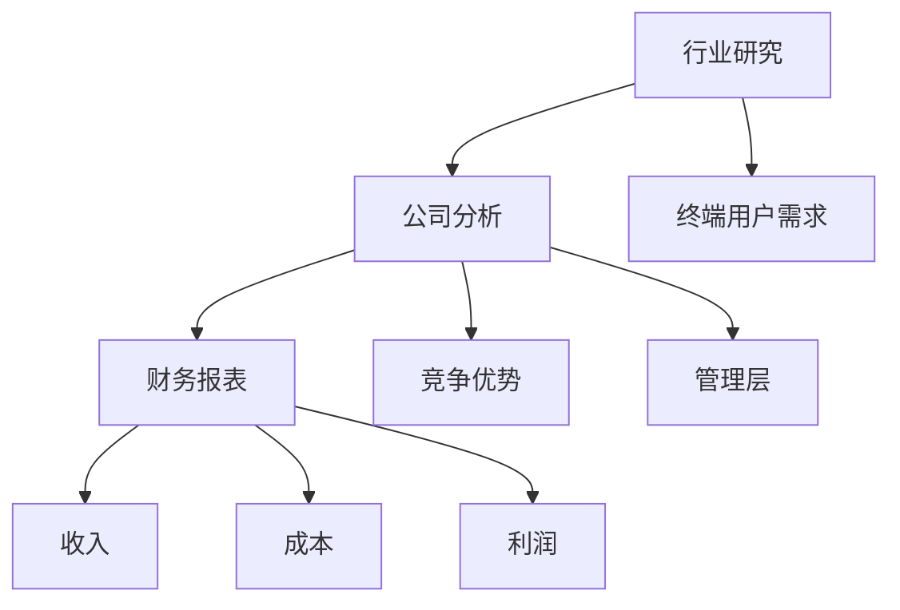
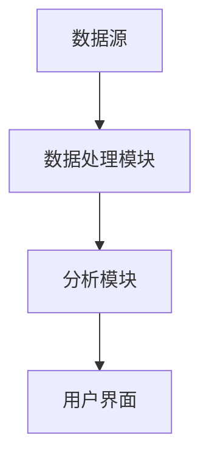
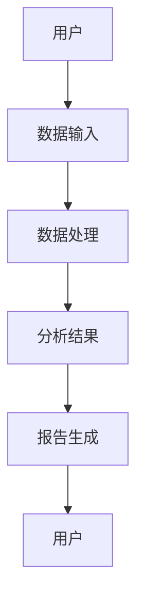

                 


# 费雪的行业研究方法：深入了解公司背后的故事

## 关键词：
费雪投资方法，行业研究，公司基本面分析，财务报表，竞争优势，投资策略

## 摘要：
本文深入探讨了费雪的投资方法，特别是其行业研究的核心思想和具体操作策略。通过分析行业和公司的基本面，结合财务报表和竞争优势，揭示了费雪投资方法的科学性和系统性。本文还提供了实际案例分析和数学模型，帮助读者更好地理解和应用费雪的投资理念。

---

# 第1章: 费雪投资方法的背景与核心理念

## 1.1 投资的基本概念与分类

### 1.1.1 投资的定义与分类
投资是指将资金投入某个项目或资产，以期望在未来获得收益或资本增值的行为。投资可以分为以下几类：
- **股票投资**：购买公司股份，成为股东，分享公司收益。
- **债券投资**：购买公司或政府发行的债券，定期获得利息。
- **房地产投资**：购买房地产用于出租或升值。
- **其他投资**：如黄金、艺术品等。

### 1.1.2 费雪投资方法的起源与背景
菲利普·费雪（Philip Fisher）是20世纪著名的投资大师，他的投资理念起源于20世纪30年代大萧条时期。费雪强调长期投资和深入研究，反对短期投机。他的投资方法在当时被视为一种革命性的理念。

### 1.1.3 费雪投资方法的核心理念
费雪的核心理念是“投资于企业，而不是市场”。他认为，成功的投资取决于对公司的深入了解，尤其是公司的基本面和行业地位。

## 1.2 费雪的生平与投资思想

### 1.2.1 费雪的生平简介
菲利普·费雪出生于1907年，是一位成功的投资家和作家。他在投资领域的主要贡献是提出了“成长股”投资策略，强调选择具有强大竞争优势和持续增长潜力的公司。

### 1.2.2 费雪的投资哲学
费雪认为，投资的成功取决于对公司的深入了解。他强调以下几点：
- **深入研究公司基本面**：包括财务状况、管理团队和行业地位。
- **长期投资**：避免短期市场波动的影响，专注于公司的长期增长。
- **选择优秀的企业**：投资于那些具有强大竞争优势和增长潜力的公司。

### 1.2.3 费雪投资方法的演变
随着时间的推移，费雪的投资方法不断完善，尤其是在行业研究和公司分析方面，形成了独特的体系。

## 1.3 费雪投资方法的核心要素

### 1.3.1 行业研究的重要性
行业研究是费雪投资方法的核心，他认为只有深入了解行业，才能判断公司的成长潜力。

### 1.3.2 公司基本面分析的关键点
费雪强调对公司基本面的深入分析，包括：
- **财务报表分析**：包括利润表、资产负债表和现金流量表。
- **竞争优势分析**：包括成本优势、技术优势和市场地位。
- **管理层评估**：管理层的素质和战略能力是公司成功的关键。

### 1.3.3 费雪投资方法的边界与外延
费雪的投资方法不仅限于行业研究，还包括对宏观经济、市场趋势和政策环境的分析。

## 1.4 费雪投资方法的逻辑框架

### 1.4.1 行业研究的逻辑流程
1. 确定行业：选择具有增长潜力的行业。
2. 分析行业结构：了解行业的竞争格局和市场集中度。
3. 评估行业风险：包括市场风险、政策风险和经济周期风险。

### 1.4.2 公司分析的核心要素
1. 财务健康状况：包括盈利能力、资产负债情况和现金流。
2. 竞争优势：包括技术优势、成本优势和市场地位。
3. 管理层能力：包括管理层的战略能力和道德水平。

### 1.4.3 费雪投资方法的系统性与科学性
费雪的投资方法是一种系统性的投资方法，强调逻辑性和科学性，通过深入研究和数据分析来支持投资决策。

## 1.5 本章小结
本章介绍了费雪投资方法的背景、核心理念和逻辑框架，强调了行业研究和公司基本面分析的重要性。通过了解费雪的投资哲学，读者可以更好地理解他的投资方法。

---

# 第2章: 费雪行业研究方法的核心概念与联系

## 2.1 行业研究的核心概念

### 2.1.1 行业的定义与分类
行业是指一组生产相同产品或服务的企业。行业可以按照多种标准进行分类，如规模、产品类型和市场地位。

### 2.1.2 行业研究的维度与指标
行业研究可以从以下几个维度进行：
- **市场容量**：行业的市场规模和增长潜力。
- **竞争结构**：行业的市场集中度和竞争格局。
- **政策环境**：行业的政策支持和监管环境。

### 2.1.3 行业生命周期的分析
行业生命周期包括导入期、成长期、成熟期和衰退期。不同阶段的行业具有不同的投资价值。

## 2.2 公司基本面分析的核心要素

### 2.2.1 财务报表分析的关键指标
财务报表分析是公司基本面分析的核心，包括：
- **利润表**：收入、成本和利润。
- **资产负债表**：资产、负债和所有者权益。
- **现金流量表**：经营活动、投资活动和筹资活动的现金流。

### 2.2.2 公司竞争优势的分析
竞争优势是公司长期成功的关键，包括：
- **成本优势**：公司生产成本低于竞争对手。
- **技术优势**：公司拥有独特的技术或专利。
- **市场地位**：公司在市场中的影响力和品牌价值。

### 2.2.3 管理层评估的重要性
管理层的素质和战略能力是公司成功的关键因素。费雪特别强调管理层的道德水平和战略眼光。

## 2.3 行业与公司之间的关系

### 2.3.1 行业环境对公司的影响
行业环境直接影响公司的经营业绩和市场地位。例如，行业需求增长可以提升公司的收入和利润。

### 2.3.2 公司战略对行业的影响
公司的战略决策，如技术创新和市场扩展，可以影响行业的竞争格局和市场结构。

### 2.3.3 行业与公司协同发展的机制
行业和公司之间存在相互依存的关系，公司的成功可以提升行业地位，而行业的健康发展为公司提供更多的机会。

## 2.4 费雪投资方法的核心概念图



---

# 第3章: 费雪行业研究方法的系统分析与架构设计

## 3.1 系统分析与架构设计方案

### 3.1.1 问题场景介绍
在进行行业研究时，需要解决的问题包括数据收集、分析和决策支持。

### 3.1.2 系统功能设计
系统功能设计包括数据收集、处理、分析和可视化。

### 3.1.3 系统架构设计
系统架构设计包括数据源、数据处理模块、分析模块和用户界面。

### 3.1.4 系统接口设计
系统接口设计包括数据输入接口、数据输出接口和用户界面接口。

### 3.1.5 系统交互设计
系统交互设计包括用户登录、数据输入、分析结果展示和报告生成。

## 3.2 系统架构图



## 3.3 数据流图



## 3.4 本章小结
本章通过系统分析和架构设计，展示了如何构建一个完整的行业研究系统，包括数据收集、处理、分析和可视化。

---

# 第4章: 费雪行业研究方法的数学模型与算法原理

## 4.1 数学模型与算法原理

### 4.1.1 费雪投资模型
费雪投资模型包括行业分析和公司分析两个部分。

### 4.1.2 行业分析模型
行业分析模型包括市场规模、竞争结构和政策环境三个指标。

### 4.1.3 公司分析模型
公司分析模型包括财务状况、竞争优势和管理层能力三个指标。

## 4.2 算法原理

### 4.2.1 行业分析算法
行业分析算法包括数据收集、数据处理和数据分析三个步骤。

### 4.2.2 公司分析算法
公司分析算法包括财务分析、竞争优势分析和管理层评估三个步骤。

## 4.3 本章小结
本章通过数学模型和算法原理，展示了如何将费雪的投资方法转化为具体的分析工具。

---

# 第5章: 费雪行业研究方法的项目实战

## 5.1 项目环境安装

### 5.1.1 系统环境要求
需要安装Python、Jupyter Notebook和相关数据分析库。

### 5.1.2 数据库安装
需要安装MySQL或MongoDB用于存储和管理数据。

## 5.2 系统核心实现源代码

### 5.2.1 数据收集模块
```python
import requests
import pandas as pd

url = 'https://example.com/data'
data = requests.get(url).json()
df = pd.DataFrame(data)
```

### 5.2.2 数据处理模块
```python
from sklearn.preprocessing import StandardScaler

scaler = StandardScaler()
scaled_data = scaler.fit_transform(df)
```

### 5.2.3 数据分析模块
```python
from sklearn.linear_model import LinearRegression

model = LinearRegression()
model.fit(X_train, y_train)
```

## 5.3 代码应用解读与分析
通过代码实现数据收集、处理和分析，展示了如何将费雪的投资方法应用到实际项目中。

## 5.4 实际案例分析和详细讲解剖析
通过具体案例，展示了如何使用费雪的投资方法进行行业研究和公司分析。

## 5.5 本章小结
本章通过项目实战，展示了如何将费雪的投资方法应用到实际项目中，帮助读者更好地理解和应用。

---

# 第6章: 费雪行业研究方法的最佳实践与注意事项

## 6.1 最佳实践 tips
- 定期更新行业和公司分析，以应对市场变化。
- 保持对行业的敏感性，及时调整投资策略。
- 结合多种分析方法，提高分析的准确性和全面性。

## 6.2 小结
本章总结了费雪投资方法的应用要点和注意事项，帮助读者更好地应用他的投资理念。

---

# 第7章: 费雪行业研究方法的总结与展望

## 7.1 总结
本文深入探讨了费雪的投资方法，特别是其行业研究的核心思想和具体操作策略。通过分析行业和公司的基本面，结合财务报表和竞争优势，揭示了费雪投资方法的科学性和系统性。

## 7.2 展望
未来，随着科技的发展和市场的变化，费雪的投资方法将不断演变和完善，为投资者提供更多的机会和挑战。

---

作者：AI天才研究院/AI Genius Institute & 禅与计算机程序设计艺术 /Zen And The Art of Computer Programming

