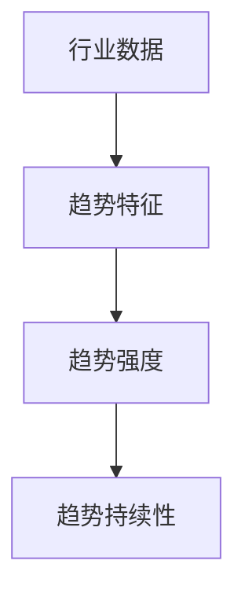
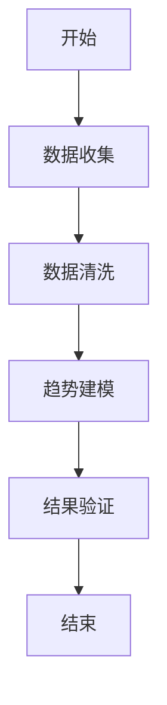
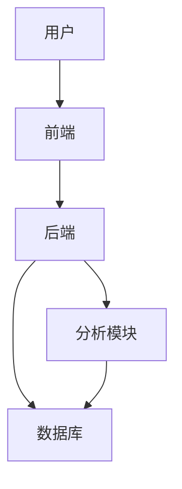
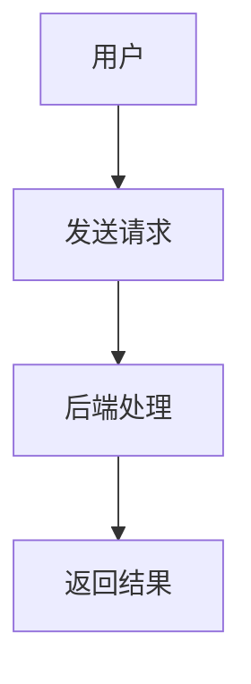

                 


# 费雪的行业趋势分析：把握未来增长机会

> **关键词**：行业趋势分析，费雪分析法，趋势预测，数据驱动，技术畅销书
>
> **摘要**：本文深入探讨了费雪的行业趋势分析方法，结合技术分析与行业研究，帮助读者识别未来增长机会。通过详细讲解分析原理、算法步骤、系统设计和实战案例，提供一套高效的趋势预测体系。

---

## 第一部分: 费雪的行业趋势分析基础

### 第1章: 行业趋势分析的背景与重要性

#### 1.1 行业趋势分析的定义与作用
- **行业趋势分析**是指通过对市场数据、行业动态和经济指标的分析，预测行业未来发展方向和变化趋势的过程。
- **重要性**：在商业决策中，准确的趋势分析能够帮助企业识别市场机会和风险，制定更具前瞻性的战略。

#### 1.2 费雪分析法的起源与发展
- **费雪分析法**由著名经济学家 Irving Fisher 提出，结合统计学和经济学原理，用于预测行业趋势。
- **区别**：与传统趋势分析不同，费雪分析法更注重数据驱动和数学模型的应用。

---

### 第2章: 费雪分析法的核心概念与联系

#### 2.1 费雪分析法的原理
- **数据驱动**：依赖历史数据和实时信息，通过统计分析识别趋势。
- **数学模型**：运用回归分析和时间序列模型，量化趋势强度和持续性。

#### 2.2 核心概念对比表
| **对比维度** | **费雪分析法** | **传统趋势分析** |
|--------------|-----------------|-------------------|
| **数据依赖** | 高             | 中               |
| **模型复杂度** | 高             | 低               |
| **预测精度** | 高             | 一般             |

#### 2.3 实体关系图


---

### 第3章: 费雪分析法的算法原理

#### 3.1 费雪分析法的步骤
1. **数据收集与预处理**：收集行业数据，清洗异常值。
2. **趋势识别与建模**：应用时间序列分析和回归模型。
3. **结果验证与优化**：通过历史数据验证模型，调整参数。

#### 3.2 算法流程图


#### 3.3 数学模型与公式
- **趋势强度计算公式**：
  $$
  T_i = \sum_{j=1}^{n} w_j \times x_{ij}
  $$
  其中，$T_i$ 是第 $i$ 个行业的趋势强度，$w_j$ 是第 $j$ 个因素的权重，$x_{ij}$ 是第 $i$ 个行业在第 $j$ 个因素上的表现。

---

### 第4章: 系统分析与架构设计

#### 4.1 系统功能设计
- **数据采集模块**：实时获取行业数据。
- **趋势分析模块**：应用费雪分析法进行预测。
- **报告生成模块**：输出趋势分析报告。

#### 4.2 系统架构图


#### 4.3 接口设计与交互流程图


---

### 第5章: 项目实战

#### 5.1 环境安装
- **Python与相关库**：安装 `numpy`, `pandas`, `matplotlib` 等库。
- **数据源获取**：从公开数据库获取行业数据。

#### 5.2 核心代码实现
```python
import pandas as pd
import numpy as np

# 数据清洗
data = pd.read_csv('industry_data.csv')
data = data.dropna()

# 趋势建模
from statsmodels.tsa.arima_model import ARIMA
model = ARIMA(data, order=(5,1,0))
model_fit = model.fit()
```

#### 5.3 实际案例分析
- **案例分析**：分析科技行业的趋势，预测未来增长点。
- **结果解读**：通过模型输出，识别关键趋势并制定策略。

---

## 第二部分: 总结与最佳实践

### 6章: 总结与注意事项

#### 6.1 小结
- 费雪分析法通过数据驱动和数学模型，提供高效的趋势预测方法。
- 实战项目展示了如何在实际中应用这些方法。

#### 6.2 注意事项
- 数据质量直接影响预测结果，需确保数据的准确性和完整性。
- 模型选择需根据具体情况调整，避免过度拟合。

#### 6.3 未来趋势展望
- 结合人工智能技术，提升趋势分析的准确性和效率。
- 推动行业趋势分析在更多领域的应用。

---

**作者：AI天才研究院/AI Genius Institute & 禅与计算机程序设计艺术 /Zen And The Art of Computer Programming**

