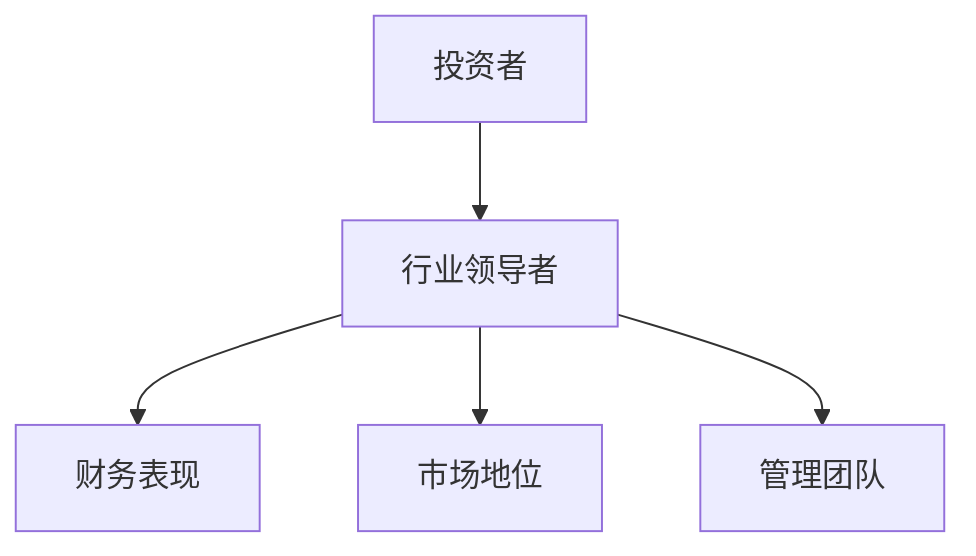
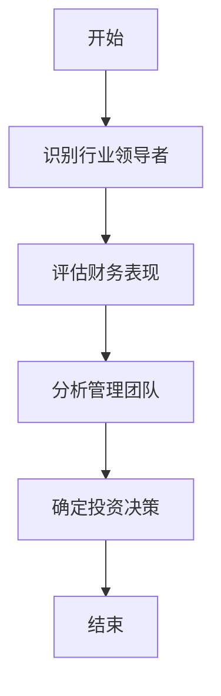
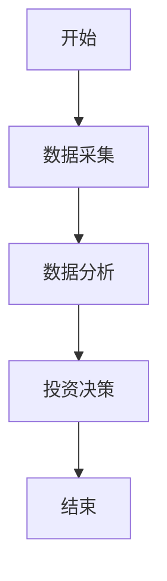
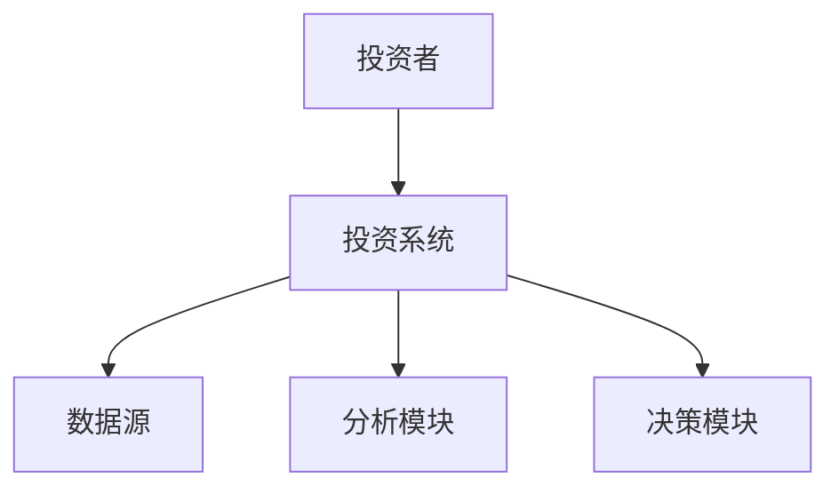
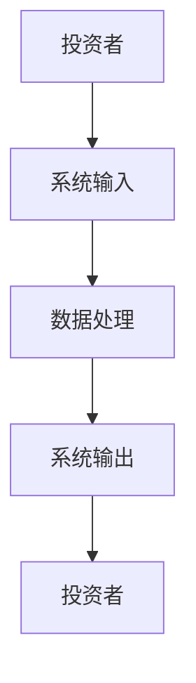

                 


# 费雪的行业领导者投资策略

> 关键词：费雪投资策略，行业领导者，成长股，投资分析，系统架构，投资工具

> 摘要：本文深入探讨菲利普·费雪的投资策略，特别是如何识别和投资行业领导者。通过分析费雪的投资理念、核心概念、算法原理、系统架构、实战案例和工具应用，为读者提供一个全面的理解框架，帮助他们在投资决策中应用这些策略。

---

# 第1章: 费雪投资策略的背景与核心理念

## 1.1 费雪的生平与投资理念

### 1.1.1 费雪的生平简介

菲利普·费雪（Philip Fisher）是20世纪著名的投资专家，被誉为“成长股之父”。他出生于1903年，去世于2004年，是投资界的重要人物之一。费雪的投资理念对现代投资理论有着深远的影响，尤其是在成长股投资领域。

### 1.1.2 费雪的投资哲学与核心思想

费雪的投资哲学基于以下几点：

1. **长期投资**：费雪主张长期持有优质股票，而不是频繁交易。
2. **选择行业领导者**：他强调投资于行业内具有领先地位的公司。
3. **关注管理团队**：他认为优秀的管理层是公司成功的关键。
4. **注重财务健康**：费雪要求公司具备健康的财务状况，能够持续增长。

### 1.1.3 费雪投资策略的演变与影响

费雪的投资策略在20世纪中期逐渐成型，并对后来的投资理论产生了深远的影响。他的理念被广泛应用于成长股投资中，并被许多投资者所采纳。

---

## 1.2 费雪投资策略的核心概念

### 1.2.1 行业领导者的定义与特征

行业领导者是指在特定行业中占据领先地位，具备竞争优势的公司。其特征包括：

- 市场占有率高
- 盈利能力强
- 管理团队优秀
- 技术创新能力强

### 1.2.2 费雪的“成长股”投资理念

费雪提出“成长股”概念，即那些收入和利润能够持续增长的公司。他强调投资于那些能够在未来几年内保持增长的公司。

### 1.2.3 费雪投资策略的边界与外延

费雪的投资策略不仅限于成长股，还包括对行业趋势、宏观经济环境和公司基本面的综合分析。

---

# 第2章: 费雪投资策略的核心概念与联系

## 2.1 费雪投资策略的核心原理

### 2.1.1 费雪投资策略的基本原理

费雪的投资策略基于以下基本原理：

- 投资于行业领导者，尤其是那些具备强大竞争优势的公司。
- 长期持有，避免频繁交易。
- 关注公司的财务健康和管理能力。

### 2.1.2 费雪策略的数学模型与公式

费雪的投资策略可以通过以下公式简化：

$$
\text{投资价值} = f(\text{财务表现}, \text{市场地位}, \text{管理团队})
$$

其中，$f$ 是一个综合评估函数，用于衡量公司的整体价值。

### 2.1.3 费雪策略与现代投资理论的对比

| 对比维度       | 费雪策略                      | 现代投资理论                 |
|----------------|------------------------------|-----------------------------|
| 核心理念       | 投资行业领导者                | 分散投资，降低风险           |
| 投资目标       | 长期增长                     | 稳定收益                     |
| 分析方法       | 定性分析                     | 定量分析                     |

---

## 2.2 费雪策略的核心要素对比分析

### 2.2.1 费雪策略与传统价值投资的对比

| 对比维度       | 费雪策略                      | 传统价值投资                |
|----------------|------------------------------|-----------------------------|
| 核心理念       | 投资成长股                    | 买入低于价值的股票           |
| 分析重点       | 未来增长潜力                  | 当前市场价格与内在价值        |

### 2.2.2 费雪策略与成长股投资的对比

| 对比维度       | 费雪策略                      | 成长股投资                  |
|----------------|------------------------------|-----------------------------|
| 核心理念       | 投资行业领导者                | 投资成长股                  |
| 分析方法       | 综合分析                     | 侧重未来增长潜力             |

### 2.2.3 费雪策略与技术分析的对比

| 对比维度       | 费雪策略                      | 技术分析                    |
|----------------|------------------------------|-----------------------------|
| 分析方法       | 定性分析                     | 侧重价格走势和图表分析        |

---

## 2.3 费雪策略的ER实体关系图



---

# 第3章: 费雪投资策略的算法原理与数学模型

## 3.1 费雪策略的算法原理

### 3.1.1 投资决策流程



---

## 3.2 费雪策略的数学模型

$$
\text{投资价值} = f(\text{财务表现}, \text{市场地位}, \text{管理团队})
$$

其中，$f$ 是一个综合评估函数，用于衡量公司的整体价值。

---

## 3.3 费雪策略的详细讲解与举例

### 3.3.1 费雪策略的详细步骤

1. **识别行业领导者**：寻找在行业中占据领先地位的公司。
2. **评估财务表现**：分析公司的财务报表，确保其具备健康的财务状况。
3. **分析管理团队**：评估公司管理层的能力和稳定性。
4. **确定投资决策**：基于以上分析，决定是否投资。

---

## 3.4 费雪策略的实际案例分析

### 3.4.1 案例：苹果公司的投资分析

苹果公司作为行业领导者，具备强大的市场地位和优秀的管理团队，符合费雪的投资策略。通过分析其财务表现和市场地位，可以确定其具备长期增长潜力。

---

# 第4章: 费雪投资策略的系统分析与架构设计

## 4.1 投资分析系统的功能设计

### 4.1.1 系统功能模块划分

- **数据采集模块**：收集行业数据和公司信息。
- **数据分析模块**：分析公司财务表现和市场地位。
- **投资决策模块**：基于分析结果，生成投资建议。

### 4.1.2 系统功能流程图



---

## 4.2 投资分析系统的架构设计

### 4.2.1 系统架构图



---

## 4.3 投资分析系统的接口设计

### 4.3.1 系统接口设计

- **输入接口**：接收投资者的需求和市场数据。
- **输出接口**：提供投资建议和分析结果。

---

## 4.4 投资分析系统的交互设计

### 4.4.1 系统交互流程



---

# 第5章: 费雪投资策略的项目实战

## 5.1 投资环境与工具

### 5.1.1 投资工具的选择

- **财务分析工具**：如Excel、财务分析软件。
- **市场数据平台**：如 Bloomberg、FactSet。

---

## 5.2 投资分析与实施

### 5.2.1 投资策略的实施步骤

1. **数据收集**：收集目标公司的财务数据和市场信息。
2. **数据分析**：分析公司的财务表现和市场地位。
3. **投资决策**：基于分析结果，制定投资计划。

---

## 5.3 投资案例分析

### 5.3.1 案例：微软公司的投资分析

通过分析微软公司的财务表现、市场地位和管理团队，可以确认其具备长期投资价值。

---

## 5.4 投资工具与模板

### 5.4.1 投资分析模板

```plaintext
公司名称：XXX
行业：XXX
市场地位：XXX
财务表现：XXX
管理团队：XXX
投资建议：XXX
```

---

# 第6章: 总结与扩展

## 6.1 总结

菲利普·费雪的投资策略强调投资于行业领导者，注重公司的财务健康和管理能力。通过系统的分析和长期持有，投资者可以实现稳定的收益。

## 6.2 扩展阅读

- 《成长股投资》
- 《费雪投资策略的现代应用》
- 《投资学基础》

---

作者：AI天才研究院/AI Genius Institute & 禅与计算机程序设计艺术 /Zen And The Art of Computer Programming

