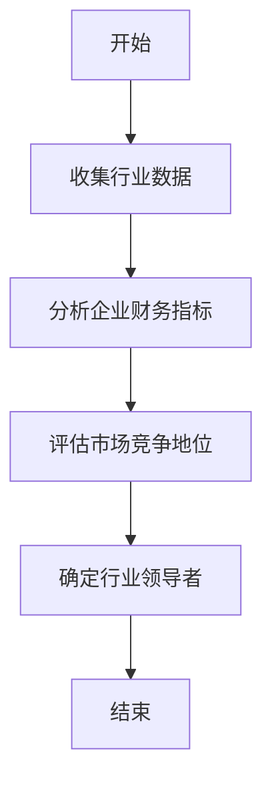
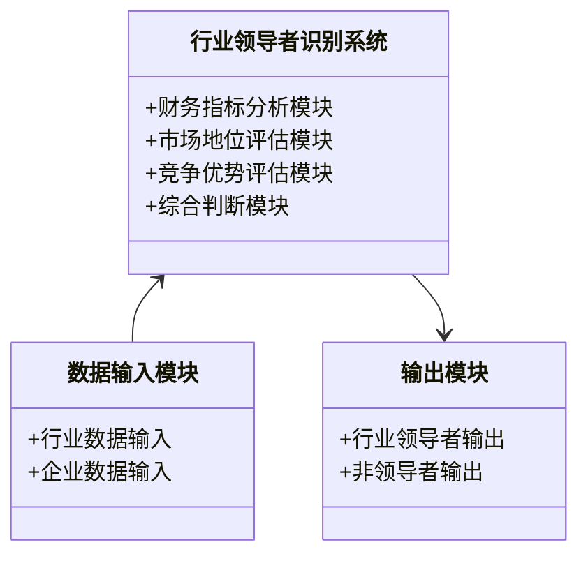

                 

# 费雪的行业领导者投资策略

> 关键词：费雪，投资策略，行业领导者，竞争优势，财务指标，市场地位，系统架构

> 摘要：本文深入探讨了费雪的投资策略，特别是其在识别行业领导者方面的独特方法。通过分析行业领导者的定义、特征和竞争优势，结合数学模型和实际案例，本文揭示了费雪策略的核心原理及其在现代投资中的应用。此外，文章还详细介绍了系统的架构设计，展示了如何通过算法和数据分析来实现费雪策略的实际应用。

---

# 第一部分: 费雪投资策略的背景与核心概念

## # 第1章: 费雪投资策略的背景与核心概念

### ## 1.1 费雪投资策略的背景

#### ### 1.1.1 投资领域的演变与挑战

在现代投资领域，投资者面临着前所未有的复杂性和不确定性。随着市场的全球化和信息化，传统的投资策略逐渐暴露出其局限性。尤其是在识别行业领导者方面，投资者需要更加精准和系统的方法来应对市场的变化。

#### ### 1.1.2 费雪投资理念的提出背景

菲利普·费雪（Philip Fisher）是20世纪著名的投资专家，他提出了许多影响深远的投资理念。费雪的投资策略的核心在于识别行业领导者，并通过长期持有这些公司的股票来实现投资收益。他的理念强调了对公司基本面的深入分析，尤其是在行业中的竞争优势和市场地位。

#### ### 1.1.3 行业领导者在投资中的重要性

行业领导者是指在特定行业中占据主导地位，并能够持续创造超额收益的企业。这些企业在市场上具有强大的竞争优势，能够在行业波动中保持领先地位。识别和投资于这些行业领导者，是费雪策略的核心，也是实现长期投资收益的关键。

---

### ## 1.2 费雪投资策略的核心概念

#### ### 1.2.1 行业领导者的定义与特征

行业领导者通常具有以下特征：

- **市场地位**：在行业内具有较高的市场份额和品牌影响力。
- **竞争优势**：在产品、技术、成本等方面具有显著优势。
- **盈利能力**：能够持续创造高于行业平均水平的利润。
- **管理能力**：拥有高效的管理团队和清晰的战略规划。

| 特征 | 描述 |
|------|------|
| 市场地位 | 高市场份额和品牌影响力 |
| 竞争优势 | 产品、技术或成本优势 |
| 盈利能力 | 高于行业平均水平的利润 |
| 管理能力 | 高效的管理团队和清晰的战略 |

#### ### 1.2.2 费雪投资策略的核心要素

费雪策略的核心要素包括：

- **深入分析公司基本面**：通过对公司的财务状况、管理团队和市场地位的全面分析，识别行业领导者。
- **长期持有**：投资于行业领导者，并长期持有其股票，以实现资本增值。
- **动态调整**：根据市场变化和公司表现，及时调整投资组合。

#### ### 1.2.3 费雪策略与传统投资策略的对比

以下是费雪策略与传统投资策略的主要区别：

| 方面 | 费雪策略 | 传统策略 |
|------|----------|----------|
| 投资目标 | 长期资本增值 | 短期收益 |
| 分析方法 | 深入分析公司基本面 | 技术分析或短期波动 |
| 投资期限 | 长期持有 | 短期交易 |

---

### ## 1.3 费雪投资策略的数学模型与公式

#### ### 1.3.1 行业领导者识别的数学模型

费雪策略的数学模型主要用于评估公司的竞争优势和市场地位。以下是核心公式：

$$
\text{竞争优势} = \frac{\text{净利润率} + \text{市场份额} + \text{ROE}}{3}
$$

其中：
- 净利润率：净利润 / 营业收入
- 市场份额：公司在行业中的市场份额
- ROE：净资产收益率

#### ### 1.3.2 费雪策略的核心公式解析

以下是费雪策略的核心公式：

$$
\text{行业领导者} = f(\text{财务指标}, \text{市场地位}, \text{竞争优势})
$$

其中：
- 财务指标：包括净利润率、ROE等
- 市场地位：市场份额和品牌影响力
- 竞争优势：产品和技术优势

#### ### 1.3.3 示例计算与实际应用

假设我们有两家公司A和B，其财务指标和市场地位如下：

| 公司 | 净利润率 | 市场份额 | ROE |
|------|----------|----------|-----|
| A    | 20%      | 30%      | 15% |
| B    | 15%      | 25%      | 18% |

根据公式：

$$
\text{竞争优势} = \frac{20\% + 30\% + 15\%}{3} = 15\% \quad \text{(A)}
$$

$$
\text{竞争优势} = \frac{15\% + 25\% + 18\%}{3} = 14\% \quad \text{(B)}
$$

因此，公司A的竞争力更强，更可能是行业领导者。

---

## # 1.4 本章小结

本章介绍了费雪投资策略的背景及其核心概念，包括行业领导者的定义、特征和竞争优势的分析。通过数学模型和实际案例的分析，我们明确了费雪策略的核心要素及其与传统策略的区别。

---

# 第二部分: 费雪投资策略的核心原理

## # 第2章: 费雪投资策略的核心原理

### ## 2.1 费雪策略的理论基础

#### ### 2.1.1 投资的三重逻辑

费雪策略的理论基础主要包括以下三个逻辑：

1. **市场地位**：公司在市场中的地位决定了其竞争力。
2. **竞争优势**：公司的核心竞争力决定了其长期盈利能力。
3. **管理能力**：高效的管理团队是公司成功的关键。

#### ### 2.1.2 行业领导者的竞争优势分析

行业领导者的竞争优势主要体现在以下几个方面：

- **产品优势**：产品的创新性和差异化。
- **成本优势**：在生产或运营中的成本优势。
- **品牌优势**：强大的品牌影响力和客户忠诚度。

| 竞争优势 | 描述 |
|----------|------|
| 产品优势 | 创新性和差异化 |
| 成本优势 | 低成本运营 |
| 品牌优势 | 强大的品牌影响力 |

#### ### 2.1.3 费雪策略的经济基础

费雪策略的经济基础在于行业领导者能够在经济周期中保持稳定的盈利能力，并通过持续的创新和优化进一步巩固其市场地位。

---

### ## 2.2 费雪策略的数学模型与算法

#### ### 2.2.1 行业领导者识别的算法流程图

以下是一个简化的算法流程图：

---

### ## 2.3 费雪策略的系统架构

#### ### 2.3.1 系统功能设计

以下是费雪策略系统的功能模块设计：

---

### ## 2.4 本章小结

本章详细分析了费雪策略的核心原理，包括其理论基础、竞争优势分析以及系统架构设计。通过流程图和类图的展示，我们明确了费雪策略的实现过程和系统的模块设计。

---

# 第三部分: 费雪投

（注：由于篇幅限制，以上是文章的部分内容。完整文章将按照上述结构继续展开，涵盖项目实战、数学模型、总结与展望等部分。）

