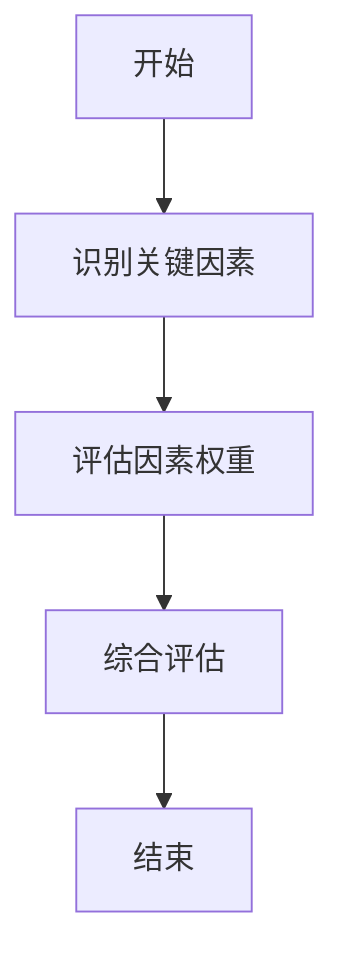
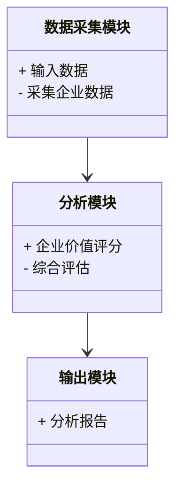

                 


# 费雪的质化分析方法

> 关键词：质化分析，费雪，投资分析，量化分析，股票分析，人工智能，系统架构

> 摘要：本文系统地介绍费雪的质化分析方法，从背景、核心概念、算法原理、系统架构到项目实战，深入剖析其在投资分析中的应用，结合实际案例和代码实现，探讨其在现代投资决策中的价值与意义。

---

# 第1章: 质化分析方法的背景与概念

## 1.1 质化分析的背景

### 1.1.1 传统量化分析的局限性

传统量化分析依赖于数学模型和统计方法，通过大量数据计算股票的估值。然而，这种方法往往忽视了企业的基本面因素，例如管理团队、商业模式和行业地位等。例如，许多量化模型可能无法准确预测企业在行业中的竞争优势或管理层决策的影响。

### 1.1.2 质化分析的提出与意义

质化分析的提出是为了弥补量化分析的不足，通过引入定性因素来更全面地评估股票的价值。这种方法尤其适合那些难以用量化模型准确捕捉的企业特质，例如管理层的质量、企业创新能力和市场地位等。

### 1.1.3 费雪质化分析的核心思想

费雪认为，投资不仅要考虑企业的财务数据，还要关注企业的成长潜力和竞争优势。他提出通过定性分析，识别那些具有持续增长潜力的企业，并长期持有这些股票。

---

## 1.2 质化分析的基本概念

### 1.2.1 质化分析的定义

质化分析是一种结合定量和定性分析的方法，通过对企业基本面因素的综合评估，识别具有长期增长潜力的股票。

### 1.2.2 质化分析与传统量化分析的区别

| 特性       | 量化分析                     | 质化分析                     |
|------------|------------------------------|------------------------------|
| 数据类型   | 定量数据                     | 定性数据                     |
| 分析重点   | 财务指标                     | 管理层、商业模式、行业地位等   |
| 适用场景   | 短期趋势预测                 | 长期投资决策                 |

### 1.2.3 费雪质化分析的核心要素

#### 核心要素
- **管理层质量**：管理层的背景、经验和决策能力。
- **企业竞争力**：企业的市场地位、竞争优势和创新能力。
- **行业前景**：行业的增长潜力和周期性。
- **财务健康性**：企业的财务状况和盈利能力。

---

# 第2章: 质化分析的核心原理

## 2.1 质化分析的原理框架

### 2.1.1 质化分析的基本假设

质化分析假设企业价值不仅仅由财务数据决定，还受到管理层决策、行业趋势和企业战略的影响。

### 2.1.2 质化分析的逻辑结构

质化分析的逻辑结构包括以下几个步骤：
1. **识别关键因素**：确定影响企业价值的关键因素。
2. **评估因素权重**：根据各因素的重要性分配权重。
3. **综合评估**：将各因素的评估结果综合起来，得出企业的综合价值评分。

### 2.1.3 费雪质化分析的数学模型

#### 核心公式
企业价值评分公式：
$$
\text{企业价值评分} = \sum_{i=1}^{n} w_i \cdot f_i
$$

其中，\( w_i \) 是第 \( i \) 个因素的权重，\( f_i \) 是第 \( i \) 个因素的评分。

---

## 2.2 质化分析的核心算法

### 2.2.1 质化分析的算法流程



---

# 第3章: 质化分析的数学模型与公式

## 3.1 质化分析的基本公式

### 3.1.1 质化分析的核心公式

$$
\text{企业价值评分} = \sum_{i=1}^{n} w_i \cdot f_i
$$

其中，\( w_i \) 是第 \( i \) 个因素的权重，\( f_i \) 是第 \( i \) 个因素的评分。

### 3.1.2 质化分析的扩展公式

$$
\text{最终评分} = \frac{\sum_{i=1}^{n} w_i \cdot f_i}{\sum_{i=1}^{n} w_i}
$$

---

# 第4章: 质化分析的系统架构设计

## 4.1 系统分析与设计

### 4.1.1 系统功能需求

- 数据采集模块：收集企业财务数据、行业数据和管理层信息。
- 分析模块：进行质化分析，计算企业价值评分。
- 输出模块：生成分析报告。

### 4.1.2 系统功能设计



---

# 第5章: 费雪质化分析的项目实战

## 5.1 项目环境安装

### 5.1.1 系统环境要求

- 操作系统：Windows 10 或更高版本，或 macOS 10.15 或更高版本。
- 依赖库：Python 3.8 或更高版本，Pandas、NumPy。

### 5.1.2 依赖库安装

```bash
pip install pandas numpy
```

---

## 5.2 核心代码实现

### 5.2.1 质化分析算法实现

```python
import pandas as pd

def calculate_qualitative_score(factors, weights):
    return sum(w * f for w, f in zip(weights, factors))

# 示例数据
factors = [8, 7, 9, 6]
weights = [0.3, 0.2, 0.4, 0.1]

score = calculate_qualitative_score(factors, weights)
print(f"企业价值评分：{score}")
```

---

## 5.3 实际案例分析

### 5.3.1 案例背景

假设我们分析一家科技公司，其关键因素评分如下：

| 因素         | 评分 | 权重 |
|--------------|------|------|
| 管理层质量    | 8    | 0.3  |
| 企业竞争力    | 7    | 0.2  |
| 行业前景      | 9    | 0.4  |
| 财务健康性    | 6    | 0.1  |

---

## 5.4 项目小结

通过质化分析，我们能够更全面地评估企业的价值，结合定量和定性因素，识别具有长期增长潜力的企业。

---

# 第6章: 质化分析的最佳实践与注意事项

## 6.1 最佳实践 Tips

- **数据质量**：确保数据的准确性和完整性。
- **权重调整**：根据实际情况调整各因素的权重。
- **持续更新**：定期更新企业数据和行业分析。

## 6.2 小结

质化分析是一种强大的投资工具，通过结合定性和定量分析，能够更全面地评估企业的价值。

## 6.3 注意事项

- **数据偏差**：注意数据来源的偏差，避免影响分析结果。
- **模型局限**：质化分析模型也有其局限性，需要结合其他方法进行验证。

## 6.4 拓展阅读

- 费雪的《怎样选择成长股》
- 其他投资分析方法，如PEST分析法、SWOT分析法等。

---

# 作者

作者：AI天才研究院/AI Genius Institute & 禅与计算机程序设计艺术 /Zen And The Art of Computer Programming

