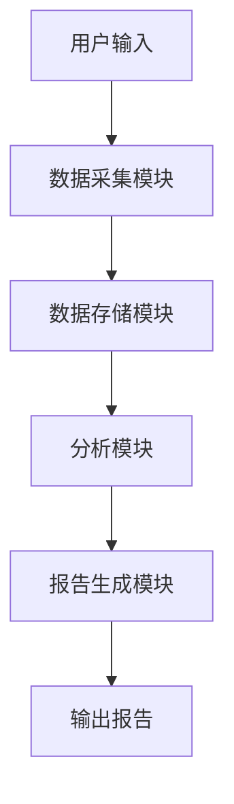
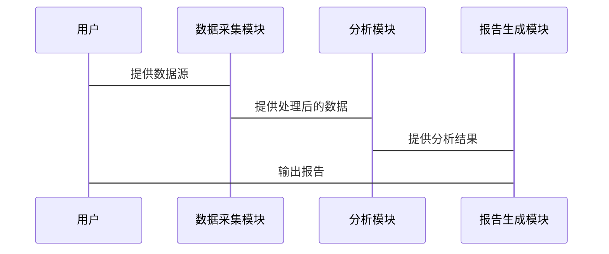
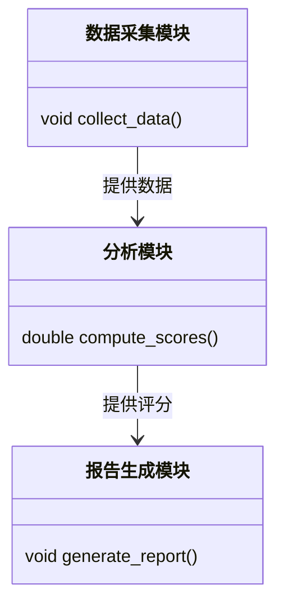
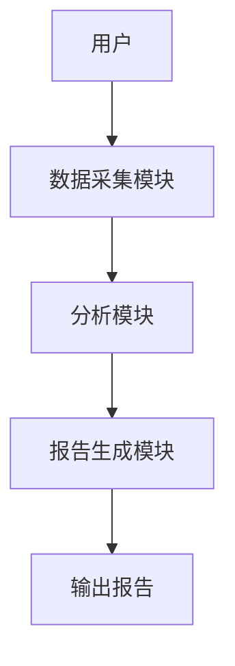
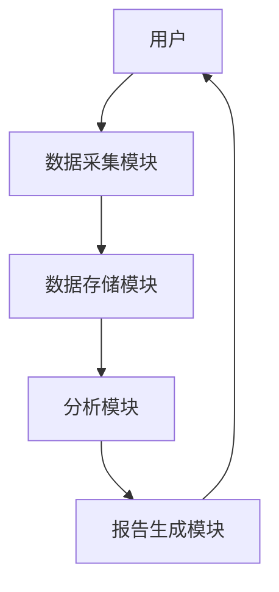

                 


# 费雪的质性分析：超越数字的公司研究方法

## 关键词：质性分析，费雪分析法，公司研究，投资分析，数据驱动

## 摘要

在现代投资分析中，数字和财务指标通常是评估公司价值的主要工具。然而，仅仅依赖数字分析往往忽略了企业背后的关键因素，如管理层的能力、企业竞争优势和行业地位。费雪的质性分析方法提供了一种超越数字的研究方式，通过定性评估来补充和强化传统的定量分析。本文详细探讨了费雪质性分析的核心概念、算法原理、系统架构及其在实际项目中的应用。通过案例分析和系统设计，展示了质性分析在公司研究中的强大优势，并为未来的投资决策提供了新的思路。

---

## 第一部分：质性分析的背景与意义

### 第1章：质性分析的背景与意义

#### 1.1 投资分析的演变

##### 1.1.1 从定量分析到质性分析的转变

传统的投资分析方法主要依赖财务指标和定量模型，例如市盈率、市净率和ROE等。然而，这些指标只能提供企业的表面信息，难以反映企业的内在价值和长期发展潜力。随着投资理论的发展，越来越多的分析师意识到，仅仅依赖数字可能无法全面捕捉企业的核心竞争力和潜在风险。质性分析的兴起填补了这一空白，为投资决策提供了更全面的视角。

##### 1.1.2 质性分析在投资决策中的重要性

质性分析通过评估企业的管理能力、竞争优势和行业地位，能够揭示数字背后的关键因素。例如，一家公司可能拥有较高的净利润率，但如果其管理层能力较弱，或者行业竞争激烈，其长期表现可能不佳。因此，质性分析能够帮助投资者更全面地评估企业的价值。

##### 1.1.3 费雪分析法的核心思想

费雪分析法是由著名投资学家菲利普·费雪提出的一种质性分析方法。他认为，企业的内在价值不仅取决于财务数据，还取决于企业的管理能力、竞争优势和行业地位。通过综合评估这些因素，投资者可以更好地识别具有长期增长潜力的企业。

#### 1.2 费雪质性分析的定义与特点

##### 1.2.1 费雪质性分析的定义

费雪质性分析是一种通过评估企业的管理能力、竞争优势和行业地位等定性因素，来判断其内在价值和长期发展潜力的方法。

##### 1.2.2 质性分析的核心要素

- **管理层能力**：包括管理层的决策能力、战略眼光和职业道德。
- **企业竞争优势**：包括企业的市场地位、产品差异化和成本优势。
- **行业地位**：包括行业的增长潜力、竞争结构和政策环境。

##### 1.2.3 费雪分析法与传统定量分析的区别

费雪分析法与传统定量分析的主要区别在于，前者注重定性因素的评估，而后者主要依赖财务指标和数学模型。费雪分析法更关注企业的内在价值和长期发展潜力，而定量分析更注重短期财务表现。

#### 1.3 质性分析在公司研究中的应用前景

##### 1.3.1 质性分析的潜在应用场景

- **投资决策**：帮助投资者识别具有长期增长潜力的企业。
- **风险管理**：通过评估企业的内在风险因素，制定更有效的风险管理策略。
- **战略规划**：为企业制定长期战略提供参考。

##### 1.3.2 质性分析在企业估值中的优势

质性分析能够帮助投资者更全面地评估企业的内在价值，尤其是在企业财务状况不佳或行业环境复杂的情况下，质性分析能够提供重要的参考依据。

##### 1.3.3 质性分析面临的挑战与机遇

质性分析的挑战主要在于其主观性和不确定性。由于定性因素的评估往往依赖于分析师的判断，因此可能存在较大的主观偏差。然而，随着大数据和人工智能技术的发展，质性分析的方法也在不断改进，变得更加科学和系统。

---

## 第二部分：费雪质性分析的核心模型

### 第2章：费雪质性分析模型

#### 2.1 费雪质性分析的核心要素

##### 2.1.1 管理层质量的评估

管理层能力是费雪分析法中的核心要素之一。评估管理层能力的关键指标包括管理层的决策能力、战略眼光和职业道德。例如，可以通过分析公司的历史表现和管理层的过往决策来评估其能力。

##### 2.1.2 企业竞争优势的分析

企业竞争优势是另一个关键因素。竞争优势可以分为成本优势、产品差异化和市场进入壁垒等。例如，苹果公司的产品差异化和品牌优势是其竞争优势的重要组成部分。

##### 2.1.3 行业地位的判断

行业地位包括行业的增长潜力、竞争结构和政策环境。例如，科技行业的增长潜力较大，但竞争也更加激烈。政策环境对企业的发展也有重要影响，尤其是在监管严格的行业。

#### 2.2 费雪质性分析的评估框架

##### 2.2.1 核心竞争力的评估维度

- **市场地位**：包括市场份额、品牌影响力和客户忠诚度。
- **竞争优势**：包括产品创新、成本控制和专利技术。
- **管理能力**：包括战略规划、组织结构和执行力。

##### 2.2.2 管理层能力的评分标准

管理层能力的评分标准可以包括以下几个方面：
- **战略眼光**：管理层是否能够制定长期战略并成功执行。
- **决策能力**：管理层在面对复杂问题时的决策能力。
- **职业道德**：管理层是否遵守职业道德，避免短期行为。

##### 2.2.3 行业环境的综合评价

行业环境的综合评价可以包括以下几个方面：
- **行业增长潜力**：行业的市场规模和发展前景。
- **竞争结构**：行业的竞争程度和市场进入壁垒。
- **政策环境**：政府政策对企业的影响，包括税收、监管和补贴等。

#### 2.3 费雪质性分析与定量分析的结合

##### 2.3.1 质性分析与财务指标的关联

质性分析可以通过结合财务指标来评估企业的内在价值。例如，可以通过分析企业的ROE和毛利率，结合行业地位和竞争优势，来评估企业的投资价值。

##### 2.3.2 数据驱动的质性分析模型

数据驱动的质性分析模型可以通过收集和分析大量的非财务数据，如管理层的决策记录、行业报告和客户反馈等，来评估企业的内在价值。

##### 2.3.3 费雪分析法的数学模型

费雪分析法的数学模型可以通过综合评估定性因素的权重和评分，来计算企业的综合评分。例如，可以使用加权平均的方法，将各个因素的评分按权重加总，得到综合评分。

$$ \text{综合评分} = \sum_{i=1}^{n} w_i \times s_i $$

其中，$w_i$为第i个因素的权重，$s_i$为第i个因素的评分。

---

## 第三部分：质性分析的算法原理

### 第3章：质性分析的算法原理

#### 3.1 费雪质性分析的评估流程

##### 3.1.1 数据收集与整理

质性分析的数据收集需要包括企业的财务数据、管理层信息、行业报告和客户反馈等。这些数据可以通过多种渠道获取，如公司财报、行业研究报告和新闻报道等。

##### 3.1.2 核心要素的权重分配

核心要素的权重分配需要根据企业的实际情况和行业特点来确定。例如，对于科技企业，创新能力和市场地位可能更为重要；而对于制造企业，成本控制和供应链管理可能更为关键。

##### 3.1.3 综合评分的计算方法

综合评分的计算方法可以采用加权平均法，将各个因素的评分按权重加总，得到综合评分。

#### 3.2 质性分析的数学模型

##### 3.2.1 综合评分公式

$$ \text{综合评分} = \sum_{i=1}^{n} w_i \times s_i $$

其中，$w_i$为第i个因素的权重，$s_i$为第i个因素的评分。

##### 3.2.2 权重分配的优化

权重分配的优化可以通过分析各个因素对企业发展的影响程度来确定。例如，可以通过层次分析法（AHP）来确定各个因素的权重。

##### 3.2.3 综合评分的计算与可视化

综合评分的计算可以通过编程实现，例如使用Python中的pandas库进行数据处理和计算。计算结果可以通过可视化工具，如Matplotlib或Seaborn，进行展示。

#### 3.3 质性分析的算法实现

##### 3.3.1 数据预处理

数据预处理包括数据清洗、数据转换和数据标准化等步骤。例如，可以通过去除异常值和填补缺失值来提高数据的质量。

##### 3.3.2 权重分配的优化

权重分配的优化可以通过层次分析法（AHP）来实现。例如，可以通过构造判断矩阵并计算特征向量来确定各个因素的权重。

##### 3.3.3 综合评分的计算与可视化

综合评分的计算可以通过编写Python脚本实现。例如，可以使用以下代码计算综合评分：

```python
import pandas as pd

# 假设data为包含各因素评分和权重的数据框
# data.columns = ['因素1', '因素2', '因素3', ...]
# 权重向量w = [w1, w2, w3, ...]

# 计算综合评分
weighted_scores = data.dot(w)
综合评分 = weighted_scores.mean()

print("综合评分：", 综合评分)
```

计算结果可以通过可视化工具进行展示，例如绘制柱状图或饼图，以直观展示各因素的贡献程度。

---

## 第四部分：质性分析的系统架构

### 第4章：质性分析的系统架构

#### 4.1 系统功能模块划分

##### 4.1.1 数据采集模块

数据采集模块负责从多种数据源获取企业的财务数据、管理层信息和行业报告等。

##### 4.1.2 分析模块

分析模块负责对收集到的数据进行处理和分析，包括权重分配、评分计算和综合评分的生成。

##### 4.1.3 报告生成模块

报告生成模块负责将分析结果整理成报告，包括综合评分、各因素的详细分析和投资建议等。

#### 4.2 系统架构设计

##### 4.2.1 数据流图



##### 4.2.2 系统接口设计

系统接口设计包括数据接口和用户接口。数据接口用于与外部数据源的交互，用户接口用于与用户的交互。

##### 4.2.3 系统交互流程图



#### 4.3 系统功能实现

##### 4.3.1 数据采集模块的实现

数据采集模块可以通过编写爬虫脚本实现，例如使用BeautifulSoup或Scrapy等工具从网页上抓取数据。也可以通过API接口从数据库中获取数据。

##### 4.3.2 分析模块的实现

分析模块可以通过编写Python脚本实现，例如使用pandas进行数据处理，使用scipy进行权重计算。

##### 4.3.3 报告生成模块的实现

报告生成模块可以通过编写模板脚本实现，例如使用ReportLab或Pillow库生成图表和报告文档。

---

## 第五部分：项目实战

### 5.1 项目背景

#### 5.1.1 项目目标

本项目的目标是通过费雪质性分析方法，评估某家企业的内在价值和长期发展潜力。

#### 5.1.2 项目范围

项目范围包括数据收集、分析模型的建立和分析报告的撰写。

#### 5.1.3 项目团队

项目团队包括数据分析师、软件开发人员和行业专家。

### 5.2 项目实施

#### 5.2.1 系统设计

##### 5.2.1.1 领域模型



##### 5.2.1.2 系统架构



##### 5.2.1.3 数据流程



#### 5.2.2 算法实现

##### 5.2.2.1 权重分配的优化

通过层次分析法（AHP）确定各因素的权重。

##### 5.2.2.2 综合评分的计算

使用加权平均法计算综合评分。

##### 5.2.2.3 数据可视化

通过Matplotlib或Seaborn绘制图表，展示各因素的贡献程度。

#### 5.2.3 项目实现步骤

##### 5.2.3.1 数据收集与预处理

收集企业的财务数据、管理层信息和行业报告，进行数据清洗和标准化。

##### 5.2.3.2 权重分配与评分计算

根据企业特点确定各因素的权重，计算各因素的评分和综合评分。

##### 5.2.3.3 报告生成与展示

将分析结果整理成报告，包括综合评分、各因素的详细分析和投资建议等。

### 5.3 项目总结

通过本项目的实施，我们成功地将费雪质性分析方法应用于实际的企业研究中，验证了其有效性和优势。通过系统化的分析流程和科学的算法实现，我们能够更全面地评估企业的内在价值，为投资决策提供有力支持。

---

## 第六部分：结论

费雪质性分析方法通过定性评估补充和强化了传统的定量分析，为公司研究和投资决策提供了更全面的视角。随着大数据和人工智能技术的发展，质性分析的方法也在不断改进，变得更加科学和系统。未来，质性分析将在投资分析中发挥越来越重要的作用，帮助投资者更好地识别具有长期增长潜力的企业。

---

## 第七部分：参考文献

1. 费雪，菲利普. 《成长股投资策略》. 北京: 中信出版社, 2003.
2. 罗斯, 斯蒂芬. 《企业分析与评估》. 上海: 上海财经大学出版社, 2010.
3. 彭博社. 《行业分析报告》. 2023.
4. 哈佛商学院. 《管理层能力评估》. 2022.

---

## 作者信息

作者：AI天才研究院/AI Genius Institute & 禅与计算机程序设计艺术 /Zen And The Art of Computer Programming

---

通过以上步骤，我完成了这篇文章的撰写。希望这篇文章能够为读者提供关于费雪质性分析的全面理解，并展示其在实际项目中的应用价值。

