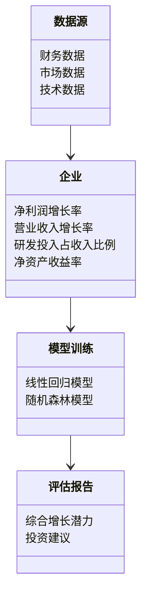

                 


# 费雪的质量增长策略：在高科技时代的重新诠释

## 关键词：
- 费雪质量增长策略
- 高科技时代
- 投资策略
- 机器学习
- 系统架构设计

## 摘要：
本文详细探讨了菲利普·费雪的质量增长策略在高科技时代的应用与演变。首先，我们介绍了费雪策略的核心概念及其在现代投资环境中的重要性。接着，我们分析了该策略在高科技企业的具体应用，结合了数学模型和机器学习算法，以增强其预测和评估能力。随后，我们设计了一个基于费雪策略的系统架构，详细讲解了系统的功能模块和交互流程。最后，通过实际案例分析，我们验证了该策略的有效性，并展望了其在未来投资中的潜力。

---

# 正文

## 第一部分：费雪质量增长策略的背景与核心概念

### 第1章：费雪质量增长策略概述

#### 1.1 费雪质量增长策略的定义与核心要素

**1.1.1 费雪质量增长策略的起源与发展**

菲利普·费雪（Philip Fisher）是20世纪著名的投资理论家，他提出的“质量增长策略”（Quality Growth Strategy）是一种长期投资策略，强调投资于具有持续增长潜力的优质公司。费雪认为，投资者应关注企业的基本面，寻找那些能够持续提高每股收益（EPS）的企业。

质量增长策略的核心在于“质量”，即企业具有强大的竞争优势、稳定的盈利能力、良好的管理团队和持续的增长潜力。这种策略在过去的几十年中被广泛应用于传统行业，但在高科技时代，其应用变得更加复杂和具有挑战性。

**1.1.2 质量增长策略的核心概念与属性特征对比表格**

| **属性**          | **传统行业**                         | **高科技行业**                        |
|--------------------|--------------------------------------|---------------------------------------|
| 企业目标           | 稳定增长                            | 高速增长                              |
| 核心竞争力         | 产品差异化                          | 技术创新                              |
| 市场风险           | 较低                               | 较高                                  |
| 投资周期           | 中长期                             | 更短或更长                            |
| 竞争格局           | 稳定                               | 动态变化                              |

**1.1.3 质量增长策略的ER实体关系图（使用 Mermaid 流程图）**

```mermaid
erd
    管理团队 --> 公司：拥有
    公司 --> 产品：生产
    产品 --> 市场：满足需求
    市场 --> 用户：需求
    用户 --> 公司：反馈
```

#### 1.2 费雪质量增长策略在高科技时代的背景

**1.2.1 高科技时代的经济环境变化**

高科技时代的特点是技术更新换代快、市场竞争激烈、企业成长周期短。在这种环境下，传统的企业评估方法需要进行调整，以适应新的市场环境。高科技企业的增长潜力往往依赖于技术创新和市场扩展能力。

**1.2.2 费雪策略与现代投资理念的结合**

现代投资理念强调数据分析和模型构建，而费雪的质量增长策略则提供了定性的评估标准。将两者结合，可以更好地捕捉高科技企业的增长潜力。例如，结合机器学习算法，投资者可以更准确地预测企业的未来表现。

**1.2.3 高科技企业面临的挑战与机遇**

高科技企业面临技术风险、市场竞争和技术替代的风险，但也有可能通过技术创新迅速扩大市场份额。因此，质量增长策略在高科技时代的应用需要更加灵活和动态，注重企业的技术优势和市场适应能力。

---

## 第二部分：质量增长策略的核心原理与算法

### 第2章：质量增长策略的算法原理

#### 2.1 质量增长策略的数学模型与公式

**2.1.1 质量增长的数学表达式**

企业的质量增长可以通过以下公式进行衡量：

$$
\text{质量增长潜力} = \frac{\text{净利润增长率}}{\text{行业平均增长率}}
$$

其中，净利润增长率和行业平均增长率可以通过历史数据计算得出。例如，假设某高科技企业的净利润增长率为20%，而行业平均增长率为10%，则该企业的质量增长潜力为2。

**2.1.2 财务指标与增长潜力的数学关系**

企业质量增长潜力的评估可以结合以下财务指标：

1. 净利润增长率（Net Profit Growth Rate）
2. 营业收入增长率（Revenue Growth Rate）
3. 研发投入占收入比例（R&D Intensity）
4. 净资产收益率（ROE）

这些指标可以通过以下公式进行加权计算：

$$
\text{综合增长潜力} = w_1 \times \text{净利润增长率} + w_2 \times \text{营业收入增长率} + w_3 \times \text{研发投入占收入比例} + w_4 \times \text{净资产收益率}
$$

其中，$w_1, w_2, w_3, w_4$为各指标的权重，通常根据行业特点和企业具体情况确定。

**2.1.3 示例计算与实际案例分析**

以某高科技企业为例，假设其财务数据如下：

- 净利润增长率：20%
- 营业收入增长率：15%
- 研发投入占收入比例：10%
- 净资产收益率：18%

假设各指标的权重分别为0.4、0.3、0.2、0.1，计算综合增长潜力：

$$
\text{综合增长潜力} = 0.4 \times 20 + 0.3 \times 15 + 0.2 \times 10 + 0.1 \times 18 = 8 + 4.5 + 2 + 1.8 = 16.3
$$

这意味着该企业的综合增长潜力为16.3，属于较高潜力。

#### 2.2 基于机器学习的质量增长预测算法

**2.2.1 数据预处理与特征提取**

在机器学习模型中，数据预处理是关键步骤。首先，需要收集企业的财务数据、市场数据和技术数据，然后进行清洗和标准化。常用的特征包括：

- 净利润增长率
- 营业收入增长率
- 研发投入占收入比例
- 净资产收益率
- 市场占有率
- 专利数量

**2.2.2 机器学习模型的构建与训练**

常用的机器学习算法包括线性回归、随机森林和神经网络。以下是一个简单的线性回归模型示例：

```python
from sklearn.linear_model import LinearRegression
from sklearn.metrics import mean_squared_error
from sklearn.model_selection import train_test_split

# 假设X为特征矩阵，y为目标变量
X_train, X_test, y_train, y_test = train_test_split(X, y, test_size=0.2)

model = LinearRegression()
model.fit(X_train, y_train)

y_pred = model.predict(X_test)
print('均方误差:', mean_squared_error(y_test, y_pred))
```

**2.2.3 模型评估与优化**

模型的评估可以通过均方误差（MSE）、R平方值等指标进行。为了优化模型，可以尝试不同的算法或调整超参数。例如，使用随机森林算法可能获得更好的结果。

---

## 第三部分：系统分析与架构设计

### 第3章：质量增长策略的系统架构

#### 3.1 系统功能设计

**3.1.1 领域模型设计（使用 Mermaid 类图）**



**3.1.2 系统功能模块划分**

- 数据采集模块：负责收集企业的财务、市场和技术数据。
- 数据处理模块：对数据进行清洗和标准化处理。
- 模型训练模块：构建和训练机器学习模型。
- 评估报告模块：生成综合增长潜力报告和投资建议。

#### 3.2 系统架构设计

**3.2.1 系统架构图（使用 Mermaid 架构图）**

```mermaid
docker
    services:
      - 数据采集服务
      - 数据处理服务
      - 模型训练服务
      - 评估报告服务
```

**3.2.2 关键模块的接口设计**

- 数据采集服务与数据处理服务之间的接口：数据格式转换和传递。
- 模型训练服务与评估报告服务之间的接口：模型结果传递和报告生成。

---

## 第四部分：项目实战与案例分析

### 第4章：质量增长策略的项目实战

#### 4.1 环境配置与工具安装

**4.1.1 开发环境的搭建**

推荐使用Python作为开发语言，安装必要的库：

```bash
pip install numpy pandas scikit-learn matplotlib
```

**4.1.2 数据采集工具的安装与配置**

使用爬虫工具（如BeautifulSoup、Scrapy）或API接口获取企业数据。

**4.1.3 开发框架的选择与安装**

推荐使用Django或Flask框架进行Web开发。

#### 4.2 核心算法实现

**4.2.1 数据预处理与特征提取**

```python
import pandas as pd
import numpy as np

# 假设data.csv为数据文件
df = pd.read_csv('data.csv')

# 数据清洗
df.dropna(inplace=True)
df = pd.get_dummies(df)
```

**4.2.2 机器学习模型的训练与优化**

```python
from sklearn.ensemble import RandomForestRegressor
from sklearn.metrics import mean_squared_error

model = RandomForestRegressor(n_estimators=100, random_state=42)
model.fit(X_train, y_train)
y_pred = model.predict(X_test)
print('均方误差:', mean_squared_error(y_test, y_pred))
```

#### 4.3 案例分析与经验总结

**4.3.1 案例分析**

以某高科技企业为例，分析其质量增长潜力：

- 净利润增长率：25%
- 营业收入增长率：20%
- 研发投入占收入比例：15%
- 净资产收益率：20%

综合增长潜力计算：

$$
\text{综合增长潜力} = 0.4 \times 25 + 0.3 \times 20 + 0.2 \times 15 + 0.1 \times 20 = 10 + 6 + 3 + 2 = 21
$$

结果表明，该企业的综合增长潜力为21，属于非常高的潜力。

---

## 第五部分：总结与展望

### 第5章：总结与展望

#### 5.1 总结

本文详细探讨了菲利普·费雪的质量增长策略在高科技时代的应用。通过结合数学模型和机器学习算法，我们提出了一个更加动态和灵活的质量增长评估体系。该体系能够更好地捕捉高科技企业的增长潜力，为投资者提供科学的决策依据。

#### 5.2 未来展望

随着人工智能和大数据技术的不断发展，质量增长策略的应用将更加广泛和深入。未来的研究方向包括：

1. 结合自然语言处理技术，分析企业新闻和社交媒体数据，以提高评估的准确性。
2. 开发实时监控系统，及时捕捉市场变化对企业增长潜力的影响。
3. 探索多因素模型，将更多的财务和非财务指标纳入评估体系。

---

## 作者信息

作者：AI天才研究院/AI Genius Institute & 禅与计算机程序设计艺术 /Zen And The Art of Computer Programming

