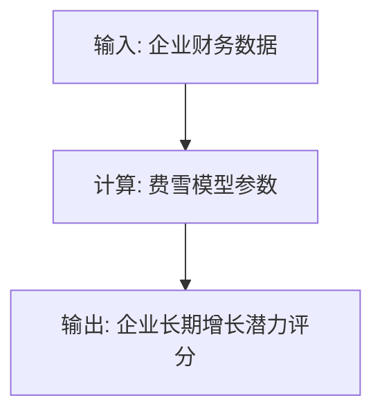
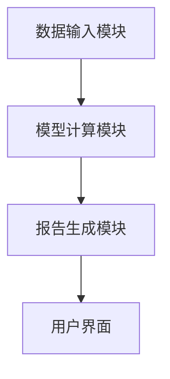
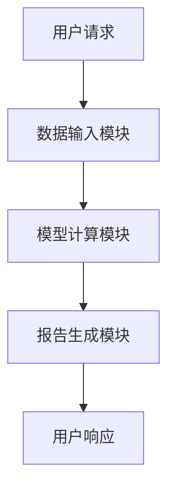

                 


# 费雪的长期增长潜力评估

## 关键词：费雪模型、长期增长潜力、企业价值评估、投资分析、金融建模、增长战略

## 摘要：  
本文深入探讨了费雪的长期增长潜力评估方法，从理论基础到实际应用，结合数学模型、算法原理和系统架构，详细解析了如何通过费雪模型评估企业的长期增长潜力。文章内容包括费雪模型的核心概念、算法流程、系统架构设计、项目实战案例以及最佳实践建议。

---

# 第1章: 长期增长潜力评估的背景与概念

## 1.1 长期增长潜力评估的重要性

### 1.1.1 企业价值评估的基石
- 企业价值的核心在于其未来的现金流。
- 长期增长潜力是决定企业价值的关键因素之一。
- 投资者关注的不仅是当前的盈利能力，更是未来的增长空间。

### 1.1.2 费雪模型的基本概念
- 费雪模型是一种用于评估企业长期增长潜力的金融模型。
- 通过分析企业的财务数据和市场环境，预测其未来的现金流和增长率。
- 费雪模型的核心假设：企业的现金流增长与市场增长率相关。

### 1.1.3 长期增长潜力的定义与特征
- 长期增长潜力是指企业在未来5-10年内的持续增长能力。
- 其特征包括：稳定的现金流增长、市场占有率提升、技术创新能力等。

## 1.2 费雪模型的核心要素

### 1.2.1 费雪模型的输入参数
- 当前现金流（CF）：企业的当前净利润或自由现金流。
- 市场增长率（g）：所在行业的市场增长率。
- 贴现率（r）：投资者要求的最低回报率。

### 1.2.2 费雪模型的输出结果
- 企业价值（V）：基于未来现金流的折现值。
- 长期增长潜力评分：基于市场增长率和企业现金流增长能力的综合评分。

## 1.3 长期增长潜力评估的边界与外延

### 1.3.1 适用场景
- 适用于成长型企业的估值。
- 适用于新兴行业的投资分析。
- 适用于企业战略规划中的增长潜力评估。

### 1.3.2 不适用场景
- 适用于周期性行业的短期波动分析，但不适用于周期性行业的长期增长潜力评估。
- 适用于中小型企业，但不适用于成熟行业的龙头企业。

## 1.4 本章小结
- 长期增长潜力评估是企业价值评估的重要组成部分。
- 费雪模型通过分析企业的现金流增长和市场增长率，帮助企业预测未来的增长潜力。

---

# 第2章: 费雪模型的原理与应用

## 2.1 费雪模型的核心理论

### 2.1.1 费雪模型的数学推导

$$ V = \frac{CF \times (1 + g)}{r - g} $$

其中：
- \( V \) 表示企业价值
- \( CF \) 表示当前现金流
- \( g \) 表示市场增长率
- \( r \) 表示贴现率

### 2.1.2 费雪模型的假设条件
- 市场增长率 \( g \) 是稳定的且可以预测的。
- 企业的现金流增长与市场增长率成正比。
- 贴现率 \( r \) 是固定的且合理的。

### 2.1.3 费雪模型的公式应用

$$ \text{长期增长潜力评分} = \frac{V}{\text{行业平均价值}} $$

---

## 2.2 费雪模型的算法原理

### 2.2.1 算法输入与输出
- 输入：企业的财务数据（净利润、现金流）、市场增长率、贴现率。
- 输出：企业价值、长期增长潜力评分。

### 2.2.2 费雪模型的算法流程图（Mermaid）



---

## 2.3 费雪模型的数学模型与公式

### 2.3.1 费雪模型的数学模型

$$ V = \frac{CF \times (1 + g)}{r - g} $$

其中：
- \( V \) 表示企业价值
- \( CF \) 表示当前现金流
- \( g \) 表示市场增长率
- \( r \) 表示贴现率

### 2.3.2 费雪模型的公式应用

$$ \text{长期增长潜力评分} = \frac{V}{\text{行业平均价值}} $$

---

## 2.4 费雪模型的实际应用

### 2.4.1 案例分析：某科技公司的长期增长潜力评估
- 输入数据：
  - 当前现金流（CF）：100万元
  - 市场增长率（g）：10%
  - 贴现率（r）：12%
- 计算结果：
  - 企业价值（V）= 100 × (1 + 0.10) / (0.12 - 0.10) = 550万元
  - 长期增长潜力评分 = 550 / 行业平均价值（假设行业平均价值为300万元）= 1.83

---

## 2.5 本章小结
- 费雪模型通过数学公式和算法流程，帮助企业预测长期增长潜力。
- 通过案例分析，展示了费雪模型的实际应用价值。

---

# 第3章: 长期增长潜力的评估方法

## 3.1 长期增长潜力的定量评估

### 3.1.1 财务指标分析
- 净利润增长率
- 营收增长率
- 自由现金流增长率

### 3.1.2 市场指标分析
- 市场增长率
- 市场份额
- 行业竞争格局

---

## 3.2 长期增长潜力的定性评估

### 3.2.1 企业战略分析
- 企业发展战略
- 创新能力
- 管理团队能力

### 3.2.2 行业环境分析
- 政策环境
- 技术进步
- 消费者需求变化

---

## 3.3 长期增长潜力的综合评估

### 3.3.1 综合评分模型
$$ \text{综合评分} = 0.6 \times \text{定量评分} + 0.4 \times \text{定性评分} $$

### 3.3.2 综合评分的应用
- 根据综合评分对企业进行分类：
  - 评分高于行业平均值：高增长潜力
  - 评分接近行业平均值：中等增长潜力
  - 评分低于行业平均值：低增长潜力

---

## 3.4 本章小结
- 长期增长潜力的评估需要结合定量和定性分析。
- 综合评分模型可以帮助投资者更好地判断企业的增长潜力。

---

# 第4章: 系统分析与架构设计

## 4.1 长期增长潜力评估系统的需求分析

### 4.1.1 系统目标
- 实现费雪模型的自动化计算。
- 提供长期增长潜力的综合评估报告。
- 支持多行业、多企业的批量分析。

### 4.1.2 系统功能需求
- 数据输入模块：支持用户输入企业财务数据、市场数据。
- 模型计算模块：基于费雪模型计算企业价值和长期增长潜力评分。
- 报告生成模块：生成详细的评估报告。

---

## 4.2 系统架构设计

### 4.2.1 系统架构图（Mermaid）



### 4.2.2 功能模块设计
- 数据输入模块：用户输入企业的财务数据和市场数据。
- 模型计算模块：基于费雪模型计算企业价值和长期增长潜力评分。
- 报告生成模块：生成详细的评估报告，包括数据可视化和评分结果。

---

## 4.3 系统接口设计

### 4.3.1 API接口设计
- 输入接口：REST API
- 输出接口：JSON格式

### 4.3.2 数据流图（Mermaid）



---

## 4.4 本章小结
- 系统架构设计为长期增长潜力评估提供了技术支持。
- 通过模块化设计，实现了系统的高效运行和功能扩展。

---

# 第5章: 项目实战与最佳实践

## 5.1 环境安装与配置

### 5.1.1 安装Python环境
- 安装Python 3.8及以上版本
- 安装必要的库：pandas、numpy、matplotlib

### 5.1.2 安装Jupyter Notebook
- 通过Anaconda安装

---

## 5.2 核心代码实现

### 5.2.1 数据处理代码

```python
import pandas as pd
import numpy as np

# 输入数据
cf = 100  # 当前现金流
g = 0.1  # 市场增长率
r = 0.12  # 贴现率

# 计算企业价值
v = cf * (1 + g) / (r - g)
print("企业价值：", v)
```

### 5.2.2 模型计算代码

```python
# 计算长期增长潜力评分
industry_avg = 300  # 行业平均价值
growth_score = v / industry_avg
print("长期增长潜力评分：", growth_score)
```

---

## 5.3 项目实战案例分析

### 5.3.1 案例分析：某科技公司

- 输入数据：
  - 当前现金流（CF）：100万元
  - 市场增长率（g）：10%
  - 贴现率（r）：12%
- 计算结果：
  - 企业价值（V）= 550万元
  - 长期增长潜力评分 = 1.83

---

## 5.4 最佳实践 tips

### 5.4.1 数据质量的重要性
- 数据的准确性和完整性直接影响评估结果。
- 建议使用多个数据源进行交叉验证。

### 5.4.2 模型假设的合理性
- 模型假设需要与企业的实际情况相符。
- 定期更新模型假设以适应市场变化。

### 5.4.3 结果解读的客观性
- 长期增长潜力评分仅供参考，需结合实际情况进行判断。
- 建议将评分结果与行业专家意见结合。

---

## 5.5 本章小结
- 通过项目实战，展示了费雪模型的实际应用价值。
- 最佳实践 tips为投资者提供了实用的建议。

---

# 第6章: 总结与展望

## 6.1 本章总结

- 费雪模型通过数学公式和算法流程，帮助企业预测长期增长潜力。
- 长期增长潜力评估需要结合定量和定性分析。
- 系统架构设计为长期增长潜力评估提供了技术支持。

## 6.2 未来展望

- 随着人工智能和大数据技术的发展，长期增长潜力评估将更加智能化和精准化。
- 未来的研究方向：
  - 结合机器学习技术，提高模型的预测精度。
  - 开发更多的行业模型，适应不同行业的特点。

---

## 作者：AI天才研究院/AI Genius Institute & 禅与计算机程序设计艺术 /Zen And The Art of Computer Programming

