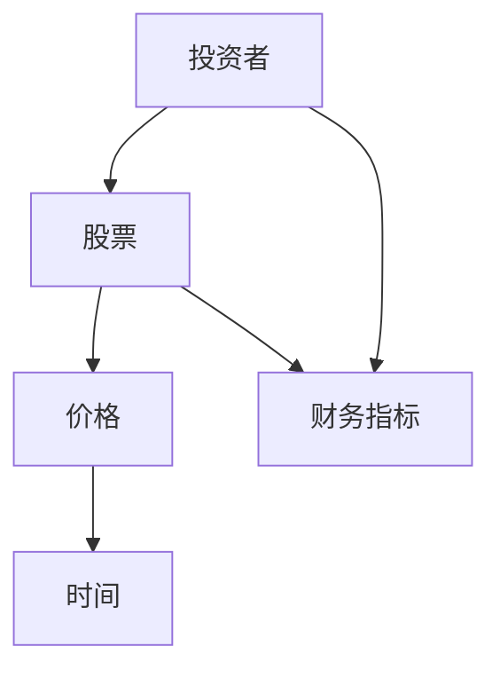
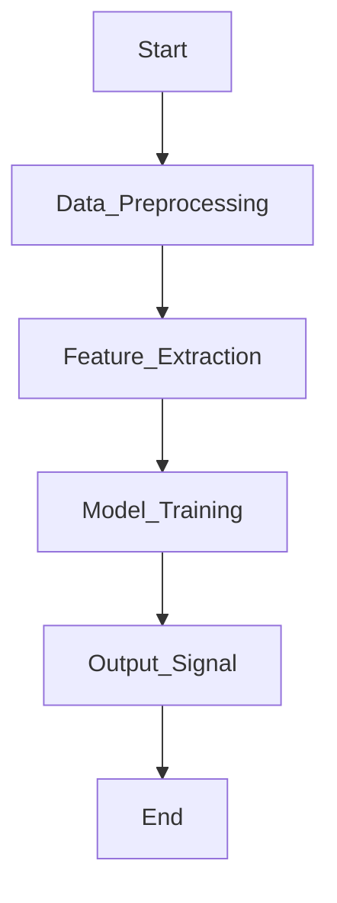
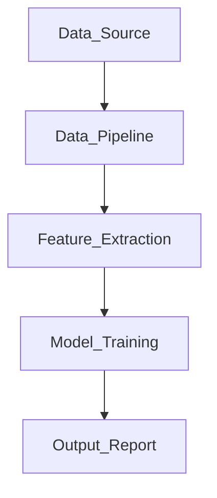

                 


# 费雪的长期持股策略

> 关键词：长期持股策略，费雪投资模型，价值投资，成长投资，股票分析

> 摘要：费雪的长期持股策略是一种基于深度基本面分析的投资方法，强调长期持有优质股票，通过复利效应实现财富增长。本文从技术分析的角度，详细阐述了费雪策略的核心概念、算法原理、数学模型、系统架构，并通过项目实战和最佳实践，为投资者提供了一套完整的长期持股策略的技术实现方案。

---

## 第一部分：背景介绍

### 第1章：长期持股策略的背景与重要性

#### 1.1 问题背景
- 投资市场的核心问题在于如何在不确定性和波动性中实现长期稳健的收益。传统的短期交易策略依赖于市场情绪和高频交易，风险高且难以持续。而长期持股策略通过精选优质资产，减少交易成本和心理干扰，为投资者提供了更稳定的投资路径。
- 费雪策略的起源可以追溯到20世纪，其核心思想是通过深入研究企业的基本面，选择具有持续竞争优势和成长潜力的公司，长期持有，等待复利效应的积累。

#### 1.2 费雪策略的定义与特点
- 费雪策略是一种基于价值投资的长期持股策略，强调买入优质企业的股票，并长期持有，避免频繁交易。
- 其特点包括：深度基本面分析、注重企业竞争优势、长期持有、分散投资、定期再平衡。

#### 1.3 费雪策略的适用场景
- 适合长期投资者，尤其是那些能够承受市场短期波动、追求长期稳健收益的投资者。
- 适合对基本面分析感兴趣的技术人员，可以通过编程实现数据处理和策略优化。

#### 1.4 本章小结
- 长期持股策略的核心在于通过时间复利效应实现财富增长，而费雪策略提供了具体的操作方法和理论框架。

---

## 第二部分：核心概念与联系

### 第2章：费雪策略的核心概念

#### 2.1 费雪策略的核心模型
- 费雪模型的核心在于对企业基本面的深入分析，包括财务指标（如ROE、毛利率、净利润增长率）和行业地位（如市场占有率、竞争优势）。
- 模型结构包括数据输入、特征提取、模型评估和策略输出四个部分。

#### 2.2 费雪策略与相关概念的对比
- **与价值投资的对比**：两者都强调企业基本面，但价值投资更关注价格与价值的偏离，而费雪策略更注重企业的成长性和竞争优势。
- **与成长投资的对比**：成长投资侧重于高增长企业，而费雪策略更强调企业的可持续成长和竞争优势。
- **与技术分析的对比**：技术分析依赖价格和成交量的信号，而费雪策略基于基本面分析，两者结合可以形成更全面的投资策略。

#### 2.3 费雪策略的ER实体关系图


#### 2.4 本章小结
- 费雪策略的核心概念在于对企业基本面的深入分析，结合长期持有和复利效应，实现稳健的投资收益。

---

## 第三部分：算法原理讲解

### 第3章：费雪策略的算法原理

#### 3.1 算法流程概述
- 数据预处理：清洗和标准化股票数据。
- 特征提取：提取财务指标和市场数据。
- 模型训练：基于特征构建投资决策模型。
- 结果输出：生成投资信号和仓位分配。

#### 3.2 费雪策略的算法流程图


#### 3.3 算法实现代码
```python
def fisher_strategy(data):
    # 数据预处理
    data = data.dropna()
    data = data[['close', 'open', 'high', 'low', 'volume']]
    
    # 特征提取
    data['rsi'] = ta.RSI(data['close'], window=14)
    data['macd'] = ta.MACD(data['close'])
    
    # 模型训练
    X = data[['rsi', 'macd']]
    y = data['close'].pct_change().shift(-1).fillna(0)
    
    model = LinearRegression()
    model.fit(X, y)
    
    # 结果输出
    predictions = model.predict(X)
    data['signal'] = np.where(predictions > 0, 1, -1)
    
    return data
```

#### 3.4 算法的数学模型
- **相对强弱指数（RSI）**：
  $$ RSI = \frac{\sum_{i=1}^{n} \text{上涨幅度}}{\sum_{i=1}^{n} \text{下跌幅度}} $$
- **移动平均收敛散度（MACD）**：
  $$ MACD = \text{短期EMA} - \text{长期EMA} $$

#### 3.5 本章小结
- 费雪策略的算法实现依赖于数据预处理、特征提取和模型训练，最终生成投资信号。

---

## 第四部分：数学模型与公式

### 第4章：费雪策略的数学模型

#### 4.1 收益计算公式
- **简单收益**：
  $$ R = \frac{P_{t+1}}{P_t} - 1 $$
- **复利收益**：
  $$ R_{\text{total}} = \prod_{i=1}^{n} (1 + R_i) - 1 $$

#### 4.2 风险评估公式
- **最大回撤**：
  $$ \text{最大回撤} = \max_{t} \left( \max_{s \leq t} P_s \right) - P_t $$
- **夏普比率**：
  $$ \text{夏普比率} = \frac{\mu - R_f}{\sigma} $$

#### 4.3 本章小结
- 费雪策略的数学模型为投资者提供了收益和风险的量化工具，帮助优化投资决策。

---

## 第五部分：系统分析与架构设计

### 第5章：系统架构设计

#### 5.1 问题场景介绍
- **问题场景**：投资者需要一个基于费雪策略的长期持股系统，实现数据采集、策略制定和结果输出。
- **系统目标**：构建一个高效、稳定的长期持股策略系统，支持多资产配置和风险控制。

#### 5.2 系统功能设计
- **数据采集模块**：负责收集股票数据和市场信息。
- **特征提取模块**：提取财务指标和市场指标。
- **模型训练模块**：构建并训练投资模型。
- **结果输出模块**：生成投资信号和报告。

#### 5.3 系统架构图


#### 5.4 本章小结
- 系统架构设计为费雪策略的实现提供了清晰的框架，支持模块化开发和扩展。

---

## 第六部分：项目实战

### 第6章：费雪策略的项目实战

#### 6.1 环境安装
- 需要安装Python、Pandas、NumPy、TA-Lib等库。

#### 6.2 核心代码实现
```python
import pandas as pd
import numpy as np
import talib as ta
from sklearn.linear_model import LinearRegression

def fisher_strategy(data):
    data = data.dropna()
    data['rsi'] = ta.RSI(data['close'], timeperiod=14)
    data['macd'], data['macdhist'], data['macdsignal'] = ta.MACD(data['close'], fastperiod=12, slowperiod=26, signalperiod=9)
    X = data[['rsi', 'macd']]
    y = data['close'].pct_change().shift(-1).fillna(0)
    model = LinearRegression()
    model.fit(X, y)
    predictions = model.predict(X)
    data['signal'] = np.where(predictions > 0, 1, -1)
    return data
```

#### 6.3 代码功能解读
- **数据预处理**：清洗数据，提取收盘价。
- **特征提取**：计算RSI和MACD指标。
- **模型训练**：使用线性回归模型预测收益。
- **结果输出**：生成买卖信号。

#### 6.4 案例分析
- 以某只股票为例，展示策略在实际中的应用，分析信号生成和收益情况。

#### 6.5 本章小结
- 项目实战部分通过代码实现和案例分析，展示了费雪策略的实际应用。

---

## 第七部分：最佳实践

### 第7章：费雪策略的最佳实践

#### 7.1 小结
- 费雪策略的核心在于长期持有优质资产，通过复利效应实现财富增长。

#### 7.2 注意事项
- **风险控制**：设置止损和止盈，避免重大损失。
- **模型优化**：根据市场变化调整模型参数。
- **持续学习**：关注市场动态，优化投资策略。

#### 7.3 拓展阅读
- 推荐相关书籍和资源，帮助读者深入学习长期持股策略。

---

## 作者

作者：AI天才研究院/AI Genius Institute & 禅与计算机程序设计艺术/Zen And The Art of Computer Programming

---

通过以上思考过程，我们系统地分析了费雪的长期持股策略，并从技术角度详细阐述了其核心概念、算法原理、数学模型和系统架构，为投资者和技术爱好者提供了深入的技术博客内容。

