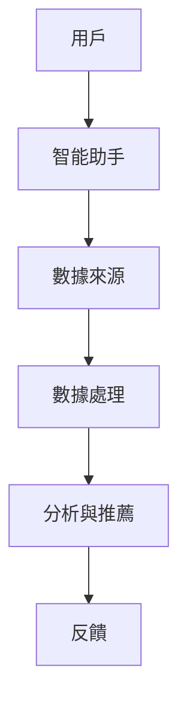
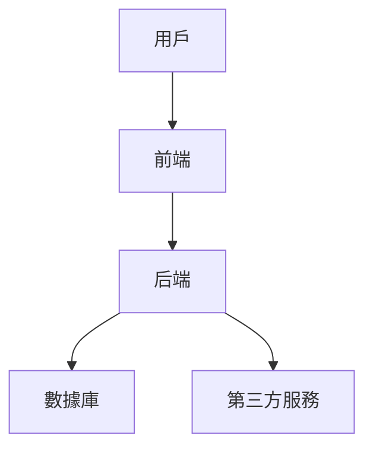

                 


# 跨平台投資理財智能助手的開發技巧

> **关键词**：跨平台开发, 投资理财, 人工智能, 系统架构, 智能助手

> **摘要**：本文详细探讨跨平台投资理财智能助手的开发技巧，涵盖跨平台开发的核心概念、人工智能技术的应用、系统架构设计、算法实现以及项目实战等内容。通过理论与实践相结合的方式，帮助读者掌握开发跨平台投资理财智能助手的关键技术。

---

## 第1章: 背景介紹

### 1.1 投資理財行業的挑戰與機遇

#### 1.1.1 投資理財行業的現狀與問題
- **投資理財行業的現狀**：隨著金融市場的複雜化，投資者面臨著信息過載、市場波動大等挑戰。
- **主要問題**：
  1. 理財產品選擇困難。
  2. 市場數據繁多，難以快速分析。
  3. 缺乏個性化的理財建議。

#### 1.1.2 人工智能在投資理財中的潛力
- **人工智能的核心作用**：
  1. 自動化數據分析。
  2. 精准用戶畫像。
  3. 智能推薦理財方案。

#### 1.1.3 跨平台智能助手的必要性
- **跨平台的意義**：
  1. 覆蓋多平台用戶，提高用戶觸達率。
  2. 提供一致的用户体验。

---

## 第2章: 核心概念與技術原理

### 2.1 跨平台技術原理

#### 2.1.1 跨平台技術的實現方式
- **跨平台技術的分類**：
  1. 本機碼共享：如 Flutter。
  2. 虛擬機執行：如 Java 和 Kotlin。

#### 2.1.2 不同平台的特性對比

| 平台     | 特性                              | 語言        |
|----------|-----------------------------------|-------------|
| iOS      | 高性能， Cupertino控件          | Swift, Objective-C |
| Android  | 開源，Material Design控件        | Java, Kotlin |
| Web      | 即時可用，HTML/CSS/JavaScript    | JavaScript   |
| Windows  | 广泛應用，.xaml資源             | C#, VB.NET   |

#### 2.1.3 跨平台架構設計
- **通用架構**：
  - **前端**：跨平台组件，如 Flutter 的Widget。
  - **后端**：共享業務邏輯，如 Node.js 或 Spring Boot。

### 2.2 人工智能在投資理財中的核心技術

#### 2.2.1 機器學習的基本原理
- **機器學習的三要素**：
  1. 數據。
  2. 模型。
  3. 擬合策略。

#### 2.2.2 自然語言處理的應用
- **NLP的核心技術**：
  - 關鍵詞抽取。
  - 情感分析。

#### 2.2.3 算法選擇與優化
- **算法選擇**：
  - 分類問題：使用 logistic regression 或 SVM。
  - 回歸問題：使用 linear regression 或 RandomForest。

---

## 第3章: 算法原理與實現

### 3.1 常見算法介紹

#### 3.1.1 決策樹算法
- **決策樹的優點**：
  - 解釋性強。
  - 適用於分類和 regression。

#### 3.1.2 隨機森林算法
- **隨機森林的核心思想**：
  - 使用多棵決策樹，降低 overfitting。

#### 3.1.3 確率模型
- **概率模型的應用**：
  - 预測市場走勢的概率。

### 3.2 算法實現步驟

#### 3.2.1 數據預處理
- **數據清洗**：
  1. 去除缺失值。
  2. 标准化數據。

#### 3.2.2 模型訓練
- **訓練步驟**：
  1. 划分訓練集和測試集。
  2. 選擇算法並訓練。

#### 3.2.3 模型評估與優化
- **評估指標**：
  1. 精准率 (Precision)。
  2. 召回率 (Recall)。

---

## 第4章: 系統分析與架構设计方案

### 4.1 系統功能設計

#### 4.1.1 功能模塊
- **用戶管理**：
  - 注册。
  - 登录。
- **數據采集**：
  - 經濟指標數據。
  - 股票數據。
- **數據分析**：
  - 趋勢分析。
  - 预測模型。

#### 4.1.2 系統架構圖


### 4.2 系統架構設計

#### 4.2.1 系統架構圖


#### 4.2.2 接口設計
- **RESTful API**：
  - `/api/v1/users/register`。
  - `/api/v1/analysis/predict`。

---

## 第5章: 項目實戰

### 5.1 環境安裝與配置

#### 5.1.1 安裝React Native
```bash
npm install -g react-native-cli
```

#### 5.1.2 安裝Node.js
```bash
curl -fsSL https://rpm.nodesource.com/setup.js | sudo -E bash -
sudo yum install nodejs
```

### 5.2 核心功能實現

#### 5.2.1 數據采集
```javascript
const fetch = require('node-fetch');

async function fetchStockData(symbol) {
    const response = await fetch(`https://api.example.com/stock/${symbol}`);
    const data = await response.json();
    return data;
}
```

#### 5.2.2 資料分析
```javascript
const model = require('./models/decisionTreeModel');

function analyzeData(data) {
    return model.predict(data);
}
```

### 5.3 案例分析
- **案例：股票預測**
  - 使用決策樹算法，根據 historical data 預測股價走勢。

---

## 第6章: 最佳實踐與小結

### 6.1 最佳實踐 Tips
1. **數據安全**：保障用戶數據隱私。
2. **性能優化**：降低響應時間。
3. **持續學習**：更新模型以適應市場變化。

### 6.2 小結
- 跨平台開發結合人工智能，能有效提升投資理財智能助手的性能和用戶體驗。
- 需要從數據采集、模型訓練到系統架構的全過程綜合考慮。

### 6.3 注意事项
- **數據質量**：數據源的可靠性至關重要。
- **模型可解釋性**：確保模型結果可被用戶理解。

### 6.4 拓展閱讀
- 《深度學習入門》。
- 《Flutter開發手冊》。

---

**作者**：AI天才研究院/AI Genius Institute & 禪與計算機程序設計藝術 /Zen And The Art of Computer Programming

