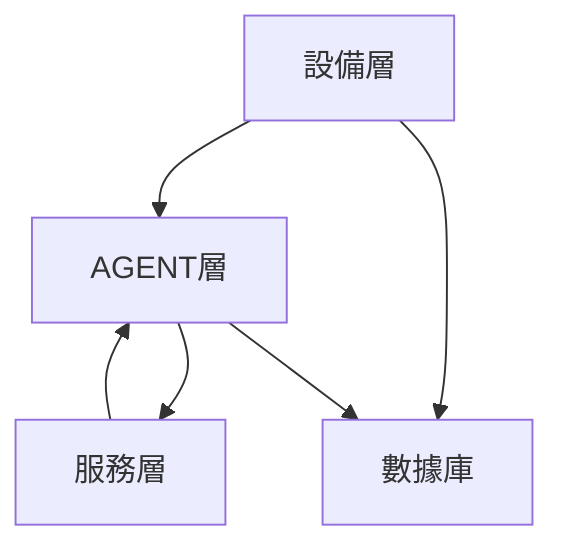

                 


# 跨設備AI Agent：LLM在物聯網環境中的部署

## 关键词：跨设备AI Agent, LLM, 物联网, 分布式计算, 人工智能, 大语言模型

## 摘要：  
随着物联网技术的快速发展，跨设备AI Agent的部署变得越来越重要。本文详细探讨了如何在物联网环境中部署大语言模型（LLM），并分析了其在跨设备环境中的应用挑战与解决方案。通过结合理论与实践，本文为读者提供了从概念理解、算法原理到系统实现的全面指南，帮助读者更好地理解和应用跨设备AI Agent技术。

---

# 第1章: 物聯網與大語言模型概述

## 1.1 物聯網的基本概念

### 1.1.1 物联 網的基本概念與發展歷程  
物聯網（Internet of Things, IoT）是指通過各種信息傳感設備，如感測器、無線通訊技術等，將物理世界中的設備、物品與互聯網緊密結合起來的網絡。物聯網的發展歷程可以分為三個階段：  
1. **初期階段**：簡單的設備連接與數據采集。  
2. **发展阶段**：設備之間的數據交互與初步智能化。  
3. **成熟階段**：設備智能化、數據深度分析與AI技術的結合。  

物聯網的核心在于實現設備之間的智能交互，而這一點正是跨設備AI Agent的出發點。

### 1.1.2 物聯網的核心技術與應用場景  
物聯網的核心技術主要包括：  
- **感測器技術**：用于采集物理世界中的數據。  
- **無線通信技術**：如Wi-Fi、蓝牙、NB-IoT等，實現設備之間的數據傳輸。  
- **數據處理技術**：包括數據存儲、分析與挖掘。  

物聯網的應用場景極為廣泛，包括智能家電、智慧城市、工業物聯網（IIoT）、智能醫療等。

### 1.1.3 物聯網環境中的數據處理特點  
物聯網環境中的數據處理具有以下特點：  
- **大規模**：海量設備產生巨量數據。  
- **多樣性**：數據來源多樣，格式多樣。  
- **實時性**：數據處理需要快速響應。  
- **分布式**：數據分布在多個設備中，需進行分布式處理。  

---

## 1.2 大語言模型的基本概念

### 1.2.1 大語言模型的定義與技術背景  
大語言模型（Large Language Model, LLM）是指基於深度學習技術訓練的大型語言模型，例如GPT、BERT等。這些模型具有億級的參數數量，能夠理解和生成人類語言，並在各種自然語言處理任務中表现出色。

大語言模型的技術背景包括：  
1. **深度學習的進展**：受益於深度學習技術的突破，大語言模型的性能飛速提升。  
2. **計算能力的提升**：大規模並行計算能力的提升使得訓練大模型成為可能。  
3. **數據的豐富性**：海量的數據為模型訓練提供了充足的養分。  

### 1.2.2 大語言模型的核心技術與實現原理  
大語言模型的核心技術包括：  
- ** transformer架構**：目前主流的模型基本上都基於transformer架構，具有並行計算效率高、語義理解能力強等特點。  
- **基於.reward的訓練**：通過最大化條件概率來學習語言模型。  
- **預訓練與微調**：首先在通用語料庫上進行預訓練，然後在特定任務上進行微調。  

### 1.2.3 大語言模型在各行各業中的應用案例  
大語言模型在各行各業中有廣泛的應用，例如：  
- **客戶服務**：智能客服chatbot，實現自動對話。  
- **醫療健康**：病情分析、藥物推薦。  
- **金融服務**：風險評估、金融新聞分析。  
- **教育**：智能輔導系統、自動作業評分。  

---

## 1.3 跨設備AI Agent的定義與特性

### 1.3.1 跨設備AI Agent的定義  
跨設備AI Agent是指能夠在不同設備之間協作、共享數據並執行任務的智能代理。這些設備可以是智能手機、筆記本電腦、智能家電等，Agent之間通過通信協議進行數據交互。

### 1.3.2 跨設備AI Agent的核心特性  
跨設備AI Agent具有以下核心特性：  
- **分布式**：Agent分佈在多個設備上，通過通信進行交互。  
- **智能性**：Agent能夠自主學習和決策。  
- **協作性**：Agent之間能夠協調合作，完成複雜任務。  
- **可擴展性**：Agent系統能夠根據需求進行擴展。  

### 1.3.3 跨設備AI Agent的優勢與挑戰  
跨設備AI Agent的優勢包括：  
- **資源共享**：Agent可以共享設備資源，提高效率。  
- **任務協作**：多個Agent可以共同完成一項複雜任務。  

其挑戰包括：  
- **通信 delay**：設備之間的通信可能存在時延。  
- **數據同步**：多設備之間需要實時同步數據，否則會影響任務執行。  
- **安全與隱私**：數據在設備之間傳遞可能存在安全風險。  

---

## 1.4 本章小結  
本章從物聯網和大語言模型的基本概念入手，介紹了物聯網的核心技術、數據處理特點以及大語言模型的技術背景和應用場景。最後，提出了跨設備AI Agent的概念，分析了其核心特性與優勢挑戰。這些內容為後續章節的展開奠定了理論基礎。

---

# 第2章: 跨設備AI Agent的核心概念與原理

## 2.1 跨設備AI Agent的背景介紹  

### 2.1.1 物聯網環境中AI Agent的需求背景  
物聯網環境中，設備的數量極大，設備之間的交互需求日益增加。為了實現設備之間的智能協作，需要引入AI Agent來幫助設備進行數據交互和任務執行。

### 2.1.2 跨設備通信的必要性  
在物聯網環境中，設備分佈在不同的地方，設備之間需要進行通信。通信的目的是為了共享數據、協調任務執行。跨設備通信的實現需要依靠通信協議和通信技術。

### 2.1.3 LLM在跨設備環境中的應用價值  
大語言模型在跨設備環境中具有廣泛的應用價值。例如：  
- **智能家電**：不同家電之間的語音控制與交互。  
- **智能城市**：城市中各種設備的智能協調。  
- **工業物聯網**：設備之間的智能協作與數據分析。  

---

## 2.2 跨設備AI Agent的核心概念  

### 2.2.1 跨設備數據交互的模型  
跨設備數據交互的模型包括：  
- **設備層**：設備之間的數據傳輸。  
- **Agent層**：Agent之間的數據交互。  
- **服務層**：提供數據存儲與分析服務。  

### 2.2.2 跨設備通信的協議與標準  
跨設備通信的協議與標準包括：  
- **ZigBee**：常見於智能家居設備。  
- **MQTT**：輕量級的Pub/Sub通信協議。  
- **CoAP**：用於物聯網設備的HTTP輕量級版本。  

### 2.2.3 跨設備AI Agent的分布式架構  
跨設備AI Agent的分布式架構包括：  
- **client-server架構**：Agent作為client向server請求數據。  
- **peer-to-peer架構**：Agent之間直接通信。  

---

## 2.3 跨設備AI Agent的原理分析  

### 2.3.1 跨設備數據同步的算法  
跨設備數據同步的算法包括：  
- **essim algorithm**：基於индексного метода同步算法。  
- **atu橢圓算法**：基於時間戳的同步算法。  

### 2.3.2 跨設備模型分發的機制  
跨設備模型分發的機制包括：  
- **全量分發**：將完整的模型分發給所有設備。  
- **差量更新**：只分發模型的增量部分。  

### 2.3.3 跨設備任務調度的策略  
跨設備任務調度的策略包括：  
- **集中式調度**：由中心控制器進行任務分配。  
- **分布式調度**：各設備根據本地資源情況自主調度。  

---

## 2.4 本章小結  
本章主要介紹了跨設備AI Agent的核心概念與原理，包括背景介紹、核心概念、通信協議與模型分發機制等。這些內容為後續章節的算法實現與系統設計提供了理論支持。

---

# 第3章: 跨設備AI Agent的算法原理與實現  

## 3.1 跨設備AI Agent的算法原理  

### 3.1.1 分布式計算的基本原理  
分布式計算的基本原理包括：  
- **任務分片**：將任務分為多個子任務，分散到不同的設備上執行。  
- **結果聚合**：將子任務的結果聚合起來，得到最終的任務結果。  

### 3.1.2 跨設備數據同步的算法  
跨設備數據同步的算法包括：  
- **essim算法**：基於индексного метода同步算法。  
- **atu橢圓算法**：基於時間戳的同步算法。  

### 3.1.3 跨設備模型分發的算法  
跨設備模型分發的算法包括：  
- **全量分發**：將完整的模型分發給所有設備。  
- **差量更新**：只分發模型的增量部分。  

---

## 3.2 跨設備AI Agent的通信協議  

### 3.2.1 跨設備通信的協議選擇  
跨設備通信的協議選擇包括：  
- **MQTT**：輕量級的Pub/Sub通信協議。  
- **CoAP**：用於物聯網設備的HTTP輕量級版本。  

### 3.2.2 跨設備通信的數據格式  
跨設備通信的數據格式包括：  
- **JSON**：輕量級數據交換格式。  
- **XML**：可擴展的 markup language。  

### 3.2.3 跨設備通信的安全性保障  
跨設備通信的安全性保障包括：  
- **數字簽名**：確保數據來源的真實性。  
- **加密傳輸**：確保數據傳輸的安全性。  

---

## 3.3 跨設備AI Agent的分布式架構  

### 3.3.1 分布式架構的設計原理  
分布式架構的設計原理包括：  
- **模塊化設計**：將功能分為獨立的模塊。  
- **異構設備支持**：支持不同類型的設備。  

### 3.3.2 分布式架構的實現技術  
分布式架構的實現技術包括：  
- **远程方法調用（RPC）**：實現設備之間的方法調用。  
- **消息隊列（MQ）**：實現設備之間的消息傳遞。  

### 3.3.3 分布式架構的優勢與局限  
分布式架構的優勢包括：  
- **高擴展性**：系統可以根據需求進行擴展。  
- **高可用性**：單點故障的可能性降低。  

其局限包括：  
- **通信時延**：設備之間的通信可能存在時延。  
- **數據同步**：多設備之間的數據同步可能需要額外的處理。  

---

## 3.4 本章小結  
本章詳細介紹了跨設備AI Agent的算法原理與實現，包括分布式計算的基本原理、通信協議與數據格式、分布式架構的設計與實現等。這些內容為後續章節的系統設計與項目實踐奠定了基礎。

---

# 第4章: 跨設備AI Agent的系統架構與設計  

## 4.1 系統架構設計  

### 4.1.1 系統架構的總體設計  
跨設備AI Agent的系統架構設計包括：  
- **設備層**：智能家電、傳感器等設備。  
- **Agent層**：跨設備AI Agent。  
- **服務層**：提供數據存儲與分析服務。  

### 4.1.2 系統架構的模塊劃分  
跨設備AI Agent的系統架構模塊劃分包括：  
- **數據采集模塊**：負責采集設備數據。  
- **數據同步模塊**：負責設備之間的數據同步。  
- **任務調度模塊**：負責任務的調度與分配。  

### 4.1.3 系統架構的交互流程  
跨設備AI Agent的系統架構交互流程包括：  
1. **數據采集**：設備采集數據並傳送給Agent。  
2. **數據同步**：Agent之間進行數據同步。  
3. **任務調度**：Agent根據任務需求調度設備資源。  
4. **數據分析**：Agent對數據進行分析並返回結果。  

---

## 4.2 系統功能設計  

### 4.2.1 系統功能總體介紹  
跨設備AI Agent的系統功能總體介紹包括：  
- **設備管理**：設備註冊、設備控制等。  
- **數據同步**：設備之間的數據同步與共享。  
- **任務執行**：Agent根據需求執行任務。  

### 4.2.2 系統功能的具體實現  
跨設備AI Agent的系統功能具體實現包括：  
- **設備管理**：通過MQTT協議實現設備的註冊與控制。  
- **數據同步**：基於essim算法實現設備之間的數據同步。  
- **任務執行**：基於分布式架構實現任務的調度與執行。  

---

## 4.3 系統架構的mermaid圖  



---

## 4.4 本章小結  
本章介紹了跨設備AI Agent的系統架構與設計，包括架構設計、模塊劃分、交互流程等。通過mermaid圖，清晰地展示了系統的架構與各模塊之間的交互關係。

---

# 第5章: 跨設備AI Agent的項目實戰  

## 5.1 環境安裝  

### 5.1.1 操作系統安裝  
跨設備AI Agent的項目實戰環境安裝包括：  
- **Linux**：推薦使用Ubuntu 22.04。  
- **Windows**：推薦使用Windows 10或更高版本。  

### 5.1.2 開發工具安裝  
跨設備AI Agent的開發工具安裝包括：  
- **Python**：安裝最新版本的Python。  
- **Python庫**：安裝paho-mqtt、requests等庫。  

---

## 5.2 系統核心實現源代碼  

### 5.2.1 跨設備數據同步的實現  
跨設備數據同步的實現代碼如下：

```python
import paho.mqtt.client as mqtt
import json
from datetime import datetime

# 定義設備ID
DEVICE_ID = "Device1"

# 定義broker地址
BROKER_ADDRESS = "localhost"

# 定義主題
TOPIC = "iot-agent/sync"

# 初始化mqtt客戶端
client = mqtt.Client(DEVICE_ID)

# 連接broker
client.connect(BROKER_ADDRESS)

# 發佈數據
def sync_data():
    # 生成同步數據
    data = {
        "device_id": DEVICE_ID,
        "timestamp": datetime.now().isoformat(),
        "status": "sync"
    }
    # 發佈消息
    client.publish(TOPIC, json.dumps(data), qos=1)
    print(f"{DEVICE_ID} - Data synced at {datetime.now()}")

# 保持連接
client.loop_start()
sync_data()
client.loop_stop()
client.disconnect()
```

### 5.2.2 跨設備模型分發的實現  
跨設備模型分發的實現代碼如下：

```python
import os
import json
import requests

# 定義模型版本
MODEL_VERSION = "1.0.0"

# 定義broker地址
BROKER_ADDRESS = "localhost"

# 定義主題
TOPIC = "iot-agent/model"

# 初始化mqtt客戶端
client = mqtt.Client("Model_Distributor")

# 連接broker
client.connect(BROKER_ADDRESS)

# 發佈模型數據
def distribute_model():
    # 加載模型數據
    model_data = {
        "model_version": MODEL_VERSION,
        "model_weights": os.urandom(1024)
    }
    # 發佈消息
    client.publish(TOPIC, json.dumps(model_data), qos=1)
    print(f"Model Distributor - Model {MODEL_VERSION} distributed at {datetime.now()}")

# 保持連接
client.loop_start()
distribute_model()
client.loop_stop()
client.disconnect()
```

---

## 5.3 代碼應用解讀與分析  

### 5.3.1 跨設備數據同步的代碼解讀  
跨設備數據同步的代碼實現了設備之間的數據同步功能。設備通過mqtt客戶端連接broker，並通過_TOPIC發布數據。數據中包含設備ID、時間戳和同步狀態。

### 5.3.2 跨設備模型分發的代碼解讀  
跨設備模型分發的代碼實現了模型數據的分發功能。模型數據包括模型版本和模型權重。設備通過mqtt客戶端連接broker，並通過_TOPIC發布模型數據。

---

## 5.4 案例分析與詳細解說  

### 5.4.1 案例分析  
假設我們有一個智能家居系統，包含智能燈泡、智能插座等設備。這些設備之間需要進行數據同步與模型分發，以實現智能控制。  

### 5.4.2 詳細解說  
在智能家居系統中，智能燈泡設備會定期同步數據，確保所有設備的數據一致。模型分發則用於設備之間共享最新的模型權重，以實現更好的智能控制。

---

## 5.5 本章小結  
本章通過具體的代碼實現，展示了跨設備AI Agent在項目實戰中的具體應用。通過mqtt協議實現了設備之間的數據同步與模型分發，並通過案例分析與詳細解說，幫助讀者更好地理解和應用這些技術。

---

# 第6章: 最佳實踐、小結、注意事項與拓展閱讀  

## 6.1 最佳實踐  

### 6.1.1 溝通協議的選擇  
在選擇通信協議時，需要根據具體需求選擇合適的協議。例如，對於輕量級的數據傳輸，MQTT是更好的選擇；對於需要可靠傳輸的場景，HTTP可能是更合適的選擇。  

### 6.1.2 模型分發的策略  
模型分發的策略需要根據具體場景選擇。對於數據敏感的場景，推薦使用差量更新，以降低數據傳輸量和數據泄露風險。  

### 6.1.3 数据同步的策略  
數據同步的策略需要根據具體需求選擇。對於實時性要求高的場景，推薦使用基於時間戳的同步算法；對於離線場景，推薦使用essim算法。  

---

## 6.2 小結  
本章總結了跨設備AI Agent的實踐經驗，提出了最佳實踐建議，並通過具體案例展示了技術的實際應用。這些內容幫助讀者更好地理解和應用跨設備AI Agent技術。

---

## 6.3 注意事項  

### 6.3.1 安全性問題  
在跨設備AI Agent的部署中，數據傳輸的安全性是重中之 urgency。需要通過加密傳輸、數字簽名等技術來保障數據的安全性。  

### 6.3.2 時間同步問題  
設備之間的時間同步問題需要特別注意。時間偏差可能導致數據同步失敗，影響系統的正常運行。  

### 6.3.3 設備資源限制  
設備的資源限制可能影響跨設備AI Agent的性能。需要根據設備的實際資源情況，合理設計系統架構與算法。  

---

## 6.4 拓展閱讀  

### 6.4.1 分布式計算領域  
推荐阅读以下資源：  
-《分布式系统：概念與設計》  
-《分布式計算的原理與技術》  

### 6.4.2 大語言模型领域  
推荐阅读以下資源：  
-《大語言模型：原理與應用》  
-《大語言模型：從理論到實踐》  

---

# 第7章: 總結  

## 7.1 全文總結  
本文詳細介紹了跨設備AI Agent的定義、核心概念、算法原理、系統架構與設計，並通過具體的項目實戰展示了技術的實際應用。本文還提出了最佳實踐建議，並總結了部署中的注意事項與拓展閱讀資源。

## 7.2 未來展望  
隨著物聯網技術的進一步發展，跨設備AI Agent將在更多領域得到廣泛應用。未來的研究方向包括：  
- **更高效的數據同步算法**：進一步降低通信時延，提高數據同步效率。  
- **更智能的模型分發策略**：根據設備資源情況動態調整模型分發策略。  
- **更安全的通信協議**：進一步提升數據傳輸的安全性與隱私保護能力。  

---

# 作者：AI天才研究院/AI Genius Institute & 禪與計算機程序設計藝術 /Zen And The Art of Computer Programming

