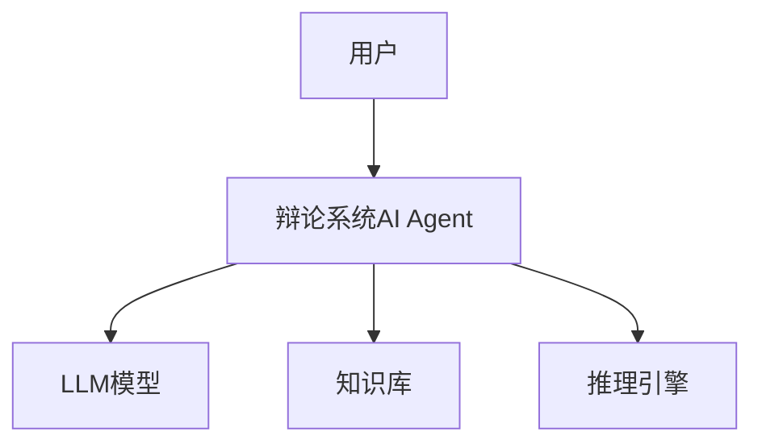
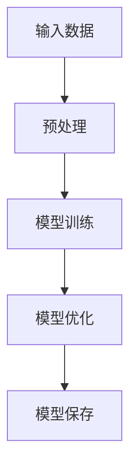
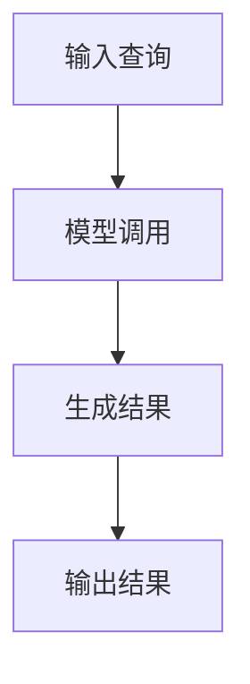
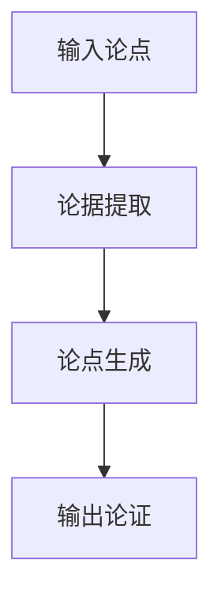
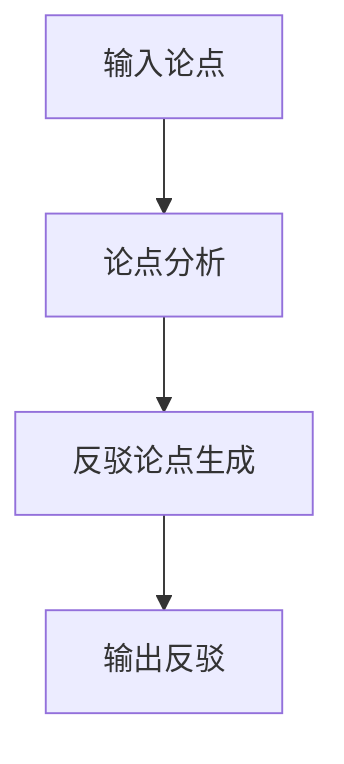
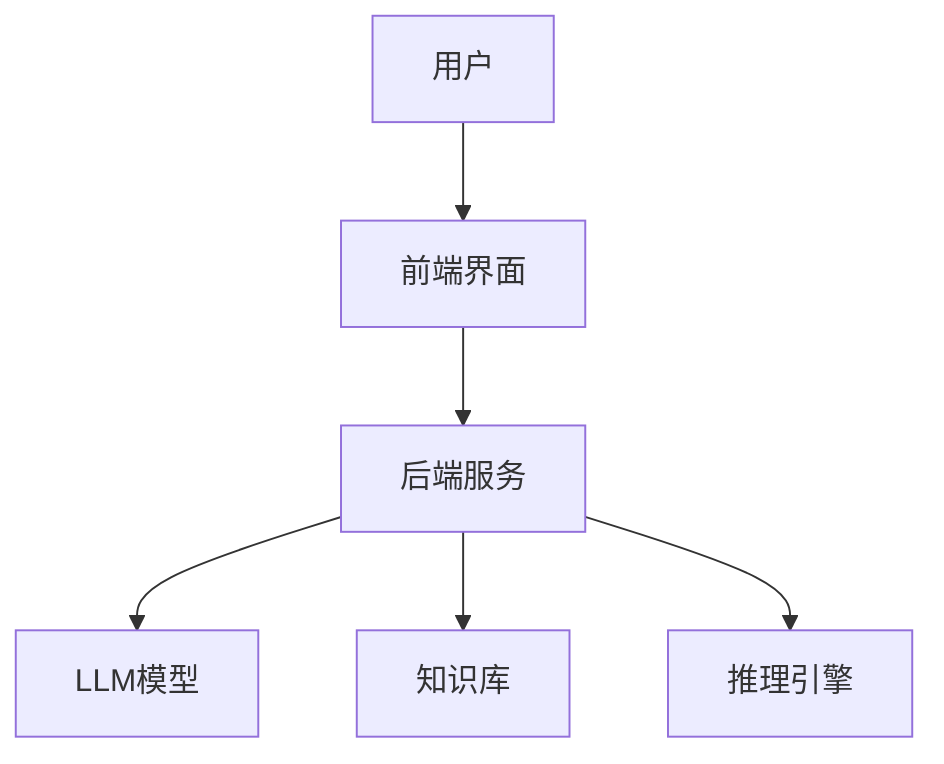
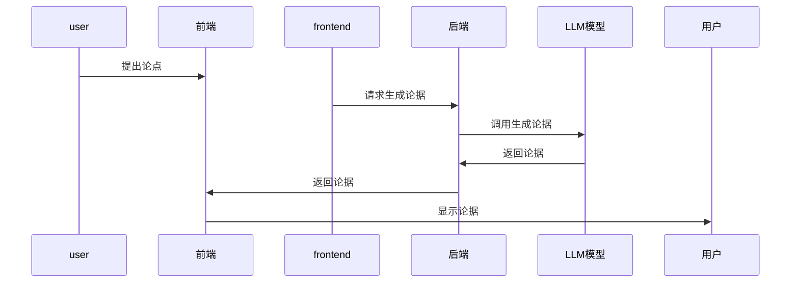

                 


# 辩论系统AI Agent：LLM驱动的论证与反驳能力

> 关键词：辩论系统，AI Agent，LLM，论证，反驳，人工智能

> 摘要：本文探讨了基于LLM的辩论系统AI Agent的构建与应用，分析其论证与反驳能力，结合算法原理和项目实战，详细阐述了系统设计与实现。

---

## 第一章：背景介绍

### 1.1 辩论系统AI Agent的背景

#### 1.1.1 辩论系统的定义与作用
辩论系统是一种通过AI模拟人类辩论能力的系统，旨在辅助或替代人类进行逻辑论证和反驳。其作用包括教育辅助、法律咨询和商业谈判等。

#### 1.1.2 问题背景与描述
当前辩论系统面临的主要问题是缺乏深度的逻辑推理和实时反驳能力，尤其是在复杂场景下的表现不足。

#### 1.1.3 问题解决与核心概念
通过引入LLM技术，辩论系统AI Agent能够实现高效的论证与反驳，提升整体辩论能力。

### 1.2 辩论系统AI Agent的核心概念

#### 1.2.1 LLM的定义与特点
大语言模型（LLM）是一种基于深度学习的NLP模型，具备强大的文本生成和理解能力。

#### 1.2.2 论证与反驳的逻辑结构
论证是通过逻辑推理支持论点，反驳则是通过逻辑推理削弱论点。两者共同构建了完整的辩论体系。

#### 1.2.3 边界与外延分析
辩论系统AI Agent的边界在于其知识库和推理能力，外延则涉及多领域应用。

---

## 第二章：核心概念与联系

### 2.1 LLM驱动的论证与反驳能力

#### 2.1.1 LLM在论证中的应用
LLM通过生成支持论点的论据，增强论证的说服力。

#### 2.1.2 LLM在反驳中的应用
LLM通过生成反驳论点，削弱对手的论点，实现有效的辩论。

#### 2.1.3 LLM与传统NLP技术的区别
LLM具有更强的上下文理解和生成能力，而传统NLP技术在特定任务上表现更佳。

### 2.2 论证与反驳的逻辑结构

#### 2.2.1 论证的基本结构
论点、论据和推理是构成论证的三要素。

#### 2.2.2 反驳的逻辑框架
反驳通常通过削弱论据或质疑推理来进行。

### 2.3 实体关系图



---

## 第三章：算法原理讲解

### 3.1 LLM的训练与推理过程

#### 3.1.1 训练流程


#### 3.1.2 推理机制


### 3.2 论证与反驳的算法实现

#### 3.2.1 论证生成算法


#### 3.2.2 反驳生成算法


### 3.3 数学模型与公式

#### 3.3.1 损失函数
$$ \text{损失函数} = -\sum_{i=1}^{n} y_i \log(p_i) + (1 - y_i) \log(1 - p_i) $$

---

## 第四章：系统分析与架构设计

### 4.1 问题场景介绍

#### 4.1.1 教育辅助场景
帮助学生准备辩论比赛，提供论点生成和反驳建议。

#### 4.1.2 法律咨询场景
在法律咨询中，系统可以辅助律师进行案件分析和辩论准备。

### 4.2 系统架构设计

#### 4.2.1 系统架构图


#### 4.2.2 功能模块设计
- 用户输入模块：接收用户输入的论点或查询。
- 论证生成模块：生成支持论点的论据。
- 反驳生成模块：生成反驳论点。
- 知识库模块：存储和管理相关知识。
- 推理引擎模块：处理逻辑推理任务。

### 4.3 接口设计

#### 4.3.1 API接口
```json
{
  "input": "论点",
  "output": "论据或反驳论点"
}
```

### 4.4 交互流程

#### 4.4.1 序列图


---

## 第五章：项目实战

### 5.1 环境安装

#### 5.1.1 安装依赖
```bash
pip install transformers torch
```

### 5.2 核心代码实现

#### 5.2.1 论证生成代码
```python
from transformers import AutoModelForSeq2SeqLM, AutoTokenizer

model_name = "facebook/pagnet-base"
model = AutoModelForSeq2SeqLM.from_pretrained(model_name)
tokenizer = AutoTokenizer.from_pretrained(model_name)

def generate_argument(prompt):
    inputs = tokenizer.encode(prompt, return_tensors='pt')
    outputs = model.generate(inputs, max_length=50)
    return tokenizer.decode(outputs[0], skip_special_tokens=True)
```

#### 5.2.2 反驳生成代码
```python
def generate_counter_argument(prompt):
    # 类似于论点生成，使用相同的模型或调整参数
    pass
```

### 5.3 案例分析

#### 5.3.1 教育辅助案例
输入论点：“在线教育优于传统教育”，系统生成论据：“灵活性和可访问性”。

#### 5.3.2 法律咨询案例
输入论点：“公司违反了劳动法”，系统生成论据：“具体条款违反情况”。

---

## 第六章：最佳实践

### 6.1 小结
通过LLM驱动的辩论系统AI Agent，可以实现高效的论证与反驳，提升辩论能力。

### 6.2 注意事项
- 数据质量影响结果。
- 需要定期更新知识库。
- 伦理问题需谨慎处理。

### 6.3 扩展阅读
推荐阅读相关论文和书籍，深入理解LLM和辩论系统的结合。

---

## 作者：AI天才研究院/AI Genius Institute & 禅与计算机程序设计艺术 /Zen And The Art of Computer Programming

---

这篇文章详细介绍了辩论系统AI Agent的构建与应用，结合理论与实践，为读者提供了全面的知识和指导。

