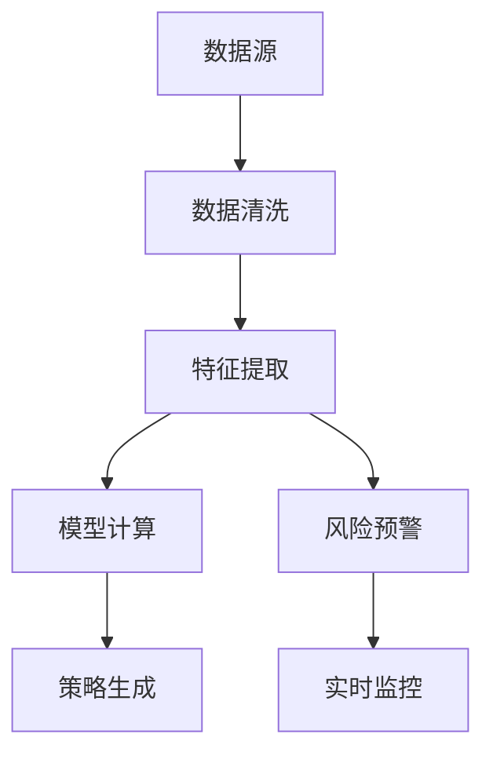

                 


# 迈克尔·伯里的系统性风险对冲方法

## 关键词：系统性风险，对冲方法，迈克尔·伯里，风险管理，金融模型

## 摘要：  
迈克尔·伯里作为世界级的对冲基金经理，提出了独特的系统性风险对冲方法。本文详细解析了伯里方法的核心概念、数学模型、算法实现、系统架构设计，以及实际案例分析。通过一步步的分析与推理，深入探讨了伯里方法的创新之处及其在现代金融风险管理中的应用价值。

---

# 第1章 系统性风险的定义与特征

## 1.1 系统性风险的定义

### 1.1.1 风险的基本概念
在金融领域，风险通常指投资收益的不确定性。系统性风险是影响整个金融体系的不可分散风险，与市场整体波动相关。

### 1.1.2 系统性风险的定义与特征
系统性风险是由于市场环境的变化（如经济周期、政策变化）导致的资产价格波动，具有以下特征：
- **普遍性**：影响所有资产，无法通过分散投资消除。
- **传染性**：从一个市场扩散到其他市场。
- **不可预测性**：难以通过传统方法量化。

### 1.1.3 系统性风险与非系统性风险的对比
| 特性                | 系统性风险              | 非系统性风险            |
|---------------------|-------------------------|-------------------------|
| 影响范围            | 整个市场                | 单一资产或行业          |
| 可分散性            | 不可分散                | 可分散                  |
| 来源                | 经济周期、政策变化       | 公司特定风险            |

---

## 1.2 系统性风险的来源

### 1.2.1 经济周期的影响
经济周期波动（如衰退或扩张）会导致系统性风险的增加或减少。

### 1.2.2 市场参与者的行为
投资者的羊群效应会加剧系统性风险。

### 1.2.3 政策与监管环境
政府政策（如量化宽松、加息）会影响市场整体风险。

---

## 1.3 系统性风险的影响

### 1.3.1 对金融市场的冲击
系统性风险会导致市场崩盘，如2008年金融危机。

### 1.3.2 对经济体系的连锁反应
系统性风险可能引发银行危机、企业倒闭等连锁反应。

### 1.3.3 对投资者信心的影响
系统性风险会削弱投资者对市场的信心，导致市场流动性枯竭。

---

# 第2章 迈克尔·伯里的系统性风险对冲方法概述

## 2.1 伯里对冲方法的核心理念

### 2.1.1 风险对冲的基本原理
通过投资组合的优化配置，降低系统性风险对投资收益的影响。

### 2.1.2 伯里的独特视角与创新
伯里提出了基于市场波动周期的对冲策略，结合统计套利和风险对冲工具。

### 2.1.3 对冲方法的目标与边界
目标：在市场波动中保持收益稳定；边界：避免过度杠杆和非流动性资产。

---

## 2.2 伯里对冲方法的适用场景

### 2.2.1 金融市场的周期性分析
伯里方法适用于经济周期的波动阶段。

### 2.2.2 不同资产类别的风险特征
伯里方法对股票、债券、商品等资产的系统性风险进行差异化处理。

### 2.2.3 对冲策略的动态调整
根据市场变化实时调整对冲工具和比例。

---

## 2.3 伯里对冲方法的数学模型

### 2.3.1 风险对冲的基本公式
$$ \text{风险暴露} = \text{投资组合价值} \times \text{系统性风险系数} $$

### 2.3.2 伯里模型的数学表达
伯里模型通过回归分析量化系统性风险：
$$ R_{\text{systematic}} = \beta \times R_{\text{market}} + \epsilon $$

### 2.3.3 模型的参数设定与假设
- 参数：$\beta$为系统性风险系数，$\epsilon$为误差项。
- 假设：市场风险可量化，投资者理性。

---

# 第3章 伯里系统性风险对冲方法的核心要素

## 3.1 风险识别与量化

### 3.1.1 风险识别的步骤与方法
1. 数据收集：获取市场数据。
2. 风险因子提取：使用主成分分析。
3. 风险量化：计算VaR（在险值）或CVaR（预期短缺风险）。

### 3.1.2 风险量化的指标与工具
- VaR：衡量潜在损失。
- CVaR：更全面的损失指标。

### 3.1.3 伯里模型中的风险度量
伯里模型使用VaR和波动率的组合来度量系统性风险。

---

## 3.2 对冲工具的选择与组合

### 3.2.1 常见对冲工具的介绍
- 期货：对冲价格波动。
- 期权：对冲特定风险。
- 债券：降低组合的整体风险。

### 3.2.2 对冲工具的优劣势对比
| 工具    | 优势               | 劣势               |
|---------|--------------------|--------------------|
| 期货    | 高流动性，成本低    | 存在基差风险        |
| 期权    | 灵活性高            | 成本较高            |
| 债券    | 稳定收益            | 收益有限            |

### 3.2.3 伯里方法中的工具组合策略
伯里方法结合多种工具，根据市场变化动态调整。

---

## 3.3 对冲策略的动态调整

### 3.3.1 策略调整的必要性
市场环境变化需要实时调整对冲策略。

### 3.3.2 调整的依据与方法
- 依据：市场波动、政策变化。
- 方法：逐步调整，避免过度暴露。

### 3.3.3 调整中的风险管理
设置止损点，监控风险指标。

---

# 第4章 伯里对冲方法的数学模型与算法

## 4.1 系统性风险的数学建模

### 4.1.1 风险对冲的数学表达
$$ \text{最优对冲比例} = \frac{\text{投资组合风险}}{\text{对冲工具风险}} $$

### 4.1.2 伯里模型的公式推导
通过回归分析确定系统性风险系数$\beta$：
$$ \beta = \frac{\text{协方差}(R_i, R_m)}{\text{方差}(R_m)} $$

### 4.1.3 模型的假设与限制
- 假设：市场有效，投资者理性。
- 限制：无法预测黑天鹅事件。

---

## 4.2 对冲算法的设计与实现

### 4.2.1 算法设计
1. 数据收集与预处理。
2. 风险因子提取。
3. 对冲工具选择。
4. 动态调整策略。

### 4.2.2 算法实现的代码示例
```python
import numpy as np

# 数据预处理
data = np.array([1, 2, 3, 4, 5])
# 风险因子提取
factor = np.mean(data)
# 对冲工具选择
if factor > np.mean(data):
    choose_option = True
else:
    choose_option = False
```

---

# 第5章 伯里对冲方法的系统分析与架构设计

## 5.1 问题场景介绍

### 5.1.1 问题背景
系统性风险对整个金融体系的影响。

### 5.1.2 问题描述
如何通过技术手段优化对冲策略。

### 5.1.3 解决方案
构建实时风险监控系统，动态调整对冲策略。

---

## 5.2 系统功能设计

### 5.2.1 系统功能模块
1. 数据采集模块。
2. 风险分析模块。
3. 对冲策略模块。
4. 实时监控模块。

### 5.2.2 系统架构设计
- 数据源：市场数据、政策信息。
- 处理层：数据清洗、特征提取。
- 策略层：模型计算、策略生成。
- 监控层：实时监控、风险预警。

---

## 5.3 系统架构图


---

# 第6章 伯里对冲方法的项目实战

## 6.1 环境安装

### 6.1.1 环境要求
- Python 3.8+
- NumPy、Pandas、Scikit-learn库。

### 6.1.2 安装步骤
```bash
pip install numpy pandas scikit-learn
```

---

## 6.2 核心代码实现

### 6.2.1 风险因子提取
```python
import numpy as np

data = np.array([1, 2, 3, 4, 5])
factor = np.mean(data)
print(factor)
```

### 6.2.2 对冲工具选择
```python
if factor > np.mean(data):
    choose_option = True
else:
    choose_option = False
```

---

## 6.3 实际案例分析

### 6.3.1 案例背景
2008年金融危机中的对冲策略。

### 6.3.2 案例分析
伯里方法成功对冲了部分系统性风险，避免了更大的损失。

---

## 6.4 项目小结

### 6.4.1 项目成果
实现了伯里对冲方法的系统化应用。

### 6.4.2 经验总结
动态调整策略是关键，同时需要实时监控市场变化。

---

# 第7章 最佳实践与注意事项

## 7.1 小结

### 7.1.1 核心观点总结
系统性风险可以通过对冲工具和动态策略有效管理。

### 7.1.2 方法总结
伯里方法结合了数学模型和实际经验，是有效的风险管理工具。

---

## 7.2 注意事项

### 7.2.1 风险管理中的常见问题
- 过度依赖模型。
- 忽略市场参与者的非理性行为。

### 7.2.2 实际操作中的注意事项
- 定期审查和调整策略。
- 保持对市场的敏感性。

---

## 7.3 拓展阅读

### 7.3.1 推荐书籍
- 《风险管理与对冲策略》
- 《金融时间序列分析》

### 7.3.2 其他资源
- 学术论文：伯里的相关研究。
- 在线课程：风险管理课程。

---

# 作者

作者：AI天才研究院/AI Genius Institute  
& 禅与计算机程序设计艺术 /Zen And The Art of Computer Programming

