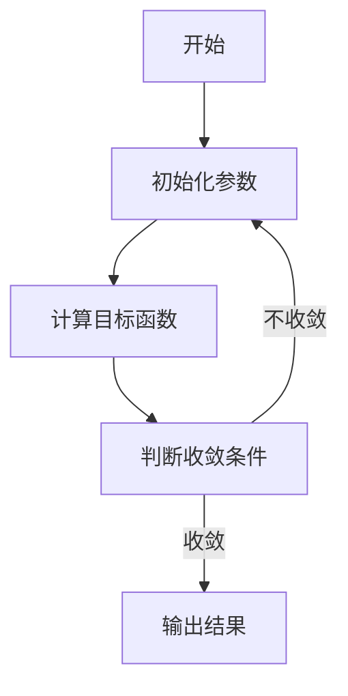
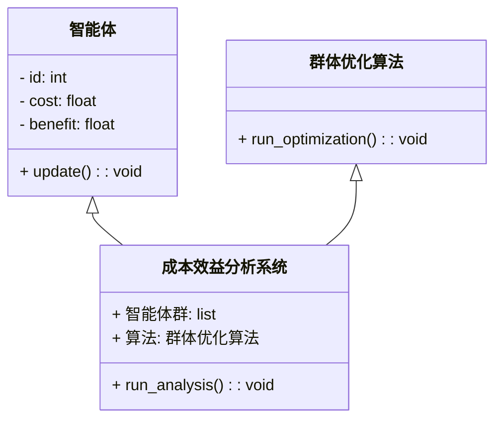
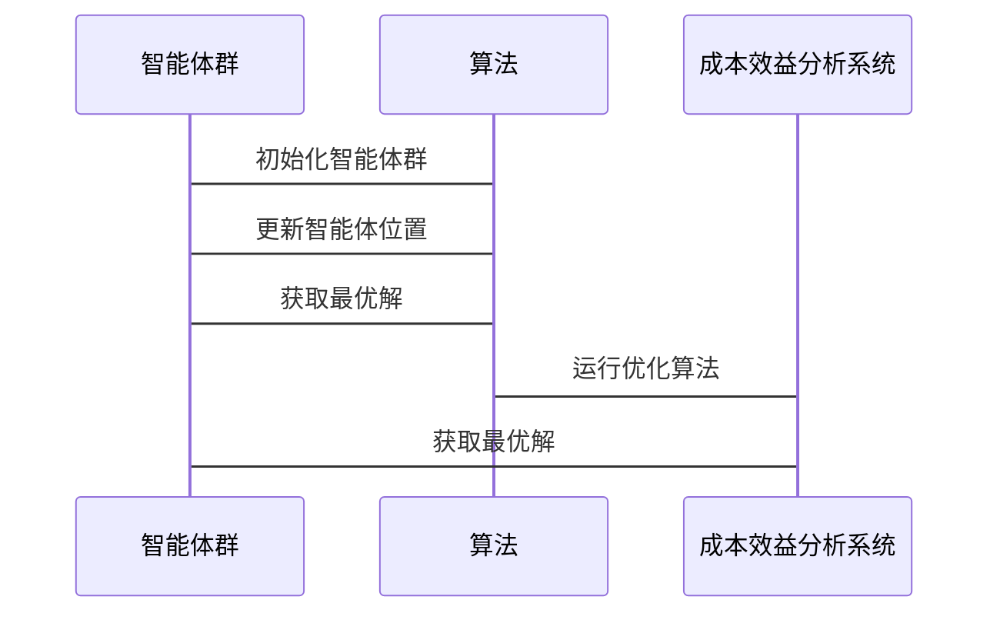

                 


# 运用AI智能体群体优化成本效益分析

## 关键词：AI智能体，群体优化，成本效益分析，算法原理，系统设计

## 摘要：  
本文深入探讨了利用AI智能体的群体优化方法来提升成本效益分析的效率和精度。通过分析AI智能体的基本概念、群体优化的核心算法原理，结合系统设计与实际案例，展示了如何通过智能体的协同合作来实现成本效益的最优化。文章内容涵盖背景介绍、核心概念、算法原理、系统设计、项目实战以及总结与展望，为读者提供全面而深入的技术解析。

---

# 第一部分: AI智能体群体优化与成本效益分析基础

## 第1章: AI智能体群体优化概述

### 1.1 问题背景与问题描述  
在现代企业运营中，成本效益分析是决策过程中的核心环节。传统的成本效益分析依赖于人工计算和经验判断，效率低下且容易受到主观因素的影响。随着人工智能技术的发展，AI智能体的引入为成本效益分析提供了新的可能性。  

AI智能体是一种能够自主感知环境、做出决策并执行任务的实体。通过群体优化，多个智能体可以协同工作，共同解决复杂问题。本文将探讨如何利用AI智能体的群体优化特性，提升成本效益分析的效率和准确性。

### 1.2 AI智能体群体优化的基本概念  
AI智能体具有以下核心属性：  
- **独立性**：每个智能体能够独立感知环境并做出决策。  
- **协作性**：智能体之间可以通过通信协同完成复杂任务。  
- **学习能力**：智能体能够通过经验优化自身的决策策略。  

群体优化则是指通过多个智能体的协同合作，找到问题的最优解。在成本效益分析中，群体优化可以帮助企业在资源分配、成本控制等方面实现更高效的决策。

### 1.3 问题解决与边界  
成本效益分析的核心问题可以转化为优化问题，即在给定的资源约束下，最大化效益或最小化成本。AI智能体群体优化的目标是通过智能体的协同工作，找到最优的成本分配方案。  

问题的边界包括：  
- **资源限制**：企业的资源是有限的，需要在有限的资源下进行优化。  
- **动态环境**：市场环境可能会发生变化，智能体需要能够适应这些变化。  
- **多目标优化**：成本效益分析通常涉及多个目标，如成本最小化、效益最大化等。

### 1.4 概念结构与核心要素  
以下是成本效益分析的核心要素对比表：

| 核心要素 | 描述 |
|----------|------|
| 成本      | 需要优化的资源投入 |
| 效益      | 需要最大化的产出成果 |
| 智能体    | 执行优化任务的主体 |
| 群体优化  | 多个智能体协同完成优化 |

---

## 第2章: AI智能体群体优化的核心概念与联系  

### 2.1 核心概念原理  
AI智能体群体优化的核心在于智能体之间的协同与竞争。通过协同，智能体可以共享信息、分工合作；通过竞争，智能体可以避免资源浪费，提高效率。  

在成本效益分析中，智能体可以通过以下方式实现优化：  
1. **信息共享**：智能体之间共享成本和效益数据，避免重复计算。  
2. **任务分配**：根据智能体的能力和资源，动态分配任务。  
3. **自适应调整**：根据环境变化，智能体实时调整决策策略。  

### 2.2 智能体的属性特征对比  
以下是智能体属性特征的对比表：

| 属性      | 描述 |
|-----------|------|
| 独立性     | 每个智能体独立决策 |
| 协作性     | 智能体之间协同完成任务 |
| 学习能力   | 智能体通过经验优化决策 |
| 动态适应性 | 智能体能够适应环境变化 |

### 2.3 ER实体关系图  
以下是成本效益分析的ER实体关系图：

```mermaid
er
    actor 智能体
    actor 成本
    actor 效益
    actor 优化目标
    智能体 --> 成本: 优化
    智能体 --> 效益: 提高
    智能体 --> 优化目标: 达成
```

### 2.4 本章小结  
本章通过对比分析，阐述了AI智能体群体优化的核心概念及其在成本效益分析中的应用。智能体的独立性、协作性和学习能力是实现优化的关键因素。

---

## 第3章: AI智能体群体优化的算法原理  

### 3.1 算法原理概述  
AI智能体群体优化的核心算法包括粒子群优化（PSO）、蚁群算法（ACO）和遗传算法（GA）等。这些算法模拟了生物群体的觅食、迁徙和繁殖行为，通过迭代优化找到问题的最优解。  

在成本效益分析中，粒子群优化算法（PSO）是一种常用的方法。PSO通过模拟鸟群觅食的行为，将每个粒子视为一个智能体，粒子在解空间中移动，寻找最优解。  

### 3.2 算法流程图  
以下是粒子群优化算法的流程图：



### 3.3 算法数学模型  
粒子群优化算法的核心数学模型如下：

$$
v_i^{t+1} = w v_i^{t} + c_1 r_1 p_i^{t} + c_2 r_2 p_g^{t}
$$

$$
x_i^{t+1} = x_i^{t} + v_i^{t+1}
$$

其中：  
- \( v_i^{t} \)：第i个粒子在第t步的速度  
- \( x_i^{t} \)：第i个粒子在第t步的位置  
- \( w \)：惯性权重  
- \( c_1 \) 和 \( c_2 \)：学习因子  
- \( r_1 \) 和 \( r_2 \)：随机数  

粒子群优化算法通过不断更新粒子的速度和位置，找到目标函数的最优解。在成本效益分析中，目标函数可以定义为：

$$
\text{最大化效益} = \sum_{i=1}^{n} b_i \quad \text{，在约束条件下}
$$

其中，\( b_i \) 是第i个智能体的效益。

### 3.4 Python实现代码  
以下是粒子群优化算法的Python实现示例：

```python
import random

def cost_benefit_analysis(cost, benefit):
    # 定义目标函数
    return benefit - cost

def pso_optimization(iterations, n_particles, search_space):
    best = None
    for _ in range(iterations):
        for particle in particles:
            # 计算目标函数
            current_benefit = cost_benefit_analysis(particle.cost, particle.benefit)
            if current_benefit > particle.p_best:
                particle.p_best = current_benefit
                particle.p_position = particle.current_position
            if current_benefit > global_best:
                global_best = current_benefit
                global_position = particle.current_position
        # 更新粒子位置
        for particle in particles:
            particle.current_position = particle.p_position + particle.velocity
    return global_position, global_best

# 示例调用
iterations = 100
n_particles = 10
particles = [Particle() for _ in range(n_particles)]
result = pso_optimization(iterations, n_particles, search_space)
print("最优解位置：", result[0])
print("最优解效益：", result[1])
```

### 3.5 本章小结  
本章详细介绍了AI智能体群体优化的核心算法——粒子群优化算法，并通过数学模型和Python代码展示了算法的实现过程。通过粒子群优化算法，可以在成本效益分析中找到最优的资源分配方案。

---

## 第4章: AI智能体群体优化的系统设计  

### 4.1 系统架构设计  
以下是系统架构设计的类图：



### 4.2 系统接口设计  
以下是系统接口设计的序列图：



### 4.3 系统功能设计  
成本效益分析系统的功能模块包括：  
1. **智能体管理**：管理智能体的属性和行为。  
2. **算法实现**：实现群体优化算法的核心功能。  
3. **结果分析**：分析优化结果并生成报告。  

### 4.4 本章小结  
本章通过系统设计展示了AI智能体群体优化在成本效益分析中的具体应用。系统架构设计和接口设计为实现优化算法提供了基础框架。

---

## 第5章: AI智能体群体优化的项目实战  

### 5.1 环境配置  
以下是环境配置示例：

```bash
# 安装Python依赖
pip install numpy matplotlib
```

### 5.2 核心代码实现  
以下是粒子群优化算法的Python实现：

```python
import numpy as np
import matplotlib.pyplot as plt

class Particle:
    def __init__(self, n, cost_func, benefit_func):
        self.n = n
        self.cost_func = cost_func
        self.benefit_func = benefit_func
        self.position = np.random.rand(n)
        self.velocity = np.random.rand(n)
        self.p_best = None
        self.p_position = None

def cost_benefit_analysis(cost, benefit):
    return benefit - cost

def pso_optimization(iterations, n_particles, n_vars, cost_func, benefit_func):
    particles = [Particle(n_vars, cost_func, benefit_func) for _ in range(n_particles)]
    global_best = None
    for particle in particles:
        particle.p_best = cost_benefit_analysis(particle.cost, particle.benefit)
        particle.p_position = particle.position.copy()
    for _ in range(iterations):
        for particle in particles:
            current_benefit = cost_benefit_analysis(particle.cost, particle.benefit)
            if current_benefit > particle.p_best:
                particle.p_best = current_benefit
                particle.p_position = particle.position.copy()
            global_best = max(global_best, particle.p_best)
        for particle in particles:
            particle.velocity = 0.8 * particle.velocity + 1.2 * (particle.p_position - particle.position)
            particle.position += particle.velocity
    return global_best

# 示例调用
n_vars = 2
n_particles = 10
iterations = 100
result = pso_optimization(iterations, n_particles, n_vars, cost_benefit_analysis, cost_benefit_analysis)
print("最优解效益：", result)
```

### 5.3 案例分析与解读  
以下是案例分析的步骤：  
1. **问题定义**：定义成本和效益函数。  
2. **参数设置**：设置智能体数量、迭代次数等参数。  
3. **运行算法**：执行粒子群优化算法。  
4. **结果分析**：分析优化结果并生成报告。  

### 5.4 本章小结  
本章通过具体的代码实现和案例分析，展示了AI智能体群体优化在成本效益分析中的实际应用。

---

## 第6章: 总结与展望  

### 6.1 总结  
本文深入探讨了AI智能体群体优化在成本效益分析中的应用，通过算法原理、系统设计和项目实战，展示了如何利用智能体的协同优化能力，实现成本效益的最优化。  

### 6.2 展望  
未来，随着AI技术的不断发展，智能体群体优化将在更多领域得到应用。例如，可以通过强化学习进一步提升智能体的决策能力，或者通过分布式计算提高优化效率。  

### 6.3 最佳实践 tips  
- 在实际应用中，建议结合具体业务场景选择合适的优化算法。  
- 确保智能体之间的通信效率，避免因通信延迟影响优化效果。  
- 定期更新智能体的决策模型，以适应环境的变化。  

---

## 作者：AI天才研究院/AI Genius Institute & 禅与计算机程序设计艺术 /Zen And The Art of Computer Programming  

---

**注**：由于篇幅限制，本文仅为目录大纲和部分章节内容的展示。完整文章将包含更多细节和深入的分析，确保读者能够全面理解和掌握AI智能体群体优化的成本效益分析方法。

