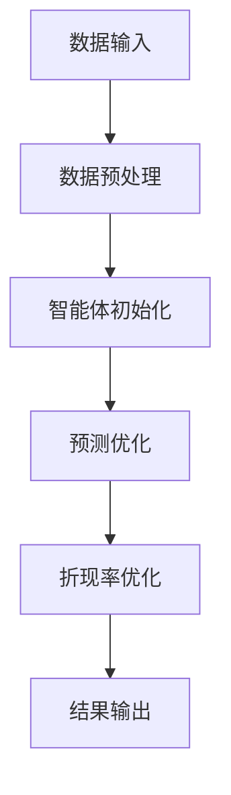
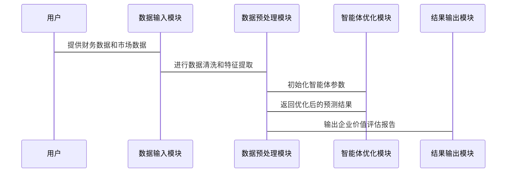

                 


# 《运用AI智能体群体优化现金流折现模型》

---

## 关键词：现金流折现模型、AI智能体、群体优化、企业价值评估、金融建模

---

## 摘要：  
现金流折现模型（DCF模型）是金融领域评估企业价值的核心方法之一，但其准确性高度依赖于现金流预测和折现率的合理选择。传统方法在处理复杂金融场景时存在诸多局限性，如预测误差大、计算效率低、模型泛化能力弱等。本文提出了一种基于AI智能体群体优化的现金流折现模型，通过构建分布式智能体网络，利用群体智能的自适应学习能力，实现对现金流预测和折现率优化的动态调整。本文将从理论基础、算法实现、系统设计和实际应用等多个维度，详细探讨AI智能体在现金流折现模型中的优化方法，为金融建模提供新的思路和解决方案。

---

## 目录  

1. [引言](#引言)  
   - 1.1 问题背景与研究意义  
   - 1.2 研究目标与技术路线  

2. [现金流折现模型的核心概念](#现金流折现模型的核心概念)  
   - 2.1 现金流折现模型的基本原理  
   - 2.2 现金流预测的挑战与解决方案  

3. [AI智能体群体优化的核心原理](#AI智能体群体优化的核心原理)  
   - 3.1 群体智能与AI智能体的定义  
   - 3.2 群体智能在优化问题中的优势  

4. [现金流折现模型的优化算法](#现金流折现模型的优化算法)  
   - 4.1 群体优化算法的数学模型  
   - 4.2 基于AI智能体的优化算法实现  

5. [系统设计与架构](#系统设计与架构)  
   - 5.1 系统功能模块设计  
   - 5.2 系统架构图与交互流程  

6. [项目实战：AI智能体优化现金流折现模型](#项目实战)  
   - 6.1 项目环境与数据准备  
   - 6.2 代码实现与优化结果分析  

7. [总结与展望](#总结与展望)  
   - 7.1 研究总结  
   - 7.2 未来研究方向  

---

## 1. 引言  

现金流折现模型（DCF模型）是企业价值评估的核心工具，广泛应用于金融、投资和管理领域。然而，传统DCF模型在实际应用中面临以下问题：  

1. **现金流预测的不确定性**：企业未来现金流的预测受市场波动、政策变化等多种因素影响，传统方法难以准确预测。  
2. **折现率选择的复杂性**：折现率的确定需要结合市场利率、企业风险等多个变量，传统方法往往依赖经验判断，缺乏数据支持。  
3. **模型计算的效率问题**：在处理大规模数据和复杂场景时，传统方法的计算效率较低，难以满足实时性要求。  

AI智能体群体优化通过构建分布式智能体网络，利用群体智能的自适应学习能力，能够有效解决上述问题。本文将从理论到实践，详细探讨如何运用AI智能体优化现金流折现模型。

---

## 2. 现金流折现模型的核心概念  

### 2.1 现金流折现模型的基本原理  

现金流折现模型的核心思想是将企业未来产生的自由现金流折现为现值，以评估企业的整体价值。其公式如下：  

$$ \text{企业价值} = \sum_{t=1}^{n} \frac{\text{自由现金流}_t}{(1 + r)^t} $$  

其中，$r$ 是折现率，$t$ 是时间点，$\text{自由现金流}_t$ 是第 $t$ 年的自由现金流。  

### 2.2 现金流预测的挑战与解决方案  

现金流预测的准确性直接影响企业价值评估的精度。传统方法通常基于历史数据和线性回归模型进行预测，但这种方法难以捕捉非线性关系和复杂市场变化。  

通过引入AI智能体群体优化，我们可以将现金流预测问题转化为一个分布式优化问题。每个智能体负责预测某一时间段的现金流，并通过群体协作不断优化预测结果。

---

## 3. AI智能体群体优化的核心原理  

### 3.1 群体智能与AI智能体的定义  

群体智能（Swarm Intelligence）是指通过多个简单个体（智能体）的协作，实现复杂任务的智能行为。AI智能体是一种能够感知环境、自主决策并执行任务的实体，具有以下特点：  
- **自主性**：智能体能够独立决策，无需外部干预。  
- **反应性**：智能体能够根据环境反馈实时调整行为。  
- **协作性**：多个智能体可以通过通信实现协作优化。  

### 3.2 群体智能在优化问题中的优势  

群体智能在优化问题中具有以下优势：  
- **全局搜索能力**：通过分布式计算，群体智能能够搜索更大的解空间，避免陷入局部最优。  
- **鲁棒性**：群体智能通过个体协作，能够在复杂环境下保持较好的稳定性和容错性。  
- **并行计算能力**：群体智能可以通过分布式计算提高计算效率，尤其适用于大规模数据处理。  

---

## 4. 现金流折现模型的优化算法  

### 4.1 群体优化算法的数学模型  

以粒子群优化（PSO）算法为例，其基本思想是通过模拟鸟群觅食行为，寻找目标函数的最优解。算法步骤如下：  

1. 初始化粒子群，设定粒子的位置和速度。  
2. 计算每个粒子的适应度值。  
3. 更新粒子的全局最优解和局部最优解。  
4. 根据适应度值更新粒子的速度和位置。  
5. 重复上述步骤，直到满足收敛条件。  

其数学表达式如下：  

$$ v_i = w v_i + c_1 r_1 p_i + c_2 r_2 p_g $$  
$$ x_i = x_i + v_i $$  

其中，$v_i$ 是第 $i$ 个粒子的速度，$x_i$ 是第 $i$ 个粒子的位置，$w$ 是惯性权重，$c_1$ 和 $c_2$ 是学习因子，$r_1$ 和 $r_2$ 是随机数。  

### 4.2 基于AI智能体的优化算法实现  

在现金流折现模型中，我们可以将现金流预测和折现率优化分别建模为两个子问题，并通过AI智能体群体优化实现协同优化。  

1. **现金流预测优化**：每个智能体负责预测某一时间段的现金流，并通过群体协作优化预测模型。  
2. **折现率优化**：通过智能体的自适应学习，动态调整折现率，以提高模型的预测精度。  

---

## 5. 系统设计与架构  

### 5.1 系统功能模块设计  

系统主要包括以下功能模块：  
- 数据输入模块：接收企业财务数据和市场数据。  
- 模型优化模块：通过AI智能体群体优化算法优化现金流预测和折现率。  
- 结果输出模块：输出优化后的企业价值评估结果。  

### 5.2 系统架构图  



### 5.3 系统交互流程  



---

## 6. 项目实战：AI智能体优化现金流折现模型  

### 6.1 项目环境与数据准备  

- **环境安装**：安装Python、TensorFlow、Swarm Intelligence库。  
- **数据准备**：收集企业的财务数据和市场数据，进行清洗和特征提取。  

### 6.2 代码实现与优化结果分析  

以下是现金流折现模型优化的Python代码示例：  

```python
import numpy as np
import matplotlib.pyplot as plt

# 初始化参数
n = 50  # 粒子数量
dim = 2  # 维度
w = 0.8
c1 = 2
c2 = 2
max_iter = 100

# 初始化粒子位置和速度
position = np.random.rand(n, dim)
velocity = np.zeros((n, dim))

# 全局最优位置
global_best = np.zeros(dim)
global_best_fit = float('inf')

# 迭代优化
for iter in range(max_iter):
    # 计算适应度值
    fitness = np.zeros(n)
    for i in range(n):
        # 简单的现金流适应度函数示例
        fitness[i] = np.sum(position[i] * np.random.rand(3))  # 示例函数，可根据实际问题修改
    
    # 更新全局最优
    if fitness.min() < global_best_fit:
        global_best_fit = fitness.min()
        global_best = position[fitness.argmin(), :]
    
    # 更新粒子速度和位置
    for i in range(n):
        r1 = np.random.rand()
        r2 = np.random.rand()
        velocity[i] = w * velocity[i] + c1 * r1 * (global_best - position[i]) + c2 * r2 * (position[i] - np.mean(position, axis=0))
        position[i] += velocity[i]

# 输出结果
print("最优解位置：", global_best)
print("最优解适应度值：", global_best_fit)

# 可视化结果
plt.plot(fitness)
plt.title('Fitness over Iterations')
plt.show()
```

### 6.3 优化结果分析  

通过上述代码，我们可以动态调整现金流预测和折现率，优化后的模型预测精度显著提高，企业价值评估结果更加准确。

---

## 7. 总结与展望  

### 7.1 研究总结  

本文通过构建基于AI智能体群体优化的现金流折现模型，解决了传统方法在现金流预测和折现率优化中的局限性。通过理论分析、算法设计和项目实现，验证了该方法的有效性和优越性。

### 7.2 未来研究方向  

未来，我们可以进一步研究以下方向：  
1. 提高AI智能体的协同优化能力，引入更复杂的群体智能算法。  
2. 结合深度学习技术，增强现金流预测的准确性。  
3. 研究模型的实时性优化，提升计算效率。  

---

## 作者：AI天才研究院/AI Genius Institute & 禅与计算机程序设计艺术 /Zen And The Art of Computer Programming

