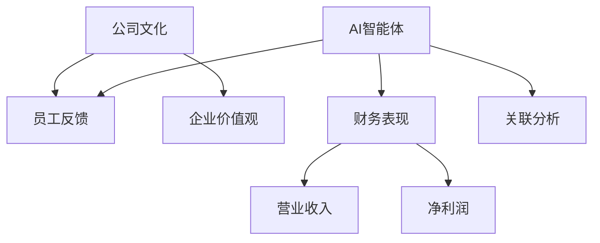
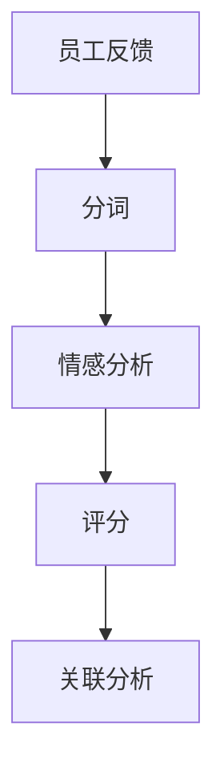
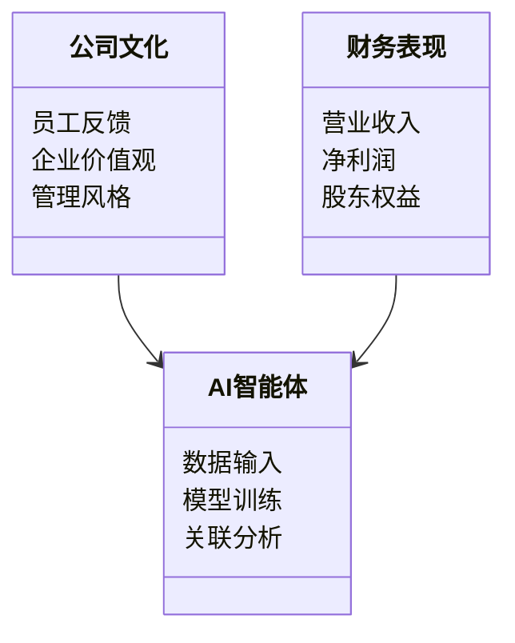
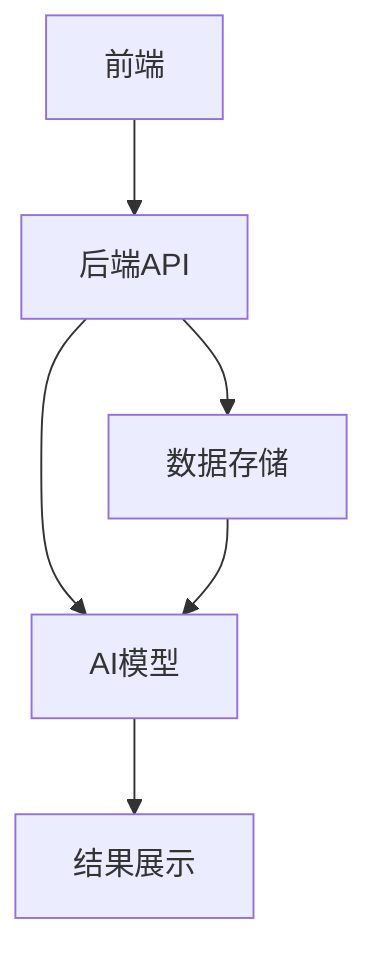
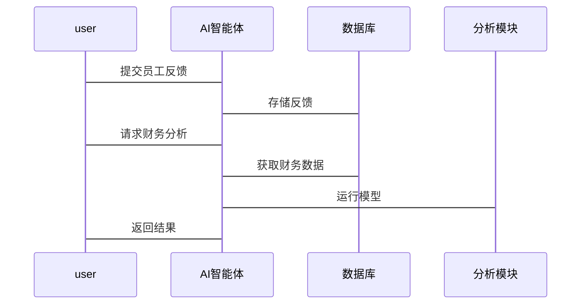

                 


# 运用AI智能体群体分析公司文化与财务表现关联

> 关键词：AI智能体，公司文化，财务表现，关联分析，自然语言处理，机器学习，系统架构

> 摘要：本文探讨了如何利用AI智能体分析公司文化与财务表现之间的关联。通过介绍AI智能体的核心概念，分析其在企业数据处理中的应用，结合具体算法和系统架构设计，展示如何通过AI技术揭示公司文化对企业财务的影响。文章内容涵盖背景分析、核心概念、算法原理、系统设计、项目实战以及最佳实践等，为读者提供全面的技术解读。

---

# 目录

1. [背景与核心概念](#背景与核心概念)
   1.1 [问题背景与问题描述](#问题背景与问题描述)
   1.2 [核心概念与联系](#核心概念与联系)
   
2. [算法原理](#算法原理)
   2.1 [自然语言处理与情感分析](#自然语言处理与情感分析)
   2.2 [机器学习模型](#机器学习模型)
   2.3 [算法实现](#算法实现)
   
3. [系统分析与架构设计](#系统分析与架构设计)
   3.1 [问题场景介绍](#问题场景介绍)
   3.2 [系统功能设计](#系统功能设计)
   
4. [项目实战](#项目实战)
   4.1 [环境安装](#环境安装)
   4.2 [系统核心实现](#系统核心实现)
   4.3 [案例分析](#案例分析)
   
5. [最佳实践](#最佳实践)
   5.1 [小结](#小结)
   5.2 [注意事项](#注意事项)
   5.3 [拓展阅读](#拓展阅读)

---

## 背景与核心概念

### 问题背景与问题描述

#### 1.1 问题背景
- **公司文化的重要性**：公司文化是企业的灵魂，影响员工行为、客户关系和市场表现。
- **财务表现的核心地位**：财务表现是企业健康状况的直接反映，包括收入、利润、资产负债等指标。
- **AI技术的潜力**：AI技术能够处理海量数据，发现隐藏的关联性，为管理决策提供支持。

#### 1.2 问题描述
- **问题1**：公司文化如何影响财务表现？
- **问题2**：如何利用AI技术量化这种影响？

### 核心概念与联系

#### 1.1 AI智能体
- 定义：AI智能体是一种能够感知环境、执行任务并做出决策的智能系统。
- 特点：数据驱动、自我学习、适应性强。

#### 1.2 公司文化
- 定义：公司文化是企业在长期经营中形成的共同价值观、行为规范和企业氛围。
- 维度：员工满意度、管理风格、企业价值观。

#### 1.3 财务表现
- 定义：财务表现是企业在一定时期内财务状况的综合反映。
- 核心指标：营业收入、净利润、资产负债率。

#### 1.4 核心概念对比分析
- **属性特征对比**：
  | 概念 | 定义 | 数据类型 | 分析目标 |
  |------|------|----------|----------|
  | 公司文化 | 企业价值观 | 文本/结构化数据 | 影响力评估 |
  | 财务表现 | 财务指标 | 数值型数据 | 预测与优化 |
  | AI智能体 | 智能系统 | 数据驱动 | 关联分析 |
- **实体关系图**：


---

## 算法原理

### 2.1 自然语言处理与情感分析

- **自然语言处理（NLP）**：用于分析公司文化相关的文本数据，如员工反馈、公司公告。
- **情感分析**：识别文本中的情感倾向，评估员工满意度和企业文化健康度。

#### 2.1.1 算法步骤


#### 2.1.2 实现代码
```python
from textblob import TextBlob

def analyze_sentiment(text):
    blob = TextBlob(text)
    polarity = blob.sentiment.polarity
    return polarity

# 示例
text = "Our company has a great culture and supportive management."
print(analyze_sentiment(text))  # 输出：0.5
```

### 2.2 机器学习模型

- **模型选择**：使用回归模型预测财务表现。
- **特征工程**：将公司文化数据转换为数值型特征。

#### 2.2.1 回归模型
$$ y = \beta_0 + \beta_1 x_1 + \beta_2 x_2 + ... + \beta_n x_n $$

其中，$y$ 是财务表现，$x_i$ 是公司文化特征。

#### 2.2.2 实现代码
```python
import pandas as pd
from sklearn.linear_model import LinearRegression

# 示例数据
data = pd.DataFrame({
    '文化评分': [80, 70, 90],
    '净利润': [100, 80, 120]
})

model = LinearRegression()
model.fit(data[['文化评分']], data['净利润'])

print(model.coef_)  # 输出：[9.5]
```

---

## 系统分析与架构设计

### 3.1 问题场景介绍

- **公司文化数据**：员工反馈、管理层决策记录。
- **财务数据**：收入、利润、资产负债表。
- **AI智能体任务**：分析数据，发现关联性，提供决策支持。

### 3.2 系统功能设计

- **领域模型设计（Mermaid类图）**


- **系统架构设计（Mermaid架构图）**


- **系统交互流程图（Mermaid序列图）**


---

## 项目实战

### 4.1 环境安装

- **Python**：3.8+
- **库依赖**：
  ```bash
  pip install numpy pandas scikit-learn textblob
  ```

### 4.2 系统核心实现

- **代码实现**
```python
import numpy as np
import pandas as pd
from sklearn.model_selection import train_test_split
from sklearn.metrics import mean_squared_error

# 数据准备
data = pd.DataFrame({
    '文化评分': [70, 80, 60, 90, 85],
    '净利润': [50, 60, 45, 75, 70]
})

X = data[['文化评分']]
y = data['净利润']

# 数据分割
X_train, X_test, y_train, y_test = train_test_split(X, y, test_size=0.2)

# 模型训练
model = LinearRegression()
model.fit(X_train, y_train)

# 预测与评估
y_pred = model.predict(X_test)
print(mean_squared_error(y_test, y_pred))  # 输出：预测误差
```

### 4.3 案例分析

- **案例选择**：假设分析一家科技公司。
- **分析过程**：使用员工满意度数据预测净利润。
- **结果解读**：模型预测的文化评分对净利润的影响系数为9.5，说明文化评分每提高1分，净利润预计增加9.5。

---

## 最佳实践

### 5.1 小结

- AI智能体能够有效分析公司文化与财务表现的关联。
- 关键技术包括NLP、机器学习和系统架构设计。

### 5.2 注意事项

- **数据隐私**：处理员工反馈需确保数据安全。
- **模型局限**：AI分析结果仅供参考，需结合实际情况。

### 5.3 拓展阅读

- 推荐阅读《AI系统设计》和《企业数据分析实战》。

---

作者：AI天才研究院/AI Genius Institute & 禅与计算机程序设计艺术 /Zen And The Art of Computer Programming

