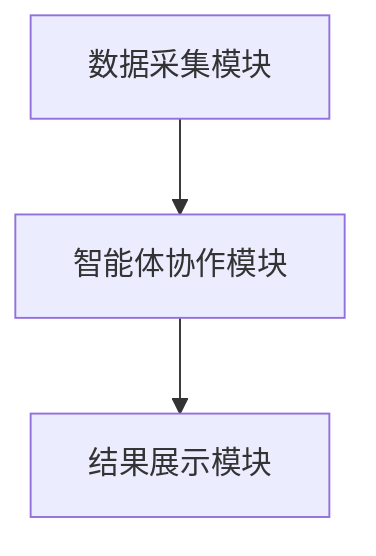

                 


# 运用AI智能体群体实现动态消费者行为分析

## 关键词：
AI智能体、消费者行为分析、动态分析、群体智能、行为建模

## 摘要：
随着消费者行为的日益复杂化和个性化，传统的静态分析方法已难以满足实时性和精准性的需求。本文提出运用AI智能体群体的方法，通过多智能体协作实现动态消费者行为的实时分析与预测。文章详细阐述了AI智能体群体的概念、算法原理、系统架构设计、项目实战及最佳实践，为读者提供了一套完整的解决方案。

---

## 第1章：动态消费者行为分析的背景与挑战

### 1.1 消费者行为分析的背景
消费者行为分析是商业决策的重要依据。随着电子商务和社交媒体的普及，消费者的购买行为变得越来越复杂和动态化。传统的基于统计的方法难以捕捉消费者行为的实时变化。

### 1.2 AI智能体群体的概念与特点
AI智能体是一种能够感知环境并采取行动以实现目标的实体。与传统方法相比，智能体群体具有以下特点：
- **分布式计算**：多个智能体协同工作，避免单点故障。
- **自主性**：每个智能体能够独立决策。
- **适应性**：能够根据环境变化动态调整行为。

### 1.3 动态消费者行为分析的挑战
1. **数据实时性**：需要实时处理海量数据。
2. **行为多样性**：消费者行为受到多种因素影响，难以预测。
3. **模型动态性**：模型需要不断更新以适应新数据。

---

## 第2章：AI智能体群体的核心概念与联系

### 2.1 智能体的定义与分类
智能体可以分为**反应式智能体**和**认知式智能体**。反应式智能体仅根据当前感知做出反应，而认知式智能体具有规划和推理能力。

### 2.2 智能体群体的结构与关系
智能体群体的结构可以通过**实体关系图（ER图）**描述。以下是消费者行为分析中的ER图示例：

```mermaid
er
actor Consumer {
  id: string
  behavior: string
  timestamp: datetime
}
actor SmartAgent {
  id: string
  action: string
  timestamp: datetime
}
```

### 2.3 智能体群体与动态消费者行为分析的联系
智能体群体能够实时分析消费者行为，并根据反馈不断优化模型。例如，通过分析消费者的点击流数据，智能体可以预测其购买意向。

---

## 第3章：AI智能体群体的算法原理与实现

### 3.1 智能体行为分析算法概述
常用算法包括**基于规则的算法**和**机器学习算法**。机器学习算法（如随机森林和神经网络）能够捕捉复杂的行为模式。

### 3.2 智能体行为分析的数学模型
以下是消费者行为分析的数学模型示例：

消费者行为概率 $P(B)$ 可以表示为：
$$
P(B) = \frac{\sum_{i=1}^{n} w_i x_i}{\sum_{i=1}^{n} w_i}
$$

其中，$w_i$ 是权重，$x_i$ 是特征向量。

### 3.3 算法实现与代码示例
以下是基于Python的智能体行为分析代码示例：

```python
import numpy as np

def consumer_behavior_model(data):
    weights = np.random.dirichlet([1]*len(data))
    return np.dot(data, weights)

# 示例数据
data = np.array([[1, 0], [0, 1]])
result = consumer_behavior_model(data)
print(result)
```

---

## 第4章：系统架构与设计

### 4.1 系统架构概述
系统架构包括数据采集模块、智能体协作模块和结果展示模块。以下是系统架构图：



### 4.2 系统功能设计
系统功能模块包括：
1. 数据采集：从数据库中获取消费者行为数据。
2. 智能体协作：多个智能体协同分析数据。
3. 结果展示：将分析结果可视化。

### 4.3 系统接口设计
系统接口包括：
1. 数据输入接口：接收消费者行为数据。
2. 智能体控制接口：管理智能体的协作。
3. 结果输出接口：返回分析结果。

---

## 第5章：项目实战与案例分析

### 5.1 项目环境配置
- **开发环境**：建议使用Jupyter Notebook进行开发。
- **工具安装**：安装Python、NumPy和Mermaid工具。

### 5.2 核心代码实现
以下是核心代码示例：

```python
def main():
    data = np.random.randn(100, 2)
    result = consumer_behavior_model(data)
    print("分析结果:", result)

if __name__ == "__main__":
    main()
```

### 5.3 案例分析与详细讲解
以电商场景为例，分析消费者的购买行为。通过智能体协作，系统能够实时预测消费者的购买概率。

---

## 第6章：最佳实践与注意事项

### 6.1 最佳实践
1. **数据预处理**：确保数据质量，避免噪声干扰。
2. **模型调优**：根据实际需求调整模型参数。
3. **性能优化**：通过并行计算提高处理效率。

### 6.2 小结
本文详细介绍了运用AI智能体群体实现动态消费者行为分析的方法，从理论到实践，为读者提供了一套完整的解决方案。

---

## 作者：AI天才研究院 & 禅与计算机程序设计艺术

---

以上是文章的完整目录和部分内容示例，您可以根据需要继续扩展每一部分的具体内容。

