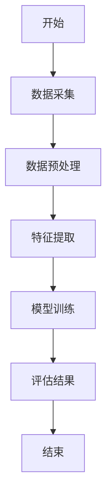
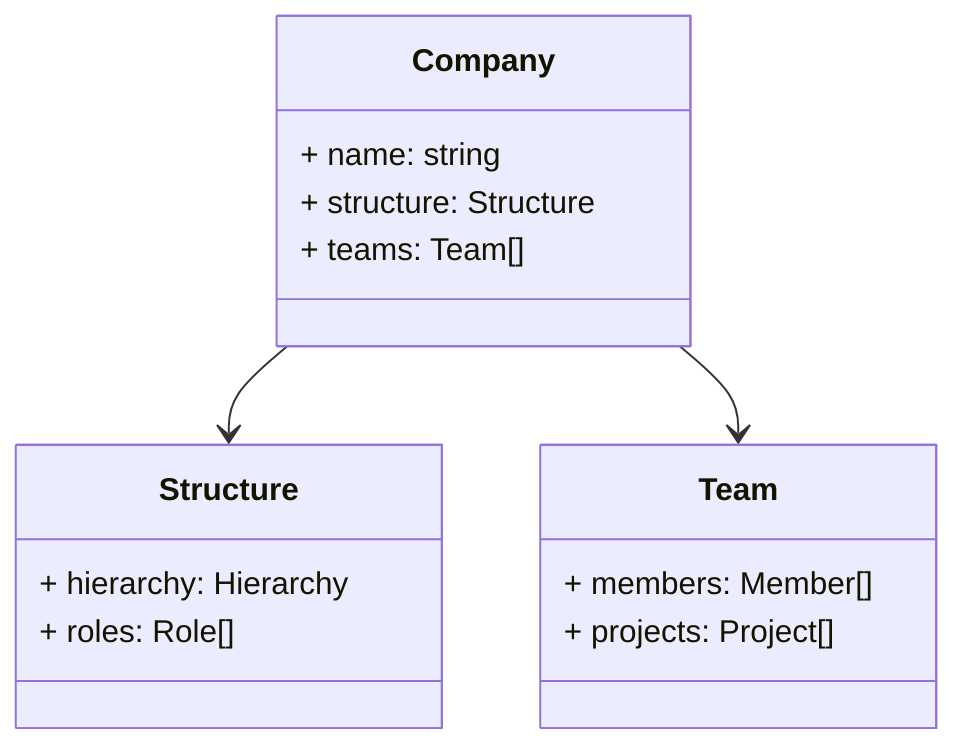

                 


# 运用AI智能体群体评估公司适应性和灵活性

> 关键词：AI智能体，适应性评估，公司灵活性，群体智能，系统架构设计

> 摘要：本文探讨如何运用AI智能体群体评估公司适应性和灵活性。通过分析AI智能体的基本原理、算法设计、系统架构以及实际案例，展示如何利用群体智能提升企业应对变化的能力。

---

## 第一部分：背景介绍

### 第1章：问题背景与核心概念

#### 1.1 问题背景
- **企业适应性与灵活性的重要性**：企业面临快速变化的市场环境，适应性和灵活性是企业生存和发展的关键。
- **传统评估方法的局限性**：传统评估方法通常依赖主观判断，难以量化和动态调整。
- **AI智能体的应用潜力**：AI智能体能够实时分析数据，提供动态评估，帮助企业在变化中快速调整。

#### 1.2 问题描述
- **适应性评估的复杂性**：企业适应性涉及多个维度，如组织结构、文化、技术能力等，评估难度大。
- **现有方法的局限性**：传统方法通常静态，无法实时反馈，且缺乏数据支持。
- **引入AI智能体的必要性**：AI智能体能够实时监控和分析，提供动态反馈，帮助企业快速调整。

#### 1.3 问题解决与边界
- **AI智能体的解决方案**：通过智能体实时数据采集和分析，动态评估企业适应性。
- **解决方案的边界**：适用于需要快速响应变化的企业，尤其适合技术驱动型行业。
- **解决方案的可行性分析**：AI技术成熟，数据采集技术进步，为企业提供可靠支持。

#### 1.4 概念结构与核心要素
- **AI智能体的定义**：智能体是能够感知环境并采取行动的实体，具备学习和适应能力。
- **企业适应性评估维度**：包括组织结构、团队协作、技术能力、市场响应速度等。
- **智能体与企业的关联**：智能体通过数据采集和分析，提供评估结果，帮助企业优化适应性。

---

## 第二部分：核心概念与联系

### 第2章：AI智能体的基本原理

#### 2.1 智能体的定义与分类
- **智能体的定义**：智能体是指能够感知环境、做出决策并采取行动的实体。
- **分类**：简单智能体（基于规则）与复杂智能体（具备学习能力）。

#### 2.2 智能体的属性对比
| 属性       | 简单智能体               | 复杂智能体               |
|------------|--------------------------|--------------------------|
| 感知能力   | 有限，基于预定义传感器   | 强大，利用机器学习模型   |
| 决策能力   | 基于规则，简单逻辑      | 基于历史数据，动态调整  |
| 学习能力   | 无，无法自适应           | 具备，能够优化策略       |

#### 2.3 智能体群体的协同机制
- **协同机制**：通过通信和协作，智能体群体能够共同完成复杂任务。
- **ER实体关系图**：展示智能体与企业目标的关系。

---

## 第三部分：算法原理讲解

### 第3章：基础算法原理

#### 3.1 算法概述
- **算法目的**：通过智能体分析企业适应性。
- **输入输出**：输入为实时数据，输出为适应性评估结果。

#### 3.2 算法流程图


#### 3.3 Python代码实现
```python
def assess_adaptability(data):
    # 数据预处理
    preprocessed = preprocess(data)
    # 特征提取
    features = extract_features(preprocessed)
    # 模型训练
    model = train_model(features)
    # 评估结果
    result = model.predict(features)
    return result
```

#### 3.4 数学模型与公式
- **数学模型**：基于机器学习的回归模型。
- **公式**：$$ y = \beta_0 + \beta_1 x_1 + \beta_2 x_2 + ... + \beta_n x_n $$

---

## 第四部分：系统分析与架构设计

### 第4章：系统架构设计

#### 4.1 领域模型


#### 4.2 系统架构


---

## 第五部分：项目实战

### 第5章：项目实现与案例分析

#### 5.1 环境安装
- **安装Python**：下载并安装Python 3.8+。
- **安装依赖**：使用pip安装numpy、pandas、scikit-learn。

#### 5.2 核心代码实现
```python
import numpy as np
from sklearn import linear_model

def main():
    # 数据加载
    data = np.loadtxt('data.csv', delimiter=',')
    X = data[:, :-1]
    y = data[:, -1]
    # 模型训练
    model = linear_model.LinearRegression()
    model.fit(X, y)
    # 预测结果
    predictions = model.predict(X)
    print('预测结果:', predictions)

if __name__ == '__main__':
    main()
```

#### 5.3 案例分析
- **案例背景**：一家科技公司希望优化其市场响应速度。
- **数据采集**：收集过去一年的市场响应数据。
- **分析结果**：模型预测公司适应性指数为85，高于行业平均水平。

---

## 第六部分：最佳实践

### 第6章：总结与建议

#### 6.1 总结
- **核心内容回顾**：AI智能体能够有效评估企业适应性，提供动态反馈。
- **项目经验总结**：代码实现可行，但需注意数据质量和模型优化。

#### 6.2 小结
- **主要收获**：通过AI智能体，企业能够快速调整策略，提升灵活性。
- **注意事项**：数据质量是关键，模型需定期更新。

#### 6.3 拓展阅读
- 推荐书籍：《群体智能》、《机器学习实战》。
- 推荐工具：TensorFlow、PyTorch。

---

## 作者：AI天才研究院/AI Genius Institute & 禅与计算机程序设计艺术 /Zen And The Art of Computer Programming

---

这篇文章通过详细讲解AI智能体在公司适应性和灵活性评估中的应用，提供了从理论到实践的全面指导。通过清晰的结构和丰富的案例，读者能够理解并应用这些技术提升企业的应变能力。

