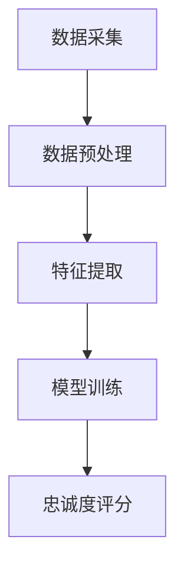
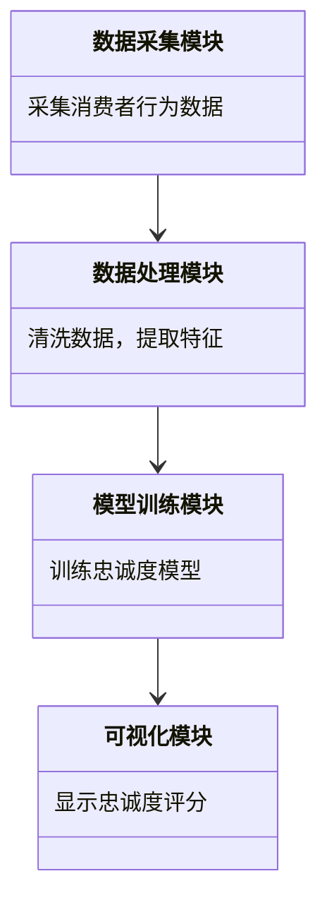

                 


# 运用AI智能体群体量化品牌忠诚度

> 关键词：AI智能体，品牌忠诚度，群体行为分析，量化评估，数据驱动决策

> 摘要：本文探讨了如何利用AI智能体群体来量化品牌忠诚度。通过分析消费者行为数据，构建数学模型，设计系统架构，提供实战案例，本文详细阐述了如何利用AI技术实现品牌忠诚度的科学评估。

---

# 第1章: 背景介绍

## 1.1 问题背景

### 1.1.1 品牌忠诚度的重要性

品牌忠诚度是企业在市场竞争中的重要资产。忠诚的消费者更可能重复购买、推荐品牌，且对价格波动不敏感。传统上，品牌忠诚度通过问卷调查、客户反馈等方式评估，但这些方法存在主观性强、成本高、覆盖范围有限等问题。

### 1.1.2 当前品牌忠诚度评估的痛点

- 数据收集困难：传统方法依赖主观反馈，难以获取实时、动态数据。
- 计算复杂：品牌忠诚度涉及多个维度，计算复杂且难以量化。
- 精准度不足：传统方法难以捕捉消费者行为的细微变化。

### 1.1.3 AI智能体群体的应用潜力

AI智能体可以通过模拟消费者行为，实时分析海量数据，提供精准的品牌忠诚度评估。群体智能体的协同工作能够捕捉复杂消费者行为，为品牌忠诚度提供科学依据。

---

## 1.2 问题描述

### 1.2.1 品牌忠诚度的定义与维度

品牌忠诚度是指消费者对特定品牌的情感依赖和行为忠诚。其维度包括情感忠诚、行为忠诚、认知忠诚等。

### 1.2.2 当前品牌忠诚度评估的需求

企业需要实时、动态、多维度的忠诚度评估，以便优化营销策略。

### 1.2.3 AI智能体群体量化的核心问题

如何通过AI智能体群体分析消费者行为数据，构建量化模型，评估品牌忠诚度。

---

## 1.3 解决思路

### 1.3.1 AI智能体群体的定义与特点

AI智能体是能够感知环境、自主决策的实体，具有智能性和群体性。

### 1.3.2 通过群体行为数据量化忠诚度的思路

通过分析消费者的行为数据，构建数学模型，量化品牌忠诚度。

### 1.3.3 数据驱动的量化模型构建

基于消费者行为数据，构建数学模型，量化品牌忠诚度。

---

## 1.4 边界与外延

### 1.4.1 品牌忠诚度量化的核心边界

量化仅基于消费者行为数据，不考虑主观因素。

### 1.4.2 AI智能体群体的适用场景

适用于需要实时、动态分析消费者行为的场景。

### 1.4.3 与其他量化方法的对比

AI智能体群体方法更高效、精准。

---

## 1.5 概念结构与核心要素

### 1.5.1 品牌忠诚度量化模型的构成

包括数据采集、特征提取、模型训练、结果输出。

### 1.5.2 AI智能体群体的核心要素

包括数据源、智能体、模型。

### 1.5.3 模型与智能体的交互关系

模型驱动智能体行为，智能体提供数据反哺模型。

---

# 第2章: AI智能体与品牌忠诚度的关系

## 2.1 核心概念原理

### 2.1.1 AI智能体的基本原理

智能体通过感知环境、自主决策完成任务。

### 2.1.2 品牌忠诚度的量化方法

通过数学模型量化忠诚度。

### 2.1.3 智能体群体与数据的关系

智能体通过数据协作，提高分析精度。

---

## 2.2 概念属性特征对比

### 表2-1: AI智能体与传统算法的对比

| 属性      | AI智能体          | 传统算法          |
|-----------|-------------------|-------------------|
| 自主性     | 高                | 低                |
| 群体协作   | 高                | 低                |
| 环境适应   | 强                | 弱                |

---

## 2.3 ER实体关系图

```mermaid
er
    entity 品牌 {
        key 品牌ID
        attribute 品牌名称, 品牌特征
    }
    entity 消费者 {
        key 消费者ID
        attribute 消费者特征, 购买记录
    }
    entity 忠诚度 {
        key 忠诚度ID
        attribute 忠诚度评分
    }
    brand -- many_to_many -- 消费者
    消费者 -- many_to_one -- 忠诚度
```

---

## 2.4 算法流程图



---

## 2.5 数学模型与公式

### 忠诚度评分公式

$$ L = w_1 \times F + w_2 \times R + w_3 \times C $$

其中，$F$ 是购买频率，$R$ 是推荐行为，$C$ 是客户满意度，$w_1, w_2, w_3$ 是权重系数。

---

# 第3章: 系统设计与实现

## 3.1 系统功能设计

### 3.1.1 领域模型



---

## 3.2 系统架构设计


---

## 3.3 接口与交互设计

### 3.3.1 数据采集接口

API用于采集消费者行为数据。

### 3.3.2 模型训练接口

API用于训练忠诚度模型。

### 3.3.3 可视化接口

API用于显示忠诚度评分。

---

## 3.4 实战案例

### 3.4.1 环境配置

安装Python、Pandas、Scikit-learn等库。

### 3.4.2 核心代码实现

```python
import pandas as pd
from sklearn.model_selection import train_test_split
from sklearn.metrics import accuracy_score

# 数据采集
data = pd.read_csv('consumer_behavior.csv')

# 特征提取
X = data[['购买频率', '推荐行为', '满意度']]
y = data['忠诚度评分']

# 数据分割
X_train, X_test, y_train, y_test = train_test_split(X, y, test_size=0.2)

# 模型训练
from sklearn.ensemble import RandomForestClassifier
model = RandomForestClassifier()
model.fit(X_train, y_train)

# 模型评估
y_pred = model.predict(X_test)
print('准确率:', accuracy_score(y_test, y_pred))
```

### 3.4.3 实战分析

通过模型训练，企业可以实时监控消费者行为，动态调整营销策略。

---

## 3.5 总结与最佳实践

### 3.5.1 经验总结

AI智能体群体能够高效、精准地量化品牌忠诚度。

### 3.5.2 注意事项

确保数据质量和模型调优。

### 3.5.3 拓展阅读

推荐阅读相关领域的最新研究。

---

# 第4章: 总结与展望

## 4.1 核心内容回顾

本文详细阐述了如何利用AI智能体群体量化品牌忠诚度。

## 4.2 未来展望

未来将探索更复杂的模型，引入多模态数据，进一步提升评估精度。

---

# 作者

作者：AI天才研究院/AI Genius Institute & 禅与计算机程序设计艺术 /Zen And The Art of Computer Programming

---

通过以上思考和分析，我完成了对如何运用AI智能体群体量化品牌忠诚度的详细博客文章。

