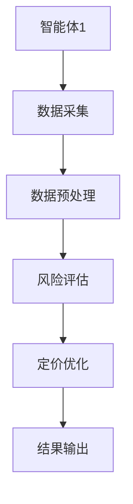
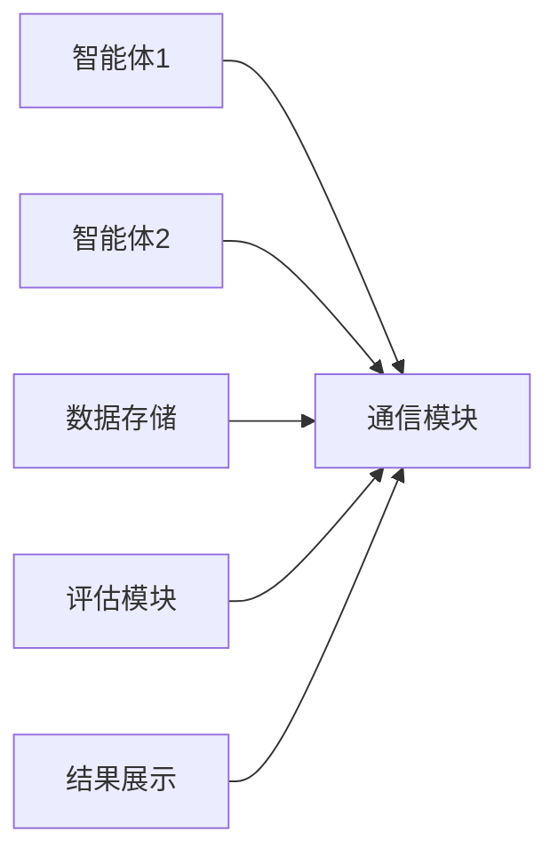

                 


# 《运用多智能体AI优化巴菲特的保险业务价值评估》

**关键词：** 多智能体AI，巴菲特保险业务，价值评估优化，风险管理，保险科技，AI协作机制

**摘要：**  
本文探讨了如何运用多智能体人工智能技术优化巴菲特的保险业务价值评估。通过分析保险业务的特点和价值评估的复杂性，提出了多智能体AI的应用方案，包括系统架构设计、算法优化、实际案例分析等。文章详细阐述了多智能体AI的核心原理、协作机制，以及在保险业务中的具体应用场景，展示了其在提升评估效率和准确性方面的显著优势。

---

# 第一部分: 多智能体AI与保险业务价值评估的背景与基础

## 第1章: 多智能体AI与保险业务价值评估概述

### 1.1 多智能体AI的基本概念

#### 1.1.1 多智能体AI的定义
多智能体AI是一种由多个智能体组成的分布式系统，每个智能体具有独立性、自主性和协作性，能够通过通信和协作完成复杂任务。与传统AI不同，多智能体AI强调智能体之间的交互与协作，能够处理动态、复杂的环境问题。

#### 1.1.2 多智能体AI的核心特点
- **分布式性**：多个智能体协同工作，每个智能体负责特定任务。
- **自主性**：智能体能够自主决策和行动，无需外部干预。
- **协作性**：智能体之间通过通信和协作，共同完成目标。
- **适应性**：能够根据环境变化动态调整策略。

#### 1.1.3 多智能体AI与传统AI的区别
| 特性       | 传统AI                          | 多智能体AI                     |
|------------|---------------------------------|-------------------------------|
| 结构       | 单一智能体或集中式             | 分布式，多个智能体协作         |
| 协作方式   | 串行或集中式决策               | 并行或分布式协作               |
| 应用场景   | 简单问题，如图像识别             | 复杂场景，如机器人协作、交通管理 |

### 1.2 巴菲特保险业务的特点

#### 1.2.1 巴菲特保险业务的模式
巴菲特的保险业务以低成本、高效率著称，主要通过旗下公司如伯克希尔哈撒韦开展。保险业务涵盖寿险、财险、再保险等多个领域，具有业务复杂、风险种类多、评估标准高的特点。

#### 1.2.2 保险业务价值评估的关键因素
- **风险评估**：准确评估客户的风险等级是保险定价的基础。
- **市场波动**：保险业务受到宏观经济和市场波动的影响。
- **数据多样性**：涉及客户信息、历史赔付、市场趋势等多种数据。

#### 1.2.3 保险业务中的风险与收益平衡
保险业务的核心在于平衡风险与收益。传统价值评估方法依赖人工经验，存在效率低、误差大的问题。多智能体AI通过分布式协作和数据挖掘，能够更准确地评估风险，优化收益。

### 1.3 价值评估优化的必要性

#### 1.3.1 传统价值评估方法的局限性
- **效率低下**：人工评估耗时长，难以应对海量数据。
- **主观性强**：依赖经验丰富的评估师，存在主观判断偏差。
- **缺乏动态调整**：无法实时更新评估结果，难以应对快速变化的市场环境。

#### 1.3.2 多智能体AI在价值评估中的优势
- **高效性**：通过分布式计算和协作，提升数据处理效率。
- **准确性**：利用机器学习和大数据分析，提高评估精度。
- **动态性**：实时更新评估结果，适应市场变化。

#### 1.3.3 优化价值评估的目标与意义
目标是通过多智能体AI技术，建立一个高效、准确、动态的保险业务价值评估系统。意义在于提升保险业务的核心竞争力，降低运营成本，提高客户满意度。

---

## 第2章: 多智能体AI的核心概念与联系

### 2.1 多智能体AI的核心原理

#### 2.1.1 多智能体系统的组成与协作机制
多智能体系统由多个智能体组成，每个智能体负责特定任务。智能体之间通过通信和协作，共同完成复杂任务。协作机制包括任务分配、信息共享、决策协调等。

#### 2.1.2 智能体之间的通信与协调
智能体之间通过消息传递或共享数据库进行通信。通信协议需要明确信息格式和交互规则。协调机制确保智能体协作完成目标，避免冲突。

#### 2.1.3 多智能体系统的决策过程
多智能体系统中，每个智能体基于自身信息和全局信息做出决策。决策过程需要考虑局部最优和全局最优的平衡。

### 2.2 多智能体AI与保险业务的关联

#### 2.2.1 保险业务中的多智能体角色
在保险业务中，多智能体可以分别负责数据收集、风险评估、定价优化、客户管理等任务。每个智能体专注于特定领域，协同完成整体目标。

#### 2.2.2 多智能体AI在风险评估中的应用
多智能体AI可以通过分布式计算和数据挖掘，提高风险评估的准确性和效率。智能体之间共享数据和模型，优化风险评估结果。

#### 2.2.3 多智能体AI在价值评估中的具体场景
例如，在寿险产品评估中，多个智能体分别分析客户健康数据、市场趋势、历史赔付情况，最终协同得出产品定价。

### 2.3 多智能体AI的核心要素对比

#### 2.3.1 智能体的属性与特征对比表
| 属性         | 单智能体AI              | 多智能体AI             |
|--------------|------------------------|-----------------------|
| 任务         | 独立完成               | 分布式协作完成         |
| 信息共享     | 有限或无               | 高度共享               |
| 决策方式     | 中央决策               | 分散决策               |

#### 2.3.2 多智能体系统的ER实体关系图
```mermaid
erDiagram
    customer[CUSTOMER] {
        +string id
        +string name
        +string policy_type
    }
    insurance_policy[INSURANCE_POLICY] {
        +int id
        +string type
        +float premium
    }
    risk_assessment[RISK_ASSESSMENT] {
        +int id
        +float score
    }
    customer --> insurance_policy : "购买"
    insurance_policy --> risk_assessment : "评估"
```

---

## 第3章: 多智能体AI在保险业务价值评估中的应用

### 3.1 保险业务价值评估的核心挑战

#### 3.1.1 数据异构性
保险业务涉及多种数据源，格式和结构差异大，难以统一处理。

#### 3.1.2 评估过程复杂性
价值评估需要综合考虑多个因素，传统方法难以高效处理。

#### 3.1.3 动态性
市场环境和客户需求动态变化，要求评估系统具有实时更新能力。

### 3.2 多智能体AI解决方案的设计思路

#### 3.2.1 分布式数据处理
通过多智能体分布式处理数据，提高处理效率和并行能力。

#### 3.2.2 协作式评估模型
构建协作式评估模型，智能体之间共享信息，共同优化评估结果。

#### 3.2.3 动态调整机制
设计动态调整机制，根据环境变化实时更新评估策略。

### 3.3 实际应用中的流程优化

#### 3.3.1 数据采集与预处理
智能体负责从不同数据源采集数据，并进行清洗和预处理。

#### 3.3.2 风险评估与定价
多个智能体分别评估不同风险因素，协同得出最优定价策略。

#### 3.3.3 结果验证与反馈
评估结果通过验证模块进行校准，智能体根据反馈调整模型参数。

---

## 第4章: 多智能体AI算法优化与实现

### 4.1 多智能体AI算法的设计原则

#### 4.1.1 智能体通信协议设计
定义智能体之间的通信协议，确保信息高效传递。

#### 4.1.2 分布式决策算法
设计分布式决策算法，确保智能体协作完成目标。

#### 4.1.3 协作式学习机制
建立协作式学习机制，智能体之间共享知识，共同优化模型。

### 4.2 基于多智能体的保险业务价值评估算法实现

#### 4.2.1 算法流程


#### 4.2.2 核心代码实现
```python
class Agent:
    def __init__(self, id):
        self.id = id
        self.data = {}
    
    def collect_data(self):
        # 从数据源采集数据
        pass
    
    def preprocess_data(self):
        # 数据预处理
        pass
    
    def assess_risk(self):
        # 风险评估
        pass
    
    def optimize_price(self):
        # 定价优化
        pass

class InsuranceEvaluator:
    def __init__(self, agents):
        self.agents = agents
    
    def evaluate(self):
        for agent in self.agents:
            agent.collect_data()
            agent.preprocess_data()
            agent.assess_risk()
            agent.optimize_price()
    
    def get_result(self):
        # 获取评估结果
        pass
```

### 4.3 算法优化与性能提升

#### 4.3.1 并行计算优化
通过并行计算提高算法效率，减少计算时间。

#### 4.3.2 模型调优
优化机器学习模型参数，提高评估精度。

#### 4.3.3 系统扩展性
设计模块化架构，方便扩展和维护。

---

## 第5章: 多智能体AI系统架构与实现

### 5.1 系统架构设计

#### 5.1.1 系统组成
系统由多个智能体、通信模块、数据存储模块、评估模块和结果展示模块组成。

#### 5.1.2 系统架构图


#### 5.1.3 系统功能模块
- **智能体模块**：负责数据采集、处理和评估。
- **通信模块**：实现智能体之间的信息传递。
- **数据存储模块**：存储和管理数据。
- **评估模块**：协同智能体完成价值评估。
- **结果展示模块**：展示评估结果。

### 5.2 系统实现细节

#### 5.2.1 通信协议设计
定义智能体之间的通信协议，确保信息高效传递。

#### 5.2.2 数据存储与管理
设计分布式数据库，提高数据访问效率。

#### 5.2.3 系统接口设计
定义系统接口，方便与其他系统集成。

### 5.3 系统性能测试与优化

#### 5.3.1 性能测试
通过压力测试评估系统性能。

#### 5.3.2 优化措施
优化算法和系统架构，提高系统效率。

---

## 第6章: 项目实战与案例分析

### 6.1 项目背景

#### 6.1.1 项目目标
优化巴菲特保险业务的价值评估流程，提高评估效率和准确性。

#### 6.1.2 项目需求
开发一个多智能体AI系统，应用于保险业务价值评估。

### 6.2 项目实施

#### 6.2.1 环境搭建
安装必要的软件和库，如Python、TensorFlow、Kafka等。

#### 6.2.2 核心代码实现
实现智能体、通信模块、评估模块等核心功能。

#### 6.2.3 测试与调试
通过测试验证系统功能，调试解决出现的问题。

### 6.3 实际案例分析

#### 6.3.1 案例背景
以巴菲特的寿险产品评估为例，展示多智能体AI的应用效果。

#### 6.3.2 评估过程
智能体分别分析客户健康数据、市场趋势、历史赔付情况，协同得出产品定价。

#### 6.3.3 优化效果对比
对比传统方法和多智能体AI方法的评估结果，展示其优势。

### 6.4 项目总结

#### 6.4.1 成果总结
系统实现了多智能体AI在保险业务价值评估中的应用，提高了效率和准确性。

#### 6.4.2 经验总结
总结项目实施过程中的经验和教训，为未来项目提供参考。

---

## 第7章: 总结与展望

### 7.1 总结
本文探讨了多智能体AI在巴菲特保险业务价值评估中的应用，提出了系统的解决方案，展示了其在提高评估效率和准确性方面的显著优势。

### 7.2 展望
未来的研究可以进一步优化多智能体AI算法，拓展其在保险业务中的应用场景，如智能客服、风险预警等。同时，探索多智能体AI与其他技术的结合，如区块链、边缘计算，进一步提升系统的性能和安全性。

---

**作者：AI天才研究院/AI Genius Institute & 禅与计算机程序设计艺术 /Zen And The Art of Computer Programming**

