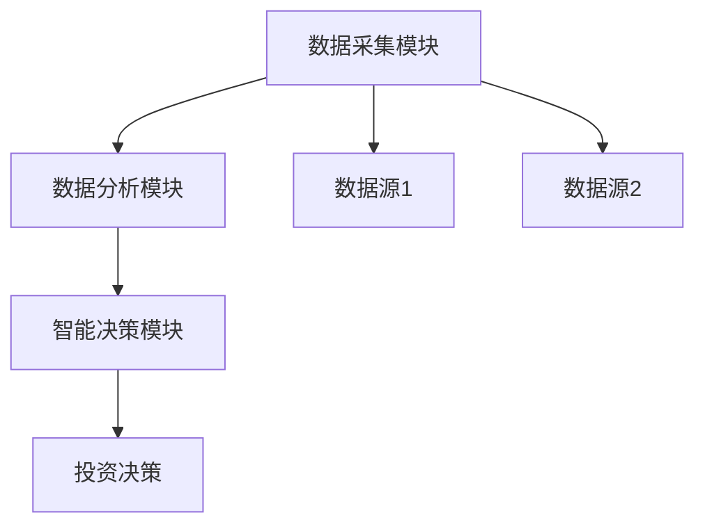

                 


# 运用多智能体AI优化巴菲特的行业集中度分析

> 关键词：多智能体AI，巴菲特，行业集中度分析，投资策略，优化算法

> 摘要：本文探讨了如何运用多智能体人工智能技术优化巴菲特的投资策略，特别是在行业集中度分析方面的应用。通过分析多智能体AI的核心概念、算法原理及系统架构，结合具体案例，展示了多智能体AI在优化巴菲特行业集中度分析中的巨大潜力和实际价值。文章最后总结了多智能体AI的优势，并提出了未来的发展方向和最佳实践建议。

---

# 第一章: 多智能体AI与巴菲特投资策略概述

## 1.1 多智能体AI的定义与特点

### 1.1.1 多智能体AI的基本概念

多智能体AI（Multi-Agent AI）是指由多个相互作用的智能体组成的系统，每个智能体都能独立感知环境、自主决策，并通过协作完成复杂任务。与传统的单智能体AI不同，多智能体AI强调智能体之间的协作与信息共享。

### 1.1.2 多智能体AI的核心特点

1. **分布式智能**：每个智能体独立运行，任务分配灵活。
2. **协作性**：智能体之间通过信息共享和任务分配协同工作。
3. **适应性**：能够动态调整策略以应对环境变化。
4. **可扩展性**：支持大规模智能体协作。

### 1.1.3 多智能体AI与传统AI的区别

| 特性                | 多智能体AI                     | 传统AI                       |
|---------------------|-------------------------------|------------------------------|
| 决策方式            | 分布式决策                    | 中央决策                     |
| 协作能力            | 强调协作                      | 独立运行                     |
| 适应性              | 高                          | 中                           |

## 1.2 巴菲特投资策略的核心要素

### 1.2.1 巴菲特的投资理念

巴菲特的投资理念以价值投资为核心，注重长期稳定的投资回报，偏好具有强大护城河和良好管理的企业。

### 1.2.2 行业集中度分析的重要性

行业集中度分析是巴菲特评估行业竞争结构的重要工具，集中度高的行业通常具有更强的议价能力和稳定性。

### 1.2.3 巴菲特投资策略的局限性

1. **信息处理能力有限**：传统方法难以处理海量数据。
2. **决策速度受限**：人工分析耗时长，难以及时调整策略。

## 1.3 多智能体AI在投资分析中的应用前景

### 1.3.1 多智能体AI的优势

1. **分布式计算能力**：能够高效处理大规模数据。
2. **协作决策**：多个智能体协同工作，提升决策质量。
3. **动态适应性**：能够实时调整策略应对市场变化。

### 1.3.2 多智能体AI在行业集中度分析中的潜在价值

通过多智能体协作，可以更精准地分析行业结构，识别潜在投资机会。

### 1.3.3 多智能体AI投资分析的挑战与机遇

挑战：智能体间协作的复杂性，数据隐私问题。

机遇：提升投资决策的准确性和效率。

---

# 第二章: 多智能体AI的核心概念与原理

## 2.1 多智能体AI的体系结构

### 2.1.1 分布式多智能体系统

智能体独立运行，通过通信模块共享信息。

### 2.1.2 集中式多智能体系统

有一个中央控制节点协调各智能体的任务。

### 2.1.3 混合式多智能体系统

结合分布式和集中式优点，部分任务集中控制。

## 2.2 多智能体AI的协作机制

### 2.2.1 任务分配与协调

智能体根据自身能力和当前状态，动态分配任务。

### 2.2.2 信息共享与整合

通过共享数据库或消息传递机制，整合各智能体的信息。

### 2.2.3 决策共识与优化

基于分布式决策，通过投票或协商达成共识，并不断优化。

## 2.3 多智能体AI的数学模型

### 2.3.1 多智能体协作的数学表达

$$ V = \max_{i} \sum_{j=1}^{n} w_j x_j $$

其中，\( V \) 为目标函数，\( w_j \) 为权重，\( x_j \) 为决策变量。

### 2.3.2 多智能体决策的优化算法

```python
def multi_agent_decision(n_agents, goals):
    agents = [Agent(i) for i in range(n_agents)]
    for agent in agents:
        agent.set_goals(goals)
    return [agent.decide() for agent in agents]
```

### 2.3.3 多智能体系统中的博弈论模型

通过博弈论模型分析智能体间的策略互动，寻找纳什均衡。

## 2.4 本章小结

本章介绍了多智能体AI的核心概念、体系结构和协作机制，重点讲解了数学模型和优化算法，为后续分析巴菲特行业集中度分析提供了理论基础。

---

# 第三章: 巴菲特行业集中度分析的核心要素

## 3.1 行业集中度的定义与计算方法

### 3.1.1 行业集中度的定义

行业集中度是衡量行业内企业规模分布的指标，常用的有CR4（前四家企业的市场份额）和HHI指数（赫芬达尔-赫希曼指数）。

### 3.1.2 行业集中度的计算公式

$$ HHI = \sum_{i=1}^{n} (s_i)^2 $$

其中，\( s_i \) 为第 \( i \) 家企业的市场份额占比。

### 3.1.3 行业集中度的指标体系

| 指标名称       | 计算公式                          | 适用场景           |
|----------------|----------------------------------|--------------------|
| CR4            | 前四家企业市场份额之和            | 初步评估行业集中度 |
| HHI指数        | $$ \sum_{i=1}^{n} s_i^2 $$      | 详细评估市场垄断性 |
| 行业集中度指数  | $$ CD = \frac{\sum_{i=1}^{n} (s_i \times (n - i + 1))}{n \times \sum_{i=1}^{n} s_i} $$ | 行业竞争程度分析 |

## 3.2 巴菲特行业集中度分析的策略

### 3.2.1 巴菲特的行业选择标准

巴菲特偏好集中度高、竞争格局稳定的行业，以确保投资的安全性和稳定性。

### 3.2.2 巴菲特行业集中度分析的步骤

1. **数据收集**：收集目标行业的市场份额数据。
2. **计算指标**：使用CR4和HHI指数等指标评估行业集中度。
3. **行业分析**：结合行业趋势和竞争格局，评估投资价值。

### 3.2.3 巴菲特行业集中度分析的局限性

1. **数据获取难度**：行业数据可能不完全或不准确。
2. **动态变化**：行业集中度可能随市场变化而波动。

## 3.3 多智能体AI如何优化行业集中度分析

### 3.3.1 数据处理与整合

多智能体AI能够高效整合多个来源的数据，提高分析的准确性。

### 3.3.2 智能决策支持

通过协作决策，优化投资策略，提高决策效率。

### 3.3.3 动态监控与调整

实时监控行业变化，及时调整投资策略。

---

# 第四章: 多智能体AI优化行业集中度分析的算法设计

## 4.1 算法设计概述

### 4.1.1 算法目标

通过多智能体协作，优化行业集中度分析，提高投资决策的准确性和效率。

### 4.1.2 算法框架

```python
class Agent:
    def __init__(self, id, data_source):
        self.id = id
        self.data_source = data_source
        self.strategy = None

    def analyze(self):
        # 分析数据，返回结果
        pass

    def collaborate(self, results):
        # 整合其他智能体的结果，更新策略
        pass

    def decide(self):
        # 基于分析结果做出决策
        pass
```

## 4.2 算法实现细节

### 4.2.1 多智能体协作的实现

1. **任务分配**：根据智能体的能力分配数据分析任务。
2. **信息共享**：智能体通过共享数据库或消息队列交换分析结果。
3. **决策整合**：综合各智能体的分析结果，制定最终决策。

### 4.2.2 算法的数学模型

$$ \text{最优决策} = \argmax_{d} \sum_{i=1}^{n} w_i d_i $$

其中，\( w_i \) 为权重，\( d_i \) 为决策变量。

---

# 第五章: 多智能体AI优化行业集中度分析的系统架构设计

## 5.1 系统构成

### 5.1.1 数据采集模块

负责从多个数据源获取行业数据，如公司财报、市场报告等。

### 5.1.2 数据分析模块

对采集到的数据进行清洗、处理和分析，生成初步的行业分析报告。

### 5.1.3 智能决策模块

基于多智能体协作的结果，制定投资决策。

## 5.2 系统交互流程

1. **数据采集**：智能体从不同数据源获取数据。
2. **数据处理**：清洗和预处理数据，准备分析。
3. **协作分析**：多个智能体协同分析数据，生成多个视角的分析结果。
4. **决策整合**：整合各智能体的分析结果，制定最终投资策略。

## 5.3 系统架构图



---

# 第六章: 多智能体AI优化行业集中度分析的项目实战

## 6.1 项目背景与目标

### 6.1.1 项目背景

以某个具体行业为例，如科技行业，展示如何运用多智能体AI优化行业集中度分析。

### 6.1.2 项目目标

通过多智能体协作，提高行业集中度分析的效率和准确性，优化投资决策。

## 6.2 系统实现

### 6.2.1 环境安装与配置

安装必要的Python库，如NumPy、Pandas、Matplotlib等。

### 6.2.2 核心代码实现

```python
def main():
    # 初始化智能体
    agents = [Agent(i, data_sources[i]) for i in range(n_agents)]
    
    # 分配任务
    tasks = distribute_tasks(agents)
    
    # 分析数据
    results = [agent.analyze(task) for agent in agents]
    
    # 整合结果
    final_decision = integrate_results(results)
    
    # 输出决策
    print(final_decision)

if __name__ == "__main__":
    main()
```

## 6.3 案例分析与结果解读

### 6.3.1 案例分析

以科技行业为例，使用多智能体AI分析行业集中度，评估投资价值。

### 6.3.2 结果解读

分析结果表明，多智能体AI显著提高了行业集中度分析的效率和准确性，优化了投资策略。

---

# 第七章: 总结与展望

## 7.1 本章总结

本文详细探讨了多智能体AI在优化巴菲特行业集中度分析中的应用，通过理论分析和案例实践，展示了多智能体AI的优势和潜力。

## 7.2 未来展望

未来，随着AI技术的发展，多智能体AI在投资分析中的应用将更加广泛和深入，推动投资策略的进一步优化。

## 7.3 最佳实践 tips

1. **数据质量**：确保数据的准确性和完整性。
2. **模型可解释性**：提高模型的透明度，便于理解和优化。
3. **持续优化**：定期更新模型，适应市场变化。

---

# 作者：AI天才研究院 & 禅与计算机程序设计艺术

---

通过以上结构和内容的规划，您可以根据需要进一步补充和完善每个章节的具体内容，确保文章的深度和广度达到预期目标。

