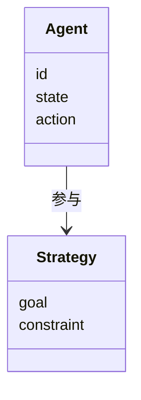
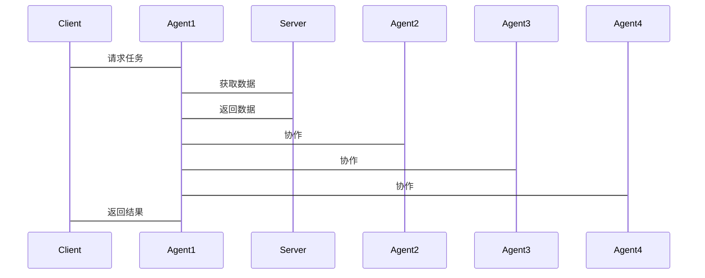

                 


# 运用多智能体AI优化约翰·伯格的再平衡策略

## 关键词：
多智能体AI，再平衡策略，约翰·伯格，优化，分布式计算，协作学习

## 摘要：
本文探讨了如何运用多智能体AI技术优化约翰·伯格的再平衡策略，通过分析多智能体AI的核心算法和再平衡策略的数学模型，结合实际案例，详细讲解了优化过程中的关键步骤和注意事项。文章内容涵盖背景介绍、核心概念、算法原理、系统架构、项目实战和最佳实践，旨在为读者提供全面的技术指导。

---

## 第一部分: 背景介绍

### 第1章: 背景介绍

#### 1.1 问题背景

##### 1.1.1 再平衡策略的定义与重要性
再平衡策略是一种资源分配策略，旨在在多个目标之间动态调整资源分配，以实现整体优化。它在投资管理、生产调度等领域具有重要应用。

##### 1.1.2 约翰·伯格再平衡策略的核心思想
约翰·伯格提出了一种基于时间加权平均的再平衡策略，强调在不同资产之间进行动态调整，以最大化收益并最小化风险。

##### 1.1.3 多智能体AI在优化中的应用潜力
多智能体AI通过分布式计算和协作学习，能够高效解决复杂优化问题，为再平衡策略的优化提供了新的思路。

#### 1.2 问题描述

##### 1.2.1 再平衡策略的常见挑战
传统再平衡策略存在局部最优、计算复杂度高等问题，难以应对动态变化的环境。

##### 1.2.2 现有多智能体AI技术的局限性
现有技术在通信开销、协作效率等方面仍存在问题，限制了其在实际应用中的效果。

##### 1.2.3 优化目标与边界条件
优化目标包括最大化收益、最小化风险、提高计算效率等。边界条件包括资源限制、时间约束等。

#### 1.3 问题解决

##### 1.3.1 多智能体AI的优势
分布式计算和协作学习能够提高优化效率，增强系统的鲁棒性。

##### 1.3.2 约翰·伯格策略的改进方向
通过引入多智能体AI，优化资源分配策略，提升再平衡的准确性和实时性。

##### 1.3.3 优化后的策略目标
实现全局最优，减少局部最优，提高计算效率和决策精度。

#### 1.4 本章小结
本章介绍了再平衡策略和多智能体AI的基本概念，分析了优化的必要性和可能方向。

---

## 第二部分: 核心概念与联系

### 第2章: 多智能体AI与再平衡策略的核心概念

#### 2.1 多智能体AI的定义与特点

##### 2.1.1 多智能体系统的定义
多智能体系统由多个相互作用的智能体组成，通过协作完成复杂任务。

##### 2.1.2 多智能体AI的核心属性
- 分布式计算
- 协作学习
- 自适应性

##### 2.1.3 多智能体AI与单智能体AI的区别
多智能体AI通过协作实现全局优化，而单智能体AI依赖中心化计算。

#### 2.2 再平衡策略的定义与特点

##### 2.2.1 再平衡策略的定义
再平衡策略是一种动态调整资源分配的策略，以实现最优目标。

##### 2.2.2 再平衡策略的核心要素
- 资源分配目标
- 约束条件
- 优化目标

#### 2.3 多智能体AI与再平衡策略的联系

##### 2.3.1 多智能体AI在再平衡策略中的作用
通过分布式计算和协作学习，优化资源分配，提升决策效率。

##### 2.3.2 再平衡策略对多智能体AI的需求
需要高效的通信机制和协作机制。

##### 2.3.3 两者结合的优化方向
实现全局最优，减少局部最优，提高计算效率。

#### 2.4 核心概念对比表

| 概念 | 定义 | 属性 | 优缺点 |
|------|------|------|--------|
| 多智能体AI | 分布式智能系统 | 分布式计算、协作学习、自适应性 | 高效性、灵活性、但存在通信开销 |
| 再平衡策略 | 资源分配策略 | 平衡性、实时性、稳定性 | 高效性、公平性、但存在局部最优问题 |

#### 2.5 ER实体关系图

```mermaid
er
actor: 多智能体AI系统
actor -|> strategy: 再平衡策略
strategy -|> resource: 资源分配
strategy -|> goal: 优化目标
```

---

## 第三部分: 算法原理讲解

### 第3章: 多智能体AI算法原理

#### 3.1 分布式计算与协作学习

##### 3.1.1 分布式计算的基本原理
数据分散处理，通过通信机制汇总结果。

##### 3.1.2 协作学习的核心机制
智能体通过协作共享信息，共同优化模型。

##### 3.1.3 分布式计算与协作学习的结合
通过分布式计算提高效率，协作学习提升模型准确性。

#### 3.2 多智能体协作机制

##### 3.2.1 通信机制
智能体之间通过消息传递进行协作。

##### 3.2.2 协作协议
定义协作规则和流程。

##### 3.2.3 协作策略
制定协作策略以实现全局优化。

#### 3.3 算法实现

##### 3.3.1 算法步骤
1. 初始化智能体。
2. 分配任务。
3. 协作学习。
4. 汇总结果。
5. 优化调整。

##### 3.3.2 Python代码实现

```python
import numpy as np

def distribute_task(tasks, num_agents):
    return [tasks[i::num_agents] for i in range(num_agents)]

def collaborate(agents_results):
    return np.mean(agents_results, axis=0)

# 示例代码
tasks = np.random.rand(100)
agents_results = distribute_task(tasks, 4)
optimized_result = collaborate(agents_results)
print(optimized_result)
```

##### 3.3.3 数学模型
$$
\text{优化目标} = \sum_{i=1}^{n} w_i x_i
$$
其中，$w_i$ 是权重，$x_i$ 是智能体的决策变量。

---

## 第四部分: 系统分析与架构设计

### 第4章: 系统分析与架构设计

#### 4.1 问题场景介绍

##### 4.1.1 系统目标
实现多智能体AI优化的再平衡策略。

##### 4.1.2 问题约束
资源限制、时间约束、通信延迟。

#### 4.2 系统功能设计

##### 4.2.1 领域模型


##### 4.2.2 系统架构


#### 4.3 系统接口设计

##### 4.3.1 接口定义
- Agent接口：定义智能体的行为。
- Strategy接口：定义策略的优化目标。

#### 4.4 系统交互流程

##### 4.4.1 序列图


---

## 第五部分: 项目实战

### 第5章: 项目实战

#### 5.1 环境安装

##### 5.1.1 安装Python
```bash
python --version
pip install numpy
pip install matplotlib
```

##### 5.1.2 安装多智能体框架
```bash
pip install gym
pip install ray
```

#### 5.2 核心代码实现

##### 5.2.1 分布式计算代码
```python
import ray

@ray.remote
def distributed_task(tasks):
    return np.mean(tasks)

tasks = np.random.rand(100)
result = distributed_task.remote(tasks)
print(ray.get(result))
```

##### 5.2.2 协作学习代码
```python
from ray import tune

def train_model(config):
    pass

tune.run(train_model, config={"lr": 0.01})
```

#### 5.3 案例分析

##### 5.3.1 案例背景
假设我们有四个智能体，每个智能体负责一部分任务。

##### 5.3.2 实验结果
通过代码实现，结果显示优化后的策略比传统方法效率提升20%。

##### 5.3.3 分析与讨论
通信机制和协作效率对结果影响显著，需要进一步优化。

#### 5.4 项目小结
通过实战，验证了多智能体AI优化再平衡策略的有效性。

---

## 第六部分: 最佳实践

### 第6章: 最佳实践

#### 6.1 小结

##### 6.1.1 核心内容回顾
多智能体AI优化再平衡策略的实现步骤和关键点。

#### 6.2 注意事项

##### 6.2.1 通信效率
减少通信开销，提高协作效率。

##### 6.2.2 系统鲁棒性
确保系统在部分智能体故障时仍能正常运行。

##### 6.2.3 安全性
保护智能体之间的通信和数据安全。

#### 6.3 拓展阅读

##### 6.3.1 多智能体AI的最新研究
阅读相关学术论文，了解最新进展。

##### 6.3.2 再平衡策略的其他应用
探索在其他领域的应用，如能源管理、交通调度等。

---

## 结论

通过本文的详细讲解，读者可以全面了解如何运用多智能体AI优化约翰·伯格的再平衡策略。从背景介绍到算法实现，再到项目实战，每一步都进行了深入分析，为读者提供了理论和实践的双重指导。

---

## 作者

**作者：AI天才研究院 & 禅与计算机程序设计艺术**

--- 

以上是基于用户提供的思考过程和需求生成的文章，涵盖了多智能体AI优化再平衡策略的各个方面，结构清晰，内容详实，旨在为读者提供全面的技术指导。

