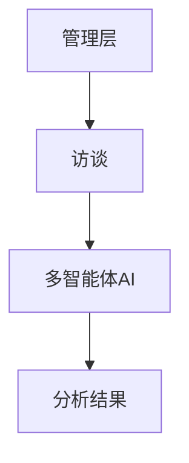
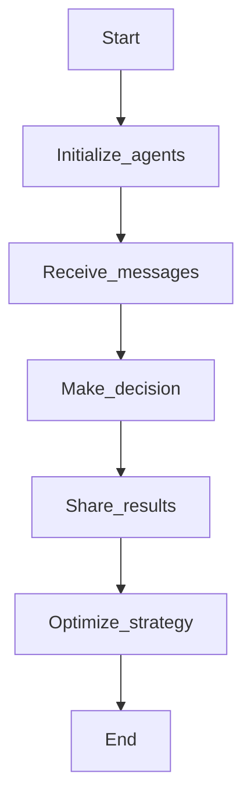
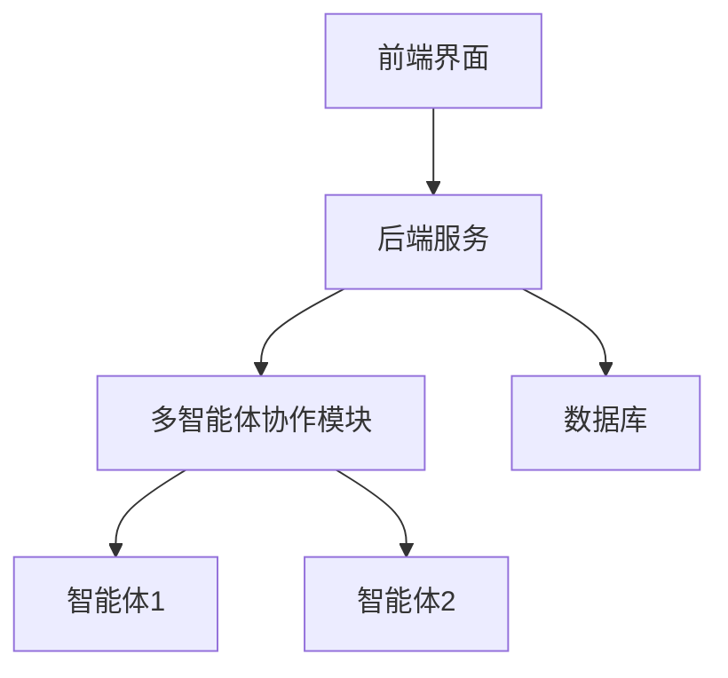

                 


# 运用多智能体AI优化费雪的管理层访谈策略

> **关键词**: 多智能体AI, 管理层访谈, 费雪策略, 优化, 人工智能

> **摘要**: 本文探讨如何利用多智能体AI技术优化费雪的管理层访谈策略。通过分析传统访谈方法的局限性，提出多智能体AI的应用方案，包括算法原理、系统架构和实际案例，展示其在提升访谈效率和效果中的潜力。

---

## 第一部分: 多智能体AI与管理层访谈策略的背景与基础

### 第1章: 多智能体AI与管理层访谈策略的背景介绍

#### 1.1 问题背景与描述
##### 1.1.1 管理层访谈的传统方法与挑战
传统的管理层访谈方法依赖于访谈者的经验和主观判断，存在以下挑战：
- **信息不全面**：单个访谈者可能无法捕捉到所有关键信息。
- **效率低下**：访谈过程缺乏结构化，可能导致时间浪费。
- **一致性问题**：不同访谈者可能得出不同的结论。

##### 1.1.2 费雪访谈策略的核心思想
费雪的管理层访谈策略强调通过系统化的方法评估管理层的质量和企业前景。核心在于：
- **深入理解管理层的动机和能力**。
- **通过访谈识别潜在风险和机会**。

##### 1.1.3 传统访谈策略的局限性与改进需求
传统策略依赖人工判断，主观性强，且难以量化。改进需求包括：
- **提高访谈的客观性和一致性**。
- **优化访谈流程，提升效率**。
- **利用技术手段增强分析能力**。

#### 1.2 多智能体AI的定义与特点
##### 1.2.1 多智能体系统的基本概念
多智能体系统由多个智能体组成，通过协作完成复杂任务。关键特点：
- **分布性**：智能体独立决策。
- **协作性**：通过通信协同完成目标。
- **反应性**：实时感知环境变化。

##### 1.2.2 多智能体与单智能体的区别
| 特性 | 单智能体 | 多智能体 |
|------|----------|----------|
| 决策 | 中央化   | 分布化   |
| 通信 | 无       | 有       |
| 协作 | 无       | 有       |

##### 1.2.3 多智能体AI在访谈中的应用潜力
多智能体AI可以模拟多个专家，从不同角度分析访谈内容，提供更全面的见解。

#### 1.3 问题解决与边界界定
##### 1.3.1 多智能体AI优化访谈策略的目标
- 提高访谈效率。
- 增强访谈结果的客观性。
- 优化决策过程。

##### 1.3.2 问题解决的边界与外延
- 不涉及实际的访谈过程，仅优化分析阶段。
- 不处理数据收集，专注于数据分析与决策。

##### 1.3.3 核心概念的结构化分析
构建一个多智能体系统，每个智能体负责分析访谈的不同维度，如财务表现、战略规划等。

### 第2章: 核心概念与联系

#### 2.1 多智能体AI的核心原理
##### 2.1.1 多智能体协作机制
通过通信协议共享信息，协调决策过程。

##### 2.1.2 多智能体的通信与协调
使用消息传递机制，确保各智能体协同工作。

##### 2.1.3 多智能体决策模型
基于分布式计算，各智能体独立决策，再汇总结果。

#### 2.2 核心概念属性对比表
| 智能体类型 | 决策方式 | 通信方式 | 协作方式 |
|------------|----------|----------|----------|
| 单智能体    | 集中式    | 无        | 无        |
| 多智能体    | 分布式    | 有        | 协作式    |

#### 2.3 ER实体关系图


---

## 第二部分: 多智能体AI在管理层访谈中的应用

### 第3章: 多智能体AI在访谈策略中的应用

#### 3.1 多智能体AI的应用场景
- **数据收集与整理**：自动化处理访谈记录。
- **多维度分析**：从财务、战略等多个维度评估管理层。
- **决策支持**：基于多智能体分析结果，提供优化建议。

#### 3.2 应用设计原则
##### 3.2.1 智能体角色分配
- 每个智能体负责一个分析维度。
- 通过通信机制共享信息。

##### 3.2.2 智能体协作机制
- 使用分布式算法，确保智能体协同工作。
- 设计消息传递协议，保证信息高效共享。

#### 3.3 应用实现步骤
##### 3.3.1 系统设计
- 定义智能体结构。
- 设计通信协议。
- 实现分布式算法。

##### 3.3.2 算法实现
```python
# 分布式算法实现
def distribute_algorithm(smart_agents):
    for agent in smart_agents:
        agent.receive_messages()
        agent.make_decision()
        agent.share_results()
```

---

## 第三部分: 算法原理与实现

### 第4章: 算法原理

#### 4.1 算法模型
##### 4.1.1 多智能体协作机制
使用分布式计算，各智能体独立决策，再汇总结果。

##### 4.1.2 目标函数
$$ \text{目标函数} = \sum_{i=1}^{n} f_i(x_i) $$

##### 4.1.3 约束条件
$$ \text{约束条件} = \{ x_i \mid g_i(x_i) \leq 0 \} $$

#### 4.2 算法流程


#### 4.3 代码实现
##### 4.3.1 智能体类
```python
class SmartAgent:
    def __init__(self, role):
        self.role = role
        self.results = {}

    def receive_messages(self, messages):
        for msg in messages:
            self.results[msg.sender] = msg.data

    def make_decision(self):
        # 分析结果，生成决策
        self.decision = self.analyze()

    def analyze(self):
        # 具体分析逻辑
        pass
```

---

## 第四部分: 系统分析与架构设计

### 第5章: 系统分析与架构设计

#### 5.1 系统功能设计
- 数据处理模块：整理访谈数据。
- 分析模块：多智能体协同分析。
- 决策支持模块：生成优化策略。

#### 5.2 系统架构设计


---

## 第五部分: 项目实战与案例分析

### 第6章: 项目实战

#### 6.1 项目背景
优化某企业的管理层访谈流程，提升分析效率和准确性。

#### 6.2 核心代码实现
```python
# 多智能体协作代码
agents = [Agent1(), Agent2(), Agent3()]
for agent in agents:
    agent.receive_messages(get_messages())
    agent.make_decision()
    agent.share_results()
```

#### 6.3 案例分析
分析某企业的访谈数据，生成优化策略。

---

## 第六部分: 最佳实践与总结

### 第7章: 最佳实践与总结

#### 7.1 最佳实践
- 合理分配智能体角色。
- 设计高效的通信机制。
- 定期更新算法模型。

#### 7.2 小结
多智能体AI能够显著提升管理层访谈的效率和准确性，是未来的重要发展方向。

#### 7.3 注意事项
- 确保数据隐私和安全。
- 定期维护和优化系统。

#### 7.4 拓展阅读
推荐阅读多智能体系统和AI优化的相关文献。

---

**作者：AI天才研究院 & 禅与计算机程序设计艺术**

