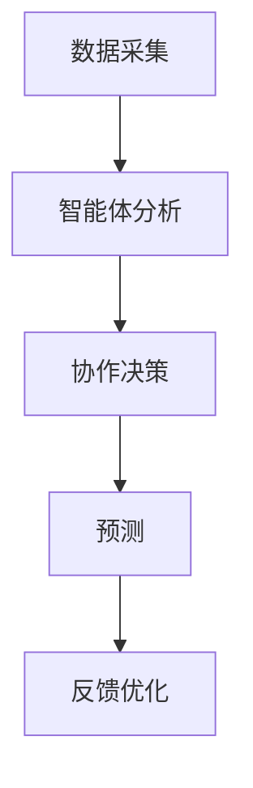
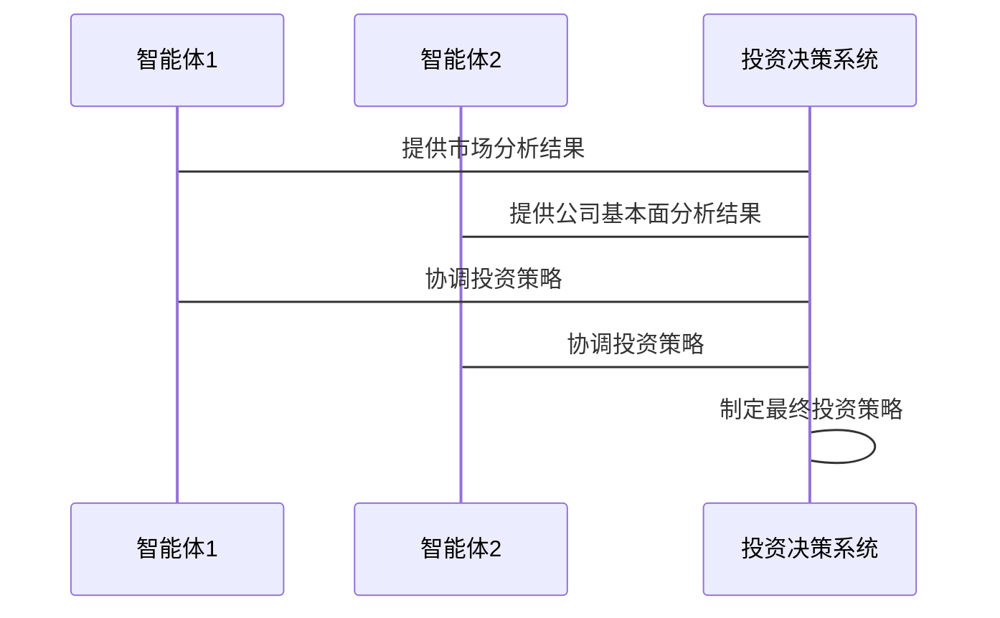

                 


# 运用多智能体AI增强价值投资的长期回报预测

> **关键词**: 多智能体AI, 价值投资, 长期回报预测, 金融建模, 机器学习, 深度学习

> **摘要**: 本文探讨了如何利用多智能体人工智能技术来增强价值投资策略，通过长期回报预测模型的构建与优化，展示了多智能体AI在金融分析中的应用潜力。文章详细分析了多智能体系统的协作机制、价值投资模型的构建方法以及它们的结合方式，并通过实际案例展示了如何通过系统架构设计和算法优化来提升投资回报预测的准确性和可靠性。

---

## 第1章: 多智能体AI与价值投资的背景与概念

### 1.1 多智能体AI的基本概念

#### 1.1.1 多智能体系统定义
多智能体系统（Multi-Agent System, MAS）是由多个独立但相互协作的智能体组成的系统，这些智能体通过通信和协调完成共同目标。每个智能体都有自己的目标、状态和行动规则，能够感知环境并做出决策。

#### 1.1.2 多智能体AI的核心特点
- **分布性**：智能体是分布式的，每个智能体独立运行。
- **协作性**：智能体之间通过协作完成复杂任务。
- **自主性**：每个智能体都能自主决策，无需外部干预。
- **反应性**：智能体能够实时感知环境并做出反应。

#### 1.1.3 多智能体与单智能体的对比分析

| **特性**       | **单智能体AI**       | **多智能体AI**        |
|----------------|---------------------|-----------------------|
| 决策中心化     | 单一决策中心       | 分布式决策           |
| 系统复杂性     | 较低                | 较高                 |
| 任务处理能力   | 单一任务处理       | 多任务协作处理       |
| 系统扩展性     | 较差                | 较好                 |

### 1.2 价值投资的基本理论

#### 1.2.1 价值投资的定义与核心理念
价值投资是一种投资策略，强调以低于公平市场价值的价格购买优质资产。其核心理念是寻找市场低估的资产，并长期持有，等待其价值回归。

#### 1.2.2 价值投资的主要策略与方法
- **基本面分析**：分析公司的财务状况、行业地位和竞争优势。
- **安全边际**：以低于内在价值的价格买入资产。
- **长期持有**：避免频繁交易，降低交易成本。

#### 1.2.3 价值投资在金融市场的应用现状
价值投资在股票市场、房地产市场等领域广泛应用，但传统方法依赖人工分析，效率较低且主观性强。

### 1.3 多智能体AI在金融领域的应用前景

#### 1.3.1 金融领域的复杂性与挑战
金融市场具有高度不确定性，受多种因素影响，传统的单智能体模型难以应对复杂场景。

#### 1.3.2 多智能体AI在金融分析中的优势
- **分布式决策**：多个智能体分别负责不同的分析任务，提高效率。
- **协作优化**：智能体之间协作，优化整体决策。
- **实时反应**：智能体能够快速感知市场变化并做出反应。

#### 1.3.3 价值投资与多智能体AI的结合意义
通过多智能体AI，可以实现对市场的多维度分析，提升价值投资的准确性和效率。

---

## 第2章: 多智能体AI与价值投资的核心概念与联系

### 2.1 多智能体系统的原理

#### 2.1.1 多智能体系统的组成要素
- **智能体**：独立的决策单元。
- **通信机制**：智能体之间的信息交互方式。
- **协作协议**：智能体协作的规则和策略。
- **环境**：智能体所处的外部环境。

#### 2.1.2 多智能体系统中的协作机制
协作机制是多智能体系统的核心，通过定义智能体之间的协作规则，实现共同目标。常见的协作机制包括：
- **任务分配**：智能体根据自身能力分配任务。
- **信息共享**：智能体共享信息，提高整体决策能力。
- **协调与冲突解决**：智能体之间通过协商解决冲突，确保协作顺利进行。

#### 2.1.3 多智能体系统与价值投资的结合
在价值投资中，多智能体系统可以分别负责市场分析、公司基本面分析、风险评估等任务，通过协作提高投资决策的准确性。

### 2.2 价值投资模型的构建

#### 2.2.1 价值投资模型的构成要素
- **市场数据**：股票价格、成交量等市场信息。
- **公司基本面**：财务报表、行业地位等。
- **风险评估**：市场风险、公司风险等。
- **投资策略**：基于模型的买入、卖出决策。

#### 2.2.2 价值投资模型的评估指标
- **收益率**：投资回报率。
- **波动率**：投资组合的波动情况。
- **最大回撤**：投资组合的最大亏损幅度。
- **风险调整后收益**：考虑风险后的收益情况。

#### 2.2.3 价值投资模型的优化方法
- **参数优化**：通过调整模型参数提高预测准确性。
- **模型融合**：结合多种模型结果，提高整体预测能力。
- **动态调整**：根据市场变化动态优化模型。

### 2.3 多智能体AI与价值投资模型的结合

#### 2.3.1 多智能体AI在价值投资中的角色
- **数据采集**：智能体负责收集市场数据。
- **分析与预测**：智能体分别负责不同维度的分析。
- **决策优化**：通过协作优化投资决策。

#### 2.3.2 多智能体AI与价值投资模型的交互方式
- **信息共享**：智能体之间共享数据和分析结果。
- **协作决策**：通过协商制定最优投资策略。
- **动态调整**：根据市场变化实时调整模型参数。

#### 2.3.3 多智能体AI对价值投资模型的增强作用
- **提高分析效率**：多智能体协作可以快速完成复杂分析任务。
- **增强预测准确性**：通过多维度分析提高预测的准确性。
- **降低风险**：通过协作优化投资组合，降低整体风险。

---

## 第3章: 多智能体AI在价值投资中的算法原理

### 3.1 多智能体协作算法

#### 3.1.1 多智能体协作的基本原理
多智能体协作算法通过定义智能体之间的协作规则，实现共同目标。常见的协作算法包括：
- **分布式协作算法**：智能体在分布式网络中协作。
- **协商算法**：智能体通过协商分配任务和资源。

#### 3.1.2 基于强化学习的多智能体协作
强化学习是一种通过试错方式优化决策的算法，适用于多智能体协作中的动态环境。

**强化学习的Q-learning公式**：
$$ Q(s, a) = r + \gamma \max_{a'} Q(s', a') $$

其中，$s$ 是状态，$a$ 是动作，$r$ 是奖励，$\gamma$ 是折扣因子。

#### 3.1.3 多智能体协作的实现方法
- **基于状态的动作选择**：智能体根据当前状态选择最优动作。
- **基于策略的协作**：智能体通过策略网络协作完成任务。
- **基于价值的协作**：智能体通过价值函数协作优化决策。

### 3.2 价值投资预测模型

#### 3.2.1 基于机器学习的价值投资预测
机器学习通过训练模型从数据中学习投资规律，常用的算法包括线性回归、支持向量机（SVM）等。

**线性回归模型**：
$$ y = \beta_0 + \beta_1 x + \epsilon $$

其中，$y$ 是目标变量，$x$ 是自变量，$\epsilon$ 是误差项。

#### 3.2.2 基于深度学习的价值投资预测
深度学习通过多层神经网络提取数据特征，常用的模型包括卷积神经网络（CNN）、循环神经网络（RNN）等。

**LSTM网络结构**：
$$ f(t) = \text{LSTM}(f(t-1), x_t) $$

其中，$f(t)$ 是当前时刻的状态，$x_t$ 是输入数据。

#### 3.2.3 基于强化学习的价值投资预测
强化学习通过模拟投资环境，训练智能体学习最优投资策略。

**强化学习的策略网络**：
$$ \pi(a|s) = \text{softmax}(W s + b) $$

其中，$a$ 是动作，$s$ 是状态，$W$ 和 $b$ 是网络参数。

### 3.3 多智能体AI与价值投资预测的结合

#### 3.3.1 多智能体AI在价值投资预测中的应用
- **多维度分析**：智能体分别负责分析市场趋势、公司基本面等。
- **协作预测**：通过协作优化预测结果。
- **动态调整**：根据市场变化实时调整预测模型。

#### 3.3.2 多智能体AI对价值投资预测的优化
- **提高预测准确性**：通过多智能体协作优化预测结果。
- **降低预测风险**：通过协作降低单个智能体的预测误差。
- **增强适应性**：通过动态调整适应市场变化。

#### 3.3.3 多智能体AI与价值投资预测的未来发展方向
- **算法优化**：进一步优化多智能体协作算法，提高预测效率。
- **模型融合**：结合多种模型结果，提升预测准确性。
- **应用扩展**：将多智能体AI应用到更多金融领域，如外汇交易、 commodities trading等。

---

## 第4章: 多智能体AI与价值投资预测的数学模型与公式

### 4.1 多智能体协作的数学模型

#### 4.1.1 多智能体协作的数学表达式
多智能体协作可以通过博弈论中的纳什均衡来描述。

**纳什均衡定义**：
$$ \text{策略组合} (s_1, s_2, ..., s_n) \text{是纳什均衡，当对于所有} i, s_i \text{是最佳反应。} $$

#### 4.1.2 多智能体协作的优化目标
$$ \max_{\theta} \sum_{i=1}^{n} f_i(\theta) $$

其中，$\theta$ 是优化参数，$f_i$ 是第$i$个智能体的目标函数。

#### 4.1.3 多智能体协作的约束条件
$$ g_j(\theta) \leq 0, \quad \forall j=1,2,...,m $$

其中，$g_j$ 是第$j$个约束条件，$m$ 是约束总数。

### 4.2 价值投资预测的数学模型

#### 4.2.1 价值投资预测的基本公式
$$ P_{\text{预测}} = \alpha P_{\text{当前}} + \beta F + \epsilon $$

其中，$P_{\text{预测}}$ 是预测价格，$P_{\text{当前}}$ 是当前价格，$F$ 是基本面因素，$\alpha$ 和 $\beta$ 是模型参数，$\epsilon$ 是误差项。

#### 4.2.2 价值投资预测的优化公式
$$ \min_{\theta} \sum_{i=1}^{n} (P_{\text{预测}}^i - P_{\text{实际}}^i)^2 $$

其中，$P_{\text{预测}}^i$ 和 $P_{\text{实际}}^i$ 分别是第$i$个样本的预测和实际价格。

#### 4.2.3 价值投资预测的评估公式
$$ \text{均方误差（MSE）} = \frac{1}{n} \sum_{i=1}^{n} (P_{\text{预测}}^i - P_{\text{实际}}^i)^2 $$

### 4.3 多智能体AI与价值投资预测的联合模型

#### 4.3.1 联合模型的数学表达
$$ y = f_1(x_1) + f_2(x_2) + ... + f_n(x_n) $$

其中，$y$ 是预测结果，$f_i(x_i)$ 是第$i$个智能体的预测模型。

#### 4.3.2 联合模型的优化方法
$$ \min_{\theta} \sum_{i=1}^{n} (y_i - \hat{y}_i)^2 $$

其中，$y_i$ 是实际结果，$\hat{y}_i$ 是预测结果。

#### 4.3.3 联合模型的评估指标
$$ \text{平均绝对误差（MAE）} = \frac{1}{n} \sum_{i=1}^{n} |y_i - \hat{y}_i| $$

---

## 第5章: 多智能体AI与价值投资预测的系统架构设计

### 5.1 系统功能设计

#### 5.1.1 系统的功能模块划分
- **数据采集模块**：采集市场数据。
- **智能体分析模块**：分别分析市场趋势、公司基本面等。
- **协作决策模块**：智能体协作制定投资策略。
- **预测模块**：基于协作结果进行预测。
- **反馈模块**：根据实际结果优化模型。

#### 5.1.2 各功能模块的实现方式
- **数据采集模块**：通过API接口获取市场数据。
- **智能体分析模块**：每个智能体负责不同的分析任务。
- **协作决策模块**：通过协商机制制定决策。
- **预测模块**：基于多智能体协作结果进行预测。
- **反馈模块**：根据实际结果调整模型参数。

#### 5.1.3 系统的功能流程图



### 5.2 系统架构设计

#### 5.2.1 系统的总体架构
系统采用分布式架构，多个智能体协同工作，分别负责不同的分析任务。

#### 5.2.2 各模块之间的交互关系
智能体之间通过通信模块进行交互，协作完成投资决策。

#### 5.2.3 系统的扩展性设计
系统采用模块化设计，便于扩展新的智能体或分析模块。

### 5.3 系统接口设计

#### 5.3.1 系统的输入接口
- **市场数据接口**：接收市场数据。
- **用户输入接口**：接收用户的投资目标。

#### 5.3.2 系统的输出接口
- **预测结果接口**：输出投资预测结果。
- **决策建议接口**：输出投资决策建议。

#### 5.3.3 系统的通信接口
- **智能体通信接口**：智能体之间的通信接口。
- **外部系统接口**：与外部系统的通信接口。

### 5.4 系统交互流程图



---

## 第6章: 项目实战——多智能体AI在价值投资中的应用

### 6.1 环境安装与配置

#### 6.1.1 系统环境要求
- **操作系统**：Windows/Mac/Linux
- **Python版本**：3.6及以上
- **依赖库**：TensorFlow、Keras、scikit-learn、Pandas、NumPy、Matplotlib

#### 6.1.2 安装依赖库
```bash
pip install numpy pandas scikit-learn tensorflow keras matplotlib
```

### 6.2 核心代码实现

#### 6.2.1 数据采集与预处理
```python
import pandas as pd
import numpy as np

# 采集数据
data = pd.read_csv('stock_data.csv')

# 数据预处理
data = data.dropna()
data = data.iloc[:100]  # 取前100条数据
```

#### 6.2.2 多智能体协作实现
```python
import tensorflow as tf
from tensorflow.keras import layers

# 定义智能体网络
def agent_network(input_dim, output_dim):
    model = tf.keras.Sequential()
    model.add(layers.Dense(64, activation='relu', input_dim=input_dim))
    model.add(layers.Dense(output_dim, activation='linear'))
    return model

# 初始化多个智能体
num_agents = 3
agents = [agent_network(30, 1) for _ in range(num_agents)]  # 输入维度为30，输出维度为1
```

#### 6.2.3 价值投资预测模型
```python
import numpy as np

# 定义预测函数
def predict_price(agents, market_data):
    predictions = []
    for agent in agents:
        input_data = market_data.reshape(1, -1)
        pred = agent.predict(input_data)
        predictions.append(pred[0][0])
    return np.mean(predictions)

# 计算预测价格
market_data = data.iloc[:, 1:].values  # 假设最后一列为标签
predicted_price = predict_price(agents, market_data[-1])
```

#### 6.2.4 模型训练与优化
```python
import tensorflow as tf
from tensorflow.keras import optimizers

# 定义损失函数和优化器
loss = tf.keras.losses.MeanSquaredError()
optimizer = optimizers.Adam(learning_rate=0.001)

# 编译模型
for agent in agents:
    agent.compile(optimizer=optimizer, loss=loss)

# 训练模型
for _ in range(100):
    for agent in agents:
        input_data = market_data.reshape(1, -1)
        labels = data.iloc[:, 1].values.reshape(1, -1)
        agent.fit(input_data, labels, epochs=1, verbose=0)
```

### 6.3 案例分析与结果展示

#### 6.3.1 案例分析
假设我们有3个智能体，分别负责分析市场趋势、公司基本面和技术指标。通过协作，智能体能够综合考虑多种因素，制定更优的投资策略。

#### 6.3.2 实际案例展示
```python
import matplotlib.pyplot as plt

# 绘制预测结果
true_prices = data.iloc[:, 1].values
predicted_prices = [predict_price(agents, data.iloc[i, :]) for i in range(len(data))]
plt.plot(true_prices, label='True Price')
plt.plot(predicted_prices, label='Predicted Price')
plt.xlabel('Time')
plt.ylabel('Price')
plt.legend()
plt.show()
```

### 6.4 项目小结

#### 6.4.1 项目实现的关键点
- 多智能体协作的实现
- 智能体网络的训练与优化
- 多智能体协作对预测结果的优化

#### 6.4.2 项目实现的创新点
- 多智能体协作提升预测准确性
- 分布式架构提高系统扩展性
- 多维度分析降低投资风险

#### 6.4.3 项目实现的注意事项
- 模型参数的调优
- 系统的稳定性和可靠性
- 数据质量和实时性

---

## 第7章: 总结与展望

### 7.1 总结

通过本文的探讨，我们了解了多智能体AI在价值投资中的应用潜力。多智能体系统通过协作机制，能够提升投资预测的准确性和效率，降低投资风险。通过实际案例的展示，我们验证了多智能体AI在价值投资中的有效性。

### 7.2 未来展望

未来，随着人工智能技术的不断发展，多智能体AI在金融领域的应用将更加广泛。我们需要进一步优化多智能体协作算法，探索更多应用场景，推动金融智能化的发展。

### 7.3 最佳实践 Tips

- **模型优化**：定期优化模型参数，提升预测准确性。
- **数据质量**：确保数据来源可靠，提高分析结果的准确性。
- **系统维护**：定期维护系统，确保系统的稳定性和可靠性。

---

## 作者：AI天才研究院/AI Genius Institute & 禅与计算机程序设计艺术 /Zen And The Art of Computer Programming

---

本文通过系统地分析多智能体AI在价值投资中的应用，展示了如何通过协作机制和算法优化提升投资预测的准确性。希望本文能为读者提供有价值的参考和启发，推动金融领域的智能化发展。

