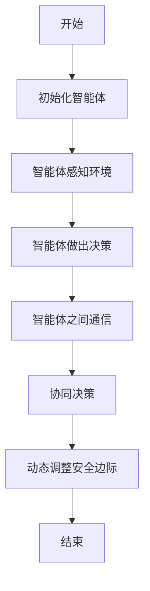
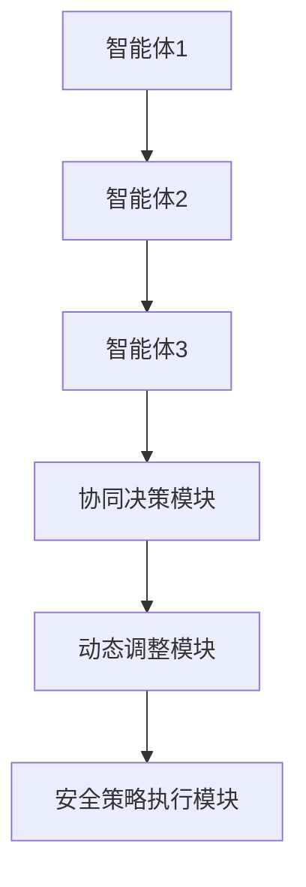
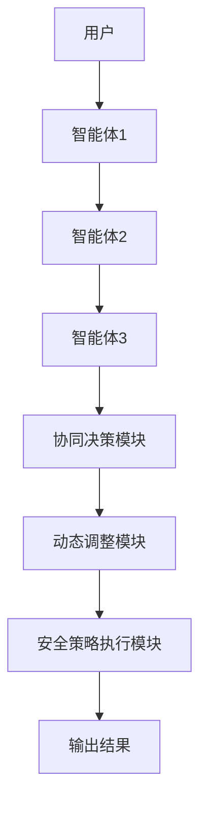

                 


# 运用多智能体AI实现动态安全边际调整

> 关键词：多智能体AI，动态安全边际调整，协同决策算法，系统架构设计，安全应用

> 摘要：本文深入探讨了运用多智能体AI技术实现动态安全边际调整的方法。通过分析多智能体AI的核心概念、算法原理、系统架构设计，以及实际应用场景，本文详细阐述了如何利用多智能体协同决策的优势，动态调整安全边界，从而提升系统的安全性与适应性。文章还通过具体案例分析，展示了多智能体AI在安全领域的实际应用价值和未来发展方向。

---

# 第一部分: 多智能体AI与动态安全边际调整概述

## 第1章: 多智能体AI与动态安全边际调整概述

### 1.1 多智能体AI的定义与特点
#### 1.1.1 多智能体AI的定义
多智能体AI（Multi-Agent AI）是由多个具有独立决策能力的智能体组成的系统。这些智能体能够通过协同工作，共同完成复杂的任务。与单智能体AI相比，多智能体AI在处理分布式问题时表现出更强的适应性和灵活性。

#### 1.1.2 多智能体AI的核心特点
- **分布式智能**：多个智能体独立决策，共同完成任务。
- **协同性**：智能体之间通过通信和协作，实现目标的一致性。
- **动态性**：能够适应环境的变化，实时调整策略。
- **鲁棒性**：单个智能体的故障不会导致整个系统崩溃。

#### 1.1.3 多智能体AI与单智能体AI的区别
| 特性 | 多智能体AI | 单智能体AI |
|------|------------|------------|
| 决策中心化 | 分散式决策 | 集中式决策 |
| 系统复杂性 | 高 | 低 |
| 适应性 | 强 | 弱 |

### 1.2 动态安全边际调整的定义与背景
#### 1.2.1 安全边际的定义
安全边际是指系统在正常运行和异常情况之间的界限。动态安全边际调整是指根据实时环境变化，动态调整这个边界的宽度。

#### 1.2.2 动态调整的必要性
- **环境变化**：网络安全威胁日益复杂，固定的安全边际无法应对动态变化。
- **系统优化**：动态调整能够提高安全策略的精准性和效率。
- **资源分配**：动态调整能够优化资源的使用，避免浪费。

#### 1.2.3 多智能体AI在安全边际调整中的作用
多智能体AI通过协同决策，能够实时感知环境变化，快速调整安全边际，从而提升系统的安全性。

### 1.3 多智能体AI在动态安全边际调整中的应用前景
#### 1.3.1 多智能体AI的优势
- **分布式计算**：能够处理大规模、复杂的网络安全问题。
- **协同决策**：多个智能体协同工作，提高决策的准确性和效率。
- **动态适应**：能够实时调整安全策略，应对新型威胁。

#### 1.3.2 动态安全边际调整的挑战
- **通信延迟**：多智能体之间的通信可能会引入延迟。
- **协同复杂性**：多个智能体之间的协同决策需要复杂的算法支持。
- **系统安全性**：智能体之间的通信和协同可能存在被攻击的风险。

#### 1.3.3 应用场景与实际案例
- **网络安全**：多智能体AI可以用于实时监控网络流量，动态调整防火墙策略。
- **金融安全**：多智能体AI可以用于实时监控金融交易，动态调整风险控制边界。

## 第2章: 多智能体AI的核心概念与联系

### 2.1 多智能体AI的核心概念
#### 2.1.1 智能体的定义与属性
智能体是指具有感知环境、做出决策并采取行动的实体。智能体的核心属性包括：
- **感知能力**：能够感知环境中的信息。
- **决策能力**：能够基于感知信息做出决策。
- **行动能力**：能够采取行动影响环境。

#### 2.1.2 多智能体系统的基本组成
- **智能体**：独立决策的个体。
- **通信机制**：智能体之间的通信方式。
- **协同机制**：智能体之间的协同决策方式。
- **目标函数**：系统的整体目标。

#### 2.1.3 多智能体系统的核心原理
多智能体系统的核心原理在于通过智能体之间的协同与竞争，实现系统的整体目标。协同可以通过通信、协作和协调来实现，而竞争则可以通过资源分配和策略调整来实现。

### 2.2 动态安全边际调整的核心概念
#### 2.2.1 安全边际的动态变化
安全边际的动态变化是指根据实时环境的变化，调整安全策略的边界。动态调整需要考虑的因素包括：
- **环境变化**：如网络流量的变化、攻击行为的变化。
- **系统状态**：如系统的负载、资源使用情况。
- **威胁情报**：如最新的网络安全威胁信息。

#### 2.2.2 调整机制的定义与分类
调整机制是指如何根据实时信息调整安全边际的具体方法。常见的调整机制包括：
- **反馈控制**：根据系统反馈调整安全边际。
- **预测控制**：根据预测的威胁变化调整安全边际。
- **混合控制**：结合反馈和预测信息进行调整。

#### 2.2.3 多智能体在调整中的角色
在动态安全边际调整中，多智能体AI扮演着关键角色：
- **感知环境**：智能体实时感知环境中的威胁信息。
- **协同决策**：多个智能体协同决策，确定最优的安全边际。
- **动态调整**：根据决策结果，动态调整安全策略。

### 2.3 多智能体AI与动态安全边际调整的关系
#### 2.3.1 多智能体AI如何实现动态调整
多智能体AI通过以下方式实现动态调整：
- **实时感知**：智能体实时感知环境信息。
- **协同决策**：多个智能体协同决策，确定最优的安全边际。
- **动态调整**：根据决策结果，动态调整安全策略。

#### 2.3.2 调整机制与智能体行为的关联
调整机制与智能体行为密切相关。智能体的行为决定了调整机制的具体实现方式。例如，智能体之间的通信方式和决策算法直接影响调整机制的效果。

#### 2.3.3 系统整体架构的描述
多智能体AI实现动态安全边际调整的系统整体架构包括：
- **感知层**：智能体实时感知环境信息。
- **决策层**：智能体协同决策，确定最优的安全边际。
- **执行层**：根据决策结果，动态调整安全策略。

### 2.4 核心概念对比表格
| 特性 | 多智能体AI | 动态安全边际调整 |
|------|------------|------------------|
| 核心目标 | 协同决策 | 动态调整安全边界 |
| 实现方式 | 分散式决策 | 反馈控制、预测控制 |
| 优势 | 高适应性 | 高实时性 |

### 2.5 ER实体关系图
```mermaid
erd
    entity 智能体 {
        id
        感知能力
        决策能力
    }
    entity 调整机制 {
        id
        调整方式
        调整目标
    }
    智能体 -->> 调整机制: 实现
```

---

# 第3章: 多智能体AI实现动态安全边际调整的算法原理

## 3.1 多智能体AI的基本算法
### 3.1.1 分散式决策算法
分散式决策算法是指每个智能体独立做出决策，无需中央控制。这种算法适用于分布式系统，具有高容错性和高适应性。

### 3.1.2 协作式学习算法
协作式学习算法是指多个智能体通过协作学习，共同提高决策能力。这种算法适用于需要多个智能体协同工作的场景。

### 3.1.3 联合优化算法
联合优化算法是指多个智能体通过协同优化，实现整体目标的最优。这种算法适用于需要全局优化的场景。

## 3.2 动态安全边际调整的数学模型
### 3.2.1 安全边际的数学表达式
安全边际的数学表达式可以表示为：
$$ S = \{s_1, s_2, ..., s_n\} $$
其中，$s_i$ 表示第$i$个智能体的安全边际。

### 3.2.2 动态调整的目标函数
动态调整的目标函数可以表示为：
$$ f(S) = \min_{S} \sum_{i=1}^{n} (s_i - s_{i-1})^2 $$
其中，$s_{i-1}$ 表示前一个时刻的安全边际。

### 3.2.3 协同决策的数学模型
协同决策的数学模型可以表示为：
$$ D = \{d_1, d_2, ..., d_n\} $$
其中，$d_i$ 表示第$i$个智能体的决策。

### 3.2.4 实际案例分析
假设我们有一个由3个智能体组成的系统，每个智能体的安全边际分别为$s_1=0.8$, $s_2=0.9$, $s_3=0.7$。我们需要通过协同决策，调整这些安全边际，使得整体安全边际达到最优。

### 3.2.5 算法流程图


---

## 第4章: 系统分析与架构设计

### 4.1 应用场景与系统功能设计
动态安全边际调整的应用场景包括网络安全、金融安全等领域。系统功能设计包括：
- **实时监控**：实时监控环境中的威胁信息。
- **协同决策**：多个智能体协同决策，确定最优的安全边际。
- **动态调整**：根据决策结果，动态调整安全策略。

### 4.2 系统架构设计
#### 4.2.1 系统架构图


#### 4.2.2 系统接口设计
系统接口设计包括：
- **智能体接口**：智能体之间的通信接口。
- **决策接口**：协同决策模块的接口。
- **调整接口**：动态调整模块的接口。

#### 4.2.3 系统交互流程图


---

## 第5章: 项目实战

### 5.1 环境安装
需要安装以下环境：
- Python 3.8+
- 多智能体AI框架（如Multi-Agent）
- 数据处理库（如Pandas、NumPy）

### 5.2 核心代码实现
#### 5.2.1 智能体类
```python
class Agent:
    def __init__(self, id):
        self.id = id
        self.perception = None
        self.decision = None
```

#### 5.2.2 协同决策模块
```python
class CoordinatedDecisionModule:
    def __init__(self, agents):
        self.agents = agents

    def make_decision(self):
        # 协同决策算法实现
        pass
```

#### 5.2.3 动态调整模块
```python
class DynamicAdjustmentModule:
    def __init__(self, decision):
        self.decision = decision

    def adjust_security_margin(self):
        # 动态调整算法实现
        pass
```

### 5.3 案例分析与代码解读
通过具体案例分析，解读代码实现，展示多智能体AI在动态安全边际调整中的实际应用。

---

## 第6章: 总结与展望

### 6.1 最佳实践 Tips
- **智能体设计**：智能体的设计需要考虑感知能力、决策能力和行动能力。
- **协同决策**：协同决策算法的选择需要根据具体应用场景来定。
- **动态调整**：动态调整机制需要考虑系统的实时性和鲁棒性。

### 6.2 本章小结
本文通过多智能体AI实现了动态安全边际调整，详细阐述了算法原理、系统架构设计和实际案例分析。通过本文的讲解，读者可以深入了解多智能体AI在动态安全边际调整中的应用。

### 6.3 注意事项
- **系统安全性**：智能体之间的通信和协同决策需要考虑安全性。
- **算法效率**：动态调整算法需要考虑计算效率和实时性。
- **系统可扩展性**：系统设计需要考虑可扩展性，以应对未来的需求变化。

### 6.4 拓展阅读
- **多智能体AI**：推荐阅读《Multi-Agent Systems》。
- **动态安全边际调整**：推荐阅读《Dynamic Security Margin Adjustment in Multi-Agent Systems》。

---

作者：AI天才研究院/AI Genius Institute & 禅与计算机程序设计艺术 /Zen And The Art of Computer Programming

