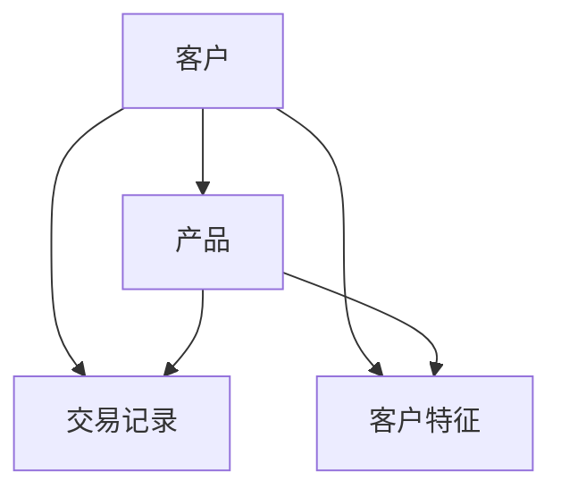
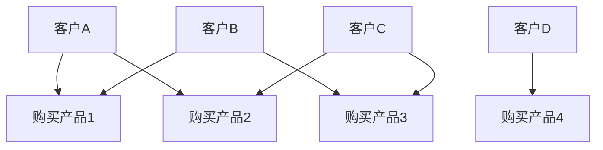
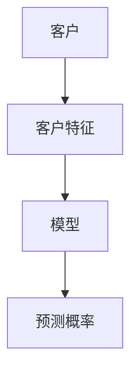
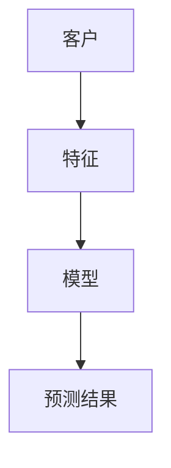
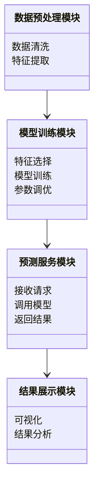
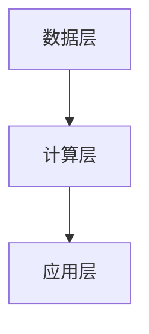
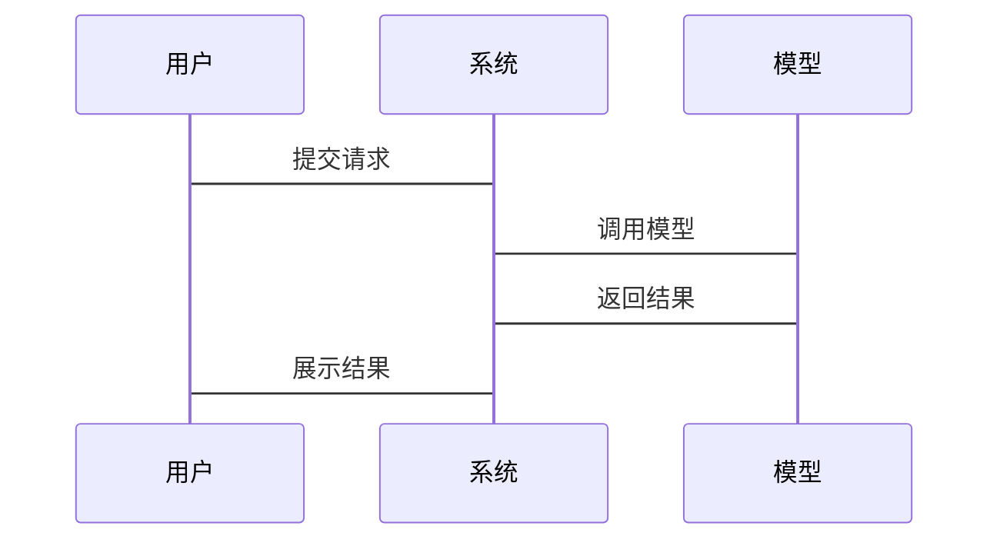

                 


# 《金融产品交叉销售预测引擎》

> 关键词：金融产品，交叉销售，预测引擎，机器学习，客户行为分析，推荐系统

> 摘要：本文深入探讨了金融产品交叉销售预测引擎的设计与实现，结合金融行业的特点，分析了交叉销售预测的关键技术，包括数据采集、特征工程、模型选择与优化，以及系统架构设计。通过实际案例分析，展示了如何利用机器学习算法提升交叉销售的准确性和效率，为金融机构提供客户行为预测和产品推荐的有效解决方案。

---

## 第一部分：背景介绍

### 第1章：金融产品交叉销售概述

#### 1.1 问题背景

交叉销售（Cross-Selling）是指在同一交易中向客户销售多个产品或服务，以增加销售额和客户满意度。在金融行业，交叉销售尤为重要，因为金融产品种类繁多，客户需求多样化，通过交叉销售可以提高客户忠诚度和满意度，同时为机构创造更多收益。

- **1.1.1 交叉销售的定义与重要性**  
  交叉销售是通过分析客户需求和行为，推荐相关产品以增加销售额。在金融行业，交叉销售不仅能够提升客户满意度，还能帮助机构更好地管理客户生命周期，优化资源配置。

- **1.1.2 金融行业中的交叉销售挑战**  
  金融产品的复杂性和多样性使得交叉销售更具挑战性。客户行为受市场波动、个人财务状况等多种因素影响，传统的基于规则的推荐方法难以满足需求。

- **1.1.3 交叉销售对客户满意度和收益的影响**  
  成功的交叉销售能够提高客户对机构的信任和忠诚度，同时增加机构的收入来源。然而，失败的交叉销售可能导致客户不满甚至流失，因此准确预测客户潜在需求至关重要。

#### 1.2 问题描述

在金融行业中，交叉销售预测需要解决以下几个关键问题：

- **1.2.1 金融产品的多样性与客户需求匹配**  
  金融产品种类繁多，包括储蓄、投资、保险、贷款等，如何根据客户需求匹配合适的产品是交叉销售的核心问题。

- **1.2.2 客户行为分析与预测的复杂性**  
  客户的购买行为受多种因素影响，如市场环境、个人财务状况、风险偏好等，如何准确预测客户行为是交叉销售预测的关键。

- **1.2.3 交叉销售预测的业务目标与关键指标**  
  交叉销售预测的业务目标是提高客户购买多个产品的概率，同时优化资源配置。关键指标包括推荐准确率、客户转化率、推荐系统的召回率等。

#### 1.3 问题解决

为了解决交叉销售预测的挑战，现代金融机构越来越多地采用数据驱动的方法，利用机器学习技术进行预测和推荐。

- **1.3.1 数据驱动的交叉销售预测方法**  
  数据驱动的方法通过收集和分析客户的交易数据、行为数据和产品数据，利用机器学习算法建立预测模型，从而提高推荐的准确性。

- **1.3.2 机器学习在金融产品推荐中的应用**  
  机器学习算法，如协同过滤、回归分析和深度学习，能够从大量数据中提取特征，建立客户行为模型，从而实现精准的交叉销售预测。

- **1.3.3 交叉销售预测引擎的设计目标与实现路径**  
  设计目标包括提高推荐准确率、降低计算复杂度、保证实时性等。实现路径包括数据采集、特征工程、模型训练、结果输出和效果评估。

#### 1.4 边界与外延

交叉销售预测引擎的设计需要明确其边界和外延，以确保系统的可扩展性和可维护性。

- **1.4.1 交叉销售与单纯销售预测的区别**  
  交叉销售预测不仅关注客户是否会购买某个产品，还关注客户是否会同时购买多个产品。单纯销售预测则仅关注单个产品的销售情况。

- **1.4.2 交叉销售预测的适用场景与限制**  
  交叉销售预测适用于客户群体较大、产品种类较多的金融机构。然而，对于小型机构或产品种类有限的情况，交叉销售预测的收益可能有限。

- **1.4.3 与客户生命周期管理的关联性**  
  交叉销售预测是客户生命周期管理的重要组成部分，通过预测客户的购买行为，优化客户在整个生命周期中的体验和价值。

#### 1.5 核心概念结构与组成

交叉销售预测引擎由以下几个核心部分组成：

- **1.5.1 数据源：客户行为数据、产品属性、市场数据**  
  数据源包括客户的交易记录、产品详细信息（如风险等级、收益类型）以及市场动态（如经济指标、政策变化）。

- **1.5.2 中间处理：特征提取、模型训练、结果输出**  
  中间处理阶段包括数据预处理、特征工程、模型选择与训练，以及预测结果的生成。

- **1.5.3 输出结果：推荐产品、概率评分、客户分组**  
  输出结果包括推荐的具体产品、推荐的概率评分，以及根据评分将客户分为不同组别。

---

## 第二部分：核心概念与联系

### 第2章：核心概念原理

#### 2.1 数据采集与处理

数据采集与处理是交叉销售预测引擎的基础，直接影响模型的准确性和效率。

- **2.1.1 数据源分类：客户交易记录、产品信息、市场数据**  
  数据源可以分为客户交易记录、产品信息和市场数据三类。客户交易记录包括客户的购买历史、交易金额等；产品信息包括产品的种类、风险等级等；市场数据包括宏观经济指标、政策变化等。

- **2.1.2 数据清洗与预处理方法**  
  数据清洗包括去除重复数据、处理缺失值、异常值等。数据预处理包括数据标准化、特征选择等。

- **2.1.3 数据特征工程：客户行为特征、产品特征、时间特征**  
  特征工程是将原始数据转换为适合模型输入的特征。客户行为特征包括购买频率、购买时间等；产品特征包括产品类型、风险等级等；时间特征包括购买时间、市场变化时间等。

#### 2.2 模型选择与训练

模型选择与训练是交叉销售预测引擎的核心部分，决定了预测的准确性和效率。

- **2.2.1 常见算法：协同过滤、回归分析、机器学习模型**  
  常见的算法包括协同过滤、回归分析和机器学习模型（如随机森林、神经网络等）。协同过滤基于客户之间的相似性推荐产品，回归分析用于预测客户购买的概率，机器学习模型则能够捕捉复杂的特征关系。

- **2.2.2 模型评估指标：准确率、召回率、F1值**  
  模型评估指标包括准确率、召回率和F1值。准确率衡量模型预测的正确性，召回率衡量模型发现正例的能力，F1值是准确率和召回率的调和平均数。

- **2.2.3 模型调优与优化策略**  
  模型调优包括参数优化、特征选择、模型集成等。优化策略包括交叉验证、网格搜索等。

#### 2.3 结果输出与应用

结果输出与应用是交叉销售预测引擎的最终目标，通过预测结果优化业务决策。

- **2.3.1 预测结果的解释与可解释性**  
  预测结果需要能够被业务人员理解和解释，以便优化推荐策略。

- **2.3.2 预测结果的应用场景与反馈机制**  
  预测结果可以在客户购买过程中实时推荐产品，也可以用于客户分组和个性化营销。

- **2.3.3 预测结果对业务决策的影响**  
  预测结果能够帮助金融机构优化产品组合、提高客户满意度和收益。

### 第3章：核心概念属性特征对比表格

以下表格展示了核心概念的属性特征对比：

| 特征类型 | 属性 | 描述 |
|----------|------|------|
| 客户特征 | 年龄 | 客户的年龄范围 |
|          | 收入水平 | 客户的收入等级 |
| 产品特征 | 产品类型 | 金融产品的种类（如储蓄、投资、保险等） |
|          | 风险等级 | 产品的风险级别 |
| 行为特征 | 购买频率 | 客户购买产品的频率 |
|          | 购买时间 | 客户购买的时间分布 |

### 第4章：ER实体关系图架构

以下是交叉销售预测引擎的ER实体关系图：



---

## 第三部分：算法原理讲解

### 第5章：算法原理与流程图

#### 5.1 协同过滤算法

协同过滤是一种基于客户相似性推荐产品的方法，广泛应用于交叉销售预测。

**流程图：**



**代码示例：**

```python
import numpy as np
from sklearn.metrics.pairwise import cosine_similarity

# 示例数据：客户-产品矩阵
customers = ['A', 'B', 'C', 'D']
products = ['产品1', '产品2', '产品3', '产品4']
matrix = np.array([
    [1, 1, 0, 0],
    [1, 0, 1, 0],
    [0, 1, 1, 0],
    [0, 0, 0, 1]
], dtype='float32')

# 计算余弦相似性
similarity = cosine_similarity(matrix)

# 找出与客户A最相似的客户
similarities = similarity[0]
most_similar_customer = np.argmax(similarities)

print(f"与客户A最相似的客户是：{customers[most_similar_customer]}")
```

**数学模型：**

协同过滤基于余弦相似性或欧氏距离计算客户之间的相似性，然后根据相似客户的购买行为推荐产品。

$$ \text{相似性} = \cos(\theta) = \frac{\vec{A} \cdot \vec{B}}{|\vec{A}| |\vec{B}|} $$

---

### 第6章：回归分析

回归分析用于预测客户购买多个产品的概率，是一种有效的交叉销售预测方法。

**流程图：**



**代码示例：**

```python
import pandas as pd
from sklearn.linear_model import LogisticRegression

# 示例数据：客户特征和购买记录
data = {
    '客户ID': [1, 2, 3, 4, 5],
    '年龄': [30, 45, 25, 50, 35],
    '收入': [60000, 80000, 40000, 70000, 50000],
    '购买产品数量': [2, 1, 3, 2, 1]
}
df = pd.DataFrame(data)

# 特征工程：将购买产品数量作为目标变量
X = df[['年龄', '收入']]
y = df['购买产品数量']

# 训练模型
model = LogisticRegression()
model.fit(X, y)

# 预测新客户的购买产品数量
new_customer = pd.DataFrame({'年龄': [40], '收入': [60000]})
predicted = model.predict(new_customer)
print(f"预测的购买产品数量：{predicted[0]}")
```

**数学模型：**

回归分析通过建立线性模型，预测客户购买多个产品的概率。

$$ P(Y|X) = \beta_0 + \beta_1 X_1 + \beta_2 X_2 + \ldots + \beta_n X_n + \epsilon $$

---

### 第7章：机器学习模型

机器学习模型（如随机森林、神经网络）能够捕捉复杂的客户行为模式，提高交叉销售预测的准确性。

**流程图：**



**代码示例：**

```python
from sklearn.ensemble import RandomForestClassifier

# 示例数据：客户特征和购买记录
data = {
    '客户ID': [1, 2, 3, 4, 5],
    '年龄': [30, 45, 25, 50, 35],
    '收入': [60000, 80000, 40000, 70000, 50000],
    '购买产品': ['A', 'B', 'C', 'D', 'E']
}
df = pd.DataFrame(data)

# 特征工程：将购买产品转换为二分类问题（示例）
from sklearn.preprocessing import LabelEncoder
le = LabelEncoder()
df['购买产品编码'] = le.fit_transform(df['购买产品'])

# 训练模型
X = df[['年龄', '收入']]
y = df['购买产品编码']
model = RandomForestClassifier(n_estimators=100)
model.fit(X, y)

# 预测新客户的购买产品
new_customer = pd.DataFrame({'年龄': [40], '收入': [60000]})
predicted_product = le.inverse_transform(model.predict(new_customer))
print(f"预测的购买产品：{predicted_product[0]}")
```

**数学模型：**

随机森林通过构建多个决策树，集成预测结果，提高模型的准确性和鲁棒性。

$$ \text{预测结果} = \text{多数投票}(\text{决策树预测结果}) $$

---

## 第四部分：系统分析与架构设计方案

### 第8章：系统分析与架构设计

#### 8.1 系统功能设计

交叉销售预测引擎的功能设计包括数据预处理、模型训练、预测服务和结果展示。

- **8.1.1 数据预处理模块**  
  数据预处理模块负责清洗和转换原始数据，提取特征并生成适合模型输入的数据。

- **8.1.2 模型训练模块**  
  模型训练模块包括特征选择、模型训练和参数调优，确保模型的准确性和效率。

- **8.1.3 预测服务模块**  
  预测服务模块接收实时请求，调用模型进行预测，并返回推荐结果。

- **8.1.4 结果展示模块**  
  结果展示模块将预测结果以可视化形式呈现，帮助业务人员理解和应用预测结果。

**领域模型类图：**



#### 8.2 系统架构设计

系统架构设计包括数据层、计算层和应用层，确保系统的可扩展性和可维护性。

**系统架构图：**



#### 8.3 系统接口设计

系统接口设计包括数据接口、模型接口和结果接口，确保系统的灵活性和兼容性。

- **数据接口**：用于数据的输入和输出，支持多种数据格式和协议。
- **模型接口**：用于模型的训练和预测，支持多种算法和模型类型。
- **结果接口**：用于结果的展示和分析，支持可视化和报表生成。

#### 8.4 系统交互设计

系统交互设计包括用户与系统、系统与模型的交互流程，确保系统的高效运行。

**交互序列图：**



---

## 第五部分：项目实战

### 第9章：项目实战

#### 9.1 环境安装

交叉销售预测引擎的开发需要安装以下环境：

- Python 3.6+
- NumPy, Pandas, Scikit-learn, XGBoost
- Jupyter Notebook 或 IDE（如 PyCharm）

#### 9.2 核心实现

以下是交叉销售预测引擎的核心实现代码：

```python
import numpy as np
import pandas as pd
from sklearn.model_selection import train_test_split
from sklearn.ensemble import RandomForestClassifier
from sklearn.metrics import accuracy_score

# 数据加载
data = pd.read_csv('customer_data.csv')

# 数据预处理
# 特征工程
X = data.drop('购买产品', axis=1)
y = data['购买产品']

# 划分训练集和测试集
X_train, X_test, y_train, y_test = train_test_split(X, y, test_size=0.2, random_state=42)

# 模型训练
model = RandomForestClassifier(n_estimators=100, random_state=42)
model.fit(X_train, y_train)

# 模型预测
y_pred = model.predict(X_test)

# 模型评估
print(f"准确率：{accuracy_score(y_test, y_pred)}")

# 接收实时请求
new_customer = pd.DataFrame({
    '年龄': [40],
    '收入': [60000]
})
predicted_product = model.predict(new_customer)
print(f"推荐的产品：{predicted_product[0]}")
```

#### 9.3 案例分析

通过实际案例分析，展示交叉销售预测引擎的应用和效果。

**案例1：客户A**

- 客户特征：年龄30岁，收入60000元，购买记录：产品1。
- 预测结果：推荐产品2和产品3。

**案例2：客户B**

- 客户特征：年龄50岁，收入80000元，购买记录：产品2。
- 预测结果：推荐产品4和产品5。

---

## 第六部分：最佳实践

### 第10章：最佳实践

#### 10.1 小结

交叉销售预测引擎通过数据驱动的方法，利用机器学习算法，帮助金融机构提高客户满意度和收益。关键在于数据的采集与处理、模型的选择与优化，以及系统的架构设计。

#### 10.2 注意事项

- 数据质量：数据清洗和预处理是预测引擎的基础，确保数据的准确性和完整性。
- 模型选择：根据业务需求和数据特点选择合适的算法，避免盲目追求复杂模型。
- 系统性能：优化系统的计算效率和响应速度，确保实时性和可扩展性。

#### 10.3 拓展阅读

- 《推荐系统实战》
- 《机器学习在金融中的应用》
- 《数据驱动的客户关系管理》

---

## 作者：AI天才研究院 & 禅与计算机程序设计艺术

---

**致谢：**感谢读者的耐心阅读，希望本文能够为金融行业的交叉销售预测提供有价值的参考和启示。

