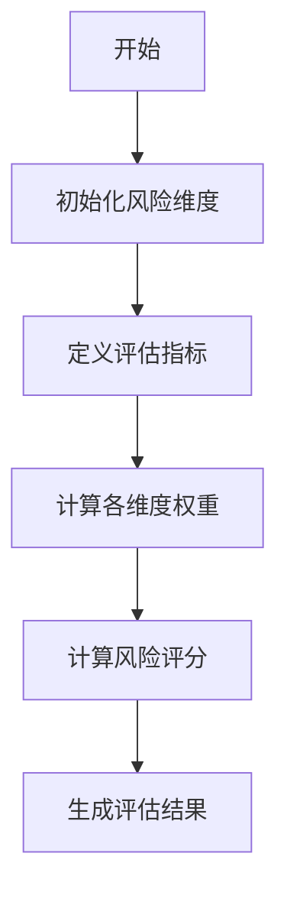
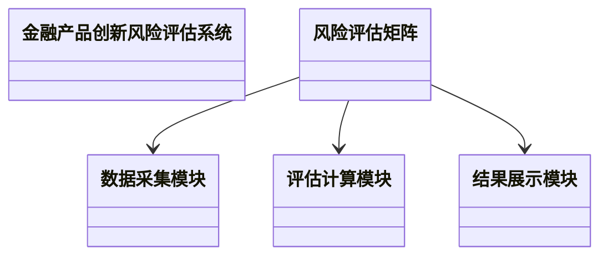
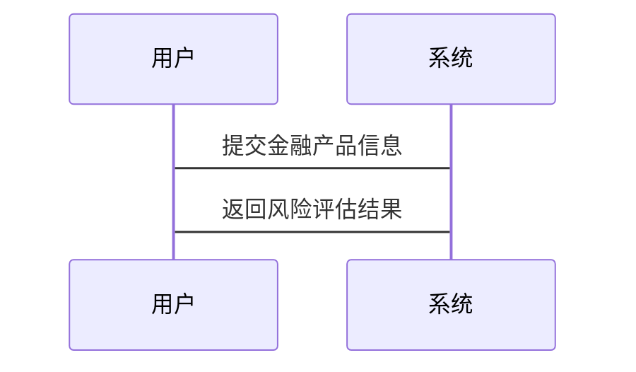

                 


# 《金融产品创新风险评估矩阵》

> 关键词：金融产品创新、风险评估、矩阵模型、层次分析法、金融系统架构

> 摘要：本文系统地介绍了金融产品创新风险评估矩阵的构建方法、核心算法、系统架构设计和实际应用案例。通过理论分析和实践结合，展示了如何利用矩阵模型对金融创新风险进行全面评估和管理，为金融创新提供了科学化、系统化的风险管理工具。

---

## 第1章: 金融产品创新的背景与问题背景

### 1.1 金融创新的背景

#### 1.1.1 金融创新的定义与特点
金融创新是指金融机构或市场参与者通过引入新的金融工具、产品、服务或业务模式，以满足市场需求或优化现有金融体系的过程。其特点包括：
- **创新性**：突破传统金融模式。
- **复杂性**：涉及多领域知识与技术。
- **风险性**：创新可能带来高风险。
- **收益性**：创新往往能带来超额收益。

#### 1.1.2 金融创新的驱动因素
- **市场需求**：客户对多样化金融产品的需求。
- **技术进步**：大数据、人工智能等技术推动金融创新。
- **政策支持**：政府鼓励金融创新的政策。
- **竞争压力**：金融机构之间的竞争促使创新。

#### 1.1.3 金融创新与风险的关系
创新是金融发展的动力，但创新也可能引入新的风险，如市场风险、信用风险、操作风险等。如何平衡创新与风险是金融机构的核心挑战。

---

### 1.2 问题背景与问题描述

#### 1.2.1 金融创新中的主要风险类型
- **市场风险**：金融产品因市场波动导致的损失。
- **信用风险**：交易对手违约风险。
- **操作风险**：操作失误或系统故障导致的损失。
- **流动性风险**：产品难以快速变现的风险。
- **法律风险**：政策或法规变化带来的风险。

#### 1.2.2 传统风险评估方法的局限性
- **单一维度评估**：传统方法通常只考虑单一风险类型，忽视了多维度风险的综合影响。
- **静态评估**：传统方法难以动态跟踪风险变化。
- **主观性高**：缺乏量化标准，评估结果主观性强。

#### 1.2.3 建立创新风险评估矩阵的必要性
- **全面性**：能够同时评估多种风险类型。
- **动态性**：能够实时跟踪风险变化。
- **量化评估**：提供可量化的风险评分，便于决策。

---

### 1.3 问题解决与边界

#### 1.3.1 创新风险评估矩阵的目标
- 提供一个系统化的工具，对金融创新产品的风险进行多维度、动态评估。
- 帮助金融机构在创新过程中降低风险，提高决策的科学性。

#### 1.3.2 矩阵的适用范围与边界
- 适用于所有类型的金融创新产品，包括但不限于贷款产品、理财产品、保险产品等。
- 不适用于非金融创新的业务或产品。

#### 1.3.3 矩阵与现有评估方法的对比
- **对比维度**：多维度评估 vs 单一维度评估。
- **评估方式**：动态评估 vs 静态评估。
- **结果呈现**：量化评分 vs 主观描述。

---

### 1.4 核心概念与结构

#### 1.4.1 风险评估矩阵的核心要素
- **风险维度**：市场风险、信用风险、操作风险等。
- **评估指标**：波动率、违约率、交易量等。
- **权重分配**：根据风险重要性分配权重。

#### 1.4.2 矩阵的构建逻辑
- 确定风险维度和指标。
- 设计权重分配机制。
- 建立评估模型。

#### 1.4.3 矩阵的数学模型框架
- 使用层次分析法（AHP）进行权重计算。
- 使用线性加权模型进行风险评分。

---

## 第2章: 风险评估矩阵的核心概念与联系

### 2.1 核心概念原理

#### 2.1.1 创新风险的分类与权重
- **分类**：市场风险、信用风险、操作风险、流动性风险、法律风险。
- **权重分配**：根据风险对整体创新的影响程度分配权重。

#### 2.1.2 矩阵的维度与指标设计
- **维度**：产品特性、市场环境、监管政策、技术实现。
- **指标**：产品复杂度、市场需求量、政策支持力度、技术稳定性。

#### 2.1.3 矩阵的评估逻辑
- 根据指标量化风险程度。
- 根据权重加权计算总体风险评分。

---

### 2.2 核心概念属性对比

#### 2.2.1 风险维度的属性特征对比表

| 风险维度 | 定义 | 计算公式 | 权重 |
|----------|------|----------|------|
| 市场风险 | 产品因市场波动带来的损失 | 波动率 * 产品规模 | 0.3 |
| 信用风险 | 交易对手违约带来的损失 | 违约概率 * 损失金额 | 0.25 |
| 操作风险 | 操作失误或系统故障带来的损失 | 故障频率 * 损失金额 | 0.2 |

---

#### 2.2.2 矩阵指标的权重分配
- 市场风险权重为0.3，信用风险权重为0.25，操作风险权重为0.2，流动性风险权重为0.15，法律风险权重为0.1。

#### 2.2.3 矩阵维度与评估目标的对应关系
- 市场风险对应市场波动率。
- 信用风险对应违约概率。
- 操作风险对应系统故障率。

---

### 2.3 ER实体关系图

```mermaid
er
    title 风险评估矩阵实体关系图
    产品创新实体
    风险维度实体
    评估指标实体
    产品创新与风险维度的关系
    风险维度与评估指标的关系
```

---

## 第3章: 风险评估矩阵的算法原理

### 3.1 算法原理概述

#### 3.1.1 层次分析法（AHP）的应用
- 层次分析法是一种用于多指标决策的分析方法，适用于风险评估矩阵的权重计算。

#### 3.1.2 风险评分计算公式
- 风险评分 = Σ（各维度风险值 * 权重）

#### 3.1.3 矩阵评估的权重分配方法
- 根据风险对整体创新的影响程度分配权重。

---

### 3.2 算法流程图



---

### 3.3 算法实现

#### 3.3.1 Python代码实现

```python
import numpy as np

# 定义风险维度和权重
dimensions = ['市场风险', '信用风险', '操作风险', '流动性风险', '法律风险']
weights = [0.3, 0.25, 0.2, 0.15, 0.1]

# 计算风险评分
def calculate_risk_scores(risk_values):
    scores = {}
    for i in range(len(dimensions)):
        scores[dimensions[i]] = risk_values[i] * weights[i]
    return scores

# 示例数据
risk_values = [0.2, 0.15, 0.1, 0.08, 0.05]
scores = calculate_risk_scores(risk_values)
print(scores)
```

#### 3.3.2 数学模型和公式

$$
\text{风险评分} = \sum_{i=1}^{n} (\text{风险值}_i \times \text{权重}_i)
$$

其中：
- $\text{风险值}_i$ 是第 $i$ 个风险维度的风险值。
- $\text{权重}_i$ 是第 $i$ 个风险维度的权重。

---

## 第4章: 系统分析与架构设计

### 4.1 问题场景介绍

#### 4.1.1 问题场景描述
- **场景1**：金融机构推出新的理财产品，需要评估其市场风险。
- **场景2**：评估P2P网络借贷产品的信用风险。

#### 4.1.2 项目介绍
- **项目目标**：构建一个金融产品创新风险评估系统。
- **项目范围**：覆盖主要金融产品类型。

---

### 4.2 系统功能设计

#### 4.2.1 系统功能模块
- **数据采集模块**：采集市场数据、产品信息。
- **评估计算模块**：计算风险评分。
- **结果展示模块**：可视化风险评估结果。

#### 4.2.2 领域模型类图



---

### 4.3 系统架构设计

#### 4.3.1 系统架构图


---

### 4.4 系统接口设计

#### 4.4.1 API接口
- **输入接口**：接收金融产品的基本信息。
- **输出接口**：返回风险评估结果。

#### 4.4.2 接口交互流程图



---

## 第5章: 项目实战

### 5.1 环境安装

#### 5.1.1 Python环境安装
- 安装Python 3.8及以上版本。
- 安装依赖库：numpy, matplotlib.

#### 5.1.2 系统安装
- 安装Jupyter Notebook用于数据分析和可视化。

---

### 5.2 系统核心实现

#### 5.2.1 核心代码实现

```python
import numpy as np
import matplotlib.pyplot as plt

# 风险评估矩阵
def risk_assessment_matrix(products):
    # 定义风险维度和权重
    dimensions = ['市场风险', '信用风险', '操作风险', '流动性风险', '法律风险']
    weights = [0.3, 0.25, 0.2, 0.15, 0.1]
    
    # 计算风险评分
    risk_scores = []
    for product in products:
        scores = {}
        for i in range(len(dimensions)):
            scores[dimensions[i]] = product[i] * weights[i]
        risk_scores.append(scores)
    
    return risk_scores

# 示例数据
products = [
    [0.2, 0.15, 0.1, 0.08, 0.05],
    [0.3, 0.1, 0.05, 0.07, 0.03]
]

# 调用函数
result = risk_assessment_matrix(products)
print(result)
```

---

### 5.3 代码应用解读与分析

- **代码功能**：对多个金融产品进行风险评估，计算每个产品的风险评分。
- **输出结果**：返回每个产品的风险维度评分。

---

### 5.4 实际案例分析

#### 5.4.1 案例分析
- **案例1**：评估一个P2P网络借贷产品的风险。
- **案例2**：评估一个创新型理财产品。

#### 5.4.2 案例解读
- 根据风险评分，分析产品的风险等级。
- 提出风险管理建议。

---

### 5.5 项目小结

- **项目总结**：通过案例分析，验证了风险评估矩阵的有效性。
- **经验总结**：在实际应用中，需要不断优化风险评估模型。

---

## 第6章: 最佳实践

### 6.1 小结

- **小结**：本文提出了一个金融产品创新风险评估矩阵，通过理论分析和实践案例，展示了其在金融创新中的应用。

---

### 6.2 注意事项

- **数据准确性**：确保输入数据的准确性。
- **模型优化**：根据实际情况优化风险评估模型。
- **风险管理**：定期更新风险评估结果。

---

### 6.3 拓展阅读

- **推荐书籍**：《金融风险管理》、《层次分析法在金融中的应用》。
- **在线课程**：推荐相关的在线课程和学习资源。

---

## 第7章: 作者信息

作者：AI天才研究院/AI Genius Institute & 禅与计算机程序设计艺术 /Zen And The Art of Computer Programming

---

感谢您的阅读！如果对本文有任何疑问或建议，请随时与我们联系。

