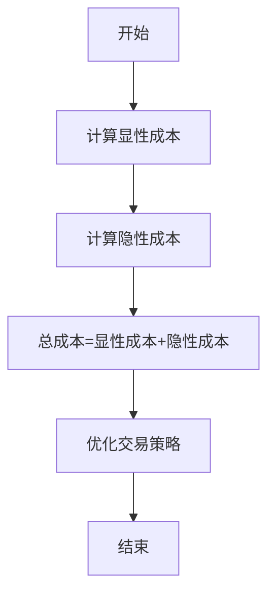
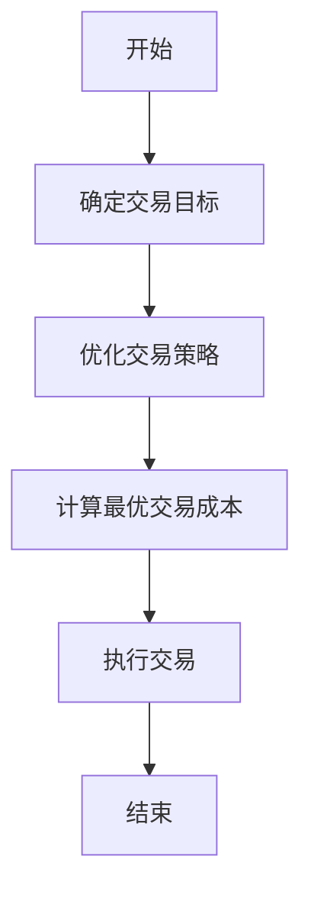

                 


# 金融市场交易成本分析与控制

---

## 关键词：  
- 金融市场  
- 交易成本  
- 分析方法  
- 控制策略  
- 系统设计  

---

## 摘要：  
金融市场交易成本是投资者在进行交易过程中所产生的一系列费用和损失，包括显性成本（如佣金、手续费）和隐性成本（如市场冲击、流动性风险）。本文将从交易成本的基本概念出发，详细分析其构成与影响因素，探讨多种分析方法，并提出有效的控制策略。通过系统设计与项目实战，结合实际案例，本文将为投资者和机构提供一套完整的交易成本分析与优化解决方案。

---

## 第一部分: 金融市场交易成本的基本概念  

### 第1章: 金融市场交易成本的基本概念  

#### 1.1 交易成本的定义与分类  
交易成本是指投资者在买入或卖出金融资产时所产生的一系列费用和损失。它不仅包括显性成本（如佣金、手续费等），还包括隐性成本（如市场冲击、流动性风险等）。  

**1.1.1 交易成本的定义**  
交易成本是指投资者在进行交易时所支付的所有费用和因交易而产生的额外成本。  

**1.1.2 交易成本的分类**  
交易成本可以分为显性成本和隐性成本：  
- **显性成本**：直接可量化的成本，如佣金、手续费、印花税等。  
- **隐性成本**：间接成本，如市场冲击、流动性风险、信息不对称等。  

**1.1.3 交易成本的影响因素**  
交易成本的影响因素包括交易规模、市场深度、交易时间和市场流动性等。  

#### 1.2 金融市场交易成本的核心概念  
交易成本的核心概念包括其构成要素、与投资收益的关系，以及其边界与外延。  

**1.2.1 交易成本的构成要素**  
交易成本的构成要素包括显性成本和隐性成本，其中显性成本是直接可见的，而隐性成本则是通过市场行为间接产生的。  

**1.2.2 交易成本与投资收益的关系**  
交易成本会直接影响投资收益。通常情况下，较高的交易成本会降低投资收益，因此在投资决策中需要综合考虑成本与收益的平衡。  

**1.2.3 交易成本的边界与外延**  
交易成本的边界在于其对投资收益的影响范围，而其外延则涉及市场结构、交易策略和风险管理等多个方面。  

#### 1.3 本章小结  
本章从基本概念出发，详细介绍了交易成本的定义、分类及其影响因素，为后续章节的分析奠定了基础。  

---

## 第二部分: 交易成本的构成与分析方法  

### 第2章: 交易成本的构成分析  

#### 2.1 显性交易成本  
显性交易成本是投资者在交易过程中可以直接量化的费用。  

**2.1.1 佣金与手续费**  
佣金是指投资者支付给经纪人的费用，手续费则是指交易系统收取的费用。  

**2.1.2 市场冲击与流动性成本**  
市场冲击是指大量交易导致的价格波动，而流动性成本则是指因市场流动性不足而产生的额外成本。  

**2.1.3 其他显性成本**  
其他显性成本包括印花税、过户费等。  

#### 2.2 隐性交易成本  
隐性交易成本是投资者在交易过程中无法直接量化的费用。  

**2.2.1 信息不对称成本**  
信息不对称是指市场参与者之间信息的不均衡所导致的成本。  

**2.2.2 时间成本与机会成本**  
时间成本是指因交易延迟而产生的成本，机会成本是指因错失交易机会而产生的成本。  

**2.2.3 风险成本**  
风险成本是指因交易风险（如价格波动）而产生的成本。  

#### 2.3 交易成本的综合分析  
综合分析交易成本需要考虑显性成本和隐性成本的动态变化。  

**2.3.1 交易成本的加总方法**  
交易成本的总成本可以通过显性成本和隐性成本的加总来计算。  

**2.3.2 交易成本的动态变化**  
交易成本会随着市场条件的变化而波动，因此需要动态监控和调整。  

**2.3.3 交易成本的优化方向**  
优化交易成本的方向包括降低显性成本和减少隐性成本。  

#### 2.4 核心概念原理  
交易成本的计算可以使用以下公式：  
$$C = C_{explicit} + C_{implicit}$$  

其中，$C$ 表示总交易成本，$C_{explicit}$ 表示显性成本，$C_{implicit}$ 表示隐性成本。  

#### 2.5 核心概念对比表格  
以下表格对比了显性和隐性交易成本的主要区别：  

| 成本类型 | 定义 | 影响因素 | 计算方式 |
|----------|------|----------|----------|
| 显性成本 | 直接可量化的成本，如佣金、手续费 | 交易量、市场深度 | 累加法 |
| 隐性成本 | 间接成本，如市场冲击、流动性风险 | 市场流动性、交易时机 | 加权法 |

#### 2.6 本章小结  
本章详细分析了交易成本的构成，包括显性和隐性成本，并提供了对比表格和数学模型，为后续的分析和控制提供了基础。

---

### 第3章: 交易成本的分析方法  

#### 3.1 定性分析方法  
定性分析方法主要包括信息分析法、市场分析法和风险评估法。  

**3.1.1 信息分析法**  
信息分析法通过分析市场信息来评估交易成本。  

**3.1.2 市场分析法**  
市场分析法通过研究市场结构和流动性来评估交易成本。  

**3.1.3 风险评估法**  
风险评估法通过评估交易风险来预测交易成本。  

#### 3.2 定量分析方法  
定量分析方法包括成本加总法、成本分摊法和成本效益分析。  

**3.2.1 成本加总法**  
成本加总法将显性和隐性成本加总起来，计算总交易成本。  

**3.2.2 成本分摊法**  
成本分摊法将交易成本分摊到每笔交易中。  

**3.2.3 成本效益分析**  
成本效益分析比较不同交易策略的成本与收益，选择最优策略。  

#### 3.3 数据分析与建模  
数据分析与建模是交易成本分析的重要部分。  

**3.3.1 数据采集与处理**  
数据采集与处理包括收集市场数据和交易数据，并进行清洗和预处理。  

**3.3.2 成本模型构建**  
成本模型构建需要根据实际数据，建立交易成本的数学模型。  

**3.3.3 模型验证与优化**  
模型验证与优化通过回测和参数调整，确保模型的准确性和有效性。  

#### 3.4 算法原理讲解  
以下是一个简单的交易成本计算算法流程图：  



同时，以下是算法的Python实现示例：  

```python
def calculate_cost(trade_volume, market_depth):
    explicit_cost = trade_volume * 0.005
    implicit_cost = max(0, trade_volume * (1/market_depth) * 0.01)
    total_cost = explicit_cost + implicit_cost
    return total_cost
```

#### 3.5 本章小结  
本章介绍了定性和定量分析方法，并通过数据分析与建模，详细讲解了交易成本的分析过程。

---

## 第三部分: 交易成本的控制策略  

### 第4章: 交易成本的控制策略  

#### 4.1 优化交易策略  
优化交易策略是降低交易成本的重要方法。  

**4.1.1 算法交易**  
算法交易通过自动化交易系统来优化交易成本。  

**4.1.2 高频交易**  
高频交易通过快速交易减少市场冲击和流动性成本。  

**4.1.3 执行管理**  
执行管理通过优化交易执行策略来降低交易成本。  

#### 4.2 风险管理与控制  
风险管理是控制交易成本的重要手段。  

**4.2.1 风险评估**  
风险评估通过识别和量化风险来制定风险管理策略。  

**4.2.2 头寸控制**  
头寸控制通过调整持仓规模来降低风险成本。  

**4.2.3 对冲策略**  
对冲策略通过套期保值来降低交易成本。  

#### 4.3 系统优化与效率提升  
系统优化是降低交易成本的重要途径。  

**4.3.1 技术优化**  
技术优化包括优化交易系统和网络架构，提高交易效率。  

**4.3.2 市场结构优化**  
市场结构优化包括优化市场深度和流动性，降低交易成本。  

**4.3.3 制度优化**  
制度优化包括优化税收政策和交易规则，降低显性成本。  

#### 4.4 核心概念原理  
以下是一个优化交易策略的算法流程图：  



#### 4.5 核心概念对比表格  
以下表格对比了不同优化策略的效果和适用场景：  

| 优化策略 | 定义 | 适用场景 | 优缺点 |
|----------|------|----------|--------|
| 算法交易 | 自动化交易系统 | 高频交易和复杂策略 | 高效但需要高技术投入 |
| 高频交易 | 快速交易 | 低延迟交易 | 高效但成本高 |
| 执行管理 | 优化执行策略 | 各类交易 | 灵活但需要专业知识 |

#### 4.6 本章小结  
本章介绍了优化交易策略、风险管理与控制以及系统优化等控制策略，并提供了对比分析。

---

### 第5章: 交易成本控制的系统设计与实现  

#### 5.1 系统设计概述  
系统设计是实现交易成本控制的重要部分。  

**5.1.1 系统目标**  
系统目标是实现交易成本的实时监控和优化。  

**5.1.2 系统功能模块**  
系统功能模块包括数据采集、成本计算、策略优化和执行管理。  

**5.1.3 系统架构设计**  
系统架构设计包括前端界面、后端逻辑和数据存储。  

#### 5.2 数据采集与处理系统  
数据采集与处理系统是系统设计的重要部分。  

**5.2.1 数据源**  
数据源包括市场数据和交易数据。  

**5.2.2 数据清洗与预处理**  
数据清洗与预处理包括去除异常值和填充缺失值。  

**5.2.3 数据特征提取**  
数据特征提取包括提取交易量、价格波动等特征。  

#### 5.3 成本计算与优化模块  
成本计算与优化模块是系统的核心部分。  

**5.3.1 成本计算方法**  
成本计算方法包括显性成本和隐性成本的计算。  

**5.3.2 优化算法实现**  
优化算法实现包括遗传算法和模拟退火算法。  

#### 5.4 系统实现与接口设计  
系统实现与接口设计是系统开发的重要部分。  

**5.4.1 系统实现**  
系统实现包括前端开发和后端开发。  

**5.4.2 系统接口设计**  
系统接口设计包括API接口和数据库接口。  

#### 5.5 本章小结  
本章详细介绍了系统设计与实现，包括数据采集、成本计算和优化模块的设计。

---

### 第6章: 项目实战与案例分析  

#### 6.1 项目背景与目标  
项目背景是降低交易成本，目标是通过优化交易策略和系统设计，实现交易成本的最小化。  

#### 6.2 数据准备与环境搭建  
数据准备包括收集市场数据和交易数据，环境搭建包括安装必要的工具和软件。  

#### 6.3 系统实现与代码解读  
系统实现包括交易成本计算模块和优化策略实现模块。  

**代码示例**  
```python
def optimize_strategy(trade_volume, market_depth):
    explicit_cost = trade_volume * 0.005
    implicit_cost = trade_volume * (1/market_depth) * 0.01
    total_cost = explicit_cost + implicit_cost
    return total_cost
```

#### 6.4 案例分析与结果展示  
案例分析包括实际交易中的成本计算和优化策略的应用。  

#### 6.5 本章小结  
本章通过项目实战，详细讲解了交易成本分析与控制的实现过程，并展示了实际案例。

---

## 第四部分: 总结与展望  

### 第7章: 总结与展望  

#### 7.1 核心知识点回顾  
交易成本的分析与控制包括显性和隐性成本的分析、多种分析方法的应用以及优化策略的实施。  

#### 7.2 交易成本分析与控制的未来展望  
未来，随着技术的发展和市场的变化，交易成本的分析与控制将更加智能化和自动化。  

#### 7.3 最佳实践 tips  
- 交易成本分析需要结合定性和定量方法，实现全面监控。  
- 优化交易策略需要根据市场条件动态调整。  
- 系统设计需要考虑数据处理和优化算法的高效性。  

#### 7.4 本章小结  
本章总结了全文，强调了交易成本分析与控制的重要性，并对未来的发展方向提出了展望。

---

## 作者：AI天才研究院/AI Genius Institute & 禅与计算机程序设计艺术 /Zen And The Art of Computer Programming  

---

**感谢您的阅读！**

