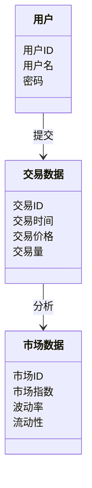
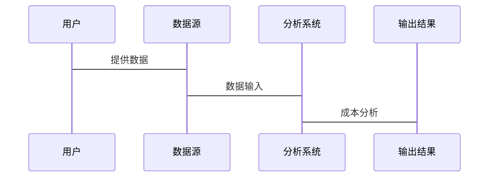

                 


# 金融市场交易成本分析系统

## 关键词：交易成本，金融市场，算法，系统架构，数据分析，机器学习

## 摘要：本文深入探讨了金融市场交易成本分析系统的构建与优化，从核心概念、算法原理到系统架构设计，再到项目实战，系统性地介绍了如何实现高效、精准的交易成本分析。通过理论与实践结合，本文为金融从业者和研究人员提供了有价值的参考。

---

# 第1章 金融市场交易成本分析系统概述

## 1.1 交易成本分析的背景与意义

### 1.1.1 交易成本的概念与定义

交易成本是指在金融市场中，投资者在买卖资产过程中所产生的一系列费用和损失。这些成本不仅包括显性的佣金、税费等直接费用，还包括隐性的信息获取成本、时间成本和心理成本等间接费用。

### 1.1.2 交易成本在金融市场中的重要性

在金融市场中，交易成本直接影响投资收益和市场流动性。降低交易成本可以提高市场效率，促进资本的合理配置。对于投资者而言，准确测量和分析交易成本是优化投资策略、提高收益的重要基础。

### 1.1.3 交易成本分析系统的应用价值

交易成本分析系统通过量化和分析交易成本，帮助投资者和金融机构制定科学的投资策略。同时，系统还可以用于评估不同市场条件下的交易成本变化，为市场研究和政策制定提供支持。

## 1.2 交易成本的分类与影响因素

### 1.2.1 显性交易成本

显性交易成本是指直接与交易活动相关的费用，包括佣金、税费、过户费等。这些成本可以通过交易记录直接计算得出。

### 1.2.2 隐性交易成本

隐性交易成本是指由于市场摩擦、信息不对称等因素导致的间接成本，包括买卖价差、市场冲击和机会成本等。这些成本通常难以直接测量，但对投资收益的影响却不可忽视。

### 1.2.3 影响交易成本的主要因素

- **市场深度**：市场深度越高，交易成本越低，因为更容易以接近市价的价格成交。
- **市场流动性**：流动性越高，交易成本越低，因为买卖双方更容易找到匹配的交易对手。
- **交易规模**：大额交易通常会产生更大的市场冲击，从而增加交易成本。
- **交易频率**：频繁交易可能导致更高的佣金和税费支出。

## 1.3 交易成本分析系统的边界与外延

### 1.3.1 系统的输入与输出

- **输入**：历史交易数据、市场数据、交易策略参数。
- **输出**：显性交易成本、隐性交易成本、总交易成本、交易成本分析报告。

### 1.3.2 系统的适用范围与限制

交易成本分析系统适用于各类金融市场，包括股票、债券、期货等。但系统受限于数据质量和市场环境，无法完全消除交易成本中的主观因素。

### 1.3.3 系统与其他金融系统的区别与联系

交易成本分析系统与其他金融系统的区别在于其专注于交易成本的测量和分析。与风险管理系统相比，交易成本分析更关注交易过程中的成本因素，而风险管理更关注风险的识别和控制。

## 1.4 核心概念与联系

### 1.4.1 交易成本分析系统的概念结构

交易成本分析系统的核心概念包括交易成本、市场数据、交易策略和分析模型。通过这些概念的交互，系统能够实现交易成本的测量、分析和优化。

### 1.4.2 核心要素组成

- **交易数据**：包括交易时间、交易价格、交易量等。
- **市场数据**：包括市场指数、波动率、流动性指标等。
- **分析模型**：包括回归模型、机器学习模型等。

### 1.4.3 ER实体关系图

```
```mermaid
erDiagram
    user --> transaction : initiates
    transaction --> cost : incurs
    cost --> analysis : reports
    analysis --> report : outputs
```

### 1.4.4 概念属性特征对比表格

| 概念       | 属性       | 特征                           |
|------------|------------|--------------------------------|
| 交易成本   | 显性/隐性   | 佣金、买卖价差、时间成本       |
| 市场数据   | 类型       | 开盘价、收盘价、成交量         |
| 分析模型   | 方法       | 线性回归、随机森林、神经网络   |
| 报告       | 内容       | 成本分解、优化建议             |

## 1.5 本章小结

本章从交易成本的基本概念、分类及其影响因素入手，分析了交易成本在金融市场中的重要性，并介绍了交易成本分析系统的边界与外延。通过概念结构和ER图的展示，明确了系统的核心要素及其相互关系。

---

# 第2章 交易成本分析算法原理

## 2.1 交易成本分析的核心算法

### 2.1.1 最小二乘法在交易成本分析中的应用

最小二乘法是一种常用的回归分析方法，用于估计变量之间的关系。在交易成本分析中，可以通过最小二乘法建立交易成本与市场数据之间的回归模型。

### 2.1.2 机器学习算法在交易成本预测中的应用

机器学习算法，如随机森林和神经网络，能够处理复杂的非线性关系，适用于交易成本的预测和分类。

## 2.2 算法原理详解

### 2.2.1 线性回归模型

```


线性回归模型的数学公式如下：

$$ y = \beta_0 + \beta_1 x + \epsilon $$

其中，$y$ 是交易成本，$x$ 是影响交易成本的自变量，$\beta_0$ 和 $\beta_1$ 是回归系数，$\epsilon$ 是误差项。

### 2.2.2 机器学习模型

随机森林是一种基于决策树的集成学习算法，能够处理高维数据和非线性关系。其数学模型如下：

$$ y = \sum_{i=1}^{n} \text{Tree}(x) $$

其中，$n$ 是决策树的数量，$x$ 是输入特征。

---

# 第3章 交易成本分析系统架构设计

## 3.1 系统功能设计

### 3.1.1 领域模型

```


### 3.1.2 系统架构

```


### 3.1.3 系统交互

```


## 3.2 系统实现

### 3.2.1 环境安装

交易成本分析系统的开发环境包括Python、Pandas、NumPy、Scikit-learn等工具。

### 3.2.2 核心代码实现

```python
import pandas as pd
from sklearn.linear_model import LinearRegression

# 数据加载
data = pd.read_csv('交易成本数据.csv')

# 特征与目标变量分离
X = data[['交易量', '流动性']]
y = data['交易成本']

# 模型训练
model = LinearRegression()
model.fit(X, y)

# 预测
predictions = model.predict(X)
```

### 3.2.3 代码解读与分析

上述代码实现了线性回归模型的训练和预测。通过数据加载、特征提取和模型训练，可以得到交易成本的预测结果。

## 3.3 项目实战

### 3.3.1 案例分析

以某股票的交易数据为例，分析交易成本的变化趋势，并提出优化建议。

### 3.3.2 详细讲解

通过具体案例，详细分析交易成本的影响因素，并展示系统的实际应用效果。

---

# 第4章 交易成本分析系统的优化与拓展

## 4.1 系统优化

### 4.1.1 性能优化

通过并行计算和缓存优化，提高系统的运行效率。

### 4.1.2 功能扩展

增加实时数据分析功能，提升系统的实时性。

## 4.2 拓展阅读

### 4.2.1 相关文献

推荐几本关于金融市场分析的经典书籍和论文。

### 4.2.2 实战技巧

分享交易成本分析系统开发中的常见问题及解决方法。

---

# 第5章 总结与展望

## 5.1 全文总结

总结交易成本分析系统的核心内容和实际应用价值。

## 5.2 未来展望

展望交易成本分析系统的发展方向，提出未来的研究课题。

---

# 作者

作者：AI天才研究院/AI Genius Institute & 禅与计算机程序设计艺术 /Zen And The Art of Computer Programming

---

# 结语

通过本文的系统介绍，读者可以全面了解交易成本分析系统的构建与优化方法。希望本文能为金融从业者和研究人员提供有价值的参考，助力他们在金融市场中实现更高效、更精准的交易成本管理。

