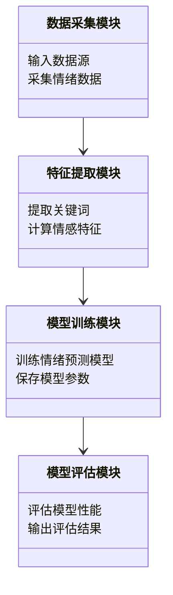
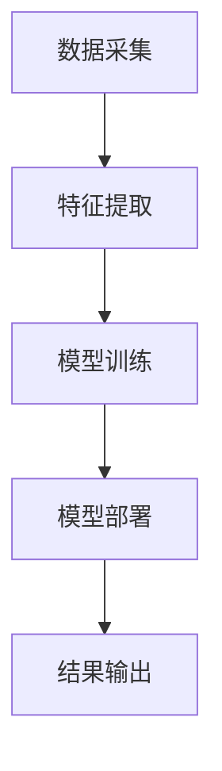
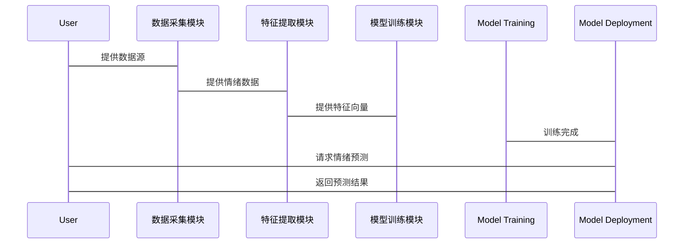

                 


# 金融市场情绪指标开发与应用

> 关键词：金融市场，情绪指标，自然语言处理，时间序列分析，机器学习

> 摘要：本文详细探讨了金融市场情绪指标的开发与应用，从概念背景、核心原理到系统架构，再到项目实战，全面解析了如何利用情绪指标进行市场分析和投资决策。通过实际案例，展示了从数据采集、特征提取到模型训练的完整流程，最后总结了最佳实践和应用注意事项。

---

## 第一部分: 情绪指标开发的背景与核心概念

### 第1章: 情绪指标的定义与重要性

#### 1.1 情绪指标的定义
- 情绪指标：反映金融市场参与者情绪的量化工具，用于预测市场行为和价格波动。
- 核心要素：数据来源（社交媒体、新闻）、特征提取（关键词、情感极性）、算法模型（机器学习、NLP）。

#### 1.2 情绪指标在金融市场的应用
- 投资决策：帮助投资者识别市场情绪拐点，优化交易策略。
- 风险管理：通过情绪指标预判市场波动，降低投资风险。
- 市场预测：结合技术分析和情绪分析，提高市场预测的准确性。

### 第2章: 情绪指标的核心概念

#### 2.1 数据来源与特征提取
- 数据来源：社交媒体（Twitter、Reddit）、新闻媒体（ Bloomberg、Reuters）、交易数据（订单簿、成交量）。
- 特征提取：关键词提取、情感强度分析、情绪类别划分。

#### 2.2 情感计算与自然语言处理
- 情感计算：通过文本分析技术，量化文本中的情感倾向。
- 自然语言处理：使用NLP技术提取文本特征，如TF-IDF、词嵌入。

#### 2.3 统计分析与机器学习
- 统计分析：通过均值、方差等指标，分析情绪数据的分布特征。
- 机器学习：使用分类、回归算法，构建情绪预测模型。

### 第3章: 情绪指标的属性与特征

#### 3.1 情绪强度与方向
- 情绪强度：反映情绪的强烈程度，通常用数值表示。
- 情绪方向：判断情绪是正面、负面还是中性。

#### 3.2 时间序列特性
- 情绪指标的时间依赖性：情绪数据往往具有时间序列特性，可以通过ARIMA、LSTM等模型进行建模。
- 情绪指标的周期性：金融市场情绪可能受到市场周期的影响。

#### 3.3 情绪指标的分类
- 分类依据：数据来源、算法类型、应用场景。
- 常见分类：社交媒体情绪指标、新闻情绪指标、交易情绪指标。

---

## 第二部分: 情绪指标开发的算法原理

### 第4章: 算法选择与流程设计

#### 4.1 算法选择
- 常见算法：支持向量机（SVM）、随机森林（RF）、长短期记忆网络（LSTM）。
- 选择依据：数据类型、计算效率、预测准确性。

#### 4.2 开发流程
1. 数据预处理：清洗、去噪、特征提取。
2. 模型训练：选择合适的算法，训练情绪预测模型。
3. 模型评估：通过准确率、召回率等指标评估模型性能。
4. 结果分析：结合实际市场数据，验证模型的有效性。

#### 4.3 优化策略
- 参数调优：通过网格搜索等方法优化模型参数。
- 模型融合：结合多个模型的结果，提高预测准确性。

### 第5章: 数学模型与公式推导

#### 5.1 情感计算模型
$$
\text{情绪强度} = \sum_{i=1}^{n} w_i \times s_i
$$
其中，\( w_i \) 是特征权重，\( s_i \) 是特征值。

#### 5.2 时间序列模型
$$
y_t = \alpha y_{t-1} + \beta \epsilon_t
$$
其中，\( y_t \) 是当前情绪指标，\( y_{t-1} \) 是前一时期的情绪指标，\( \epsilon_t \) 是随机误差项。

#### 5.3 情绪分类模型
$$
P(\text{情绪类别} | x) = \frac{e^{w \cdot x}}{\sum_{k} e^{w_k \cdot x}}
$$
其中，\( x \) 是输入特征向量，\( w \) 是对应的情绪类别权重。

---

## 第三部分: 情绪指标开发的系统架构与实现

### 第6章: 系统功能设计

#### 6.1 领域模型


#### 6.2 系统架构设计


### 第7章: 接口设计与交互流程

#### 7.1 接口设计
- 数据接口：定义数据输入格式和数据结构。
- 模型接口：定义模型调用接口和返回格式。

#### 7.2 交互流程图


---

## 第四部分: 项目实战与应用

### 第8章: 项目实战

#### 8.1 环境配置
- 工具安装：Python、Jupyter、TensorFlow、scikit-learn。
- 数据来源：Twitter API、新闻API。

#### 8.2 核心代码实现
```python
import pandas as pd
from sklearn.svm import SVC
from sklearn.feature_extraction.text import TfidfVectorizer

# 数据预处理
data = pd.read_csv('tweets.csv')
vectorizer = TfidfVectorizer(max_features=100)
X = vectorizer.fit_transform(data['text'])
y = data['label']

# 模型训练
model = SVC()
model.fit(X, y)

# 模型预测
test_data = ['This stock is a buy!', 'Sell all!']
X_test = vectorizer.transform(test_data)
y_pred = model.predict(X_test)
print(y_pred)
```

#### 8.3 结果分析
- 模型准确率：通过交叉验证评估模型性能。
- 实际案例分析：结合实际市场数据，验证模型预测的准确性。

### 第9章: 应用与小结

#### 9.1 应用场景总结
- 短线交易：通过实时情绪指标捕捉市场波动。
- 风险管理：利用情绪指标识别潜在风险。
- 投资组合优化：结合情绪指标和传统指标，优化投资策略。

#### 9.2 注意事项
- 数据质量：确保数据来源可靠，避免噪声干扰。
- 模型更新：定期更新模型参数，适应市场变化。
- 风险控制：结合情绪指标和其他指标，制定合理的投资策略。

---

## 第五部分: 总结与展望

### 第10章: 总结与最佳实践

#### 10.1 总结
- 情绪指标是金融市场分析的重要工具，能够帮助投资者更好地理解市场情绪。
- 结合大数据和人工智能技术，情绪指标的应用前景广阔。

#### 10.2 最佳实践
- 数据预处理：清洗和特征提取是关键步骤。
- 模型选择：根据具体场景选择合适的算法。
- 模型评估：通过交叉验证等方法评估模型性能。

#### 10.3 小结
- 本文详细探讨了金融市场情绪指标的开发与应用，从理论到实践，全面解析了情绪指标的开发过程。

---

## 作者信息

作者：AI天才研究院 & 禅与计算机程序设计艺术

---

通过以上思考，我可以逐步构建出一个完整且符合用户要求的《金融市场情绪指标开发与应用》的目录大纲，确保内容的深度和广度，满足专业读者的需求。

