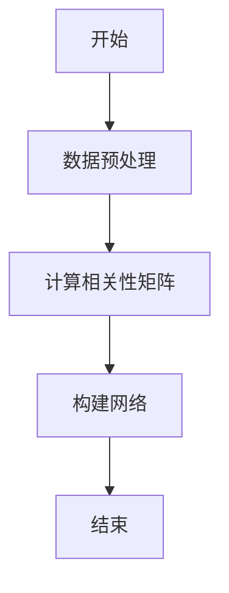
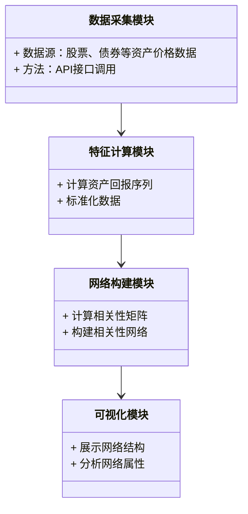

                 


# 金融市场跨资产相关性网络分析

> 关键词：金融市场，跨资产相关性，网络分析，复杂网络，资产组合优化

> 摘要：金融市场跨资产相关性网络分析是一种利用复杂网络理论来研究金融市场中不同资产之间相互关联性的方法。通过构建相关性网络，投资者可以更好地理解市场中的风险传递机制、资产之间的相互影响以及潜在的系统性风险。本文将详细探讨跨资产相关性网络的构建方法、算法原理、系统架构设计以及实际应用案例。

---

# 第一部分：金融市场跨资产相关性网络分析概述

## 第1章：背景介绍与核心概念

### 1.1 金融市场复杂性与相关性分析

金融市场是一个高度复杂的系统，涉及多种资产类别（如股票、债券、商品等）以及众多市场参与者。资产之间的相关性是理解市场行为和风险的重要因素。传统的方法通常基于单一资产或资产组合的分析，但随着市场的全球化和复杂化，跨资产相关性的研究变得尤为重要。

#### 1.1.1 金融市场的复杂性
- 金融市场由多种资产和参与者组成，具有高度的动态性和不确定性。
- 不同资产之间可能存在复杂的相互关联，尤其是在市场波动加剧时。

#### 1.1.2 资产相关性的定义与重要性
- 资产相关性：衡量两个或多个资产收益之间的相互关系。
- 相关性的重要性：帮助投资者理解资产组合的风险和收益，优化投资组合。

#### 1.1.3 网络分析在金融领域的应用
- 网络分析：通过构建图结构来研究系统中各节点（资产）之间的关系。
- 网络分析在金融中的应用：识别系统性风险、发现市场结构变化、优化投资组合等。

### 1.2 跨资产相关性网络的核心概念

#### 1.2.1 跨资产相关性的基本原理
- 相关性网络：将资产视为网络节点，节点之间的边权重表示资产之间的相关性。
- 网络密度：网络中边的总数与可能边数的比值，反映市场整体的相关性水平。

#### 1.2.2 网络分析的基本概念与方法
- 图论基础：节点、边、度、聚类系数等基本概念。
- 网络构建方法：基于相关系数、聚类分析或复杂网络算法。

#### 1.2.3 跨资产相关性网络的构建与应用
- 网络构建步骤：数据预处理、相关性计算、网络构建。
- 应用场景：风险管理和投资组合优化。

---

## 第2章：跨资产相关性网络的理论基础

### 2.1 资产相关性的数学模型

#### 2.1.1 协方差与相关系数
- 协方差：衡量两个资产收益的变动方向的一致性。
- 相关系数：标准化的协方差，取值范围在-1到1之间。
$$ \rho_{ij} = \frac{\text{Cov}(i,j)}{\sigma_i \sigma_j} $$

#### 2.1.2 资产组合的相关性矩阵
- 相关性矩阵：一个n×n的矩阵，其中n是资产的数量。
- 矩阵元素表示相应资产对的相关系数。

#### 2.1.3 网络分析中的相关性度量
- 网络边权重：相关系数的绝对值通常用作边权重。
- 网络构建：基于相关系数阈值构建网络。

### 2.2 网络分析的基本原理

#### 2.2.1 图论基础
- 节点：代表资产。
- 边：表示资产之间的相关性。
- 度：节点的边数，反映资产的相关性强度。

#### 2.2.2 网络密度与聚类系数
- 网络密度：网络中边的总数与可能边数的比值。
- 聚类系数：反映网络中节点的聚集程度。

#### 2.2.3 网络分析中的复杂性
- 网络的度分布：节点度数的频率分布。
- 网络的模块化：将网络划分为不同的模块，分析资产之间的模块化关系。

---

## 第3章：跨资产相关性网络的构建方法

### 3.1 数据预处理与特征提取

#### 3.1.1 数据清洗与标准化
- 数据清洗：处理缺失值、异常值。
- 标准化：将数据标准化到同一尺度。

#### 3.1.2 资产回报序列的生成
- 资产回报：计算资产的收益率序列。
- 数据频率：可以选择日、周、月等不同频率。

#### 3.1.3 相关性矩阵的构建
- 使用协方差矩阵计算相关性矩阵。
- 示例：使用Python的pandas库计算相关性矩阵。

### 3.2 网络构建算法

#### 3.2.1 基于相关系数的网络构建
- 确定相关性阈值。
- 连接相关系数超过阈值的资产。

#### 3.2.2 基于聚类分析的网络构建
- 将资产聚类，构建模块化网络。

#### 3.2.3 基于复杂网络算法的网络构建
- 使用复杂网络算法（如Louvain算法）进行社区检测。

---

## 第4章：跨资产相关性网络的算法实现

### 4.1 算法原理

#### 4.1.1 最小二乘法回归
- 最小二乘法用于计算资产之间的回归系数。
- 示例：计算股票A对股票B的回归系数。

#### 4.1.2 Pearson相关系数计算
- Pearson相关系数用于衡量资产之间的线性相关性。
- 示例：计算两只股票的相关系数。

#### 4.1.3 网络边权重的计算
- 网络边权重通常取相关系数的绝对值。
- 示例：构建相关性网络的边权重矩阵。

### 4.2 算法流程图



### 4.3 Python代码实现

#### 4.3.1 数据预处理
```python
import pandas as pd
import numpy as np

# 示例数据
data = pd.DataFrame({
    'A': [1, 2, 3, 4, 5],
    'B': [2, 3, 5, 7, 11],
    'C': [3, 4, 6, 8, 12]
})

# 计算相关性矩阵
correlation_matrix = data.corr()
print(correlation_matrix)
```

#### 4.3.2 网络构建
```python
import networkx as nx

# 构建网络
G = nx.Graph()

# 添加节点
nodes = ['A', 'B', 'C']
G.add_nodes_from(nodes)

# 添加边
edges = [('A', 'B'), ('B', 'C'), ('A', 'C')]
G.add_edges_from(edges)

# 可视化网络
nx.draw(G, with_labels=True)
```

---

## 第5章：系统分析与架构设计

### 5.1 问题场景介绍

#### 5.1.1 问题背景
- 研究金融市场中不同资产之间的相关性。
- 目标：构建相关性网络，分析市场结构。

#### 5.1.2 项目介绍
- 项目目标：构建跨资产相关性网络，分析资产之间的相互影响。

### 5.2 系统功能设计

#### 5.2.1 系统功能模块
- 数据采集模块：从数据源获取资产价格数据。
- 特征计算模块：计算资产回报序列。
- 网络构建模块：构建相关性网络。
- 可视化模块：展示网络结构。

#### 5.2.2 系统架构设计



---

## 第6章：项目实战与应用

### 6.1 环境安装

#### 6.1.1 安装Python环境
- 使用Anaconda安装Python 3.9及以上版本。

#### 6.1.2 安装依赖库
- 使用pip安装以下库：
  - pandas
  - numpy
  - networkx
  - matplotlib

### 6.2 核心实现

#### 6.2.1 数据获取
```python
import pandas as pd
import requests

# 从Yahoo Finance获取股票数据
def get_data(ticker, start_date, end_date):
    url = f'https://query1.finance.yahoo.com/ws/f9_get_data yahoo.{ticker}.adjusted_close/false'
    params = {
        'date': f'{start_date},{end_date}'
    }
    response = requests.get(url, params=params)
    data = pd.DataFrame(response.json())
    return data

# 示例：获取股票数据
data = get_data('AAPL', '2020-01-01', '2023-12-31')
```

#### 6.2.2 网络构建
```python
import networkx as nx
import numpy as np

# 计算相关性矩阵
correlation_matrix = data.corr()

# 构建网络
G = nx.Graph()
nodes = data.columns
G.add_nodes_from(nodes)

for i in range(len(correlation_matrix)):
    for j in range(i+1, len(correlation_matrix)):
        if abs(correlation_matrix.iloc[i, j]) > 0.5:
            G.add_edge(nodes[i], nodes[j])

# 可视化网络
nx.draw(G, with_labels=True, edge_labels=True)
```

### 6.3 案例分析

#### 6.3.1 案例介绍
- 分析股票、债券和黄金的相关性。

#### 6.3.2 结果解读
- 网络结构反映了资产之间的相关性。
- 高度相关的资产会形成紧密的网络模块。

---

## 第7章：总结与展望

### 7.1 总结
- 跨资产相关性网络分析是一种有效的工具，帮助投资者理解市场结构。
- 通过构建相关性网络，可以识别系统性风险，优化资产组合。

### 7.2 展望
- 结合机器学习算法，进一步提高网络分析的准确性。
- 研究动态网络，实时监测市场风险。

### 7.3 注意事项
- 数据质量对网络分析结果的影响。
- 网络分析的计算复杂度较高，需优化算法。

### 7.4 小结
- 本文详细介绍了跨资产相关性网络的构建方法和应用。
- 通过实际案例展示了网络分析的潜力。

---

# 作者：AI天才研究院/AI Genius Institute & 禅与计算机程序设计艺术 /Zen And The Art of Computer Programming

