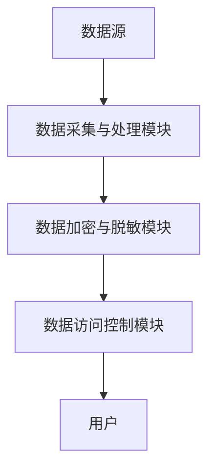

                 


```markdown
# 《金融数据安全与隐私保护框架》

---

## 关键词：金融数据安全、隐私保护、联邦学习、多方安全计算、数据脱敏、隐私计算

---

## 摘要：  
本文系统地探讨了金融数据安全与隐私保护的核心框架，重点分析了隐私计算、数据脱敏、联邦学习与多方安全计算等关键技术的原理与应用。通过结合实际案例，深入讲解了金融数据安全与隐私保护的系统架构设计、实现方法及最佳实践，为金融机构和相关技术从业者提供了理论与实践相结合的指导。

---

## 第一部分：金融数据安全与隐私保护框架概述

### 第1章：金融数据安全与隐私保护的背景与挑战

#### 1.1 金融数据安全的重要性

##### 1.1.1 金融数据的敏感性与价值  
金融数据是金融机构的核心资产，涵盖了客户信息、交易记录、财务数据等敏感信息。这些数据不仅具有巨大的商业价值，还直接关系到客户的隐私和财产安全。  

##### 1.1.2 数字化时代的金融数据安全威胁  
随着金融业务的数字化转型，金融数据的暴露面不断扩大，数据泄露、网络攻击等安全威胁日益增加。金融机构需要面对来自内外部的安全风险，确保数据的机密性、完整性和可用性。  

##### 1.1.3 隐私保护的法律与合规要求  
近年来，全球范围内的隐私保护法规（如GDPR、CCPA）对金融机构提出了更高的要求。金融机构必须在合法合规的前提下，保护客户隐私，避免因数据泄露引发的法律风险和声誉损失。  

---

#### 1.2 金融数据安全与隐私保护的核心问题

##### 1.2.1 数据泄露的潜在风险  
金融数据的泄露可能导致严重的经济损失和声誉损害。攻击者可能利用这些数据进行身份盗用、欺诈交易等非法活动。  

##### 1.2.2 用户隐私权的保护需求  
用户对隐私权的关注日益增加，金融机构需要在数据使用与隐私保护之间找到平衡点，确保用户数据的合法使用和隐私权的保护。  

##### 1.2.3 金融机构的合规压力  
随着监管力度的加强，金融机构需要投入更多的资源来满足合规要求，同时提升数据安全防护能力。  

---

#### 1.3 本章小结  
本章从金融数据的敏感性、数字化时代的安全威胁以及隐私保护的法律要求三个方面，阐述了金融数据安全与隐私保护的重要性。同时，总结了金融机构在数据安全与隐私保护方面面临的核心问题，为后续的技术分析奠定了基础。  

---

### 第2章：隐私计算与数据脱敏技术

#### 2.1 隐私计算的核心原理

##### 2.1.1 隐私计算的定义与目标  
隐私计算是一种在保护数据隐私的前提下，对数据进行计算的技术。其目标是在不泄露原始数据的情况下，完成数据的分析与计算。  

##### 2.1.2 隐私计算的主要技术路线  
隐私计算主要通过以下技术实现：  
1. **同态加密**：在不解密数据的情况下，对数据进行计算。  
2. **秘密分享**：将数据分割为多个密片，通过组合密片进行计算。  
3. **安全多方计算**：多方在不泄露各自数据的情况下，共同完成计算。  

##### 2.1.3 隐私计算的数学模型与公式  
以下是一个简单的同态加密数学模型：  
$$ E(x) = x^k \mod n $$  
其中，$E(x)$ 表示加密后的数据，$k$ 是加密密钥，$n$ 是模数。  

---

#### 2.2 数据脱敏技术的实现方法

##### 2.2.1 数据脱敏的定义与应用场景  
数据脱敏是指通过技术手段对数据进行变形处理，使其在脱敏后无法还原出原始数据，但保持数据的业务价值和使用价值。  

##### 2.2.2 数据脱敏的实现步骤  
1. 数据分类与标识：根据数据敏感程度进行分类。  
2. 脱敏规则制定：根据数据类型制定脱敏规则。  
3. 数据变形处理：通过加密、替换、删除等方式对数据进行脱敏处理。  
4. 脱敏数据验证：确保脱敏后的数据符合业务需求。  

##### 2.2.3 数据脱敏的算法与代码实现  
以下是一个简单的数据脱敏实现示例：  
```python
def mask_data(data, mask_rule):
    masked = []
    for item in data:
        masked_item = apply_mask(item, mask_rule)
        masked.append(masked_item)
    return masked

def apply_mask(item, mask_rule):
    if mask_rule['type'] == 'encrypt':
        return encrypt(item, mask_rule['key'])
    elif mask_rule['type'] == 'replace':
        return replace(item, mask_rule['pattern'])
    elif mask_rule['type'] == 'hash':
        return hash(item, mask_rule['algorithm'])
```

---

#### 2.3 隐私计算与数据脱敏的对比分析

##### 2.3.1 技术特点对比  
| **技术**       | **目标**               | **实现方式**               |  
|----------------|------------------------|-----------------------------|  
| 隐私计算       | 在保护隐私的前提下计算 | 使用加密、分享、多方计算等技术 |  
| 数据脱敏       | 避免数据泄露            | 通过变形处理保护数据       |  

##### 2.3.2 适用场景对比  
| **技术**       | **适用场景**           |  
|----------------|------------------------|  
| 隐私计算       | 数据分析、计算          |  
| 数据脱敏       | 数据存储、传输          |  

##### 2.3.3 优缺点分析  
- 隐私计算的优势在于保护数据隐私的同时完成计算，但实现复杂度较高。  
- 数据脱敏的优势在于简单易实现，但无法在脱敏后恢复原始数据。  

---

#### 2.4 本章小结  
本章详细介绍了隐私计算与数据脱敏的核心原理、实现方法及其对比分析。隐私计算适用于需要在保护隐私的前提下进行数据计算的场景，而数据脱敏则适用于需要保护数据在存储和传输过程中的隐私。  

---

### 第3章：联邦学习与多方安全计算

#### 3.1 联邦学习的原理与架构

##### 3.1.1 联邦学习的定义与目标  
联邦学习是一种分布式机器学习技术，旨在在保护数据隐私的前提下，通过多个参与方的数据协作训练模型。  

##### 3.1.2 联邦学习的数学模型与公式  
以下是一个简单的联邦学习模型：  
$$ \theta_{i}^{(t+1)} = \theta_{i}^{(t)} + \eta \cdot \nabla L_{i}(\theta_{i}^{(t)}) $$  
其中，$\theta_{i}$ 表示参与方$i$的模型参数，$\eta$ 是学习率，$\nabla L_{i}$ 是参与方$i$的损失函数梯度。  

##### 3.1.3 联邦学习的实现步骤  
1. **模型初始化**：初始化模型参数。  
2. **局部训练**：每个参与方在本地数据上训练模型。  
3. **参数同步**：将模型参数同步到中央服务器。  
4. **模型更新**：中央服务器聚合各参与方的模型参数，更新全局模型。  

---

#### 3.2 多方安全计算的核心技术

##### 3.2.1 多方安全计算的定义与特点  
多方安全计算是一种在多方协作计算中保护各方隐私的技术，确保各方数据不被泄露。  

##### 3.2.2 多方安全计算的算法与实现  
以下是一个简单的多方安全计算实现示例：  
```python
def secure_computation(data1, data2):
    # 数据加密
    encrypted_data1 = encrypt(data1)
    encrypted_data2 = encrypt(data2)
    # 数据计算
    result = compute(encrypted_data1, encrypted_data2)
    # 数据解密
    return decrypt(result)
```

##### 3.2.3 多方安全计算的数学模型与公式  
以下是一个简单的多方安全计算模型：  
$$ y = f(x_1, x_2, \ldots, x_n) $$  
其中，$x_i$ 表示参与方$i$的输入数据，$f$ 是计算函数，$y$ 是计算结果。  

---

#### 3.3 联邦学习与多方安全计算的对比

##### 3.3.1 技术原理对比  
| **技术**       | **原理**               |  
|----------------|------------------------|  
| 联邦学习       | 分布式模型训练           |  
| 多方安全计算   | 多方协作计算             |  

##### 3.3.2 适用场景对比  
| **技术**       | **适用场景**           |  
|----------------|------------------------|  
| 联邦学习       | 机器学习模型训练         |  
| 多方安全计算   | 多方协作计算             |  

##### 3.3.3 优缺点分析  
- 联邦学习的优势在于能够在保护数据隐私的前提下进行模型训练，但计算效率较低。  
- 多方安全计算的优势在于能够支持多种类型的计算任务，但实现复杂度较高。  

---

#### 3.4 本章小结  
本章详细介绍了联邦学习与多方安全计算的核心原理、实现方法及其对比分析。联邦学习适用于需要在保护数据隐私的前提下进行模型训练的场景，而多方安全计算则适用于需要多方协作计算的场景。  

---

## 第二部分：金融数据安全与隐私保护框架的系统架构

### 第4章：金融数据安全与隐私保护的系统架构

#### 4.1 系统功能设计

##### 4.1.1 数据采集与处理模块  
数据采集与处理模块负责从各个数据源采集数据，并进行预处理（如清洗、转换）。  

##### 4.1.2 数据加密与脱敏模块  
数据加密与脱敏模块负责对敏感数据进行加密或脱敏处理，确保数据在存储和传输过程中的安全性。  

##### 4.1.3 数据访问控制模块  
数据访问控制模块负责根据用户的权限进行数据访问控制，确保只有授权用户才能访问敏感数据。  

---

#### 4.2 系统架构设计

##### 4.2.1 系统架构图  
以下是一个简单的系统架构图：  


##### 4.2.2 系统功能模块的交互流程  
1. 用户发起数据请求。  
2. 数据访问控制模块根据用户权限判断是否允许访问数据。  
3. 如果允许访问，数据访问控制模块将数据请求转发到数据加密与脱敏模块。  
4. 数据加密与脱敏模块对数据进行加密或脱敏处理。  
5. 数据采集与处理模块从数据源采集数据，并进行预处理。  
6. 处理后的数据返回给用户。  

---

#### 4.3 系统接口设计

##### 4.3.1 数据加密接口  
```python
def encrypt(data, key):
    # 数据加密逻辑
    return encrypted_data
```

##### 4.3.2 数据脱敏接口  
```python
def mask_data(data, mask_rule):
    # 数据脱敏逻辑
    return masked_data
```

##### 4.3.3 数据访问控制接口  
```python
def authorize(user, data_request):
    # 权限判断逻辑
    return authorized
```

---

## 第三部分：项目实战与总结

### 第5章：项目实战

#### 5.1 环境安装

##### 5.1.1 安装依赖  
```bash
pip install numpy pandas scikit-learn
```

##### 5.1.2 启动服务  
```bash
python server.py
```

---

#### 5.2 核心代码实现

##### 5.2.1 隐私计算实现  
```python
def add(x, y, key):
    encrypted_x = encrypt(x, key)
    encrypted_y = encrypt(y, key)
    result = encrypted_x + encrypted_y
    return decrypt(result, key)
```

##### 5.2.2 数据脱敏实现  
```python
def mask_credit_card(card_number):
    masked_number = card_number[:6] + '****' + card_number[10:]
    return masked_number
```

---

#### 5.3 案例分析与详细讲解  
以下是一个简单的案例分析：  
假设我们有一个客户交易数据集，我们需要在保护客户隐私的前提下，分析客户的交易行为。通过使用联邦学习技术，我们可以让多个金融机构在不共享原始数据的前提下，共同训练客户交易行为的预测模型。  

---

#### 5.4 项目小结  
本章通过实际项目案例，详细讲解了金融数据安全与隐私保护框架的实现过程。通过环境安装、核心代码实现和案例分析，帮助读者更好地理解和掌握相关技术。  

---

## 第四部分：最佳实践与总结

### 第6章：最佳实践、小结与注意事项

#### 6.1 最佳实践  
1. 在实际应用中，建议根据具体需求选择合适的技术方案。  
2. 数据安全与隐私保护需要从技术、管理和法律等多个方面综合考虑。  
3. 定期进行安全演练和漏洞排查，确保系统的安全性。  

#### 6.2 小结  
本文系统地探讨了金融数据安全与隐私保护的核心框架，重点分析了隐私计算、数据脱敏、联邦学习与多方安全计算等关键技术的原理与应用。通过结合实际案例，深入讲解了金融数据安全与隐私保护的系统架构设计、实现方法及最佳实践，为金融机构和相关技术从业者提供了理论与实践相结合的指导。  

#### 6.3 注意事项  
1. 数据安全与隐私保护是一个长期的过程，需要持续关注技术发展和法规变化。  
2. 在实际应用中，建议根据具体需求选择合适的技术方案，并结合实际情况进行优化。  

---

## 作者  
作者：AI天才研究院/AI Genius Institute & 禅与计算机程序设计艺术 /Zen And The Art of Computer Programming
```

