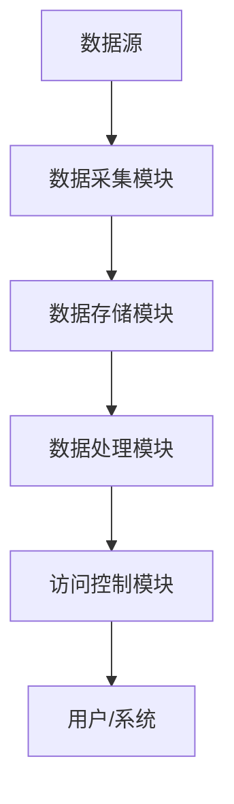

                 


# 《金融数据隐私保护技术》

---

## 关键词：
金融数据隐私保护、数据加密、匿名化处理、访问控制、同态加密、安全协议、法律框架

---

## 摘要：
金融数据隐私保护是当前数字时代的核心挑战之一。随着金融业务的数字化和网络化，金融数据的敏感性使得其隐私保护成为一项复杂而重要的任务。本文从金融数据隐私保护的核心概念出发，深入探讨数据加密、匿名化处理、访问控制等技术原理，并结合实际案例和系统架构设计，为读者提供全面的技术解析与实践指导。文章还总结了金融数据隐私保护的最佳实践，为金融机构和相关技术从业者提供了实用的参考。

---

## 第1章: 金融数据隐私保护的背景与挑战

### 1.1 金融数据隐私的重要性
金融数据的隐私保护直接关系到个人和机构的财产安全、信用评估以及法律合规性。随着金融业务的线上化和智能化，数据泄露的风险也在不断增加。本文将从以下几个方面分析金融数据隐私的重要性：

1. **数据的敏感性分析**  
   金融数据包括但不限于用户的个人信息（如身份证号、手机号、地址）、账户信息（如银行卡号、交易记录）、交易数据（如金额、时间、地点）等。这些数据一旦泄露，可能导致身份盗窃、财产损失甚至法律纠纷。

2. **金融数据泄露的潜在风险**  
   数据泄露不仅会对个人造成直接损失，还可能引发系统性风险。例如，黑客攻击可能导致大量用户数据泄露，进而引发信任危机和声誉损失。此外，数据泄露还可能被用于洗钱、欺诈等非法活动。

3. **金融隐私保护的法律框架**  
   各国和地区都出台了相关法律法规来保护金融数据隐私。例如，欧盟的《通用数据保护条例》（GDPR）要求企业严格控制数据访问权限，并在数据泄露事件发生后及时通知用户。中国的《个人信息保护法》（PIPL）也对金融机构的数据处理活动提出了严格要求。

---

### 1.2 数据隐私保护的核心概念
数据隐私保护是一个多维度的概念，涉及技术、法律和伦理等多个方面。以下是数据隐私保护的核心概念：

1. **数据隐私的定义与特征**  
   数据隐私是指个人对自身数据的控制权，包括数据的收集、存储、使用、共享和删除等环节。其核心特征包括：  
   - **最小化原则**：仅收集实现业务目标所必需的数据。  
   - **目的限制原则**：数据的使用必须符合收集时的授权目的。  
   - **数据主体权利**：数据主体有权了解、修改或删除其数据。

2. **金融数据隐私的特殊性**  
   金融数据的特殊性在于其敏感性高、涉及范围广且监管严格。例如，银行账户信息的泄露可能导致直接的经济损失，而信用评分的泄露可能影响个人的信用评估。

3. **数据隐私保护的边界与外延**  
   数据隐私保护的边界在于如何在保护隐私的同时实现数据的合理利用。例如，数据加密和匿名化处理可以在保护隐私的同时支持数据分析和共享。

---

### 1.3 金融数据隐私保护的现状与挑战
尽管金融数据隐私保护的重要性日益凸显，但在实际操作中仍面临诸多挑战：

1. **技术挑战**  
   - 数据加密技术的性能瓶颈：加密算法的计算开销可能影响系统的运行效率。  
   - 匿名化处理的技术难度：如何在保护隐私的同时支持数据的可分析性是一个技术难题。  

2. **法律挑战**  
   - 不同国家和地区的法律差异：金融机构需要应对复杂的法律环境。  
   - 数据跨境传输的合规性：如何在遵守本地法律的同时实现跨境数据共享是一个复杂的问题。  

3. **认知挑战**  
   - 金融机构和用户的隐私保护意识不足：部分金融机构对隐私保护的重要性认识不足，用户也缺乏对隐私保护的足够重视。  

---

## 第2章: 金融数据隐私保护的核心概念与联系

### 2.1 核心概念原理
1. **数据隐私保护的基本原理**  
   数据隐私保护的核心在于控制数据的访问权限和使用范围。通过技术手段实现数据的加密存储、匿名化处理和访问控制，可以有效保护数据隐私。

2. **金融数据的分类与分级**  
   根据数据的敏感性，金融机构通常将数据分为以下几类：  
   - **高敏感数据**：如身份证号、银行卡号、交易记录等。  
   - **中敏感数据**：如姓名、地址等。  
   - **低敏感数据**：如交易时间、金额等。  

3. **数据加密与匿名化处理**  
   数据加密和匿名化处理是保护数据隐私的两大核心手段。  
   - **数据加密**：通过对数据进行加密，确保只有授权方才能解密数据。  
   - **数据匿名化**：通过技术手段去除数据中的身份标识信息，降低数据泄露风险。  

---

### 2.2 核心概念属性特征对比

| 概念         | 定义与特征                                                                 |
|--------------|---------------------------------------------------------------------------|
| 数据隐私     | 数据主体对自身数据的控制权，包括数据的收集、存储、使用和共享等环节。               |
| 数据安全     | 数据的机密性、完整性和可用性的保护，防止未经授权的访问和篡改。                     |
| 数据加密     | 通过加密算法对数据进行加密处理，确保数据在存储和传输过程中的安全性。             |
| 数据匿名化   | 对数据进行脱敏处理，去除或加密敏感信息，降低数据泄露风险。                       |
| 数据访问控制 | 通过权限管理机制，限制只有授权用户或系统才能访问敏感数据。                       |

---

### 2.3 ER实体关系图架构

```mermaid
erDiagram
    actor 用户 {
        +string 用户ID
        +string 姓名
        +string 身份证号
    }
    actor 金融机构 {
        +string 机构ID
        +string 机构名称
    }
    actor 监管机构 {
        +string 监管机构ID
        +string 监管机构名称
    }
    user 用户 --> 关系 数据拥有者
    user 用户 --> 关系 数据授权者
    user 用户 --> 关系 数据访问者
    金融机构 --> 关系 数据存储者
    监管机构 --> 关系 数据监督者
```

---

### 2.4 本章小结
本章主要介绍了金融数据隐私保护的核心概念及其联系。通过数据的分类与分级、数据加密与匿名化处理，以及数据访问控制等手段，可以有效保护金融数据的隐私。同时，通过ER实体关系图展示了数据隐私保护的主体和关系，为后续的技术实现提供了基础。

---

## 第3章: 金融数据隐私保护的算法原理

### 3.1 数据加密算法
1. **对称加密算法**  
   对称加密算法是一种简单的加密方式，加密和解密使用相同的密钥。其优点是加密速度快，适合大规模数据加密。以下是常见的对称加密算法：

   - **AES（高级加密标准）**  
     AES是一种广泛使用的块加密算法，支持128、192和256位密钥长度。其加密过程如下：

     ```mermaid
     graph TD
     A[明文数据] --> B[加密]
     B --> C[密文数据]
     C --> D[解密]
     D --> E[明文数据]
     ```

     ```python
     def symmetric_encrypt(plaintext, key):
         # 加密逻辑
         return ciphertext
     ```

   - **DES（数据加密标准）**  
     DES是一种较早的对称加密算法，但由于密钥长度较短（56位），安全性较低，已被逐渐淘汰。

2. **非对称加密算法**  
   非对称加密算法使用公钥和私钥进行加密和解密，其优点是安全性高，适合公钥分发的场景。常见的非对称加密算法包括RSA和椭圆曲线加密（ECC）。

   - **RSA算法**  
     RSA算法基于大整数的因式分解问题，其安全性依赖于密钥的长度。加密和解密过程如下：

     ```mermaid
     graph TD
     A[明文数据] --> B[公钥加密]
     B --> C[密文数据]
     C --> D[私钥解密]
     D --> E[明文数据]
     ```

     ```python
     def rsa_encrypt(plaintext, public_key):
         # 加密逻辑
         return ciphertext
     ```

3. **同态加密算法**  
   同态加密是一种特殊的加密方式，允许在加密状态下对数据进行计算。其核心在于加密后的数据可以直接进行运算，而无需解密。数学模型如下：

   $$ E(x) = x + k \mod p $$

   其中，\( x \) 是明文，\( k \) 是随机数，\( p \) 是模数。通过这种加密方式，可以在保护数据隐私的同时支持数据分析。

---

### 3.2 匿名化处理算法
匿名化处理是保护数据隐私的重要手段，常见的匿名化技术包括：

1. **数据脱敏**  
   数据脱敏通过对敏感字段进行替换、隐藏或加密，降低数据泄露风险。例如，将身份证号中的部分数字替换为星号：

   $$ \text{身份证号} \rightarrow \text{****-***-****} $$

2. **K-匿名化**  
   K-匿名化是一种通过确保数据集中每个记录无法被唯一识别的技术。其核心在于将数据分组，确保每个组内有至少\( K \)个相同的记录。

   $$ \text{匿名化后数据} = \{\text{GroupID}, \text{属性值}\} $$

3. **差分隐私**  
   差分隐私是一种通过在数据中添加噪声来保护隐私的技术。其核心在于平衡数据的可用性和隐私保护。数学模型如下：

   $$ \text{噪声} \sim \text{Laplace}(0, \epsilon) $$

   其中，\( \epsilon \) 是隐私预算参数，控制噪声的大小。

---

### 3.3 本章小结
本章详细讲解了金融数据隐私保护的核心算法，包括对称加密、非对称加密和同态加密等技术。通过对这些算法的分析，可以更好地理解如何在实际应用中保护金融数据的隐私。同时，匿名化处理技术也为数据的脱敏和隐私保护提供了重要手段。

---

## 第4章: 金融数据隐私保护的系统架构设计

### 4.1 系统架构概述
金融数据隐私保护系统通常包括以下几个模块：

1. **数据采集模块**  
   负责从各种数据源（如交易系统、用户终端）采集金融数据。

2. **数据存储模块**  
   负责存储采集到的金融数据，并通过加密和匿名化处理保护数据隐私。

3. **数据处理模块**  
   负责对数据进行清洗、转换和分析，支持数据的可分析性和可用性。

4. **访问控制模块**  
   通过权限管理机制，限制只有授权用户或系统才能访问敏感数据。

---

### 4.2 系统架构设计
以下是金融数据隐私保护系统的架构图：



---

### 4.3 接口设计
系统接口设计需要遵循以下原则：

1. **最小权限原则**  
   接口的权限应严格遵循最小化原则，只开放必要的权限。

2. **身份验证机制**  
   所有接口必须通过身份验证，确保只有授权用户或系统才能访问。

3. **日志记录与审计**  
   系统应记录所有接口的访问日志，便于后续的审计和追溯。

---

### 4.4 本章小结
本章从系统架构设计的角度，详细介绍了金融数据隐私保护系统的各个模块及其交互关系。通过合理的系统架构设计，可以有效保护金融数据的隐私，同时支持系统的可扩展性和灵活性。

---

## 第5章: 金融数据隐私保护的项目实战

### 5.1 项目背景
以客户交易数据保护为例，设计一个基于同态加密的隐私保护方案。该方案的目标是保护客户的交易数据隐私，同时支持数据分析和共享。

---

### 5.2 系统实现

#### 5.2.1 环境配置
以下是项目所需的环境配置：

- **操作系统**：Linux/Windows/macOS  
- **编程语言**：Python 3.8+  
- **依赖库**：PyCrypto、PyEcc、numpy  

#### 5.2.2 核心代码实现

1. **数据加密模块**  
   使用AES算法对交易数据进行加密：

   ```python
   importAES = require('crypto')

   def encrypt_data(plaintext, key):
       cipher = AES.new(key, AES.MODE_ECB)
       ciphertext = cipher.encrypt(plaintext)
       return ciphertext
   ```

2. **匿名化处理模块**  
   使用K-匿名化技术对数据进行脱敏处理：

   ```python
   def k_anonymize(data, k):
       # 数据分组逻辑
       grouped_data = group_by(data, k)
       # 匿名化处理
       anonymized_data = replace_with_group_id(grouped_data)
       return anonymized_data
   ```

3. **访问控制模块**  
   通过角色权限管理控制数据访问：

   ```python
   def check_permission(user_role, data_type):
       if user_role not in ['admin', 'user']:
           raise PermissionError("Invalid user role")
       if data_type not in ['transaction', 'account']:
           raise ValueError("Invalid data type")
       return True
   ```

---

### 5.3 项目小结
本章通过一个具体的项目实战，展示了如何在实际场景中应用金融数据隐私保护技术。通过数据加密、匿名化处理和访问控制等手段，可以在保护数据隐私的同时支持数据分析和共享。

---

## 第6章: 金融数据隐私保护的最佳实践

### 6.1 关键点总结
1. **技术层面**  
   - 选择合适的加密算法和匿名化技术。  
   - 定期进行安全评估和漏洞扫描。  

2. **法律层面**  
   - 遵守相关法律法规，确保数据处理的合法性。  
   - 建立数据泄露应急响应机制。  

3. **管理层面**  
   - 加强员工的隐私保护意识培训。  
   - 建立完善的数据生命周期管理制度。  

---

### 6.2 注意事项
- **数据最小化原则**：只收集实现业务目标所必需的数据。  
- **权限最小化原则**：严格控制数据访问权限。  
- **数据加密与备份**：确保数据的机密性和可用性。  

---

## 附录

### 附录A: 术语表
- **数据隐私**：数据主体对自身数据的控制权。  
- **对称加密**：加密和解密使用相同密钥的技术。  
- **同态加密**：允许在加密状态下对数据进行计算的技术。  

---

### 附录B: 参考文献
1. 《数据隐私保护技术与实践》  
2. 《金融数据安全与合规》  
3. 《区块链与数据隐私保护》  

---

## 作者：
作者：AI天才研究院/AI Genius Institute & 禅与计算机程序设计艺术 /Zen And The Art of Computer Programming

---

**文章结束**

