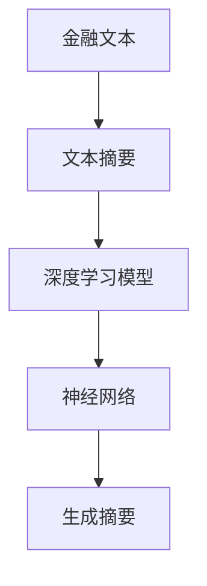
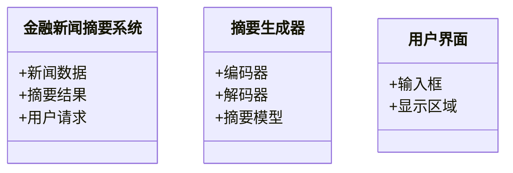
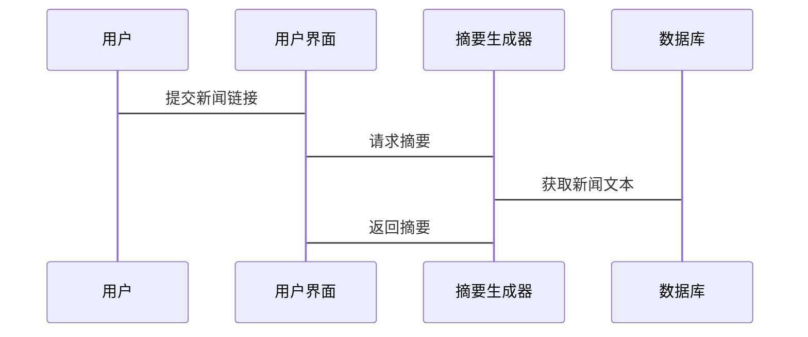

                 


# 金融文本摘要生成的深度学习方法

> 关键词：金融文本摘要、深度学习、文本生成、自然语言处理、金融NLP

> 摘要：本文系统地介绍了金融文本摘要生成的深度学习方法，从背景与核心概念出发，详细讲解了基于Seq2Seq、Transformer和BERT的文本摘要生成模型的算法原理，并通过金融新闻摘要系统的实战案例，展示了如何设计和实现一个完整的金融文本摘要生成系统。文章还讨论了模型优化与部署策略，最后给出了最佳实践和未来研究方向。

---

# 第一部分: 金融文本摘要生成的背景与核心概念

## 第1章: 金融文本摘要生成的背景与核心概念

### 1.1 问题背景与问题描述

#### 1.1.1 金融文本摘要生成的背景
金融领域涉及大量的文本数据，包括新闻、财报、研究报告等。这些文本通常信息丰富但冗长，需要通过摘要生成技术提取关键信息，帮助用户快速获取核心内容。随着自然语言处理（NLP）技术的快速发展，深度学习在金融文本摘要生成中的应用越来越广泛。

#### 1.1.2 问题描述与目标
金融文本摘要生成的目标是将长文本（如新闻文章、财报）压缩成一个简洁的摘要，同时保留原文的核心信息和语义。例如，将一篇关于公司财报的长篇文章摘要为“公司Q2净利润增长10%，主要得益于产品线扩展”。摘要生成的关键挑战在于如何准确捕捉文本中的重要信息，同时保持生成摘要的流畅性和可读性。

#### 1.1.3 问题解决的必要性
金融领域的决策者、投资者和分析师需要快速获取关键信息，尤其是在时间敏感的情况下（如市场波动、突发事件）。通过深度学习生成的金融文本摘要，可以显著提高信息处理效率，帮助用户做出更快速、更准确的决策。

#### 1.1.4 边界与外延
金融文本摘要生成的边界包括：
- 输入：金融领域的文本数据（如新闻、财报、研究报告）。
- 输出：摘要文本。
- 约束条件：摘要长度限制（如1-3句话）、语义准确性。
- 外延：与金融NLP相关的其他任务，如情感分析、关键词提取。

### 1.2 核心概念与联系

#### 1.2.1 金融文本的定义与特点
金融文本是指与金融相关的内容，包括新闻、财报、研究报告、市场分析等。其特点包括：
- 专业性：文本中包含大量金融术语和行业知识。
- 信息密度高：文本通常包含大量关键信息，但冗长复杂。
- 时间敏感性：某些金融文本需要快速处理（如实时新闻）。

#### 1.2.2 文本摘要的定义与类型
文本摘要是指从原始文本中提取关键信息，生成一个简洁的摘要。文本摘要的类型包括：
- 摘要长度：分为长摘要和短摘要。
- 摘要风格：分为正式摘要和非正式摘要。
- 摘要内容：分为事实摘要和观点摘要。

#### 1.2.3 深度学习在文本摘要中的作用
深度学习通过神经网络模型（如RNN、Transformer）自动学习文本中的语义信息和上下文关系，从而生成高质量的摘要。

#### 1.2.4 核心概念联系表

| 核心概念 | 定义 | 特性 | 示例 |
|----------|------|------|------|
| 金融文本 | 与金融相关的文本 | 专业性、信息密度高 | 财报、新闻 |
| 文本摘要 | 文本信息的精简总结 | 简洁性、准确性 | 1-3句话 |
| 深度学习 | 神经网络模型 | 自动学习、非线性 | RNN、Transformer |

#### 1.2.5 实体关系图（Mermaid流程图）



---

## 第2章: 深度学习算法原理

### 2.1 常见文本摘要生成模型

#### 2.1.1 基于Seq2Seq的模型
Seq2Seq模型由编码器（Encoder）和解码器（Decoder）组成，编码器将输入文本编码为固定长度的向量，解码器将向量解码为目标摘要。

#### 2.1.2 基于Transformer的模型
Transformer模型通过自注意力机制（Self-Attention）捕捉文本中的长距离依赖关系，生成高质量的摘要。

#### 2.1.3 基于BERT的模型
BERT模型通过预训练语言模型（Pre-trained Language Model）生成摘要，具有上下文理解能力强的特点。

### 2.2 模型原理与流程图

#### 2.2.1 Seq2Seq模型原理（Mermaid流程图）


#### 2.2.2 Transformer模型原理（Mermaid流程图）


#### 2.2.3 BERT模型原理（Mermaid流程图）


### 2.3 算法实现与代码示例

#### 2.3.1 基于Seq2Seq的Python代码实现

```python
import torch
import torch.nn as nn

class Seq2Seq(nn.Module):
    def __init__(self, input_dim, hidden_dim):
        super(Seq2Seq, self).__init__()
        self.encoder = nn.RNN(input_dim, hidden_dim, batch_first=True)
        self.decoder = nn.RNN(hidden_dim, hidden_dim, batch_first=True)
        self.linear = nn.Linear(hidden_dim, output_dim)
        
    def forward(self, input_seq):
        encoded, _ = self.encoder(input_seq)
        decoded, _ = self.decoder(encoded)
        output = self.linear(decoded[:, -1, :])
        return output
```

#### 2.3.2 Transformer模型的数学模型和公式

$$\text{自注意力机制} = \frac{QK^T}{\sqrt{d_k}}$$

其中，$Q$是查询向量，$K$是键向量，$d_k$是向量的维度。

---

## 第3章: 系统分析与架构设计

### 3.1 项目背景与目标

#### 3.1.1 项目背景
本项目旨在构建一个金融新闻摘要生成系统，帮助用户快速获取金融新闻的核心内容。

#### 3.1.2 项目目标
实现一个基于深度学习的金融新闻摘要生成系统，支持实时新闻摘要生成和历史新闻摘要查询。

### 3.2 系统功能设计

#### 3.2.1 领域模型（Mermaid类图）



#### 3.2.2 系统架构设计（Mermaid架构图）

```mermaid
container 金融新闻摘要系统 {
    component 新闻数据 {
        数据库
        API接口
    }
    component 摘要生成器 {
        编码器
        解码器
        模型权重
    }
    component 用户界面 {
        输入框
        显示区域
    }
}
```

#### 3.2.3 系统接口设计与交互（Mermaid序列图）



---

## 第4章: 项目实战

### 4.1 环境安装与配置

#### 4.1.1 安装Python与深度学习框架
```bash
pip install numpy torch transformers
```

#### 4.1.2 安装NLP库
```bash
pip install NLTK spacy
```

### 4.2 系统核心实现

#### 4.2.1 数据预处理代码

```python
import spacy

def preprocess(text):
    nlp = spacy.load("en_core_web_sm")
    doc = nlp(text)
    return [token.text for token in doc]
```

#### 4.2.2 模型训练代码

```python
import torch
import torch.nn as nn

class SimpleModel(nn.Module):
    def __init__(self, input_dim, hidden_dim, output_dim):
        super(SimpleModel, self).__init__()
        self.encoder = nn.RNN(input_dim, hidden_dim)
        self.decoder = nn.RNN(hidden_dim, output_dim)
        
    def forward(self, input_seq):
        output, _ = self.decoder(input_seq)
        return output
```

#### 4.2.3 摘要生成代码

```python
def generate_summary(model, input_seq):
    with torch.no_grad():
        output = model(input_seq)
        return output
```

---

## 第5章: 模型优化与部署

### 5.1 模型优化策略

#### 5.1.1 超参数调优
调整学习率、批次大小、模型层数等参数，优化模型性能。

#### 5.1.2 模型压缩
使用模型剪枝、知识蒸馏等技术，降低模型规模，提升推理速度。

#### 5.1.3 分布式训练
利用分布式计算框架（如PyTorch分布式）提升模型训练效率。

### 5.2 模型部署

#### 5.2.1 API开发
使用Flask或FastAPI等框架，开发RESTful API。

#### 5.2.2 微服务架构
将系统拆分为多个微服务，实现模块化管理。

#### 5.2.3 模型服务化
将模型部署到云平台（如AWS S3、阿里云OSS），提供实时摘要服务。

---

## 第6章: 总结与展望

### 6.1 最佳实践

#### 6.1.1 数据质量的重要性
金融文本摘要生成的效果很大程度上依赖于输入数据的质量。建议使用高质量的金融文本数据，并进行充分的预处理。

#### 6.1.2 模型调优的注意事项
在模型调优过程中，建议逐步调整超参数，避免过度拟合。同时，可以通过交叉验证评估模型的泛化能力。

#### 6.1.3 持续学习与优化
金融领域是一个快速变化的领域，建议定期更新模型和数据，保持系统的实时性和准确性。

### 6.2 未来研究方向

#### 6.2.1 更先进的模型架构
探索更先进的深度学习模型（如ViT、GPT-3）在金融文本摘要生成中的应用。

#### 6.2.2 多模态摘要生成
结合图像、语音等多模态数据，生成更全面的金融摘要。

#### 6.2.3 实时摘要生成
优化模型推理速度，实现金融新闻的实时摘要生成。

---

# 作者：AI天才研究院 & 禅与计算机程序设计艺术

---

**感谢您的阅读！希望本文对您理解和应用金融文本摘要生成的深度学习方法有所帮助。**

