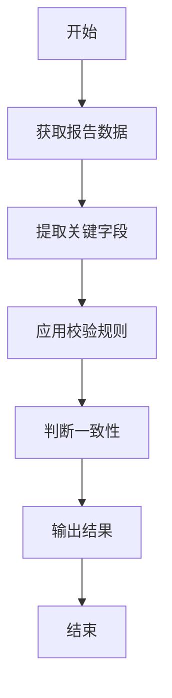
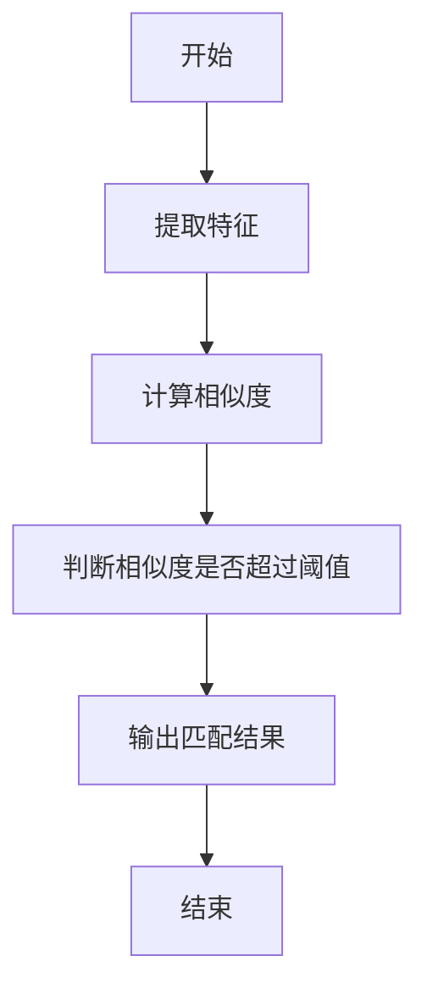
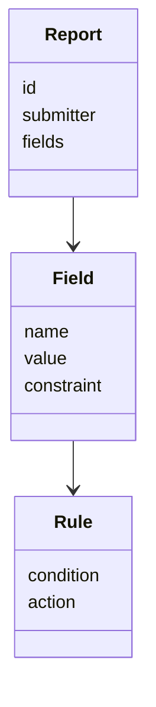
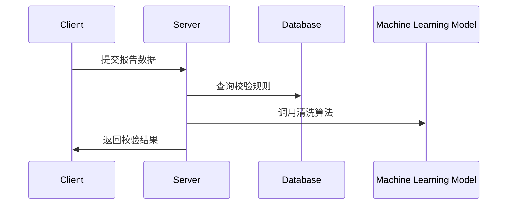

                 


# 《金融监管报告数据一致性自动校验》

## 关键词：金融监管，数据一致性，自动校验，系统设计，数据清洗

## 摘要：  
金融监管是保障金融市场健康运行的重要手段，而数据一致性是金融监管的核心要求之一。本文详细探讨了金融监管报告数据一致性自动校验的技术实现，从问题背景、核心概念、算法原理、系统架构到项目实战，层层剖析，提出了基于规则引擎和机器学习的双重校验机制，通过系统化的解决方案确保金融数据的准确性和一致性。

---

# 第一部分: 金融监管报告数据一致性校验的背景与问题

## 第1章: 金融监管报告数据一致性校验的背景与问题

### 1.1 数据一致性校验的背景介绍
#### 1.1.1 金融监管的背景与意义
金融监管是维护金融市场秩序、保护投资者利益的重要手段。随着金融业务的复杂化和数据量的爆炸式增长，金融监管报告的数据一致性成为确保监管有效性的关键因素。数据一致性校验是金融监管技术的重要组成部分。

#### 1.1.2 数据一致性校验的重要性
金融数据的准确性直接关系到监管的有效性和决策的正确性。数据不一致可能导致监管失准、风险遗漏或虚假报告。通过自动化校验技术，可以显著提高数据处理的效率和准确性。

#### 1.1.3 金融监管中的数据一致性问题
在金融监管中，数据来源多样、格式复杂，容易出现数据重复、格式错误、字段缺失等问题。例如，同一笔交易在不同报告中可能被记录为不同的金额或时间点。

### 1.2 问题背景与描述
#### 1.2.1 数据不一致的常见问题
- 数据字段的格式不统一，例如金额单位（元、万元）混淆。
- 数据记录的时间不一致，例如交易时间与报告时间不匹配。
- 数据来源的多样性导致字段缺失或重复。

#### 1.2.2 金融监管中的数据一致性需求
- 监管机构要求报告数据必须符合特定的格式和标准。
- 数据需要满足业务逻辑约束，例如金额的合理性、时间的顺序性等。
- 数据一致性是评估报告质量的重要指标。

#### 1.2.3 数据一致性校验的目标与边界
- 目标：通过技术手段自动识别和修复数据不一致问题。
- 边界：校验范围限定在监管报告的数据字段和格式，不涉及业务逻辑以外的领域。

### 1.3 数据一致性校验的解决方案
#### 1.3.1 自动化校验的核心思想
通过规则引擎和机器学习算法，结合数据特征进行自动校验。

#### 1.3.2 数据一致性校验的实现方式
- 基于规则的校验：根据预定义的规则检查数据一致性。
- 基于机器学习的校验：利用模型预测数据的合理性和一致性。

#### 1.3.3 技术手段与工具的选择
- 规则引擎：使用易于配置的规则引擎实现快速校验。
- 机器学习：采用自然语言处理和模式识别技术进行数据清洗。

### 1.4 核心概念与外延
#### 1.4.1 数据一致性的定义与特征
- 定义：数据在不同来源或不同记录中的表示保持一致。
- 特征：格式统一、业务逻辑一致、数据完整性。

#### 1.4.2 数据一致性校验的边界与范围
- 校验范围：监管报告中的关键字段。
- 边界：不涉及数据生成过程，仅关注数据结果的正确性。

#### 1.4.3 校验系统的核心要素与组成
- 核心要素：规则引擎、数据清洗算法、校验结果报告。
- 组成：数据输入、校验规则库、校验引擎、结果输出。

### 1.5 本章小结
本章从金融监管的背景出发，分析了数据一致性校验的重要性和必要性，并提出了基于规则和机器学习的双重校验机制，为后续的技术实现奠定了基础。

---

# 第2章: 数据一致性校验的核心概念与联系

## 2.1 数据一致性校验的原理
### 2.1.1 数据校验的基本原理
通过预定义的规则或模型，识别数据中的不一致问题。

### 2.1.2 数据一致性校验的实现机制
- 基于规则的校验：匹配数据字段是否符合预定义的格式和约束。
- 基于机器学习的校验：利用特征提取和分类模型识别异常数据。

### 2.1.3 校验算法的核心原理
- 规则匹配：基于正则表达式或条件判断匹配数据字段。
- 数据相似度计算：通过Jaccard相似度或余弦相似度判断数据一致性。

## 2.2 核心概念对比分析
### 2.2.1 数据校验方法对比表
| 方法 | 优点 | 缺点 |
|------|------|------|
| 基于规则 | 简单易实现 | 需要手动维护规则 |
| 基于机器学习 | 自适应性强 | 需要大量数据训练 |

### 2.2.2 不同校验算法的优缺点分析
- 规则校验：适用于数据格式明确的场景，但难以处理复杂的数据关系。
- 机器学习校验：适用于数据关系复杂、规则动态变化的场景，但需要大量数据支持。

### 2.2.3 数据一致性校验与数据清洗的联系
数据清洗是数据一致性校验的前提，校验是清洗的重要环节。

## 2.3 实体关系图与流程图
### 2.3.1 数据一致性校验的ER实体关系图
```mermaid
er
  actor:监管机构
  report:监管报告
  field:数据字段
  rule:校验规则
  constraint:约束条件
  relation:关联关系
  actor --> report: 提交报告
  report --> field: 包含字段
  field --> constraint: 遵循约束
  rule --> constraint: 定义约束
```

### 2.3.2 数据一致性校验的流程图


---

## 第3章: 数据一致性校验的算法原理

### 3.1 数据匹配算法
#### 3.1.1 基于规则的匹配算法
- 使用正则表达式匹配数据格式。
- 例如，金额字段必须以“元”为单位。

#### 3.1.2 基于相似度的匹配算法
- 使用Jaccard相似度计算数据相似性。
$$ J(a, b) = \frac{|a \cap b|}{|a \cup b|} $$

#### 3.1.3 算法流程


### 3.2 数据清洗算法
#### 3.2.1 基于规则的清洗算法
- 删除不符合规则的数据字段。
- 例如，删除格式错误的日期字段。

#### 3.2.2 基于机器学习的清洗算法
- 使用聚类算法识别异常数据。
- 例如，使用K-means算法对交易金额进行聚类分析。

#### 3.2.3 算法实现
```python
def data_cleaning(data, rules):
    cleaned_data = []
    for item in data:
        if matches_rules(item, rules):
            cleaned_data.append(item)
    return cleaned_data
```

### 3.3 数学模型与公式
#### 3.3.1 Jaccard相似度公式
$$ J(a, b) = \frac{|a \cap b|}{|a \cup b|} $$

#### 3.3.2 数据清洗模型
$$ C = \sum_{i=1}^{n} w_i x_i $$

---

## 第4章: 系统分析与架构设计

### 4.1 系统分析
#### 4.1.1 问题场景介绍
- 数据来源多样，格式不统一。
- 需要对数据进行清洗和校验。

#### 4.1.2 项目介绍
- 开发目标：实现数据一致性校验系统。
- 项目范围：金融监管报告数据。

### 4.2 系统功能设计
#### 4.2.1 领域模型图


#### 4.2.2 系统架构图


### 4.3 系统接口设计
#### 4.3.1 API接口
- 输入接口：接收监管报告数据。
- 输出接口：返回校验结果。

#### 4.3.2 交互序列图


---

## 第5章: 项目实战

### 5.1 环境安装
- Python 3.8+
- Jupyter Notebook
- Pandas、Scikit-learn库

### 5.2 核心代码实现
#### 5.2.1 数据清洗代码
```python
import pandas as pd
from sklearn.cluster import KMeans

def clean_data(df):
    # 提取特征
    features = df[['amount', 'time']].values
    # 聚类分析
    model = KMeans(n_clusters=2, random_state=0)
    model.fit(features)
    # 标签预测
    labels = model.labels_
    # 删除异常数据
    cleaned_df = df[labels == 0]
    return cleaned_df
```

#### 5.2.2 数据校验代码
```python
def validate_data(df, rules):
    for rule in rules:
        mask = df[rule['field']].apply(lambda x: not matches_rule(x, rule['condition']))
        df = df[mask]
    return df
```

### 5.3 案例分析
#### 5.3.1 案例背景
某金融机构提交的交易报告中，金额字段存在格式不一致的问题。

#### 5.3.2 数据清洗与校验
- 使用聚类算法识别异常交易。
- 通过规则引擎修复金额格式。

### 5.4 项目小结
通过实际案例，验证了基于规则和机器学习的双重校验机制的有效性。

---

## 第6章: 最佳实践与总结

### 6.1 最佳实践
- 规则引擎与机器学习结合使用，提高校验效率。
- 定期更新校验规则，适应业务变化。

### 6.2 小结
数据一致性校验是金融监管的重要环节，通过自动化技术可以显著提高数据处理的效率和准确性。

### 6.3 注意事项
- 数据清洗过程中要避免过度清洗，防止信息丢失。
- 机器学习模型需要定期重新训练，保证准确性。

### 6.4 拓展阅读
- 《数据清洗实战》
- 《金融监管技术前沿》

---

## 作者：AI天才研究院/AI Genius Institute & 禅与计算机程序设计艺术/Zen And The Art of Computer Programming

