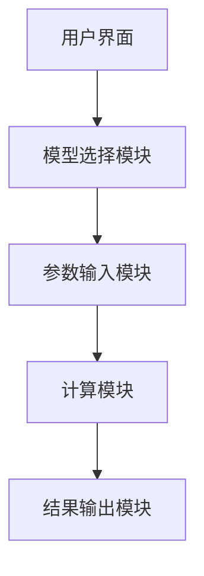

                 


# 《金融衍生品定价模型比较与选择框架》

---

## 关键词：  
金融衍生品、定价模型、Black-Scholes、蒙特卡洛模拟、风险管理、模型选择框架

---

## 摘要：  
本文系统地探讨了金融衍生品定价模型的核心概念、算法原理、数学模型及应用场景，重点分析了不同定价模型的优劣势，并提出了一个基于模型属性特征的比较与选择框架。通过对比典型定价模型（如Black-Scholes、蒙特卡洛模拟、二叉树模型），本文旨在为读者提供一个清晰的路径，帮助其在实际应用中选择最适合的定价模型。文章还结合了数学公式、流程图和系统架构图，深入剖析了各模型的内在逻辑，并通过案例分析展示了如何将理论应用于实践。

---

# 第一部分: 金融衍生品定价模型基础

## 第1章: 金融衍生品定价模型概述

### 1.1 金融衍生品的基本概念

#### 1.1.1 金融衍生品的定义
金融衍生品（Financial Derivatives）是指从基础金融工具（如股票、债券、商品等）派生出来的金融合约。其价值取决于基础资产的价格变动。常见的金融衍生品包括期权、期货、掉期和互换等。

#### 1.1.2 金融衍生品的主要类型
- **期权（Options）**：买方有权在特定时间以特定价格购买或出售标的资产。
- **期货（Futures）**：买方和卖方同意在未来某一时间以预定价格买卖标的资产。
- **掉期（Swaps）**：双方同意在未来某个时间交换现金流。
- **互换（Forwards）**：类似于期货，但通常不在交易所进行。

#### 1.1.3 金融衍生品的市场现状
金融衍生品市场是全球最大的金融市场之一，市场规模超过千亿美元。衍生品广泛应用于风险管理、资产定价和投机交易。

---

### 1.2 定价模型的背景与重要性

#### 1.2.1 金融衍生品定价的核心问题
金融衍生品的定价是其价值评估的关键问题。定价模型需要考虑标的资产的价格波动、时间价值、波动率、利率等因素。

#### 1.2.2 定价模型在风险管理中的作用
定价模型不仅用于确定衍生品的公允价值，还用于评估市场风险（如VaR）和信用风险。

#### 1.2.3 定价模型的边界与外延
定价模型的边界包括假设条件（如无交易成本、无套利机会）和适用范围（如波动率恒定）。其外延则涉及模型的改进和扩展。

---

### 1.3 定价模型的选择与比较框架

#### 1.3.1 模型选择的基本原则
- **适用性**：模型是否适合特定的金融工具和市场环境。
- **计算复杂度**：模型的计算是否高效。
- **准确性**：模型是否能准确反映市场价格。
- **灵活性**：模型是否能适应不同的市场条件。

#### 1.3.2 模型比较的关键维度
- **计算效率**：模型的计算速度和资源消耗。
- **假设条件**：模型的假设是否符合实际市场。
- **适用范围**：模型是否适用于特定的金融工具。

#### 1.3.3 框架的构建逻辑
本文提出的定价模型选择框架基于以下步骤：
1. 明确需求：确定衍生品的类型和市场环境。
2. 选择模型：根据模型的属性特征进行初步筛选。
3. 模型校准：调整模型参数以匹配市场价格。
4. 模型验证：通过回测和实证分析验证模型的有效性。

---

## 第2章: 定价模型的核心概念与联系

### 2.1 定价模型的核心概念

#### 2.1.1 随机过程与概率分布
金融市场的波动通常可以用随机过程描述，常见的概率分布包括正态分布、对数正态分布和幂律分布。

#### 2.1.2 风险中性定价
风险中性定价假设市场参与者是风险中性的，可以通过调整风险中性概率来计算期望值。

#### 2.1.3 无套利定价原理
无套利定价基于市场无套利机会的假设，通过构建对冲组合来确定衍生品的公允价值。

---

### 2.2 核心概念的联系与对比

#### 2.2.1 模型属性特征对比表
| 模型 | 假设条件 | 计算复杂度 | 适用场景 |
|------|----------|------------|----------|
| Black-Scholes | 无股息、无交易成本 | 中等 | 欧式期权定价 |
| 蒙特卡洛模拟 | 适用于高维问题 | 较高 | 适用于复杂衍生品 |
| 二叉树模型 | 离散时间步 | 较低 | 美式期权定价 |

#### 2.2.2 ER实体关系图架构


---

## 第3章: 定价模型的算法原理与数学模型

### 3.1 定价模型的算法原理

#### 3.1.1 Black-Scholes方程
Black-Scholes模型用于欧式期权定价，其公式为：
$$ C = S_0 N(d_1) - K e^{-rT} N(d_2) $$
其中：
- $S_0$：标的资产当前价格
- $K$：期权行权价
- $r$：无风险利率
- $T$：期权到期时间
- $\sigma$：标的资产价格波动率
- $N(d)$：标准正态分布的累积分布函数
- $d_1 = \frac{\ln(S_0/K) + (r + \sigma^2/2)T}{\sigma \sqrt{T}}$
- $d_2 = d_1 - \sigma \sqrt{T}$

#### 3.1.2 蒙特卡洛模拟
蒙特卡洛模拟通过随机采样来估计衍生品的期望值。其数学基础是：
$$ E[X] = \int_{-\infty}^{\infty} x f(x) dx $$

#### 3.1.3 二叉树模型
二叉树模型将时间划分为离散步长，假设价格在每一步向上或向下波动。

---

### 3.2 数学模型与公式

#### 3.2.1 Black-Scholes公式推导
$$ S_t = S_0 e^{(r-\sigma^2/2)t + \sigma W_t} $$

#### 3.2.2 蒙特卡洛模拟的数学基础
$$ E[X] = \int_{-\infty}^{\infty} x f(x) dx $$

---

## 第4章: 系统分析与架构设计方案

### 4.1 系统功能设计
系统功能包括：
- 模型选择与输入
- 参数校准
- 模型计算
- 结果输出

### 4.2 系统架构设计


---

## 第5章: 项目实战

### 5.1 环境安装
安装Python和相关库（如NumPy、Matplotlib）。

### 5.2 核心代码实现
```python
import numpy as np
from scipy.stats import norm

def black_scholes(S, K, r, T, sigma):
    d1 = (np.log(S/K) + (r + sigma**2/2)*T) / (sigma*np.sqrt(T))
    d2 = d1 - sigma*np.sqrt(T)
    C = S * norm.cdf(d1) - K * np.exp(-r*T) * norm.cdf(d2)
    return C

# 示例
S = 100
K = 105
r = 0.05
T = 1
sigma = 0.2
print(black_scholes(S, K, r, T, sigma))
```

---

## 第6章: 最佳实践与小结

### 6.1 小结
本文系统地探讨了金融衍生品定价模型的核心概念、算法原理和选择框架，通过对比不同模型的优缺点，提出了一个基于模型属性特征的比较与选择框架。

### 6.2 注意事项
在实际应用中，模型的选择应结合市场环境和数据质量，同时注意模型的假设条件和计算复杂度。

### 6.3 拓展阅读
推荐阅读《Options, Futures, and Other Derivatives》（John C. Hull）和《The Concepts and Practice of Mathematical Finance》（Mark S. Joshi）。

---

## 作者：  
AI天才研究院/AI Genius Institute & 禅与计算机程序设计艺术 /Zen And The Art of Computer Programming

